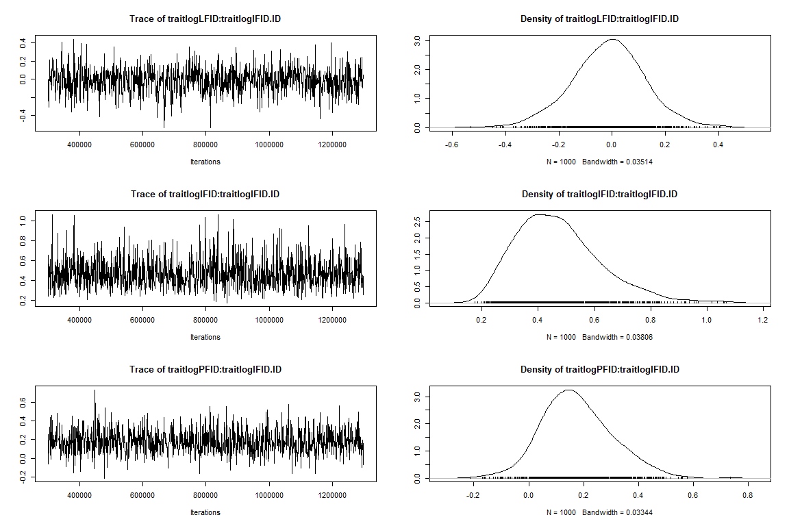
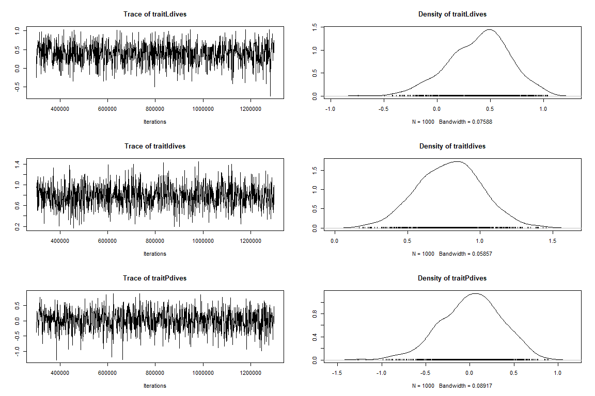
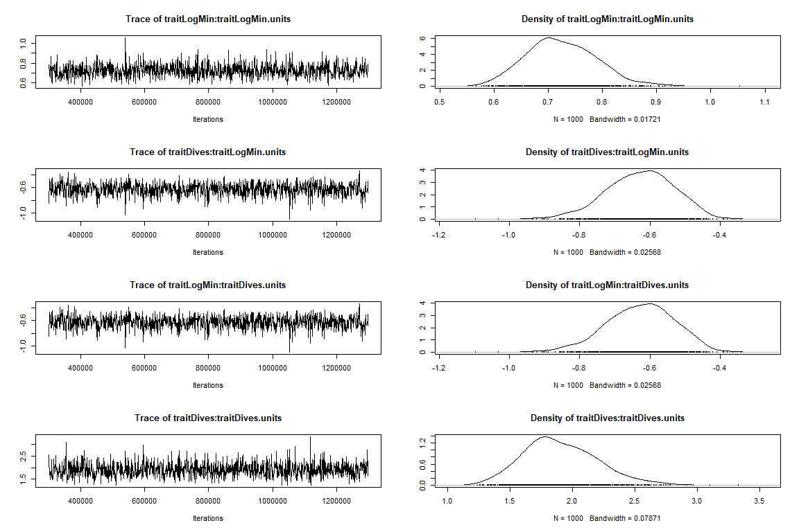
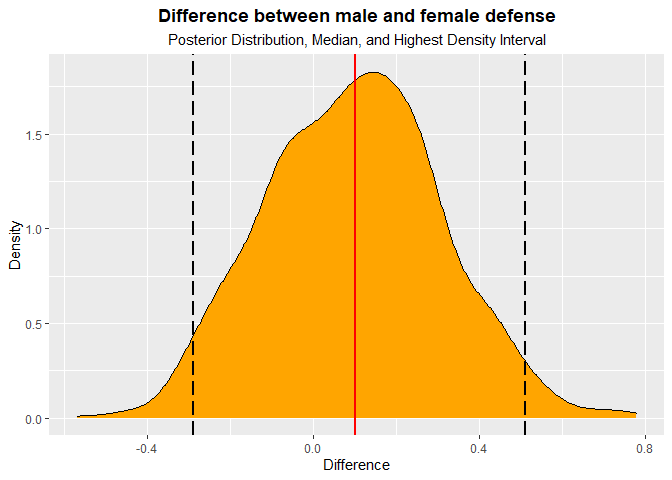
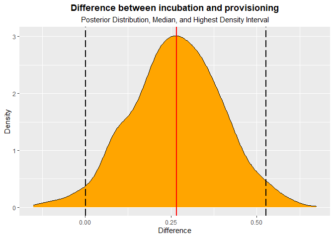
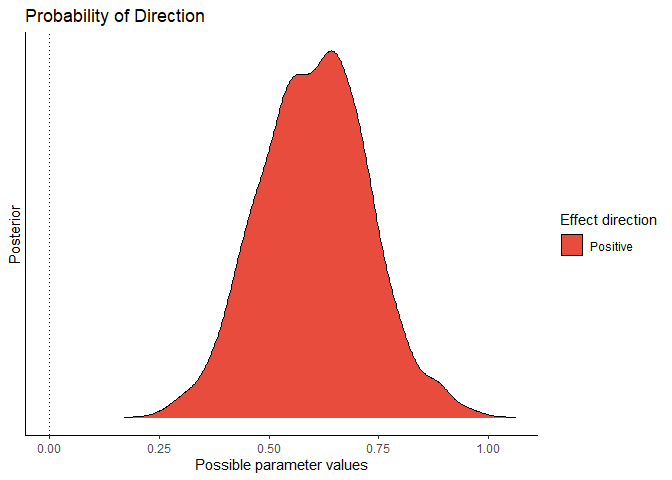
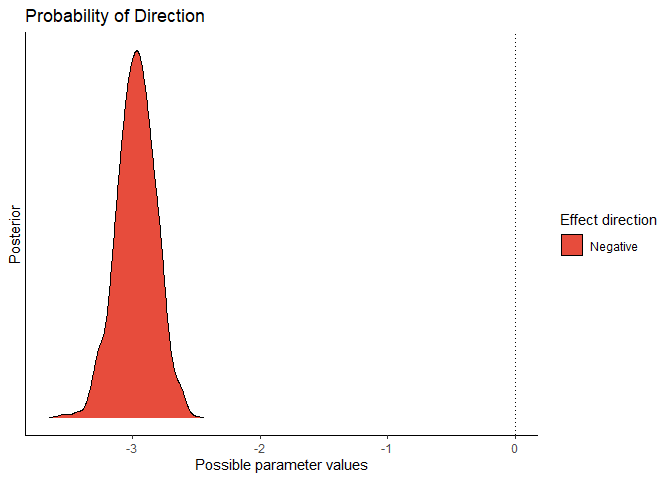
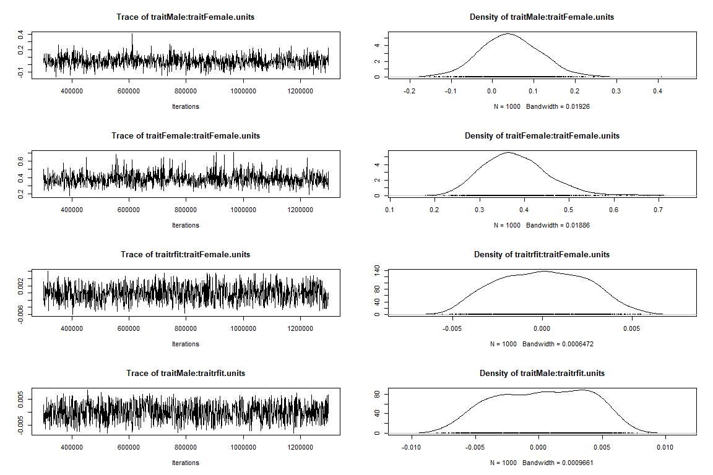
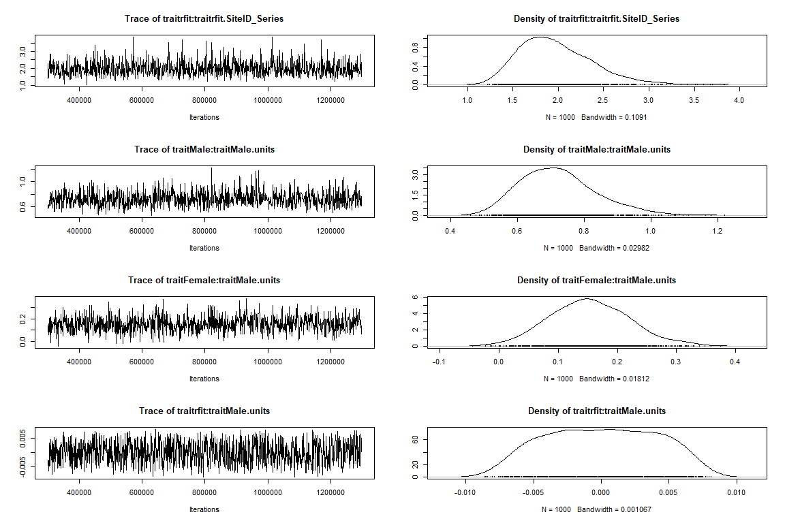
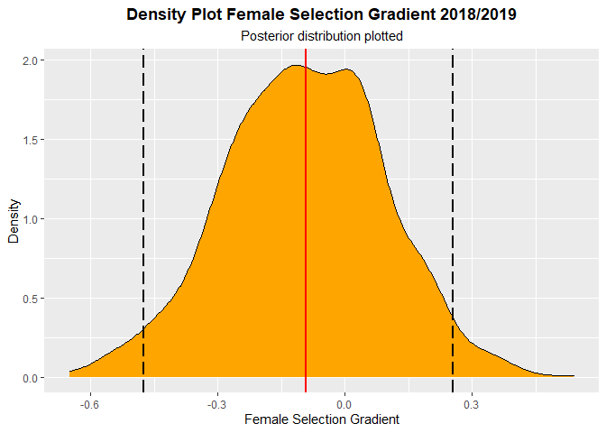

R Script: Does fluctuating selection maintain variation in nest defense
behavior in Arctic peregrine falcons (Falco peregrinus tundrius)?
================

``` r
#required packages
require(readr)
require(lme4)
require(MCMCglmm)
require(dplyr)
require(ggplot2)
require(rlang)
require(tidyverse)
require(rlang)
require(ggeffects)
require(arm)
require(bayestestR)

# Set wd
setwd("C:/Users/nickg/OneDrive/Desktop/R projects/krmp_nest-defense")
#load data
data<-read.csv("C:/Users/nickg/OneDrive/Desktop/R projects/krmp_nest-defense/data/nest_defense_test_final.csv")
names(data)
```

##### **Make Year,ID, and ID_Series factors. Inspect raw data and transform.**

``` r
data$Year2<-as.factor(data$Year2)
data$ID_Series<-as.factor(data$ID_Series)
data$ID<-as.factor(data$ID)

summary(data$MinDisRaw)
```

    ##    Min. 1st Qu.  Median    Mean 3rd Qu.    Max. 
    ##    0.10    5.00   15.00   27.72   25.00  600.00

``` r
data$MinDis100<-ifelse(data$MinDisRaw>100,100,data$MinDisRaw)
data$LogMin<-log(data$MinDis100+1)
```

##### **Minimum distance is capped at 100 meters (i.e., \>100 is not a response)**

``` r
data2<-subset(data, data$MinDisRaw<=100)
hist(data2$MinDisRaw)
```

<!-- -->

``` r
data2$logMin<-log(data2$MinDisRaw+1)
hist(data2$logMin)
```

<!-- -->

### **1. Sources of variation in nest defense**

-   *Univariate analyses of each of the three measures to i) evaluate if
    all three behaviors are representations of nest defense, and ii)
    choose best measure to use in main text.*

#### **Univariate model– Log-transformed minimum distance**

``` r
#Minimum distance---- 
require(lme4)
m1<-lmer(logMin~ Sex + NestStage + Year2+ (1|ID)+(1|Observer) ,
         data=data2) 

#summary
summary(m1)
```

    ## Linear mixed model fit by REML ['lmerMod']
    ## Formula: logMin ~ Sex + NestStage + Year2 + (1 | ID) + (1 | Observer)
    ##    Data: data2
    ## 
    ## REML criterion at convergence: 883.8
    ## 
    ## Scaled residuals: 
    ##      Min       1Q   Median       3Q      Max 
    ## -2.46859 -0.64241 -0.00094  0.59131  2.53522 
    ## 
    ## Random effects:
    ##  Groups   Name        Variance Std.Dev.
    ##  ID       (Intercept) 0.29899  0.5468  
    ##  Observer (Intercept) 0.03097  0.1760  
    ##  Residual             0.52508  0.7246  
    ## Number of obs: 351, groups:  ID, 103; Observer, 8
    ## 
    ## Fixed effects:
    ##                        Estimate Std. Error t value
    ## (Intercept)             2.97079    0.15338  19.369
    ## SexMale                -0.30939    0.14235  -2.173
    ## NestStage2Incubating   -0.24865    0.11971  -2.077
    ## NestStage3Provisioning -0.56368    0.12764  -4.416
    ## Year21                  0.08779    0.12461   0.704
    ## 
    ## Correlation of Fixed Effects:
    ##             (Intr) SexMal NstS2I NstS3P
    ## SexMale     -0.437                     
    ## NstStg2Incb -0.453  0.038              
    ## NstStg3Prvs -0.464  0.040  0.622       
    ## Year21      -0.409 -0.014  0.008  0.166

``` r
#model check
plot(m1)
```

<!-- -->

``` r
hist(resid(m1)) # residuals
```

<!-- -->

``` r
lattice::qqmath(m1) #normality of errors
```

<!-- -->

##### **Simulate posterior distribution–Log-transformed minimum distance**

``` r
sm1<-sim(m1)
smfixef=sm1@fixef
smranef=sm1@ranef
smfixef=as.mcmc(smfixef)
posterior.mode(smfixef)
```

    ##            (Intercept)                SexMale   NestStage2Incubating 
    ##             2.95755253            -0.32165926            -0.34651069 
    ## NestStage3Provisioning                 Year21 
    ##            -0.57708585             0.04610777

``` r
HPDinterval(smfixef)
```

    ##                             lower        upper
    ## (Intercept)             2.6786072  3.241665826
    ## SexMale                -0.5686800 -0.082192731
    ## NestStage2Incubating   -0.4935030 -0.005439134
    ## NestStage3Provisioning -0.8374805 -0.316453515
    ## Year21                 -0.1224068  0.280049520
    ## attr(,"Probability")
    ## [1] 0.95

``` r
bID<-sm1@ranef$ID
bvar<-as.vector(apply(bID, 1, var)) ##between individual variance posterior distribution
bvar<-as.mcmc(bvar)
posterior.mode(bvar )## mode of the distribution
```

    ##      var1 
    ## 0.3058755

``` r
HPDinterval(bvar)
```

    ##          lower     upper
    ## var1 0.2403821 0.3756089
    ## attr(,"Probability")
    ## [1] 0.95

``` r
bObs<-sm1@ranef$Observer
ObsVar<-as.vector(apply(bObs, 1, var)) ##between individual variance posterior distribution
ObsVar<-as.mcmc(ObsVar)
posterior.mode(ObsVar )## mode of the distribution
```

    ##       var1 
    ## 0.02674039

``` r
HPDinterval(ObsVar)
```

    ##            lower      upper
    ## var1 0.006428476 0.05186463
    ## attr(,"Probability")
    ## [1] 0.95

``` r
rvar<-sm1@sigma^2
rvar<-as.mcmc(rvar)
posterior.mode(rvar)
```

    ##      var1 
    ## 0.5433952

``` r
HPDinterval(rvar)
```

    ##          lower    upper
    ## var1 0.4547437 0.600484
    ## attr(,"Probability")
    ## [1] 0.95

##### **Repeatability–Log-transformed minimum distance**

``` r
r <- bvar/(bvar + rvar) ###individual
posterior.mode(r)
```

    ##     var1 
    ## 0.372503

``` r
HPDinterval(r)
```

    ##         lower     upper
    ## var1 0.328285 0.4228402
    ## attr(,"Probability")
    ## [1] 0.95

##### **Univariate model– Log-transformed truncated minimum distance to the observer (i.e., \>100m is not response)**

``` r
###min distance (truncated to max of 100)----
data$MinDis100<-ifelse(data$MinDisRaw>100,100,data$MinDisRaw)
data$logMinDis100<-log(data$MinDis100+1)
hist(data$logMinDis100)
```

<!-- -->

``` r
m1.1<-lmer(logMinDis100~ Sex + NestStage + Year2+ (1|ID)+(1|Observer) ,
         data=data) 
#summary
summary(m1.1)
```

    ## Linear mixed model fit by REML ['lmerMod']
    ## Formula: logMinDis100 ~ Sex + NestStage + Year2 + (1 | ID) + (1 | Observer)
    ##    Data: data
    ## 
    ## REML criterion at convergence: 986.4
    ## 
    ## Scaled residuals: 
    ##     Min      1Q  Median      3Q     Max 
    ## -2.7813 -0.6582 -0.0389  0.6082  2.3707 
    ## 
    ## Random effects:
    ##  Groups   Name        Variance Std.Dev.
    ##  ID       (Intercept) 0.33362  0.5776  
    ##  Observer (Intercept) 0.07101  0.2665  
    ##  Residual             0.61580  0.7847  
    ## Number of obs: 369, groups:  ID, 108; Observer, 8
    ## 
    ## Fixed effects:
    ##                        Estimate Std. Error t value
    ## (Intercept)              3.0078     0.1764  17.054
    ## SexMale                 -0.1685     0.1478  -1.140
    ## NestStage2Incubating    -0.3290     0.1245  -2.642
    ## NestStage3Provisioning  -0.5716     0.1349  -4.236
    ## Year21                   0.1734     0.1367   1.268
    ## 
    ## Correlation of Fixed Effects:
    ##             (Intr) SexMal NstS2I NstS3P
    ## SexMale     -0.400                     
    ## NstStg2Incb -0.405  0.036              
    ## NstStg3Prvs -0.411  0.030  0.604       
    ## Year21      -0.386 -0.022  0.033  0.203

``` r
#model check
plot(m1.1)
```

<!-- -->

``` r
hist(resid(m1.1)) # residuals
```

<!-- -->

``` r
lattice::qqmath(m1.1) #normality of errors
```

<!-- -->

##### **Simulate posterior distribution–Log-transformed truncated minimum distance to the observer (i.e., \>100m is not response)**

``` r
sm1<-sim(m1.1)
smfixef=sm1@fixef
smranef=sm1@ranef
smfixef=as.mcmc(smfixef)
posterior.mode(smfixef)
```

    ##            (Intercept)                SexMale   NestStage2Incubating 
    ##             2.96764360            -0.11546157            -0.25517327 
    ## NestStage3Provisioning                 Year21 
    ##            -0.62436059             0.08778879

``` r
HPDinterval(smfixef)
```

    ##                             lower       upper
    ## (Intercept)             2.7462436  3.28774342
    ## SexMale                -0.4699911  0.18781813
    ## NestStage2Incubating   -0.5698473 -0.06977418
    ## NestStage3Provisioning -0.8474040 -0.33283664
    ## Year21                 -0.1186940  0.38152053
    ## attr(,"Probability")
    ## [1] 0.95

``` r
bID<-sm1@ranef$ID
bvar<-as.vector(apply(bID, 1, var)) ##between individual variance posterior distribution
bvar<-as.mcmc(bvar)
posterior.mode(bvar )## mode of the distribution
```

    ##      var1 
    ## 0.3255504

``` r
HPDinterval(bvar)
```

    ##         lower     upper
    ## var1 0.255575 0.4166346
    ## attr(,"Probability")
    ## [1] 0.95

``` r
bObs<-sm1@ranef$Observer
ObsVar<-as.vector(apply(bObs, 1, var)) ##between individual variance posterior distribution
ObsVar<-as.mcmc(ObsVar)
posterior.mode(ObsVar )## mode of the distribution
```

    ##       var1 
    ## 0.06394288

``` r
HPDinterval(ObsVar)
```

    ##           lower     upper
    ## var1 0.02417646 0.1330345
    ## attr(,"Probability")
    ## [1] 0.95

``` r
rvar<-sm1@sigma^2
rvar<-as.mcmc(rvar)
posterior.mode(rvar)
```

    ##      var1 
    ## 0.6242328

``` r
HPDinterval(rvar)
```

    ##          lower     upper
    ## var1 0.5343964 0.7254473
    ## attr(,"Probability")
    ## [1] 0.95

##### **Repeatability–Log-transformed truncated minimum distance to the observer (i.e., \>100m is not response)**

``` r
r <- bvar/(bvar + rvar)        ###individual
posterior.mode(r)
```

    ##      var1 
    ## 0.3436217

``` r
HPDinterval(r)
```

    ##          lower     upper
    ## var1 0.3039536 0.4015338
    ## attr(,"Probability")
    ## [1] 0.95

#### **Univariate model– Number of Stoops**

``` r
###Number of stoops----
#names(data)
m2<-glmer(Dives~ Sex + NestStage + Year2+ (1|ID)+ (1|Observer) ,
         data=data, family="poisson") 
#summary
summary(m2)
```

    ## Generalized linear mixed model fit by maximum likelihood (Laplace
    ##   Approximation) [glmerMod]
    ##  Family: poisson  ( log )
    ## Formula: Dives ~ Sex + NestStage + Year2 + (1 | ID) + (1 | Observer)
    ##    Data: data
    ## 
    ##      AIC      BIC   logLik deviance df.resid 
    ##   2510.4   2537.7  -1248.2   2496.4      362 
    ## 
    ## Scaled residuals: 
    ##     Min      1Q  Median      3Q     Max 
    ## -3.5774 -1.3142 -0.5969  0.8893  6.7682 
    ## 
    ## Random effects:
    ##  Groups   Name        Variance Std.Dev.
    ##  ID       (Intercept) 1.4901   1.2207  
    ##  Observer (Intercept) 0.2758   0.5252  
    ## Number of obs: 369, groups:  ID, 108; Observer, 8
    ## 
    ## Fixed effects:
    ##                        Estimate Std. Error z value Pr(>|z|)    
    ## (Intercept)             0.58284    0.27920   2.088 0.036839 *  
    ## SexMale                 0.55899    0.25335   2.206 0.027356 *  
    ## NestStage2Incubating    0.19798    0.08685   2.280 0.022636 *  
    ## NestStage3Provisioning  0.20617    0.09424   2.188 0.028683 *  
    ## Year21                 -0.33174    0.10022  -3.310 0.000932 ***
    ## ---
    ## Signif. codes:  0 '***' 0.001 '**' 0.01 '*' 0.05 '.' 0.1 ' ' 1
    ## 
    ## Correlation of Fixed Effects:
    ##             (Intr) SexMal NstS2I NstS3P
    ## SexMale     -0.464                     
    ## NstStg2Incb -0.177  0.019              
    ## NstStg3Prvs -0.167  0.015  0.734       
    ## Year21      -0.149 -0.005  0.081  0.226

##### **Simulate posterior distribution–Number of Stoops**

``` r
sm2<-sim(m2)
smfixef=sm2@fixef
smranef=sm2@ranef
smfixef=as.mcmc(smfixef)
posterior.mode(smfixef)
```

    ##            (Intercept)                SexMale   NestStage2Incubating 
    ##              0.7291545              0.7512464              0.2698439 
    ## NestStage3Provisioning                 Year21 
    ##              0.1727342             -0.3637808

``` r
HPDinterval(smfixef)
```

    ##                              lower      upper
    ## (Intercept)             0.03873504  1.2123964
    ## SexMale                 0.10145937  1.1103779
    ## NestStage2Incubating    0.04545238  0.3302535
    ## NestStage3Provisioning  0.05887201  0.3602547
    ## Year21                 -0.50061721 -0.1084545
    ## attr(,"Probability")
    ## [1] 0.95

``` r
bID<-sm2@ranef$ID
bvar<-as.vector(apply(bID, 1, var)) ##between individual variance posterior distribution
bvar<-as.mcmc(bvar)
posterior.mode(bvar )## mode of the distribution
```

    ##     var1 
    ## 1.348538

``` r
HPDinterval(bvar)
```

    ##         lower    upper
    ## var1 1.239504 1.636202
    ## attr(,"Probability")
    ## [1] 0.95

``` r
bObs<-sm2@ranef$Observer
ObsVar<-as.vector(apply(bObs, 1, var)) ##between individual variance posterior distribution
ObsVar<-as.mcmc(ObsVar)
posterior.mode(ObsVar )## mode of the distribution
```

    ##    var1 
    ## 0.26155

``` r
HPDinterval(ObsVar)
```

    ##          lower     upper
    ## var1 0.1865145 0.3733216
    ## attr(,"Probability")
    ## [1] 0.95

##### **Repeatability– Number of Stoops**

``` r
r <- bvar/(bvar + 1)        ###individual
posterior.mode(r)
```

    ##      var1 
    ## 0.5742283

``` r
HPDinterval(r)
```

    ##          lower     upper
    ## var1 0.5534726 0.6206664
    ## attr(,"Probability")
    ## [1] 0.95

#### **Univariate model– Log-transformed FID**

``` r
###FID----
data3<-subset(data, data$FID>0)
hist(data3$FID)
```

<!-- -->

``` r
data3$logFID<-log(data3$FID+1)
hist(data3$logFID)
```

<!-- -->

``` r
m3<-lmer(logFID~ Sex + NestStage + Year2+ (1|ID)+(1|Observer) ,
         data=data3) 
#summary
summary(m3)
```

    ## Linear mixed model fit by REML ['lmerMod']
    ## Formula: logFID ~ Sex + NestStage + Year2 + (1 | ID) + (1 | Observer)
    ##    Data: data3
    ## 
    ## REML criterion at convergence: 938.5
    ## 
    ## Scaled residuals: 
    ##     Min      1Q  Median      3Q     Max 
    ## -2.9408 -0.5841  0.1320  0.6995  2.2551 
    ## 
    ## Random effects:
    ##  Groups   Name        Variance Std.Dev.
    ##  ID       (Intercept) 0.2042   0.4519  
    ##  Observer (Intercept) 0.0000   0.0000  
    ##  Residual             0.9121   0.9550  
    ## Number of obs: 321, groups:  ID, 105; Observer, 8
    ## 
    ## Fixed effects:
    ##                        Estimate Std. Error t value
    ## (Intercept)             4.38743    0.15729  27.894
    ## SexMale                 0.39660    0.15040   2.637
    ## NestStage2Incubating   -0.47823    0.15153  -3.156
    ## NestStage3Provisioning -0.05798    0.14886  -0.390
    ## Year21                 -0.27550    0.13033  -2.114
    ## 
    ## Correlation of Fixed Effects:
    ##             (Intr) SexMal NstS2I NstS3P
    ## SexMale     -0.432                     
    ## NstStg2Incb -0.560  0.054              
    ## NstStg3Prvs -0.627  0.073  0.613       
    ## Year21      -0.457 -0.026 -0.030  0.109
    ## optimizer (nloptwrap) convergence code: 0 (OK)
    ## boundary (singular) fit: see ?isSingular

``` r
#model check
plot(m3)
```

<!-- -->

``` r
hist(resid(m3)) # residuals
```

<!-- -->

``` r
lattice::qqmath(m3) #normality of errors
```

<!-- -->

##### **Simulate posterior distribution– Log-transformed FID**

``` r
sm3<-sim(m3)
smfixef=sm3@fixef
smranef=sm3@ranef
smfixef=as.mcmc(smfixef)
posterior.mode(smfixef)
```

    ##            (Intercept)                SexMale   NestStage2Incubating 
    ##             4.39266711             0.33434294            -0.49320460 
    ## NestStage3Provisioning                 Year21 
    ##            -0.02655185            -0.23058342

``` r
HPDinterval(smfixef)
```

    ##                             lower       upper
    ## (Intercept)             4.0373574  4.69430651
    ## SexMale                 0.1054760  0.69685657
    ## NestStage2Incubating   -0.7065227 -0.07776713
    ## NestStage3Provisioning -0.3233181  0.21537957
    ## Year21                 -0.4895097  0.02834393
    ## attr(,"Probability")
    ## [1] 0.95

``` r
bID<-sm3@ranef$ID
bvar<-as.vector(apply(bID, 1, var)) ##between individual variance posterior distribution
bvar<-as.mcmc(bvar)
posterior.mode(bvar )## mode of the distribution
```

    ##      var1 
    ## 0.1990451

``` r
HPDinterval(bvar)
```

    ##          lower     upper
    ## var1 0.1501821 0.2524033
    ## attr(,"Probability")
    ## [1] 0.95

``` r
bObs<-sm3@ranef$Observer
ObsVar<-as.vector(apply(bObs, 1, var)) ##between individual variance posterior distribution
ObsVar<-as.mcmc(ObsVar)
posterior.mode(ObsVar )## mode of the distribution
```

    ##          var1 
    ## -0.0002103502

``` r
HPDinterval(ObsVar)
```

    ##      lower upper
    ## var1     0     0
    ## attr(,"Probability")
    ## [1] 0.95

``` r
rvar<-sm1@sigma^2
rvar<-as.mcmc(rvar)
posterior.mode(rvar)
```

    ##      var1 
    ## 0.6242328

``` r
HPDinterval(rvar)
```

    ##          lower     upper
    ## var1 0.5343964 0.7254473
    ## attr(,"Probability")
    ## [1] 0.95

##### **Repeatability– Log-transformed FID**

``` r
r <- bvar/(bvar + rvar)        ###individual
posterior.mode(r)
```

    ##      var1 
    ## 0.2560536

``` r
HPDinterval(r)
```

    ##          lower     upper
    ## var1 0.1958458 0.2852105
    ## attr(,"Probability")
    ## [1] 0.95

### **2. Multivariate model with 9 nest defense traits (across contexts)**

-   *Since we had variable effects of nest stage with each behavior
    measured, we constructed three multivariate models to understand the
    correlation of each measure of nest defense with nest stage.*

#### **Multivariate: FID across breeding contexts**

``` r
prior3var=list(R=list(V=diag(3),nu=3.002),G=list(G1=list(V=diag(3), nu=3.002))) #3 trait prior w/one random effect

m3FID<-MCMCglmm(cbind(logLFID, logIFID,logPFID)~(trait-1),
             random=~us(trait):ID,
             rcov=~idh(trait):units,
             family=c("gaussian","gaussian", "gaussian"),
             prior=prior3var,
             nitt=1300000,thin=1000,burnin=300000, 
             data=data_3c,verbose=F)

summary(m3FID)
```

    ## 
    ##  Iterations = 300001:1299001
    ##  Thinning interval  = 1000
    ##  Sample size  = 1000 
    ## 
    ##  DIC: 908.1827 
    ## 
    ##  G-structure:  ~us(trait):ID
    ## 
    ##                              post.mean l-95% CI u-95% CI eff.samp
    ## traitlogLFID:traitlogLFID.ID   0.55751  0.25930   0.8719   1000.0
    ## traitlogIFID:traitlogLFID.ID  -0.01313 -0.26799   0.2662   1000.0
    ## traitlogPFID:traitlogLFID.ID  -0.21748 -0.54723   0.1044    910.5
    ## traitlogLFID:traitlogIFID.ID  -0.01313 -0.26799   0.2662   1000.0
    ## traitlogIFID:traitlogIFID.ID   0.47057  0.22826   0.7740   1000.0
    ## traitlogPFID:traitlogIFID.ID   0.17132 -0.06681   0.4235   1000.0
    ## traitlogLFID:traitlogPFID.ID  -0.21748 -0.54723   0.1044    910.5
    ## traitlogIFID:traitlogPFID.ID   0.17132 -0.06681   0.4235   1000.0
    ## traitlogPFID:traitlogPFID.ID   0.64825  0.28315   1.0145   1000.0
    ## 
    ##  R-structure:  ~idh(trait):units
    ## 
    ##                    post.mean l-95% CI u-95% CI eff.samp
    ## traitlogLFID.units    0.5612   0.3193   0.8391     1000
    ## traitlogIFID.units    0.9785   0.6604   1.2727     1000
    ## traitlogPFID.units    0.7330   0.5214   0.9765     1225
    ## 
    ##  Location effects: cbind(logLFID, logIFID, logPFID) ~ (trait - 1) 
    ## 
    ##              post.mean l-95% CI u-95% CI eff.samp  pMCMC    
    ## traitlogLFID     4.435    4.181    4.658   1000.0 <0.001 ***
    ## traitlogIFID     3.918    3.677    4.178    791.4 <0.001 ***
    ## traitlogPFID     4.287    4.018    4.554   1000.0 <0.001 ***
    ## ---
    ## Signif. codes:  0 '***' 0.001 '**' 0.01 '*' 0.05 '.' 0.1 ' ' 1

``` r
plot(m3FID)
```

<!-- --><!-- --><!-- --><!-- --><!-- -->

##### **Among-individual covariance-FID**

``` r
c1 <- posterior.cor(m3FID$VCV[,1:9])
round(apply(c1,2,mean),2)
```

    ##  var1  var2  var3  var4  var5  var6  var7  var8  var9 
    ##  1.00 -0.02 -0.35 -0.02  1.00  0.31 -0.35  0.31  1.00

``` r
round(apply(c1,2, quantile, c(0.025, 0.975)),2)
```

    ##       var1  var2  var3  var4 var5  var6  var7  var8 var9
    ## 2.5%     1 -0.51 -0.73 -0.51    1 -0.12 -0.73 -0.12    1
    ## 97.5%    1  0.49  0.15  0.49    1  0.63  0.15  0.63    1

#### **Multivariate: minimum approach distance across breeding contexts**

``` r
m3Min<-MCMCglmm(cbind(logLMinDis, logIMinDis,logPMinDis)~(trait-1),
                random=~us(trait):ID,
                rcov=~idh(trait):units,
                family=c("gaussian","gaussian", "gaussian"),
                prior=prior3var,
                nitt=1300000,thin=1000,burnin=300000, 
                data=data_3c,verbose=FALSE)

summary(m3Min)
```

    ## 
    ##  Iterations = 300001:1299001
    ##  Thinning interval  = 1000
    ##  Sample size  = 1000 
    ## 
    ##  DIC: 844.1679 
    ## 
    ##  G-structure:  ~us(trait):ID
    ## 
    ##                                    post.mean l-95% CI u-95% CI eff.samp
    ## traitlogLMinDis:traitlogLMinDis.ID    0.5464  0.21668   0.9298     1000
    ## traitlogIMinDis:traitlogLMinDis.ID    0.1573 -0.07745   0.4493     1000
    ## traitlogPMinDis:traitlogLMinDis.ID    0.1408 -0.11714   0.3999     1000
    ## traitlogLMinDis:traitlogIMinDis.ID    0.1573 -0.07745   0.4493     1000
    ## traitlogIMinDis:traitlogIMinDis.ID    0.5701  0.30750   0.9402     1137
    ## traitlogPMinDis:traitlogIMinDis.ID    0.2670  0.04265   0.5457     1000
    ## traitlogLMinDis:traitlogPMinDis.ID    0.1408 -0.11714   0.3999     1000
    ## traitlogIMinDis:traitlogPMinDis.ID    0.2670  0.04265   0.5457     1000
    ## traitlogPMinDis:traitlogPMinDis.ID    0.6234  0.33845   0.9875     1122
    ## 
    ##  R-structure:  ~idh(trait):units
    ## 
    ##                       post.mean l-95% CI u-95% CI eff.samp
    ## traitlogLMinDis.units    0.6722   0.3777   1.0304    953.4
    ## traitlogIMinDis.units    0.6084   0.4326   0.8075   1000.0
    ## traitlogPMinDis.units    0.5765   0.3977   0.7692   1000.0
    ## 
    ##  Location effects: cbind(logLMinDis, logIMinDis, logPMinDis) ~ (trait - 1) 
    ## 
    ##                 post.mean l-95% CI u-95% CI eff.samp  pMCMC    
    ## traitlogLMinDis     2.990    2.744    3.253     1000 <0.001 ***
    ## traitlogIMinDis     2.727    2.487    2.950     1000 <0.001 ***
    ## traitlogPMinDis     2.420    2.149    2.673     1000 <0.001 ***
    ## ---
    ## Signif. codes:  0 '***' 0.001 '**' 0.01 '*' 0.05 '.' 0.1 ' ' 1

``` r
plot(m3Min)
```

<!-- --><!-- --><!-- --><!-- --><!-- -->

##### **Among-individual covariance–minimum approach distance across breeding contexts**

``` r
c1 <- posterior.cor(m3Min$VCV[,1:9])
round(apply(c1,2,mean),2)
```

    ## var1 var2 var3 var4 var5 var6 var7 var8 var9 
    ## 1.00 0.28 0.24 0.28 1.00 0.45 0.24 0.45 1.00

``` r
round(apply(c1,2, quantile, c(0.025, 0.975)),2)
```

    ##       var1  var2  var3  var4 var5 var6  var7 var8 var9
    ## 2.5%     1 -0.16 -0.19 -0.16    1 0.07 -0.19 0.07    1
    ## 97.5%    1  0.64  0.60  0.64    1 0.73  0.60 0.73    1

#### **Multivariate: number of dives across breeding contexts**

``` r
m3Dives<-MCMCglmm(cbind(Ldives, Idives,Pdives)~(trait-1),
                random=~us(trait):ID,
                rcov=~idh(trait):units,
                family=c("poisson","poisson", "poisson"), 
                prior=prior3var,
                nitt=1300000,thin=1000,burnin=300000, 
                data=data_3c,verbose=FALSE)

summary(m3Dives)
```

    ## 
    ##  Iterations = 300001:1299001
    ##  Thinning interval  = 1000
    ##  Sample size  = 1000 
    ## 
    ##  DIC: 1273.45 
    ## 
    ##  G-structure:  ~us(trait):ID
    ## 
    ##                            post.mean l-95% CI u-95% CI eff.samp
    ## traitLdives:traitLdives.ID    1.9183  0.43338    3.561   1000.0
    ## traitIdives:traitLdives.ID    0.9117  0.01088    1.864   1000.0
    ## traitPdives:traitLdives.ID    1.6716  0.28369    3.231   1000.0
    ## traitLdives:traitIdives.ID    0.9117  0.01088    1.864   1000.0
    ## traitIdives:traitIdives.ID    1.4481  0.68782    2.520   1000.0
    ## traitPdives:traitIdives.ID    1.6688  0.69375    2.759   1000.0
    ## traitLdives:traitPdives.ID    1.6716  0.28369    3.231   1000.0
    ## traitIdives:traitPdives.ID    1.6688  0.69375    2.759   1000.0
    ## traitPdives:traitPdives.ID    3.3506  1.43398    5.724    920.3
    ## 
    ##  R-structure:  ~idh(trait):units
    ## 
    ##                   post.mean l-95% CI u-95% CI eff.samp
    ## traitLdives.units     1.880   0.5683    3.337     1000
    ## traitIdives.units     1.250   0.6324    1.982     1000
    ## traitPdives.units     2.207   1.2036    3.602     1000
    ## 
    ##  Location effects: cbind(Ldives, Idives, Pdives) ~ (trait - 1) 
    ## 
    ##             post.mean l-95% CI u-95% CI eff.samp  pMCMC    
    ## traitLdives   0.36643 -0.20724  0.86361     1148  0.208    
    ## traitIdives   0.77828  0.35092  1.16939     1000 <0.001 ***
    ## traitPdives  -0.02093 -0.66013  0.63021     1000  0.992    
    ## ---
    ## Signif. codes:  0 '***' 0.001 '**' 0.01 '*' 0.05 '.' 0.1 ' ' 1

``` r
plot(m3Dives)
```

<!-- --><!-- --><!-- --><!-- --><!-- -->

##### **Among-individual covariance–number of dives across breeding contexts**

``` r
c1 <- posterior.cor(m3Dives$VCV[,1:9])
round(apply(c1,2,mean),2)
```

    ## var1 var2 var3 var4 var5 var6 var7 var8 var9 
    ## 1.00 0.55 0.66 0.55 1.00 0.77 0.66 0.77 1.00

``` r
round(apply(c1,2, quantile, c(0.025, 0.975)),2)
```

    ##       var1 var2 var3 var4 var5 var6 var7 var8 var9
    ## 2.5%     1 0.06 0.22 0.06    1 0.52 0.22 0.52    1
    ## 97.5%    1 0.84 0.90 0.84    1 0.91 0.90 0.91    1

### **3. Bivariate model with minimum distance and number of dives**

-   *Evaluate covariance between each measure of nest defense*

``` r
prior_2var= list(R = list(V = diag(2), nu = 1.002),
                 G = list(G1 = list(V = diag(2), nu = 2,
                                    alpha.mu = rep(0,2),
                                    alpha.V = diag(25^2,2)))) # 3-trait prior w/one random effect
#names(data)

model.2var <- MCMCglmm(
  cbind(LogMin, Dives) ~ trait - 1,
  random = ~ us(trait):ID,
  rcov = ~ us(trait):units,
  family = c("gaussian", "poisson"),
  data = data,
  prior = prior_2var,
  verbose = FALSE,
  nitt = 1300000, thin = 1000, burnin = 300000
  )


summary(model.2var)
```

    ## 
    ##  Iterations = 300001:1299001
    ##  Thinning interval  = 1000
    ##  Sample size  = 1000 
    ## 
    ##  DIC: 2337.576 
    ## 
    ##  G-structure:  ~us(trait):ID
    ## 
    ##                            post.mean l-95% CI u-95% CI eff.samp
    ## traitLogMin:traitLogMin.ID    0.3886   0.2246   0.5740     1000
    ## traitDives:traitLogMin.ID    -0.5289  -0.8495  -0.2625     1000
    ## traitLogMin:traitDives.ID    -0.5289  -0.8495  -0.2625     1000
    ## traitDives:traitDives.ID      1.2839   0.6234   1.9662     1000
    ## 
    ##  R-structure:  ~us(trait):units
    ## 
    ##                               post.mean l-95% CI u-95% CI eff.samp
    ## traitLogMin:traitLogMin.units    0.7270   0.6082   0.8496     1000
    ## traitDives:traitLogMin.units    -0.6264  -0.8127  -0.4455     1000
    ## traitLogMin:traitDives.units    -0.6264  -0.8127  -0.4455     1000
    ## traitDives:traitDives.units      1.9023   1.3247   2.4346     1000
    ## 
    ##  Location effects: cbind(LogMin, Dives) ~ trait - 1 
    ## 
    ##             post.mean l-95% CI u-95% CI eff.samp  pMCMC    
    ## traitLogMin    2.7326   2.5446   2.8657   1059.8 <0.001 ***
    ## traitDives     0.4688   0.1747   0.7981    906.9  0.006 ** 
    ## ---
    ## Signif. codes:  0 '***' 0.001 '**' 0.01 '*' 0.05 '.' 0.1 ' ' 1

``` r
plot(model.2var)
```

<!-- --><!-- --><!-- -->

#### **Among-individual and within-individual covariance–minimum distance and number of dives**

``` r
c1<- posterior.cor(model.2var$VCV[,1:4])
round(apply(c1,2,mean),2)
```

    ##  var1  var2  var3  var4 
    ##  1.00 -0.75 -0.75  1.00

``` r
round(apply(c1,2, quantile, c(0.025, 0.975)),2)
```

    ##       var1  var2  var3 var4
    ## 2.5%     1 -0.91 -0.91    1
    ## 97.5%    1 -0.54 -0.54    1

``` r
#within individual covariance
c2<- posterior.cor(model.2var$VCV[,5:8])
round(apply(c2,2,mean),2)
```

    ##  var1  var2  var3  var4 
    ##  1.00 -0.53 -0.53  1.00

``` r
round(apply(c2,2, quantile, c(0.025, 0.975)),2)
```

    ##       var1  var2  var3 var4
    ## 2.5%     1 -0.62 -0.62    1
    ## 97.5%    1 -0.42 -0.42    1

### **4. Univariate model to estimate short-versus long-term repeatability with interaction**

-   *Interaction is included since we predicted that females would be
    more defensive with increasing nest stages.*

``` r
#no sex:nest stage interaction... Table S3
require(lme4)
m1.0<-lmer(LogMin~ (Sex + NestStage)^2 + Year2+ (1|ID) + (1|ID_Series) ,
         data=data) 
summary(m1.0)
```

    ## Linear mixed model fit by REML ['lmerMod']
    ## Formula: LogMin ~ (Sex + NestStage)^2 + Year2 + (1 | ID) + (1 | ID_Series)
    ##    Data: data
    ## 
    ## REML criterion at convergence: 1003.1
    ## 
    ## Scaled residuals: 
    ##      Min       1Q   Median       3Q      Max 
    ## -2.94297 -0.61202 -0.02309  0.52714  2.76760 
    ## 
    ## Random effects:
    ##  Groups    Name        Variance Std.Dev.
    ##  ID_Series (Intercept) 0.08504  0.2916  
    ##  ID        (Intercept) 0.27454  0.5240  
    ##  Residual              0.65003  0.8062  
    ## Number of obs: 369, groups:  ID_Series, 123; ID, 108
    ## 
    ## Fixed effects:
    ##                                Estimate Std. Error t value
    ## (Intercept)                     2.94076    0.16208  18.144
    ## SexMale                        -0.09501    0.21235  -0.447
    ## NestStage2Incubating           -0.28349    0.16770  -1.690
    ## NestStage3Provisioning         -0.55002    0.15752  -3.492
    ## Year21                          0.29835    0.12778   2.335
    ## SexMale:NestStage2Incubating   -0.10133    0.25100  -0.404
    ## SexMale:NestStage3Provisioning -0.13211    0.24497  -0.539
    ## 
    ## Correlation of Fixed Effects:
    ##             (Intr) SexMal NstS2I NstS3P Year21 SM:NS2
    ## SexMale     -0.628                                   
    ## NstStg2Incb -0.586  0.457                            
    ## NstStg3Prvs -0.602  0.444  0.647                     
    ## Year21      -0.411 -0.016 -0.029  0.045              
    ## SxMl:NstS2I  0.396 -0.642 -0.668 -0.433  0.008       
    ## SxMl:NstS3P  0.369 -0.615 -0.417 -0.641  0.013  0.604

``` r
anova(m1.0)
```

    ## Analysis of Variance Table
    ##               npar  Sum Sq Mean Sq F value
    ## Sex              1  0.4447  0.4447  0.6841
    ## NestStage        2 18.0005  9.0003 13.8459
    ## Year2            1  3.5660  3.5660  5.4859
    ## Sex:NestStage    2  0.1953  0.0976  0.1502

##### **Simulate posterior distribution**

``` r
smod<-sim(m1.0,1000)
posterior.mode(as.mcmc(smod@fixef))
```

    ##                    (Intercept)                        SexMale 
    ##                     2.99986806                    -0.09502282 
    ##           NestStage2Incubating         NestStage3Provisioning 
    ##                    -0.22353166                    -0.54019552 
    ##                         Year21   SexMale:NestStage2Incubating 
    ##                     0.31988530                    -0.08104898 
    ## SexMale:NestStage3Provisioning 
    ##                    -0.10122815

``` r
HPDinterval(as.mcmc(smod@fixef))
```

    ##                                      lower       upper
    ## (Intercept)                     2.60820210  3.23379611
    ## SexMale                        -0.45085061  0.38030185
    ## NestStage2Incubating           -0.58696082  0.01250817
    ## NestStage3Provisioning         -0.86710761 -0.26246579
    ## Year21                          0.04168956  0.54261750
    ## SexMale:NestStage2Incubating   -0.59361378  0.37716851
    ## SexMale:NestStage3Provisioning -0.59915477  0.33692417
    ## attr(,"Probability")
    ## [1] 0.95

``` r
##Between individual variance
bID<-smod@ranef$ID[,,1]
bvar<-as.vector(apply(bID, 1, var)) ##ID variance posterior distribution
require(MCMCglmm)
bvar<-as.mcmc(bvar)
posterior.mode(bvar )## mode of the distribution
```

    ##      var1 
    ## 0.2983444

``` r
HPDinterval(bvar)
```

    ##          lower     upper
    ## var1 0.2190252 0.4015431
    ## attr(,"Probability")
    ## [1] 0.95

``` r
##Between individual variance, ID_Series
bID2<-smod@ranef$ID_Series[,,1]
bvar2<-as.vector(apply(bID2, 1, var)) ##ID_Series variance posterior distribution
require(MCMCglmm)
bvar2<-as.mcmc(bvar2)
posterior.mode(bvar2 )## mode of the distribution
```

    ##       var1 
    ## 0.07463647

``` r
HPDinterval(bvar2)
```

    ##           lower      upper
    ## var1 0.05443475 0.09703907
    ## attr(,"Probability")
    ## [1] 0.95

``` r
###residual variance
rvar<-smod@sigma^2
rvar<-as.mcmc(rvar)
posterior.mode(rvar)
```

    ##      var1 
    ## 0.6300381

``` r
HPDinterval(rvar)
```

    ##          lower     upper
    ## var1 0.5506462 0.7431829
    ## attr(,"Probability")
    ## [1] 0.95

##### **Long-term and short-term repeatability**

``` r
### Long-term repeatability
r<-bvar/(rvar+bvar +bvar2 )
posterior.mode(r)
```

    ##      var1 
    ## 0.3066759

``` r
HPDinterval(r)  ##repeatability 
```

    ##          lower     upper
    ## var1 0.2460247 0.3589113
    ## attr(,"Probability")
    ## [1] 0.95

``` r
###Short-term
r1<-(bvar +bvar2  )/(rvar+bvar +bvar2 )
posterior.mode(r1)
```

    ##      var1 
    ## 0.3874194

``` r
HPDinterval(r1)  ##repeatability
```

    ##          lower     upper
    ## var1 0.3237235 0.4258156
    ## attr(,"Probability")
    ## [1] 0.95

### **Main effects similar without including interactions.**

-   *We dropped the interaction since it was not significant. Results
    for main text Table 1*

``` r
cor.test(data$Stage, data$NumberOfChicks)#correlation b/n nest stage and number of chicks. r=0.78 thus drop Number of Chicks from model 
```

    ## 
    ##  Pearson's product-moment correlation
    ## 
    ## data:  data$Stage and data$NumberOfChicks
    ## t = 21.628, df = 367, p-value < 2.2e-16
    ## alternative hypothesis: true correlation is not equal to 0
    ## 95 percent confidence interval:
    ##  0.6999745 0.7902693
    ## sample estimates:
    ##       cor 
    ## 0.7485722

``` r
m1<-lmer(LogMin~ Sex + NestStage +Year2+ (1|ID) + (1|ID_Series) ,
         data=data) 
#summary
summary(m1)
```

    ## Linear mixed model fit by REML ['lmerMod']
    ## Formula: LogMin ~ Sex + NestStage + Year2 + (1 | ID) + (1 | ID_Series)
    ##    Data: data
    ## 
    ## REML criterion at convergence: 1001.1
    ## 
    ## Scaled residuals: 
    ##      Min       1Q   Median       3Q      Max 
    ## -2.90448 -0.60019 -0.01792  0.54558  2.73142 
    ## 
    ## Random effects:
    ##  Groups    Name        Variance Std.Dev.
    ##  ID_Series (Intercept) 0.08652  0.2941  
    ##  ID        (Intercept) 0.27623  0.5256  
    ##  Residual              0.64505  0.8031  
    ## Number of obs: 369, groups:  ID_Series, 123; ID, 108
    ## 
    ## Fixed effects:
    ##                        Estimate Std. Error t value
    ## (Intercept)              2.9759     0.1465  20.317
    ## SexMale                 -0.1718     0.1514  -1.135
    ## NestStage2Incubating    -0.3293     0.1245  -2.646
    ## NestStage3Provisioning  -0.6045     0.1202  -5.029
    ## Year21                   0.3000     0.1279   2.346
    ## 
    ## Correlation of Fixed Effects:
    ##             (Intr) SexMal NstS2I NstS3P
    ## SexMale     -0.510                     
    ## NstStg2Incb -0.472  0.043              
    ## NstStg3Prvs -0.508  0.056  0.614       
    ## Year21      -0.461 -0.010 -0.031  0.070

``` r
#model check
plot(m1)
```

<!-- -->

``` r
hist(resid(m1)) # residuals
```

<!-- -->

``` r
lattice::qqmath(m1) #normality of errors
```

<!-- -->

##### **Simulate posterior distribution– Univariate model with no interaction**

``` r
#simulated parameters
require(dplyr)
library(arm)
require(MCMCglmm)
smod<-sim(m1,1000)
posterior.mode(as.mcmc(smod@fixef))
```

    ##            (Intercept)                SexMale   NestStage2Incubating 
    ##              3.0495242             -0.2080147             -0.3033702 
    ## NestStage3Provisioning                 Year21 
    ##             -0.6118114              0.3475541

``` r
HPDinterval(as.mcmc(smod@fixef))
```

    ##                              lower      upper
    ## (Intercept)             2.68360207  3.2377184
    ## SexMale                -0.48246302  0.1179500
    ## NestStage2Incubating   -0.57190482 -0.0910381
    ## NestStage3Provisioning -0.83763041 -0.3738502
    ## Year21                  0.03374575  0.5416054
    ## attr(,"Probability")
    ## [1] 0.95

``` r
##Between individual variance
bID<-smod@ranef$ID[,,1]
bvar<-as.vector(apply(bID, 1, var)) ##ID variance posterior distribution
require(MCMCglmm)
bvar<-as.mcmc(bvar)
posterior.mode(bvar )## mode of the distribution
```

    ##      var1 
    ## 0.3051023

``` r
HPDinterval(bvar)
```

    ##          lower     upper
    ## var1 0.2340063 0.4099514
    ## attr(,"Probability")
    ## [1] 0.95

``` r
##Between individual variance, ID_Series
bID2<-smod@ranef$ID_Series[,,1]
bvar2<-as.vector(apply(bID2, 1, var)) ##ID_Series variance posterior distribution
require(MCMCglmm)
bvar2<-as.mcmc(bvar2)
posterior.mode(bvar2 )## mode of the distribution
```

    ##       var1 
    ## 0.07605867

``` r
HPDinterval(bvar2)
```

    ##          lower      upper
    ## var1 0.0549132 0.09993226
    ## attr(,"Probability")
    ## [1] 0.95

``` r
###residual variance
rvar<-smod@sigma^2
rvar<-as.mcmc(rvar)
posterior.mode(rvar)
```

    ##      var1 
    ## 0.6384209

``` r
HPDinterval(rvar)
```

    ##          lower     upper
    ## var1 0.5551724 0.7509586
    ## attr(,"Probability")
    ## [1] 0.95

#### **Contrasts differences among-sexes**

``` r
#compute difference among-sexes

p222<-smod@fixef[,1:2]#gather posterior for intercept(female) and Male 
p222<-as.data.frame(p222)#make a dataframe to manipulate easier
colnames(p222)<-c("Female", "SexMale")#change column names
p22<-p222%>%
  summarise(Male= Female+ SexMale)#add posteriors for Intercept to each value of Male

con<-as.data.frame(c(p222, p22))#combine estimates into one dataframe

difference<-con%>%
  summarise(diff= Female - Male)#compute difference

contrast<-as.data.frame(c(con, difference))#dataframe for contrasts

require(bayestestR)
describe_posterior(contrast)# pd is 87% for difference among sexes 
```

    ## Summary of Posterior Distribution
    ## 
    ## Parameter | Median |        95% CI |     pd |          ROPE | % in ROPE
    ## -----------------------------------------------------------------------
    ## Female    |   2.97 | [ 2.69, 3.25] |   100% | [-0.10, 0.10] |        0%
    ## SexMale   |  -0.17 | [-0.46, 0.14] | 85.50% | [-0.10, 0.10] |    31.47%
    ## Male      |   2.81 | [ 2.53, 3.12] |   100% | [-0.10, 0.10] |        0%
    ## diff      |   0.17 | [-0.14, 0.46] | 85.50% | [-0.10, 0.10] |    31.47%

``` r
contable<-describe_posterior(contrast)#estimates for difference b/n male and female nest defense

contab<-contable%>%filter(Parameter=="diff")


plot(pd(contrast$diff))+theme_classic()
```

<!-- -->

``` r
ggplot(contrast, aes(x=diff)) + geom_density(fill="orange") +
  geom_vline(xintercept = median(contrast$diff), color="red", size=1)+
   geom_vline(xintercept = (contab$CI_low), color="black", size=1, linetype="longdash")+
  geom_vline(xintercept = (contab$CI_high), color="black", size=1, linetype="longdash")+
  labs(x= "Difference", y="Density")+
  ggtitle(label ="Difference between male and female defense",
          subtitle = "Posterior Distribution, Median, and Highest Density Interval")+
  theme(plot.title = element_text(face = "bold", hjust=0.5), plot.subtitle=element_text(hjust=0.5))
```

<!-- -->

#### **Contrast differences among-nest stages**

``` r
p2223<-smod@fixef[,3:4]#gather posterior for incubation and provisioning nest stages 
p2223<-as.data.frame(p2223)#make a dataframe to manipulate easier
p2224<-smod@fixef[,1]#extract intercept (estimate for egg-laying)
p2224<-as.data.frame(p2224)
colnames(p2224)<-"Intercept"

nestcon<-as.data.frame(c(p2224, p2223))

#compute estimates for each nest stage
neststage<-nestcon%>%
  summarise(Incubation   = Intercept  + NestStage2Incubating,
            Provisioning = Intercept + NestStage3Provisioning,
            EggLaying    = Intercept)#add posteriors for Intercept to each value of Male

#compute differences between nest stage groups
contrasts<-neststage%>%
  summarise(diff_ie = Incubation-EggLaying,
            diff_ip = Incubation-Provisioning,
            diff_ep = EggLaying-Provisioning)
require(bayestestR)
describe_posterior(contrasts)#median, 95% CrI and PD for each difference
```

    ## Summary of Posterior Distribution
    ## 
    ## Parameter | Median |         95% CI |     pd |          ROPE | % in ROPE
    ## ------------------------------------------------------------------------
    ## diff_ie   |  -0.33 | [-0.59, -0.10] | 99.90% | [-0.10, 0.10] |     0.11%
    ## diff_ip   |   0.27 | [ 0.06,  0.47] | 99.50% | [-0.10, 0.10] |     3.05%
    ## diff_ep   |   0.61 | [ 0.37,  0.84] |   100% | [-0.10, 0.10] |        0%

``` r
contable<-describe_posterior(contrasts)#estimates for difference b/n male and female nest defense
diff_ie<-contable%>%filter(Parameter=="diff_ie")
diff_ip<-contable%>%filter(Parameter=="diff_ip")
diff_ep<-contable%>%filter(Parameter=="diff_ep")

# incubation vs egg-laying
p3<-ggplot(contrasts, aes(x=diff_ie)) + geom_density(fill="orange") +
  geom_vline(xintercept = median(contrasts$diff_ie), color="red", size=1)+
   geom_vline(xintercept = (diff_ie$CI_low), color="black", size=1, linetype="longdash")+
  geom_vline(xintercept = (diff_ie$CI_high), color="black", size=1, linetype="longdash")+
  labs(x= "Difference", y="Density")+
  ggtitle(label ="Difference between incubation and egg laying",
          subtitle = "Posterior Distribution, Median, and Highest Density Interval")+
  theme(plot.title = element_text(face = "bold", hjust=0.5), plot.subtitle=element_text(hjust=0.5))
p3
```

<!-- -->

``` r
# pd plot incubation vs egg-laying
plot(pd(contrasts$diff_ie))+theme_classic()
```

<!-- -->

``` r
# incubation vs provisioning
p2<-ggplot(contrasts, aes(x=diff_ip)) + geom_density(fill="orange") +
  geom_vline(xintercept = median(contrasts$diff_ip), color="red", size=1)+
   geom_vline(xintercept = (diff_ip$CI_low), color="black", size=1, linetype="longdash")+
  geom_vline(xintercept = (diff_ip$CI_high), color="black", size=1, linetype="longdash")+
  labs(x= "Difference", y="Density")+
  ggtitle(label ="Difference between incubation and provisioning",
          subtitle = "Posterior Distribution, Median, and Highest Density Interval")+
  theme(plot.title = element_text(face = "bold", hjust=0.5), plot.subtitle=element_text(hjust=0.5))
p2
```

<!-- -->

``` r
# pd plot incubation vs egg-laying
plot(pd(contrasts$diff_ip))+theme_classic()
```

<!-- -->

``` r
# egg laying vs provisioning
p1<-ggplot(contrasts, aes(x=diff_ep)) + geom_density(fill="orange") +
  geom_vline(xintercept = median(contrasts$diff_ep), color="red", size=1)+
   geom_vline(xintercept = (diff_ep$CI_low), color="black", size=1, linetype="longdash")+
  geom_vline(xintercept = (diff_ep$CI_high), color="black", size=1, linetype="longdash")+
  labs(x= "Difference", y="Density")+
  ggtitle(label ="Difference between incubation and provisioning",
          subtitle = "Posterior Distribution, Median, and Highest Density Interval")+
  theme(plot.title = element_text(face = "bold", hjust=0.5), plot.subtitle=element_text(hjust=0.5))
p1
```

<!-- -->

``` r
# pd plot egg laying vs provisioning
plot(pd(contrasts$diff_ep))+theme_classic()
```

<!-- -->

### **Contrast difference among years**

``` r
p55<-smod@fixef[,5]#gather posterior for intercept(female) and Male 
p55<-as.data.frame(p222)#make a dataframe to manipulate easier
colnames(p55)<-c("Year2019")#change column names
p2224<-smod@fixef[,1]#extract intercept (estimate for egg-laying)
p2224<-as.data.frame(p2224)
colnames(p2224)<-"Intercept"

yearcon<-as.data.frame(c(p2224, p55))

p2299<-yearcon%>%
  summarise(Y2019 = Intercept+ Year2019)#add posteriors for Intercept(2018) to each value of Male

ycon<-as.data.frame(c(yearcon, p2299)) 


difference_y<-ycon%>%
  summarise(diff_year= Intercept - Y2019)#compute difference


require(bayestestR)
describe_posterior(difference_y)# pd is 87% for difference among sexes 
```

    ## Summary of Posterior Distribution
    ## 
    ## Parameter | Median |         95% CI |   pd |          ROPE | % in ROPE
    ## ----------------------------------------------------------------------
    ## diff_year |  -2.97 | [-3.25, -2.69] | 100% | [-0.10, 0.10] |        0%

``` r
contable<-describe_posterior(difference_y)#estimates for difference b/n male and female nest defense


ggplot(difference_y, aes(x=diff_year)) + geom_density(fill="orange") +
  geom_vline(xintercept = median(difference_y$diff_year), color="red", size=1)+
   geom_vline(xintercept = (contable$CI_low), color="black", size=1, linetype="longdash")+
  geom_vline(xintercept = (contable$CI_high), color="black", size=1, linetype="longdash")+
  labs(x= "Difference", y="Density")+
  ggtitle(label ="Difference between 2018 and 2019",
          subtitle = "Posterior Distribution, Median, and Highest Density Interval")+
  theme(plot.title = element_text(face = "bold", hjust=0.5), plot.subtitle=element_text(hjust=0.5))
```

<!-- -->

``` r
plot(pd(difference_y$diff_year))+theme_classic()
```

<!-- -->
##### **Long-term and short-term repeatability–Univariate model with no
interaction**

``` r
### Long-term repeatability
r<-bvar/(rvar+bvar +bvar2 )
posterior.mode(r)
```

    ##      var1 
    ## 0.3020857

``` r
HPDinterval(r)  ##repeatability 
```

    ##          lower    upper
    ## var1 0.2481627 0.362272
    ## attr(,"Probability")
    ## [1] 0.95

``` r
###Short-term
r1<-(bvar +bvar2  )/(rvar+bvar +bvar2 )
posterior.mode(r1)
```

    ##      var1 
    ## 0.3660512

``` r
HPDinterval(r1)  ##repeatability
```

    ##         lower     upper
    ## var1 0.324245 0.4238655
    ## attr(,"Probability")
    ## [1] 0.95

##### **Plot–Univariate model with no interaction**

``` r
#load packages for predictive plot
require(ggplot2)
require(ggeffects)


d18<-subset(data, data$Year=="2018")
d19<-subset(data, data$Year=="2019")

#plot
p18<-ggplot(data, aes(x = NestStage, y = MinDisRaw, factor=NestStage, fill=Sex)) + geom_boxplot() +
  scale_y_continuous("Minimum approach distnace to observer (m)",limits = c(0, 100)) +
  scale_x_discrete("Nest Stage", labels=c('Egg-laying', 'Incubating', 'Provisioning'))+ 
  guides(fill="none")+
  guides(color="none")+ theme_classic(base_size = 12) 

p18
```

<!-- -->

``` r
require(cowplot)
#posterior of difference plots for groups in main effects (supp material)
cowplot::plot_grid(p3, p2, p1, nrow = 2,labels = c("A.", "B.", "C."))
```

<!-- -->

### **5. Models of (dis-)assortative mating + relative fitness**

-   *Multivariate models that estimate assortative mating (among-pair
    correlation), response to labile environment (within-pair
    correlation), and selection gradients for each combination of sex
    and year.*

#### **2018 3 trait model**

``` r
mod.12 <- MCMCglmm(cbind(Male, Female, rfit) ~ (trait-1),  
                   random = ~us(trait):NestID ,
                   rcov = ~us(trait):units, 
                   family = c("gaussian", "gaussian", "gaussian"),
                   data=data2018, 
                   prior = prior_E_B_fit_1px, 
                   verbose = FALSE,
                   nitt=590000,thin=500,burnin=90000
                   )
summary(mod.12)
```

    ## 
    ##  Iterations = 90001:589501
    ##  Thinning interval  = 500
    ##  Sample size  = 1000 
    ## 
    ##  DIC: 117.4801 
    ## 
    ##  G-structure:  ~us(trait):NestID
    ## 
    ##                                post.mean   l-95% CI u-95% CI eff.samp
    ## traitMale:traitMale.NestID       0.57162  1.191e-01   1.1460   1212.7
    ## traitFemale:traitMale.NestID     0.03971 -1.023e-01   0.2103   1000.0
    ## traitrfit:traitMale.NestID       0.01771 -3.465e-01   0.3867   1000.0
    ## traitMale:traitFemale.NestID     0.03971 -1.023e-01   0.2103   1000.0
    ## traitFemale:traitFemale.NestID   0.09148  1.536e-06   0.2323    994.9
    ## traitrfit:traitFemale.NestID     0.10401 -6.183e-02   0.3149   1000.0
    ## traitMale:traitrfit.NestID       0.01771 -3.465e-01   0.3867   1000.0
    ## traitFemale:traitrfit.NestID     0.10401 -6.183e-02   0.3149   1000.0
    ## traitrfit:traitrfit.NestID       0.88030  4.400e-01   1.4262   1000.0
    ## 
    ##  R-structure:  ~us(trait):units
    ## 
    ##                                post.mean  l-95% CI u-95% CI eff.samp
    ## traitMale:traitMale.units      6.275e-01  0.392554 0.905096   1000.0
    ## traitFemale:traitMale.units    4.217e-02 -0.108811 0.182372   1000.0
    ## traitrfit:traitMale.units     -1.655e-05 -0.006466 0.005856   1000.0
    ## traitMale:traitFemale.units    4.217e-02 -0.108811 0.182372   1000.0
    ## traitFemale:traitFemale.units  3.841e-01  0.244530 0.538040    773.3
    ## traitrfit:traitFemale.units   -1.243e-05 -0.004592 0.004352   1000.0
    ## traitMale:traitrfit.units     -1.655e-05 -0.006466 0.005856   1000.0
    ## traitFemale:traitrfit.units   -1.243e-05 -0.004592 0.004352   1000.0
    ## traitrfit:traitrfit.units      1.000e-04  0.000100 0.000100      0.0
    ## 
    ##  Location effects: cbind(Male, Female, rfit) ~ (trait - 1) 
    ## 
    ##             post.mean l-95% CI u-95% CI eff.samp  pMCMC    
    ## traitMale     -2.3719  -2.7515  -2.0259   1000.0 <0.001 ***
    ## traitFemale   -2.5826  -2.7853  -2.3851    881.9 <0.001 ***
    ## traitrfit      0.7785   0.4064   1.1012   1000.0 <0.001 ***
    ## ---
    ## Signif. codes:  0 '***' 0.001 '**' 0.01 '*' 0.05 '.' 0.1 ' ' 1

``` r
plot(mod.12)
```

<!-- --><!-- --><!-- --><!-- --><!-- --><!-- -->

``` r
#auto-correlation
autocorr.diag(mod.12$VCV)
```

    ##           traitMale:traitMale.NestID traitFemale:traitMale.NestID
    ## Lag 0                    1.000000000                 1.0000000000
    ## Lag 500                 -0.066334903                -0.0013713223
    ## Lag 2500                -0.027838869                -0.0005997272
    ## Lag 5000                -0.006293716                -0.0270956906
    ## Lag 25000                0.006395170                 0.0068477321
    ##           traitrfit:traitMale.NestID traitMale:traitFemale.NestID
    ## Lag 0                     1.00000000                 1.0000000000
    ## Lag 500                   0.01647310                -0.0013713223
    ## Lag 2500                  0.04758344                -0.0005997272
    ## Lag 5000                  0.03757998                -0.0270956906
    ## Lag 25000                -0.03844041                 0.0068477321
    ##           traitFemale:traitFemale.NestID traitrfit:traitFemale.NestID
    ## Lag 0                         1.00000000                 1.0000000000
    ## Lag 500                       0.00732241                -0.0202237084
    ## Lag 2500                     -0.02039748                -0.0189710467
    ## Lag 5000                     -0.01341689                 0.0001045529
    ## Lag 25000                    -0.01832319                -0.0363479131
    ##           traitMale:traitrfit.NestID traitFemale:traitrfit.NestID
    ## Lag 0                     1.00000000                 1.0000000000
    ## Lag 500                   0.01647310                -0.0202237084
    ## Lag 2500                  0.04758344                -0.0189710467
    ## Lag 5000                  0.03757998                 0.0001045529
    ## Lag 25000                -0.03844041                -0.0363479131
    ##           traitrfit:traitrfit.NestID traitMale:traitMale.units
    ## Lag 0                    1.000000000               1.000000000
    ## Lag 500                 -0.037837948               0.042639376
    ## Lag 2500                 0.023473765              -0.038155838
    ## Lag 5000                 0.007721926              -0.003122516
    ## Lag 25000                0.026044020              -0.011941573
    ##           traitFemale:traitMale.units traitrfit:traitMale.units
    ## Lag 0                    1.0000000000                1.00000000
    ## Lag 500                 -0.0188766886                0.02573786
    ## Lag 2500                -0.0004261213               -0.04315561
    ## Lag 5000                -0.0018949551                0.03206013
    ## Lag 25000               -0.0451908612                0.05783478
    ##           traitMale:traitFemale.units traitFemale:traitFemale.units
    ## Lag 0                    1.0000000000                   1.000000000
    ## Lag 500                 -0.0188766886                   0.020955035
    ## Lag 2500                -0.0004261213                  -0.031942343
    ## Lag 5000                -0.0018949551                   0.005684043
    ## Lag 25000               -0.0451908612                   0.021184946
    ##           traitrfit:traitFemale.units traitMale:traitrfit.units
    ## Lag 0                      1.00000000                1.00000000
    ## Lag 500                   -0.03005326                0.02573786
    ## Lag 2500                   0.04747114               -0.04315561
    ## Lag 5000                  -0.01660903                0.03206013
    ## Lag 25000                  0.05550289                0.05783478
    ##           traitFemale:traitrfit.units traitrfit:traitrfit.units
    ## Lag 0                      1.00000000                       NaN
    ## Lag 500                   -0.03005326                       NaN
    ## Lag 2500                   0.04747114                       NaN
    ## Lag 5000                  -0.01660903                       NaN
    ## Lag 25000                  0.05550289                       NaN

``` r
autocorr(mod.12$Sol)
```

    ## , , traitMale
    ## 
    ##              traitMale  traitFemale    traitrfit
    ## Lag 0      1.000000000  0.157920377  0.001854675
    ## Lag 500   -0.013456481 -0.001968167 -0.031309056
    ## Lag 2500   0.031462035  0.011485637  0.008483902
    ## Lag 5000   0.008235701  0.054422924  0.002590875
    ## Lag 25000  0.031345415 -0.014902213 -0.061689702
    ## 
    ## , , traitFemale
    ## 
    ##              traitMale traitFemale   traitrfit
    ## Lag 0      0.157920377  1.00000000  0.24171869
    ## Lag 500   -0.056674460  0.06224353 -0.01621595
    ## Lag 2500   0.071302104 -0.01450186 -0.04409164
    ## Lag 5000   0.061498584  0.01533070 -0.04147394
    ## Lag 25000 -0.003447435  0.02259326 -0.02774252
    ## 
    ## , , traitrfit
    ## 
    ##             traitMale traitFemale    traitrfit
    ## Lag 0     0.001854675  0.24171869  1.000000000
    ## Lag 500   0.013993901 -0.03434909 -0.025093132
    ## Lag 2500  0.066245218  0.02487113 -0.044446029
    ## Lag 5000  0.015984582  0.02970527  0.006634395
    ## Lag 25000 0.024133842  0.02540699 -0.012843068

##### **Among and within-pair correlations and selection gradients– 2018 3 trait model**

``` r
# posteriors
posteriors_3<-as.mcmc(mod.12$VCV)
posterior.mode(posteriors_3)
```

    ##     traitMale:traitMale.NestID   traitFemale:traitMale.NestID 
    ##                   3.953745e-01                  -2.659587e-03 
    ##     traitrfit:traitMale.NestID   traitMale:traitFemale.NestID 
    ##                  -5.868262e-02                  -2.659587e-03 
    ## traitFemale:traitFemale.NestID   traitrfit:traitFemale.NestID 
    ##                   1.577899e-03                   8.330009e-02 
    ##     traitMale:traitrfit.NestID   traitFemale:traitrfit.NestID 
    ##                  -5.868262e-02                   8.330009e-02 
    ##     traitrfit:traitrfit.NestID      traitMale:traitMale.units 
    ##                   7.485818e-01                   6.398303e-01 
    ##    traitFemale:traitMale.units      traitrfit:traitMale.units 
    ##                   3.818817e-02                  -1.128652e-03 
    ##    traitMale:traitFemale.units  traitFemale:traitFemale.units 
    ##                   3.818817e-02                   3.803748e-01 
    ##    traitrfit:traitFemale.units      traitMale:traitrfit.units 
    ##                   1.524494e-03                  -1.128652e-03 
    ##    traitFemale:traitrfit.units      traitrfit:traitrfit.units 
    ##                   1.524494e-03                   9.998673e-05

``` r
# among-pair correlations
pair.correlation_3<-posteriors_3[,"traitFemale:traitMale.NestID"]/
  sqrt(posteriors_3[,"traitFemale:traitFemale.NestID"]*
         posteriors_3[,"traitMale:traitMale.NestID"])

posterior.mode(pair.correlation_3)
```

    ##      var1 
    ## 0.1808913

``` r
HPDinterval(pair.correlation_3)
```

    ##           lower     upper
    ## var1 -0.5007218 0.7760622
    ## attr(,"Probability")
    ## [1] 0.95

``` r
# within-pair correlations (residuals)
residual.correlation_3<-posteriors_3[,"traitFemale:traitMale.units"]/
  sqrt(posteriors_3[,"traitFemale:traitFemale.units"]*
         posteriors_3[,"traitMale:traitMale.units"])

posterior.mode(residual.correlation_3)
```

    ##       var1 
    ## 0.09247406

``` r
HPDinterval(residual.correlation_3)
```

    ##         lower     upper
    ## var1 -0.20116 0.3356918
    ## attr(,"Probability")
    ## [1] 0.95

``` r
#male selection gradient
Male_sel_18<- posteriors_3[,"traitrfit:traitMale.NestID"]/
  (sqrt(posteriors_3[,"traitrfit:traitrfit.NestID"])*
     sqrt(posteriors_3[,"traitMale:traitMale.NestID"]))
posterior.mode(Male_sel_18)
```

    ##       var1 
    ## -0.1030154

``` r
HPDinterval(Male_sel_18)
```

    ##           lower     upper
    ## var1 -0.4201811 0.5017051
    ## attr(,"Probability")
    ## [1] 0.95

``` r
#female selection gradient
Female_sel_18<- posteriors_3[,"traitrfit:traitFemale.NestID"]/
  (sqrt(posteriors_3[,"traitrfit:traitrfit.NestID"])*
     sqrt(posteriors_3[,"traitFemale:traitFemale.NestID"]))
posterior.mode(Female_sel_18)
```

    ##     var1 
    ## 0.402253

``` r
HPDinterval(Female_sel_18)
```

    ##           lower     upper
    ## var1 -0.1973032 0.8557259
    ## attr(,"Probability")
    ## [1] 0.95

#### **2019 3 trait model**

``` r
#prior for three trait- Houslay tutorial 
prior_E_B_fit_1px = list(R = list(V = diag(c(1,1,0.0001),3,3), nu = 1.002, fix = 3),
                         G = list(G1 = list(V = diag(3), nu = 3,
                                            alpha.mu = rep(0,3),
                                            alpha.V = diag(25^2,3,3))))

#model
mod.13 <- MCMCglmm(cbind(Male, Female, rfit) ~ (trait-1),  
                   random = ~us(trait):NestID ,
                   rcov = ~us(trait):units, 
                   family = c("gaussian", "gaussian", "gaussian"),
                   data=data2019, 
                   prior = prior_E_B_fit_1px, 
                   verbose = FALSE,
                   nitt=590000,thin=500,burnin=90000)
summary(mod.13)
```

    ## 
    ##  Iterations = 90001:589501
    ##  Thinning interval  = 500
    ##  Sample size  = 1000 
    ## 
    ##  DIC: 117.0648 
    ## 
    ##  G-structure:  ~us(trait):NestID
    ## 
    ##                                post.mean l-95% CI u-95% CI eff.samp
    ## traitMale:traitMale.NestID        0.7596  0.10484  1.46387    836.3
    ## traitFemale:traitMale.NestID     -0.2612 -0.69874  0.09385   1000.0
    ## traitrfit:traitMale.NestID        0.4715 -0.33574  1.33388    920.9
    ## traitMale:traitFemale.NestID     -0.2612 -0.69874  0.09385   1000.0
    ## traitFemale:traitFemale.NestID    0.4771  0.03426  1.06770   1000.0
    ## traitrfit:traitFemale.NestID     -0.2419 -0.92711  0.40718    834.4
    ## traitMale:traitrfit.NestID        0.4715 -0.33574  1.33388    920.9
    ## traitFemale:traitrfit.NestID     -0.2419 -0.92711  0.40718    834.4
    ## traitrfit:traitrfit.NestID        3.5417  1.77547  5.61870    895.4
    ## 
    ##  R-structure:  ~us(trait):units
    ## 
    ##                               post.mean  l-95% CI u-95% CI eff.samp
    ## traitMale:traitMale.units     0.9083559  0.544938 1.307123    910.4
    ## traitFemale:traitMale.units   0.2817000  0.025502 0.555127   1098.8
    ## traitrfit:traitMale.units     0.0001012 -0.008133 0.007839   1000.0
    ## traitMale:traitFemale.units   0.2817000  0.025502 0.555127   1098.8
    ## traitFemale:traitFemale.units 0.7651164  0.472031 1.149956   1084.0
    ## traitrfit:traitFemale.units   0.0001176 -0.007099 0.007123   1000.0
    ## traitMale:traitrfit.units     0.0001012 -0.008133 0.007839   1000.0
    ## traitFemale:traitrfit.units   0.0001176 -0.007099 0.007123   1000.0
    ## traitrfit:traitrfit.units     0.0001000  0.000100 0.000100      0.0
    ## 
    ##  Location effects: cbind(Male, Female, rfit) ~ (trait - 1) 
    ## 
    ##             post.mean  l-95% CI  u-95% CI eff.samp  pMCMC    
    ## traitMale   -2.395433 -2.844866 -1.981556     1000 <0.001 ***
    ## traitFemale -2.727529 -3.080421 -2.341825     1000 <0.001 ***
    ## traitrfit    0.670827  0.001814  1.440151     1000  0.054 .  
    ## ---
    ## Signif. codes:  0 '***' 0.001 '**' 0.01 '*' 0.05 '.' 0.1 ' ' 1

``` r
plot(mod.13)
```

<!-- --><!-- --><!-- --><!-- --><!-- --><!-- -->

``` r
#auto-correlation
autocorr.diag(mod.13$VCV)
```

    ##           traitMale:traitMale.NestID traitFemale:traitMale.NestID
    ## Lag 0                   1.0000000000                   1.00000000
    ## Lag 500                 0.0054254181                  -0.03336815
    ## Lag 2500                0.0539898644                   0.03505506
    ## Lag 5000                0.0003671051                  -0.01946646
    ## Lag 25000              -0.0139164209                   0.02743777
    ##           traitrfit:traitMale.NestID traitMale:traitFemale.NestID
    ## Lag 0                    1.000000000                   1.00000000
    ## Lag 500                 -0.007846613                  -0.03336815
    ## Lag 2500                -0.002162858                   0.03505506
    ## Lag 5000                 0.028070233                  -0.01946646
    ## Lag 25000               -0.024245423                   0.02743777
    ##           traitFemale:traitFemale.NestID traitrfit:traitFemale.NestID
    ## Lag 0                        1.000000000                  1.000000000
    ## Lag 500                     -0.014114858                  0.089801522
    ## Lag 2500                    -0.007049805                 -0.005891096
    ## Lag 5000                    -0.018245709                  0.001758735
    ## Lag 25000                    0.013710888                  0.006465499
    ##           traitMale:traitrfit.NestID traitFemale:traitrfit.NestID
    ## Lag 0                    1.000000000                  1.000000000
    ## Lag 500                 -0.007846613                  0.089801522
    ## Lag 2500                -0.002162858                 -0.005891096
    ## Lag 5000                 0.028070233                  0.001758735
    ## Lag 25000               -0.024245423                  0.006465499
    ##           traitrfit:traitrfit.NestID traitMale:traitMale.units
    ## Lag 0                     1.00000000               1.000000000
    ## Lag 500                   0.05468714               0.046420728
    ## Lag 2500                  0.02416710               0.006346654
    ## Lag 5000                  0.03203154               0.024429421
    ## Lag 25000                 0.04905211              -0.060536152
    ##           traitFemale:traitMale.units traitrfit:traitMale.units
    ## Lag 0                      1.00000000               1.000000000
    ## Lag 500                   -0.04758911               0.044605515
    ## Lag 2500                  -0.01203878               0.001150107
    ## Lag 5000                  -0.04951283              -0.017493690
    ## Lag 25000                  0.02825216               0.011283523
    ##           traitMale:traitFemale.units traitFemale:traitFemale.units
    ## Lag 0                      1.00000000                    1.00000000
    ## Lag 500                   -0.04758911                    0.01648321
    ## Lag 2500                  -0.01203878                   -0.03397622
    ## Lag 5000                  -0.04951283                   -0.06329939
    ## Lag 25000                  0.02825216                   -0.09957813
    ##           traitrfit:traitFemale.units traitMale:traitrfit.units
    ## Lag 0                     1.000000000               1.000000000
    ## Lag 500                   0.043073307               0.044605515
    ## Lag 2500                  0.028909960               0.001150107
    ## Lag 5000                 -0.015390507              -0.017493690
    ## Lag 25000                 0.002302088               0.011283523
    ##           traitFemale:traitrfit.units traitrfit:traitrfit.units
    ## Lag 0                     1.000000000                       NaN
    ## Lag 500                   0.043073307                       NaN
    ## Lag 2500                  0.028909960                       NaN
    ## Lag 5000                 -0.015390507                       NaN
    ## Lag 25000                 0.002302088                       NaN

``` r
autocorr(mod.13$Sol)
```

    ## , , traitMale
    ## 
    ##              traitMale   traitFemale   traitrfit
    ## Lag 0      1.000000000 -0.1379389281  0.24827552
    ## Lag 500    0.014808491  0.0197547093 -0.04836474
    ## Lag 2500   0.006960153 -0.0008871812  0.03180231
    ## Lag 5000  -0.034406482  0.0497689513 -0.06616068
    ## Lag 25000  0.032131065  0.0280646856 -0.03897713
    ## 
    ## , , traitFemale
    ## 
    ##              traitMale traitFemale   traitrfit
    ## Lag 0     -0.137938928  1.00000000 -0.15107287
    ## Lag 500   -0.007986626  0.01036491  0.05076164
    ## Lag 2500  -0.001437207 -0.03490240  0.01096927
    ## Lag 5000   0.016568926 -0.05975334 -0.03302275
    ## Lag 25000  0.009034207 -0.05925851  0.02557878
    ## 
    ## , , traitrfit
    ## 
    ##              traitMale  traitFemale   traitrfit
    ## Lag 0      0.248275515 -0.151072866  1.00000000
    ## Lag 500   -0.003907595 -0.024356296 -0.04103931
    ## Lag 2500   0.010187991  0.007879165  0.00194854
    ## Lag 5000  -0.023974920  0.045791351 -0.06257396
    ## Lag 25000  0.021101117 -0.005778781 -0.04359095

``` r
# posteriors
posteriors1<-as.mcmc(mod.13$VCV)
posterior.mode(posteriors1)
```

    ##     traitMale:traitMale.NestID   traitFemale:traitMale.NestID 
    ##                   4.933177e-01                  -2.427007e-01 
    ##     traitrfit:traitMale.NestID   traitMale:traitFemale.NestID 
    ##                   2.350852e-01                  -2.427007e-01 
    ## traitFemale:traitFemale.NestID   traitrfit:traitFemale.NestID 
    ##                   2.735821e-01                  -2.246197e-01 
    ##     traitMale:traitrfit.NestID   traitFemale:traitrfit.NestID 
    ##                   2.350852e-01                  -2.246197e-01 
    ##     traitrfit:traitrfit.NestID      traitMale:traitMale.units 
    ##                   3.191603e+00                   8.329934e-01 
    ##    traitFemale:traitMale.units      traitrfit:traitMale.units 
    ##                   3.225619e-01                   1.355339e-03 
    ##    traitMale:traitFemale.units  traitFemale:traitFemale.units 
    ##                   3.225619e-01                   7.159385e-01 
    ##    traitrfit:traitFemale.units      traitMale:traitrfit.units 
    ##                   1.024155e-03                   1.355339e-03 
    ##    traitFemale:traitrfit.units      traitrfit:traitrfit.units 
    ##                   1.024155e-03                   9.998673e-05

##### **Among and within-pair correlations and selection gradients– 2019 3 trait model**

``` r
# among-pair correlations
pair.correlation_4<-posteriors1[,"traitFemale:traitMale.NestID"]/
  sqrt(posteriors1[,"traitFemale:traitFemale.NestID"]*
         posteriors1[,"traitMale:traitMale.NestID"])

posterior.mode(pair.correlation_4)
```

    ##       var1 
    ## -0.6498721

``` r
HPDinterval(pair.correlation_4)
```

    ##           lower      upper
    ## var1 -0.9406419 0.06043462
    ## attr(,"Probability")
    ## [1] 0.95

``` r
# within-pair correlations (residuals)
residual.correlation4<-posteriors1[,"traitFemale:traitMale.units"]/
  sqrt(posteriors1[,"traitFemale:traitFemale.units"]*
         posteriors1[,"traitMale:traitMale.units"])

posterior.mode(residual.correlation4)
```

    ##      var1 
    ## 0.3386165

``` r
HPDinterval(residual.correlation4)
```

    ##           lower     upper
    ## var1 0.05722656 0.5809864
    ## attr(,"Probability")
    ## [1] 0.95

``` r
#male selection gradient
Male_sel_19<- posteriors1[,"traitrfit:traitMale.NestID"]/
  (sqrt(posteriors1[,"traitrfit:traitrfit.NestID"])*
     sqrt(posteriors1[,"traitMale:traitMale.NestID"]))
posterior.mode(Male_sel_19)
```

    ##      var1 
    ## 0.3943701

``` r
HPDinterval(Male_sel_19)
```

    ##           lower     upper
    ## var1 -0.1653351 0.6654792
    ## attr(,"Probability")
    ## [1] 0.95

``` r
#female selection gradient
Female_sel_19<- posteriors1[,"traitrfit:traitFemale.NestID"]/
  (sqrt(posteriors1[,"traitrfit:traitrfit.NestID"])*
     sqrt(posteriors1[,"traitFemale:traitFemale.NestID"]))
posterior.mode(Female_sel_19)
```

    ##       var1 
    ## -0.2795337

``` r
HPDinterval(Female_sel_19)
```

    ##           lower     upper
    ## var1 -0.6441542 0.2637651
    ## attr(,"Probability")
    ## [1] 0.95

##### **Comparing 2018 and 2019**

``` r
#among
y2018a<-ifelse(pair.correlation_3<0.04291904,1,0)
sum(y2018a)
```

    ## [1] 330

``` r
y2018b<-ifelse(pair.correlation_3>0.04291904,1,0)
sum(y2018b)
```

    ## [1] 670

``` r
y2019a<-ifelse(pair.correlation_4>(-0.334157 ),1,0)
sum(y2019a)
```

    ## [1] 280

``` r
y2019b<-ifelse(pair.correlation_4<(-0.334157 ),1,0)
sum(y2019b)
```

    ## [1] 720

``` r
p<-(sum(y2018a)/1000)*(sum(y2019a)/1000)
p
```

    ## [1] 0.0924

``` r
#within
y2018w<-ifelse(residual.correlation_3>0.04291904,1,0)
sum(y2018w)
```

    ## [1] 633

``` r
y2018x<-ifelse(residual.correlation_3<0.04291904,1,0)
sum(y2018x)
```

    ## [1] 367

``` r
y2019w<-ifelse(residual.correlation4<0.3588893,1,0)
sum(y2019w)
```

    ## [1] 549

``` r
y2019x<-ifelse(residual.correlation4>0.3588893,1,0)
sum(y2019x)
```

    ## [1] 451

``` r
p<-sum(y2018w)/1000*sum(y2019w)/1000
p
```

    ## [1] 0.347517

``` r
##compare sexes within years
m2018<-ifelse(Male_sel_18<0.09374586,1,0)
m2018b<-ifelse(Male_sel_18<0.09374586,0,1)
f2018<-ifelse(Female_sel_18>(-0.4853156),1,0)
f2018b<-ifelse(Female_sel_18>(-0.4853156),0,1)

sum(m2018)
```

    ## [1] 609

``` r
sum(m2018b)
```

    ## [1] 391

``` r
sum(f2018)
```

    ## [1] 990

``` r
sum(f2018b)
```

    ## [1] 10

``` r
p<-sum(m2018)/1000*sum(f2018)/1000
p
```

    ## [1] 0.60291

``` r
m2019<-ifelse(Male_sel_19>-0.2069016,1,0)
m2019b<-ifelse(Male_sel_19>-0.2069016,0,1)
f2019<-ifelse(Female_sel_19<0.08781835,1,0)
f2019b<-ifelse(Female_sel_19<0.08781835,0,1)

sum(m2019)
```

    ## [1] 986

``` r
sum(m2019b)
```

    ## [1] 14

``` r
sum(f2019)
```

    ## [1] 883

``` r
sum(f2019b)
```

    ## [1] 117

``` r
p<-sum(m2019)/1000*sum(f2019)/1000
p
```

    ## [1] 0.870638

``` r
##compare within sex across years
#females
f2018<-ifelse(Female_sel_18>(-0.2069016),1,0)
f2018b<-ifelse(Female_sel_18>(-0.2069016),0,1)
f2019<-ifelse(Female_sel_19<0.09374586,1,0)
f2019b<-ifelse(Female_sel_19<0.09374586,0,1)

sum(f2018)
```

    ## [1] 962

``` r
sum(f2018b)
```

    ## [1] 38

``` r
sum(f2019)
```

    ## [1] 888

``` r
sum(f2019b)
```

    ## [1] 112

``` r
p<-sum(f2018)/1000*sum(f2019)/1000
p
```

    ## [1] 0.854256

``` r
#males
m2018<-ifelse(Male_sel_18<(0.08781835),1,0)
m2018b<-ifelse(Male_sel_18<(0.08781835),0,1)
m2019<-ifelse(Male_sel_19>(-0.4853156),1,0)
m2019b<-ifelse(Male_sel_19>(-0.4853156),0,1)

sum(m2018)
```

    ## [1] 601

``` r
sum(m2018b)
```

    ## [1] 399

``` r
sum(m2019)
```

    ## [1] 1000

``` r
sum(m2019b)
```

    ## [1] 0

``` r
p<-sum(m2018)/1000*sum(m2019)/1000
p
```

    ## [1] 0.601

##### **2018/2019 3 trait model**

``` r
#pooled years----

require(readr)
require(tidyr)
require(MCMCglmm)
#data
data2018<-read.csv("C:/Users/nickg/OneDrive/Desktop/R projects/krmp_nest-defense/data/data_2018.csv")
data2019<-read.csv("C:/Users/nickg/OneDrive/Desktop/R projects/krmp_nest-defense/data/data_2019.csv")


data2018$Male<-log(data2018$male_raw+1)*-1  #log transform 
data2018$Female<-log(data2018$female_raw+1)*-1 #log transform
data2018<-data2018%>%mutate(Site=SiteID)
data2018<-data2018%>% 
  unite(SiteID_Series,c("SiteID", "Year"))
data2018<-data2018%>%mutate(Year="2018")


data2019$Male<-log(data2019$male_raw+1)*-1 #log transform
data2019$Female<-log(data2019$female_raw+1)*-1 #log transform
data2019<-data2019%>%mutate(Site=SiteID)
data2019<-data2019%>% 
  unite(SiteID_Series,c("SiteID", "Year"))
data2019<-data2019%>%mutate(Year="2019")


data_2<-full_join(data2018, data2019) #join datasets

#prior for three traits- from Houslay tutorial
prior_E_B_fit_1px = list(R = list(V = diag(c(1,1,0.0001),3,3), nu = 1.002, fix = 3),
                         G = list(G1 = list(V = diag(3), nu = 3,
                                            alpha.mu = rep(0,3),
                                            alpha.V = diag(25^2,3,3))))
#set residual variance for fitness near 0
prior_E_B_fit_1px$R$V[3,3]<-0.0001

#2018/2019 3 trait model ----
mod.122 <- MCMCglmm(cbind(Male, Female, rfit) ~ (trait-1),  
                   random = ~us(trait):SiteID_Series ,
                   rcov = ~us(trait):units, 
                   family = c("gaussian", "gaussian", "gaussian"),
                   data=data_2, 
                   prior = prior_E_B_fit_1px, 
                   verbose = FALSE,
                   nitt=590000,thin=500,burnin=90000
)

plot(mod.122)
```

<!-- --><!-- --><!-- --><!-- --><!-- --><!-- -->

``` r
summary(mod.122)
```

    ## 
    ##  Iterations = 90001:589501
    ##  Thinning interval  = 500
    ##  Sample size  = 1000 
    ## 
    ##  DIC: 237.7626 
    ## 
    ##  G-structure:  ~us(trait):SiteID_Series
    ## 
    ##                                       post.mean l-95% CI u-95% CI eff.samp
    ## traitMale:traitMale.SiteID_Series       0.60578   0.2640  1.02216   1000.0
    ## traitFemale:traitMale.SiteID_Series    -0.11408  -0.3116  0.06682   1000.0
    ## traitrfit:traitMale.SiteID_Series       0.25908  -0.1120  0.64603   1000.0
    ## traitMale:traitFemale.SiteID_Series    -0.11408  -0.3116  0.06682   1000.0
    ## traitFemale:traitFemale.SiteID_Series   0.25985   0.0460  0.48775   1000.0
    ## traitrfit:traitFemale.SiteID_Series    -0.05956  -0.3280  0.21239    754.2
    ## traitMale:traitrfit.SiteID_Series       0.25908  -0.1120  0.64603   1000.0
    ## traitFemale:traitrfit.SiteID_Series    -0.05956  -0.3280  0.21239    754.2
    ## traitrfit:traitrfit.SiteID_Series       2.04632   1.3516  2.90113   1000.0
    ## 
    ##  R-structure:  ~us(trait):units
    ## 
    ##                               post.mean  l-95% CI u-95% CI eff.samp
    ## traitMale:traitMale.units     0.7157158  0.510832 0.925850   1000.0
    ## traitFemale:traitMale.units   0.1486249  0.003523 0.281196   1000.0
    ## traitrfit:traitMale.units     0.0001794 -0.006713 0.006444    451.1
    ## traitMale:traitFemale.units   0.1486249  0.003523 0.281196   1000.0
    ## traitFemale:traitFemale.units 0.5309666  0.365036 0.701267   1000.0
    ## traitrfit:traitFemale.units   0.0000488 -0.005548 0.005597    764.5
    ## traitMale:traitrfit.units     0.0001794 -0.006713 0.006444    451.1
    ## traitFemale:traitrfit.units   0.0000488 -0.005548 0.005597    764.5
    ## traitrfit:traitrfit.units     0.0001000  0.000100 0.000100      0.0
    ## 
    ##  Location effects: cbind(Male, Female, rfit) ~ (trait - 1) 
    ## 
    ##             post.mean l-95% CI u-95% CI eff.samp  pMCMC    
    ## traitMale     -2.3772  -2.6349  -2.1075   1000.0 <0.001 ***
    ## traitFemale   -2.6541  -2.8548  -2.4454   1000.0 <0.001 ***
    ## traitrfit      0.7240   0.3546   1.1069    900.7 <0.001 ***
    ## ---
    ## Signif. codes:  0 '***' 0.001 '**' 0.01 '*' 0.05 '.' 0.1 ' ' 1

``` r
#auto-correlation
autocorr.diag(mod.122$VCV)
```

    ##           traitMale:traitMale.SiteID_Series traitFemale:traitMale.SiteID_Series
    ## Lag 0                            1.00000000                         1.000000000
    ## Lag 500                          0.03872168                         0.010848200
    ## Lag 2500                        -0.01403325                         0.041841448
    ## Lag 5000                         0.02482725                         0.049331814
    ## Lag 25000                        0.01950162                        -0.007053758
    ##           traitrfit:traitMale.SiteID_Series traitMale:traitFemale.SiteID_Series
    ## Lag 0                           1.000000000                         1.000000000
    ## Lag 500                         0.006694918                         0.010848200
    ## Lag 2500                       -0.017915366                         0.041841448
    ## Lag 5000                        0.033721856                         0.049331814
    ## Lag 25000                       0.027154822                        -0.007053758
    ##           traitFemale:traitFemale.SiteID_Series
    ## Lag 0                               1.000000000
    ## Lag 500                             0.030192349
    ## Lag 2500                           -0.022367323
    ## Lag 5000                           -0.006002433
    ## Lag 25000                          -0.012372032
    ##           traitrfit:traitFemale.SiteID_Series traitMale:traitrfit.SiteID_Series
    ## Lag 0                              1.00000000                       1.000000000
    ## Lag 500                           -0.01881348                       0.006694918
    ## Lag 2500                           0.07499007                      -0.017915366
    ## Lag 5000                          -0.01547835                       0.033721856
    ## Lag 25000                          0.02620527                       0.027154822
    ##           traitFemale:traitrfit.SiteID_Series traitrfit:traitrfit.SiteID_Series
    ## Lag 0                              1.00000000                       1.000000000
    ## Lag 500                           -0.01881348                       0.001952886
    ## Lag 2500                           0.07499007                      -0.039534790
    ## Lag 5000                          -0.01547835                       0.015375575
    ## Lag 25000                          0.02620527                       0.074327758
    ##           traitMale:traitMale.units traitFemale:traitMale.units
    ## Lag 0                  1.0000000000                 1.000000000
    ## Lag 500               -0.0215368542                 0.005682650
    ## Lag 2500               0.0171395964                 0.016130604
    ## Lag 5000               0.0498610139                -0.007000208
    ## Lag 25000             -0.0003664209                -0.036058838
    ##           traitrfit:traitMale.units traitMale:traitFemale.units
    ## Lag 0                    1.00000000                 1.000000000
    ## Lag 500                  0.17762458                 0.005682650
    ## Lag 2500                 0.02145349                 0.016130604
    ## Lag 5000                -0.01679469                -0.007000208
    ## Lag 25000               -0.03090218                -0.036058838
    ##           traitFemale:traitFemale.units traitrfit:traitFemale.units
    ## Lag 0                        1.00000000                 1.000000000
    ## Lag 500                     -0.02606191                 0.132976385
    ## Lag 2500                     0.04826566                 0.021400217
    ## Lag 5000                    -0.02304921                -0.009338485
    ## Lag 25000                   -0.02209637                -0.037359105
    ##           traitMale:traitrfit.units traitFemale:traitrfit.units
    ## Lag 0                    1.00000000                 1.000000000
    ## Lag 500                  0.17762458                 0.132976385
    ## Lag 2500                 0.02145349                 0.021400217
    ## Lag 5000                -0.01679469                -0.009338485
    ## Lag 25000               -0.03090218                -0.037359105
    ##           traitrfit:traitrfit.units
    ## Lag 0                           NaN
    ## Lag 500                         NaN
    ## Lag 2500                        NaN
    ## Lag 5000                        NaN
    ## Lag 25000                       NaN

``` r
autocorr(mod.122$Sol)
```

    ## , , traitMale
    ## 
    ##              traitMale  traitFemale   traitrfit
    ## Lag 0      1.000000000 -0.106844392  0.16485093
    ## Lag 500    0.028274768 -0.030166701 -0.03470294
    ## Lag 2500  -0.009707553 -0.032623701 -0.06021364
    ## Lag 5000  -0.021188964  0.002447284  0.03994138
    ## Lag 25000 -0.029401471 -0.001229661 -0.02433973
    ## 
    ## , , traitFemale
    ## 
    ##             traitMale  traitFemale    traitrfit
    ## Lag 0     -0.10684439  1.000000000 -0.053129560
    ## Lag 500   -0.02508024 -0.011135277  0.034053201
    ## Lag 2500   0.03440654  0.009108160  0.030401833
    ## Lag 5000  -0.01086469 -0.002763355 -0.002463588
    ## Lag 25000 -0.03191749  0.012500836  0.033961940
    ## 
    ## , , traitrfit
    ## 
    ##             traitMale traitFemale    traitrfit
    ## Lag 0     0.164850930 -0.05312956  1.000000000
    ## Lag 500   0.024186973  0.05878735  0.051737697
    ## Lag 2500  0.030896156 -0.02893851  0.025964434
    ## Lag 5000  0.030594361  0.03274482 -0.009584145
    ## Lag 25000 0.008456584  0.02471965 -0.004488274

##### **Among and within-pair correlations and selection gradients– 2018/2019 3 trait model**

``` r
# posteriors
require(bayestestR)
require(ggplot2)
posteriors_3<-as.mcmc(mod.122$VCV)


# among-pair correlations
pair.correlation_33<-posteriors_3[,"traitFemale:traitMale.SiteID_Series"]/
  sqrt(posteriors_3[,"traitFemale:traitFemale.SiteID_Series"]*
         posteriors_3[,"traitMale:traitMale.SiteID_Series"])

posterior.mode(pair.correlation_33)
```

    ##      var1 
    ## -0.407404

``` r
HPDinterval(pair.correlation_33)
```

    ##           lower     upper
    ## var1 -0.8065424 0.1208981
    ## attr(,"Probability")
    ## [1] 0.95

``` r
paircor<-as.data.frame(pair.correlation_33)
describe_posterior(paircor)
```

    ## Summary of Posterior Distribution
    ## 
    ## Parameter | Median |        95% CI |     pd |          ROPE | % in ROPE
    ## -----------------------------------------------------------------------
    ## var1      |  -0.32 | [-0.76, 0.18] | 91.90% | [-0.10, 0.10] |    15.47%

``` r
plot(pd(paircor$var1))+theme_classic()
```

<!-- -->

``` r
# within-pair correlations (residuals)
residual.correlation_33<-posteriors_3[,"traitFemale:traitMale.units"]/
  sqrt(posteriors_3[,"traitFemale:traitFemale.units"]*
         posteriors_3[,"traitMale:traitMale.units"])

posterior.mode(residual.correlation_33)
```

    ##      var1 
    ## 0.2269476

``` r
HPDinterval(residual.correlation_33)
```

    ##           lower     upper
    ## var1 0.03878706 0.4441294
    ## attr(,"Probability")
    ## [1] 0.95

``` r
withincor<-as.data.frame(residual.correlation_33)
describe_posterior(withincor)
```

    ## Summary of Posterior Distribution
    ## 
    ## Parameter | Median |       95% CI |     pd |          ROPE | % in ROPE
    ## ----------------------------------------------------------------------
    ## var1      |   0.24 | [0.03, 0.44] | 98.70% | [-0.10, 0.10] |     6.63%

``` r
plot(pd(withincor$var1))+theme_classic()
```

<!-- -->

``` r
#male selection gradient
Male_sel<- posteriors_3[,"traitrfit:traitMale.SiteID_Series"]/
  (sqrt(posteriors_3[,"traitrfit:traitrfit.SiteID_Series"])*
     sqrt(posteriors_3[,"traitMale:traitMale.SiteID_Series"]))
posterior.mode(Male_sel)
```

    ##      var1 
    ## 0.2013361

``` r
HPDinterval(Male_sel)
```

    ##            lower     upper
    ## var1 -0.09807867 0.5275414
    ## attr(,"Probability")
    ## [1] 0.95

``` r
male<-as.data.frame(Male_sel)
describe_posterior(male)
```

    ## Summary of Posterior Distribution
    ## 
    ## Parameter | Median |        95% CI |     pd |          ROPE | % in ROPE
    ## -----------------------------------------------------------------------
    ## var1      |   0.24 | [-0.11, 0.52] | 92.20% | [-0.10, 0.10] |    18.74%

``` r
plot(pd(male$var1))+theme_classic()
```

<!-- -->

``` r
#female selection gradient
Female_sel<- posteriors_3[,"traitrfit:traitFemale.SiteID_Series"]/
  (sqrt(posteriors_3[,"traitrfit:traitrfit.SiteID_Series"])*
     sqrt(posteriors_3[,"traitFemale:traitFemale.SiteID_Series"]))
posterior.mode(Female_sel)
```

    ##        var1 
    ## -0.02716738

``` r
HPDinterval(Female_sel)
```

    ##           lower     upper
    ## var1 -0.4708788 0.2359678
    ## attr(,"Probability")
    ## [1] 0.95

``` r
female<-as.data.frame(Female_sel)
plot(pd(female$var1))+theme_classic()
```

<!-- -->

``` r
describe_posterior(female)
```

    ## Summary of Posterior Distribution
    ## 
    ## Parameter | Median |        95% CI |     pd |          ROPE | % in ROPE
    ## -----------------------------------------------------------------------
    ## var1      |  -0.09 | [-0.45, 0.25] | 67.50% | [-0.10, 0.10] |    39.47%

``` r
plot(pd(female$var1))+theme_classic()
```

<!-- -->

##### **Correlation Plot**

``` r
### create data frame and within-subject center for plot

require(tidyr)

df_mcmc_cors <- data_frame(Traits = c("Among-pair (2018)",    
                                      "Within-pair (2018)",
                                      "Among-pair (2019)",
                                      "Within-pair (2019)",
                                      "Among-pair (Pooled)",
                                      "Within-pair (Pooled)"
                                        ),
                           Estimate = c(posterior.mode(pair.correlation_3),
                                        posterior.mode(residual.correlation_3),
                                        posterior.mode(pair.correlation_4),
                                        posterior.mode(residual.correlation4),
                                        posterior.mode(pair.correlation_33),
                                        posterior.mode(residual.correlation_33)),
                           Lower = c(HPDinterval(pair.correlation_3)[,"lower"],
                                     HPDinterval(residual.correlation_3)[,"lower"],
                                     HPDinterval(pair.correlation_4)[,"lower"],
                                     HPDinterval(residual.correlation4)[,"lower"],
                                     HPDinterval(pair.correlation_33)[,"lower"],
                                     HPDinterval(residual.correlation_33)[,"lower"]
                                     ),
                           Upper = c(HPDinterval(pair.correlation_3)[,"upper"],
                                     HPDinterval(residual.correlation_3)[,"upper"],
                                     HPDinterval(pair.correlation_4)[,"upper"],
                                     HPDinterval(residual.correlation4)[,"upper"],
                                     HPDinterval(pair.correlation_33)[,"upper"],
                                     HPDinterval(residual.correlation_33)[,"upper"]
                                     ))


correlation1<-ggplot(df_mcmc_cors, aes(x = Traits, y = Estimate)) +
  geom_pointrange(aes(ymin = Lower,
                      ymax = Upper)) +
  geom_hline(yintercept = 0,
             linetype = "dotted",alpha = 0.35, size=0.3) +
  labs(x = "",
       y = "Correlation (Estimate +/- 95% CIs)") +
  ylim(-1,1) +
  coord_flip() + theme_classic()


df_mcmc_cors1 <- data_frame(Traits = c("Female (2018)",    
                                      "Male (2018)",
                                      "Female (2019)",
                                      "Male (2019)",
                                      "Female (Pooled)",
                                      "Male (Pooled)"
),
Estimate = c(posterior.mode(Female_sel_18),
             posterior.mode(Male_sel_18),
             posterior.mode(Female_sel_19),
             posterior.mode(Male_sel_19),
             posterior.mode(Female_sel),
             posterior.mode(Male_sel)
             ),
Lower = c(HPDinterval(Female_sel_18)[,"lower"],
          HPDinterval(Male_sel_18)[,"lower"],
          HPDinterval(Female_sel_19)[,"lower"],
          HPDinterval(Male_sel_19)[,"lower"],
          HPDinterval(Female_sel)[,"lower"],
          HPDinterval(Male_sel)[,"lower"]
),
Upper = c(HPDinterval(Female_sel_18)[,"upper"],
          HPDinterval(Male_sel_18)[,"upper"],
          HPDinterval(Female_sel_19)[,"upper"],
          HPDinterval(Male_sel_19)[,"upper"],
          HPDinterval(Female_sel)[,"upper"],
          HPDinterval(Male_sel)[,"upper"]
          ))


correlation2<-ggplot(df_mcmc_cors1, aes(x = Traits, y = Estimate)) +
  geom_pointrange(aes(ymin = Lower,
                      ymax = Upper)) +
  geom_hline(yintercept = 0,
             linetype = "dotted",alpha = 0.35, size=0.3) +
  labs(x = "",
       y = "Correlation (Estimate +/- 95% CIs)") +
  ylim(-1,1) +
  coord_flip() + theme_classic()

require(cowplot)
plot_grid(correlation1,correlation2, labels = c("A.", "B."), nrow = 1)
```

<!-- -->
