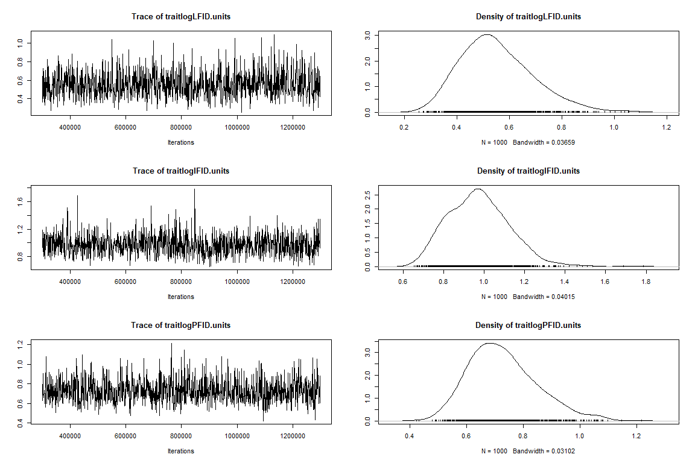
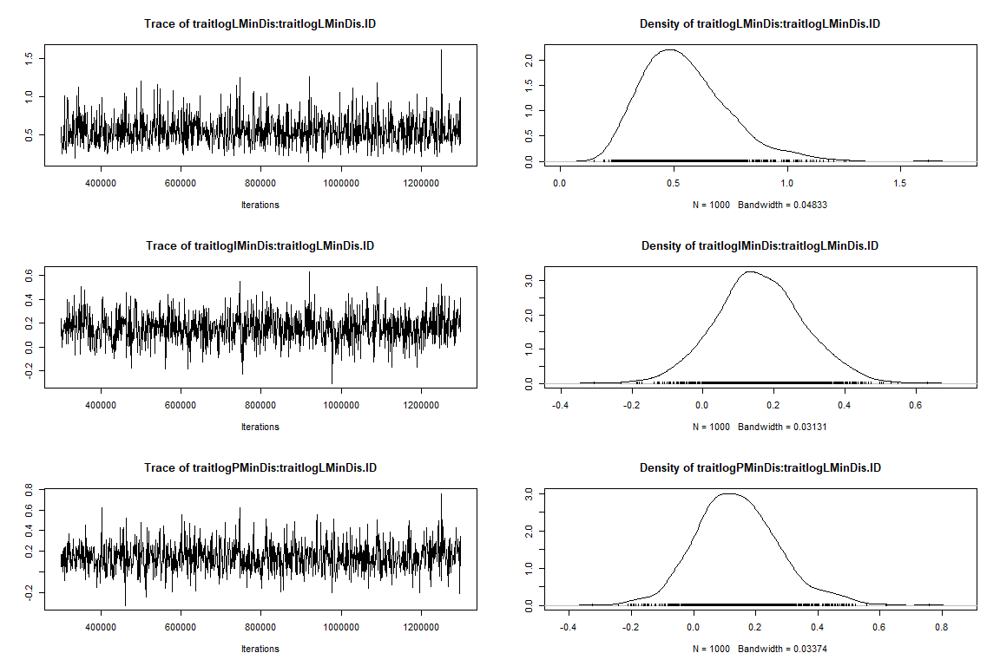
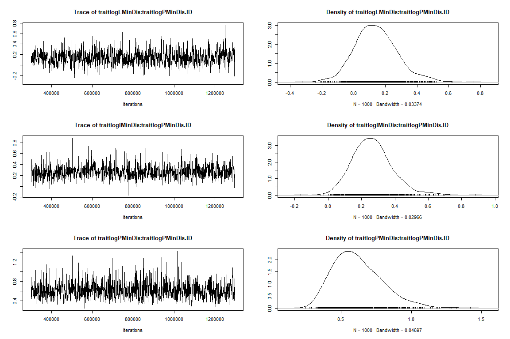
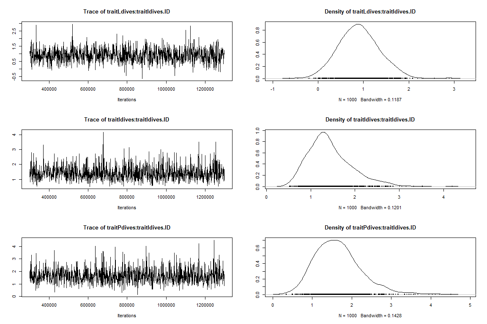
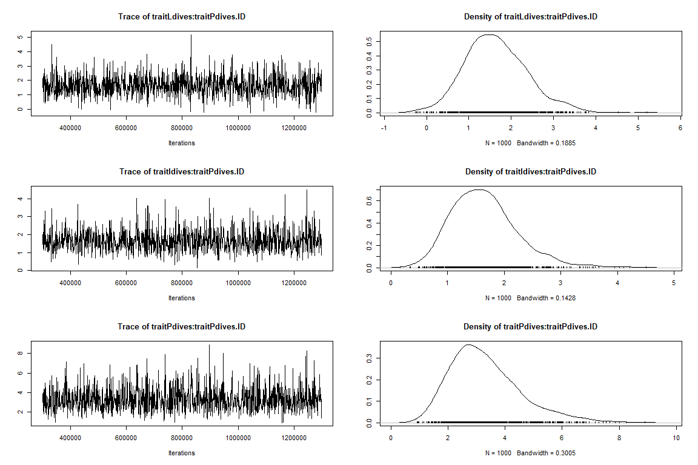
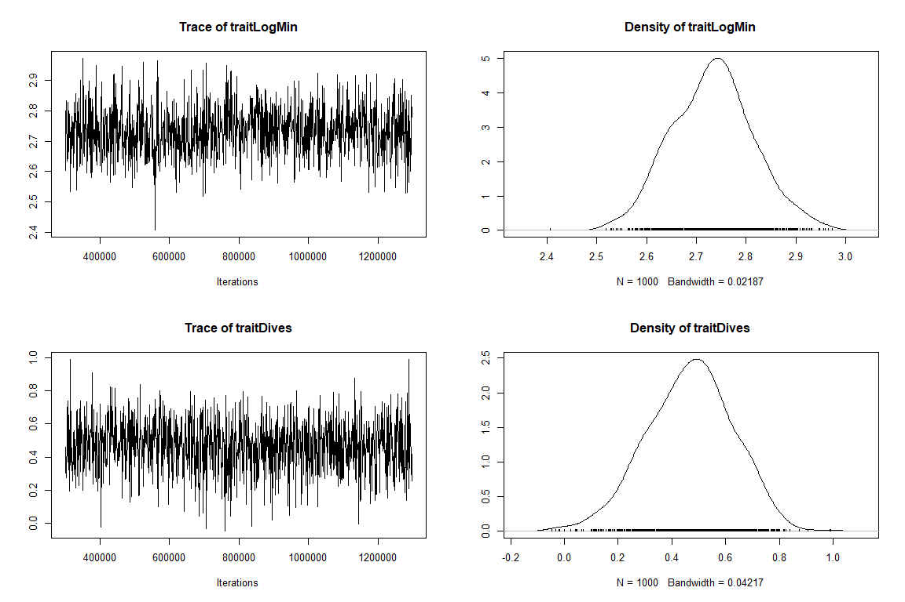
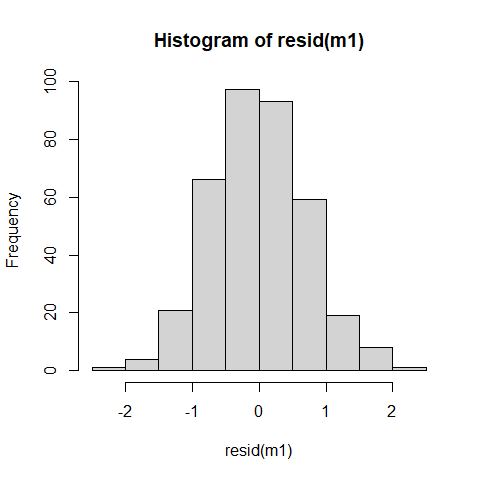
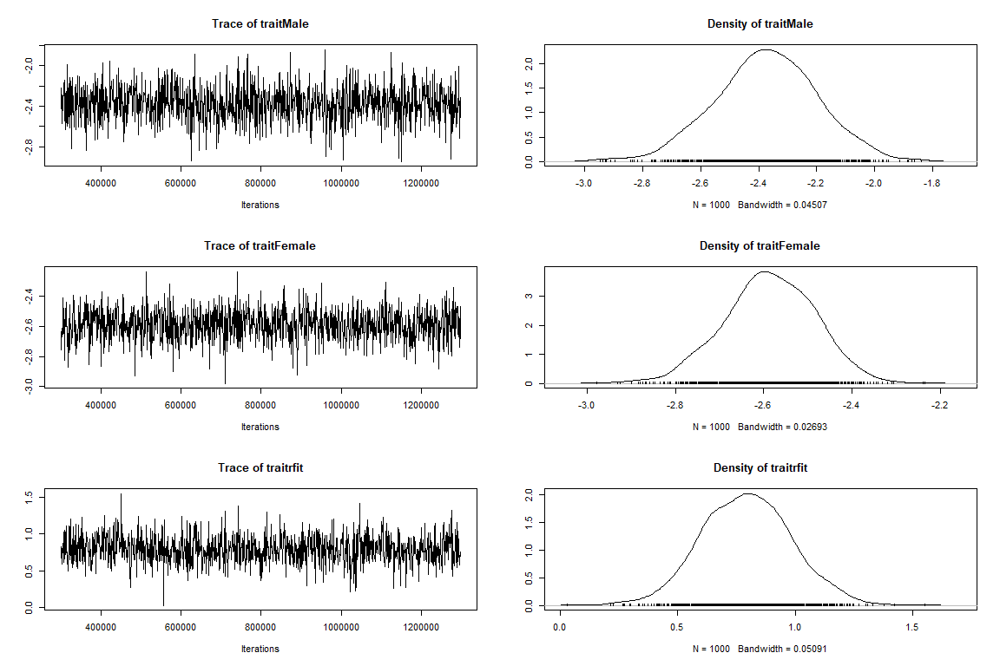
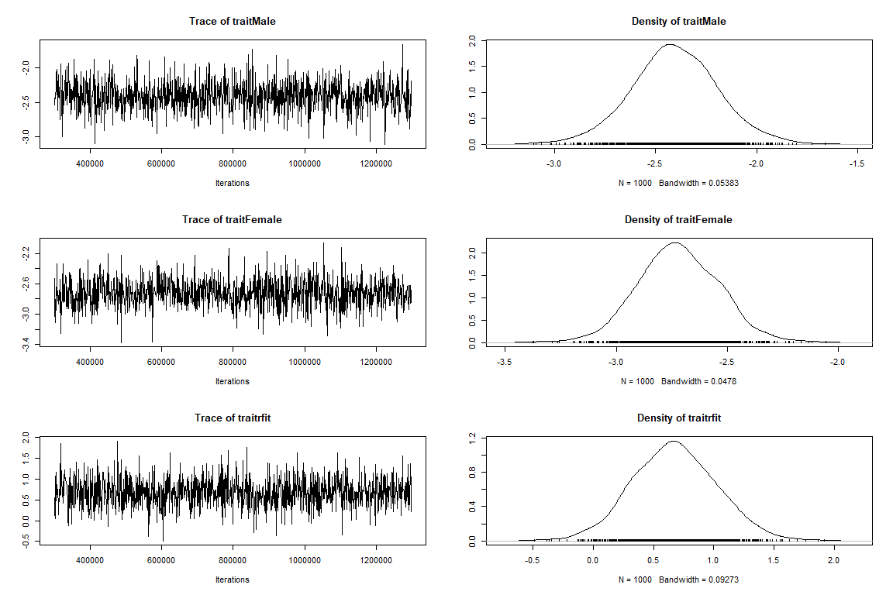

R Script: Does fluctuating selection maintain variation in nest defense
behavior in Arctic peregrine falcons (Falco peregrinus tundrius)?
================

``` r
#required packages
require(readr)
require(lme4)
require(MCMCglmm)
require(dplyr)
require(ggplot2)
require(rlang)
require(tidyverse)
require(rlang)
require(ggeffects)
require(arm)

# Set wd
setwd("C:/Users/nickg/OneDrive/Desktop/R projects/krmp_nest-defense")
#load data
data<-read.csv("data/nest_defense_test_final.csv")
names(data)
```

##### **Make Year,ID, and ID_Series factors. Inspect raw data and transform.**

``` r
data$Year2<-as.factor(data$Year2)
data$ID_Series<-as.factor(data$ID_Series)
data$ID<-as.factor(data$ID)

summary(data$MinDisRaw)
```

    ##    Min. 1st Qu.  Median    Mean 3rd Qu.    Max. 
    ##    0.10    5.00   15.00   27.72   25.00  600.00

``` r
data$MinDis100<-ifelse(data$MinDisRaw>100,100,data$MinDisRaw)
data$LogMin<-log(data$MinDis100+1)
```

##### **Minimum distance is capped at 100 meters (i.e., \>100 is not a response)**

``` r
data2<-subset(data, data$MinDisRaw<=100)
hist(data2$MinDisRaw)
```

<!-- -->

``` r
data2$logMin<-log(data2$MinDisRaw+1)
hist(data2$logMin)
```

<!-- -->

### **1. Sources of variation in nest defense**

-   *Univariate analyses of each of the three measures to i) evaluate if
    all three behaviors are representations of nest defense, and ii)
    choose best measure to use in main text.*

#### **Univariate model– Log-transformed minimum distance**

``` r
#Minimum distance---- 
require(lme4)
m1<-lmer(logMin~ Sex + NestStage + Year2+ (1|ID)+(1|Observer) ,
         data=data2) 

#summary
summary(m1)
```

    ## Linear mixed model fit by REML ['lmerMod']
    ## Formula: logMin ~ Sex + NestStage + Year2 + (1 | ID) + (1 | Observer)
    ##    Data: data2
    ## 
    ## REML criterion at convergence: 883.8
    ## 
    ## Scaled residuals: 
    ##      Min       1Q   Median       3Q      Max 
    ## -2.46859 -0.64241 -0.00094  0.59131  2.53522 
    ## 
    ## Random effects:
    ##  Groups   Name        Variance Std.Dev.
    ##  ID       (Intercept) 0.29899  0.5468  
    ##  Observer (Intercept) 0.03097  0.1760  
    ##  Residual             0.52508  0.7246  
    ## Number of obs: 351, groups:  ID, 103; Observer, 8
    ## 
    ## Fixed effects:
    ##                        Estimate Std. Error t value
    ## (Intercept)             2.97079    0.15338  19.369
    ## SexMale                -0.30939    0.14235  -2.173
    ## NestStage2Incubating   -0.24865    0.11971  -2.077
    ## NestStage3Provisioning -0.56368    0.12764  -4.416
    ## Year21                  0.08779    0.12461   0.704
    ## 
    ## Correlation of Fixed Effects:
    ##             (Intr) SexMal NstS2I NstS3P
    ## SexMale     -0.437                     
    ## NstStg2Incb -0.453  0.038              
    ## NstStg3Prvs -0.464  0.040  0.622       
    ## Year21      -0.409 -0.014  0.008  0.166

``` r
#model check
plot(m1)
```

<!-- -->

``` r
hist(resid(m1)) # residuals
```

<!-- -->

``` r
lattice::qqmath(m1) #normality of errors
```

<!-- -->

##### **Simulate posterior distribution–Log-transformed minimum distance**

``` r
sm1<-sim(m1)
smfixef=sm1@fixef
smranef=sm1@ranef
smfixef=as.mcmc(smfixef)
posterior.mode(smfixef)
```

    ##            (Intercept)                SexMale   NestStage2Incubating 
    ##             3.08833254            -0.33979478            -0.20796857 
    ## NestStage3Provisioning                 Year21 
    ##            -0.57818137             0.09957685

``` r
HPDinterval(smfixef)
```

    ##                             lower       upper
    ## (Intercept)             2.7000695  3.29185092
    ## SexMale                -0.5626121 -0.02148813
    ## NestStage2Incubating   -0.4471288 -0.03099244
    ## NestStage3Provisioning -0.7853677 -0.35233510
    ## Year21                 -0.1192943  0.29391231
    ## attr(,"Probability")
    ## [1] 0.95

``` r
bID<-sm1@ranef$ID
bvar<-as.vector(apply(bID, 1, var)) ##between individual variance posterior distribution
bvar<-as.mcmc(bvar)
posterior.mode(bvar )## mode of the distribution
```

    ##      var1 
    ## 0.3311147

``` r
HPDinterval(bvar)
```

    ##          lower     upper
    ## var1 0.2286352 0.3628702
    ## attr(,"Probability")
    ## [1] 0.95

``` r
bObs<-sm1@ranef$Observer
ObsVar<-as.vector(apply(bObs, 1, var)) ##between individual variance posterior distribution
ObsVar<-as.mcmc(ObsVar)
posterior.mode(ObsVar )## mode of the distribution
```

    ##       var1 
    ## 0.02541443

``` r
HPDinterval(ObsVar)
```

    ##            lower      upper
    ## var1 0.009230029 0.05345309
    ## attr(,"Probability")
    ## [1] 0.95

``` r
rvar<-sm1@sigma^2
rvar<-as.mcmc(rvar)
posterior.mode(rvar)
```

    ##      var1 
    ## 0.4869391

``` r
HPDinterval(rvar)
```

    ##          lower    upper
    ## var1 0.4655054 0.611815
    ## attr(,"Probability")
    ## [1] 0.95

##### **Repeatability–Log-transformed minimum distance**

``` r
r <- bvar/(bvar + rvar) ###individual
posterior.mode(r)
```

    ##      var1 
    ## 0.3573126

``` r
HPDinterval(r)
```

    ##          lower     upper
    ## var1 0.3069508 0.4205744
    ## attr(,"Probability")
    ## [1] 0.95

##### **Univariate model– Log-transformed truncated minimum distance to the observer (i.e., \>100m is not response)**

``` r
###min distance (truncated to max of 100)----
data$MinDis100<-ifelse(data$MinDisRaw>100,100,data$MinDisRaw)
data$logMinDis100<-log(data$MinDis100+1)
hist(data$logMinDis100)
```

<!-- -->

``` r
m1.1<-lmer(logMinDis100~ Sex + NestStage + Year2+ (1|ID)+(1|Observer) ,
         data=data) 
#summary
summary(m1.1)
```

    ## Linear mixed model fit by REML ['lmerMod']
    ## Formula: logMinDis100 ~ Sex + NestStage + Year2 + (1 | ID) + (1 | Observer)
    ##    Data: data
    ## 
    ## REML criterion at convergence: 986.4
    ## 
    ## Scaled residuals: 
    ##     Min      1Q  Median      3Q     Max 
    ## -2.7813 -0.6582 -0.0389  0.6082  2.3707 
    ## 
    ## Random effects:
    ##  Groups   Name        Variance Std.Dev.
    ##  ID       (Intercept) 0.33362  0.5776  
    ##  Observer (Intercept) 0.07101  0.2665  
    ##  Residual             0.61580  0.7847  
    ## Number of obs: 369, groups:  ID, 108; Observer, 8
    ## 
    ## Fixed effects:
    ##                        Estimate Std. Error t value
    ## (Intercept)              3.0078     0.1764  17.054
    ## SexMale                 -0.1685     0.1478  -1.140
    ## NestStage2Incubating    -0.3290     0.1245  -2.642
    ## NestStage3Provisioning  -0.5716     0.1349  -4.236
    ## Year21                   0.1734     0.1367   1.268
    ## 
    ## Correlation of Fixed Effects:
    ##             (Intr) SexMal NstS2I NstS3P
    ## SexMale     -0.400                     
    ## NstStg2Incb -0.405  0.036              
    ## NstStg3Prvs -0.411  0.030  0.604       
    ## Year21      -0.386 -0.022  0.033  0.203

``` r
#model check
plot(m1.1)
```

<!-- -->

``` r
hist(resid(m1.1)) # residuals
```

<!-- -->

``` r
lattice::qqmath(m1.1) #normality of errors
```

<!-- -->

##### **Simulate posterior distribution–Log-transformed truncated minimum distance to the observer (i.e., \>100m is not response)**

``` r
sm1<-sim(m1.1)
smfixef=sm1@fixef
smranef=sm1@ranef
smfixef=as.mcmc(smfixef)
posterior.mode(smfixef)
```

    ##            (Intercept)                SexMale   NestStage2Incubating 
    ##              3.0205773             -0.2293972             -0.2629506 
    ## NestStage3Provisioning                 Year21 
    ##             -0.6139531              0.1798510

``` r
HPDinterval(smfixef)
```

    ##                              lower      upper
    ## (Intercept)             2.70940665  3.3879695
    ## SexMale                -0.45240350  0.1943825
    ## NestStage2Incubating   -0.53410616 -0.1092220
    ## NestStage3Provisioning -0.81906177 -0.2953445
    ## Year21                 -0.05698162  0.3884333
    ## attr(,"Probability")
    ## [1] 0.95

``` r
bID<-sm1@ranef$ID
bvar<-as.vector(apply(bID, 1, var)) ##between individual variance posterior distribution
bvar<-as.mcmc(bvar)
posterior.mode(bvar )## mode of the distribution
```

    ##      var1 
    ## 0.3533804

``` r
HPDinterval(bvar)
```

    ##          lower     upper
    ## var1 0.2564606 0.4070926
    ## attr(,"Probability")
    ## [1] 0.95

``` r
bObs<-sm1@ranef$Observer
ObsVar<-as.vector(apply(bObs, 1, var)) ##between individual variance posterior distribution
ObsVar<-as.mcmc(ObsVar)
posterior.mode(ObsVar )## mode of the distribution
```

    ##       var1 
    ## 0.06015887

``` r
HPDinterval(ObsVar)
```

    ##          lower     upper
    ## var1 0.0154506 0.1266427
    ## attr(,"Probability")
    ## [1] 0.95

``` r
rvar<-sm1@sigma^2
rvar<-as.mcmc(rvar)
posterior.mode(rvar)
```

    ##      var1 
    ## 0.5940656

``` r
HPDinterval(rvar)
```

    ##         lower     upper
    ## var1 0.531788 0.6921465
    ## attr(,"Probability")
    ## [1] 0.95

##### **Repeatability–Log-transformed truncated minimum distance to the observer (i.e., \>100m is not response)**

``` r
r <- bvar/(bvar + rvar)        ###individual
posterior.mode(r)
```

    ##      var1 
    ## 0.3592548

``` r
HPDinterval(r)
```

    ##          lower     upper
    ## var1 0.2953174 0.4068641
    ## attr(,"Probability")
    ## [1] 0.95

#### **Univariate model– Number of Stoops**

``` r
###Number of stoops----
#names(data)
m2<-glmer(Dives~ Sex + NestStage + Year2+ (1|ID)+ (1|Observer) ,
         data=data, family="poisson") 
#summary
summary(m2)
```

    ## Generalized linear mixed model fit by maximum likelihood (Laplace
    ##   Approximation) [glmerMod]
    ##  Family: poisson  ( log )
    ## Formula: Dives ~ Sex + NestStage + Year2 + (1 | ID) + (1 | Observer)
    ##    Data: data
    ## 
    ##      AIC      BIC   logLik deviance df.resid 
    ##   2510.4   2537.7  -1248.2   2496.4      362 
    ## 
    ## Scaled residuals: 
    ##     Min      1Q  Median      3Q     Max 
    ## -3.5774 -1.3142 -0.5969  0.8893  6.7682 
    ## 
    ## Random effects:
    ##  Groups   Name        Variance Std.Dev.
    ##  ID       (Intercept) 1.4901   1.2207  
    ##  Observer (Intercept) 0.2758   0.5252  
    ## Number of obs: 369, groups:  ID, 108; Observer, 8
    ## 
    ## Fixed effects:
    ##                        Estimate Std. Error z value Pr(>|z|)    
    ## (Intercept)             0.58284    0.27920   2.088 0.036839 *  
    ## SexMale                 0.55899    0.25335   2.206 0.027356 *  
    ## NestStage2Incubating    0.19798    0.08685   2.280 0.022636 *  
    ## NestStage3Provisioning  0.20617    0.09424   2.188 0.028683 *  
    ## Year21                 -0.33174    0.10022  -3.310 0.000932 ***
    ## ---
    ## Signif. codes:  0 '***' 0.001 '**' 0.01 '*' 0.05 '.' 0.1 ' ' 1
    ## 
    ## Correlation of Fixed Effects:
    ##             (Intr) SexMal NstS2I NstS3P
    ## SexMale     -0.464                     
    ## NstStg2Incb -0.177  0.019              
    ## NstStg3Prvs -0.167  0.015  0.734       
    ## Year21      -0.149 -0.005  0.081  0.226

##### **Simulate posterior distribution–Number of Stoops**

``` r
sm2<-sim(m2)
smfixef=sm2@fixef
smranef=sm2@ranef
smfixef=as.mcmc(smfixef)
posterior.mode(smfixef)
```

    ##            (Intercept)                SexMale   NestStage2Incubating 
    ##              0.6093745              0.4388507              0.2153490 
    ## NestStage3Provisioning                 Year21 
    ##              0.2824816             -0.3173581

``` r
HPDinterval(smfixef)
```

    ##                              lower      upper
    ## (Intercept)             0.03979586  1.1710486
    ## SexMale                 0.03775549  1.0191727
    ## NestStage2Incubating    0.03551563  0.3732263
    ## NestStage3Provisioning  0.03256656  0.3668102
    ## Year21                 -0.55389085 -0.1402812
    ## attr(,"Probability")
    ## [1] 0.95

``` r
bID<-sm2@ranef$ID
bvar<-as.vector(apply(bID, 1, var)) ##between individual variance posterior distribution
bvar<-as.mcmc(bvar)
posterior.mode(bvar )## mode of the distribution
```

    ##     var1 
    ## 1.416244

``` r
HPDinterval(bvar)
```

    ##         lower    upper
    ## var1 1.165077 1.591031
    ## attr(,"Probability")
    ## [1] 0.95

``` r
bObs<-sm2@ranef$Observer
ObsVar<-as.vector(apply(bObs, 1, var)) ##between individual variance posterior distribution
ObsVar<-as.mcmc(ObsVar)
posterior.mode(ObsVar )## mode of the distribution
```

    ##      var1 
    ## 0.3010622

``` r
HPDinterval(ObsVar)
```

    ##          lower     upper
    ## var1 0.2121155 0.3917127
    ## attr(,"Probability")
    ## [1] 0.95

##### **Repeatability– Number of Stoops**

``` r
r <- bvar/(bvar + 1)        ###individual
posterior.mode(r)
```

    ##      var1 
    ## 0.5861543

``` r
HPDinterval(r)
```

    ##          lower     upper
    ## var1 0.5381226 0.6140532
    ## attr(,"Probability")
    ## [1] 0.95

#### **Univariate model– Log-transformed FID**

``` r
###FID----
data3<-subset(data, data$FID>0)
hist(data3$FID)
```

<!-- -->

``` r
data3$logFID<-log(data3$FID+1)
hist(data3$logFID)
```

<!-- -->

``` r
m3<-lmer(logFID~ Sex + NestStage + Year2+ (1|ID)+(1|Observer) ,
         data=data3) 
#summary
summary(m3)
```

    ## Linear mixed model fit by REML ['lmerMod']
    ## Formula: logFID ~ Sex + NestStage + Year2 + (1 | ID) + (1 | Observer)
    ##    Data: data3
    ## 
    ## REML criterion at convergence: 938.5
    ## 
    ## Scaled residuals: 
    ##     Min      1Q  Median      3Q     Max 
    ## -2.9408 -0.5841  0.1320  0.6995  2.2551 
    ## 
    ## Random effects:
    ##  Groups   Name        Variance Std.Dev.
    ##  ID       (Intercept) 0.2042   0.4519  
    ##  Observer (Intercept) 0.0000   0.0000  
    ##  Residual             0.9121   0.9550  
    ## Number of obs: 321, groups:  ID, 105; Observer, 8
    ## 
    ## Fixed effects:
    ##                        Estimate Std. Error t value
    ## (Intercept)             4.38743    0.15729  27.894
    ## SexMale                 0.39660    0.15040   2.637
    ## NestStage2Incubating   -0.47823    0.15153  -3.156
    ## NestStage3Provisioning -0.05798    0.14886  -0.390
    ## Year21                 -0.27550    0.13033  -2.114
    ## 
    ## Correlation of Fixed Effects:
    ##             (Intr) SexMal NstS2I NstS3P
    ## SexMale     -0.432                     
    ## NstStg2Incb -0.560  0.054              
    ## NstStg3Prvs -0.627  0.073  0.613       
    ## Year21      -0.457 -0.026 -0.030  0.109
    ## optimizer (nloptwrap) convergence code: 0 (OK)
    ## boundary (singular) fit: see ?isSingular

``` r
#model check
plot(m3)
```

<!-- -->

``` r
hist(resid(m3)) # residuals
```

<!-- -->

``` r
lattice::qqmath(m3) #normality of errors
```

<!-- -->

##### **Simulate posterior distribution– Log-transformed FID**

``` r
sm3<-sim(m3)
smfixef=sm3@fixef
smranef=sm3@ranef
smfixef=as.mcmc(smfixef)
posterior.mode(smfixef)
```

    ##            (Intercept)                SexMale   NestStage2Incubating 
    ##             4.51222285             0.45251010            -0.46461403 
    ## NestStage3Provisioning                 Year21 
    ##            -0.09900085            -0.21756572

``` r
HPDinterval(smfixef)
```

    ##                              lower       upper
    ## (Intercept)             4.15412198  4.67560351
    ## SexMale                 0.07350174  0.60272463
    ## NestStage2Incubating   -0.83880159 -0.20879347
    ## NestStage3Provisioning -0.33251104  0.18418679
    ## Year21                 -0.46087587 -0.06194758
    ## attr(,"Probability")
    ## [1] 0.95

``` r
bID<-sm3@ranef$ID
bvar<-as.vector(apply(bID, 1, var)) ##between individual variance posterior distribution
bvar<-as.mcmc(bvar)
posterior.mode(bvar )## mode of the distribution
```

    ##      var1 
    ## 0.1954916

``` r
HPDinterval(bvar)
```

    ##         lower     upper
    ## var1 0.158074 0.2817802
    ## attr(,"Probability")
    ## [1] 0.95

``` r
bObs<-sm3@ranef$Observer
ObsVar<-as.vector(apply(bObs, 1, var)) ##between individual variance posterior distribution
ObsVar<-as.mcmc(ObsVar)
posterior.mode(ObsVar )## mode of the distribution
```

    ##          var1 
    ## -0.0002103502

``` r
HPDinterval(ObsVar)
```

    ##      lower upper
    ## var1     0     0
    ## attr(,"Probability")
    ## [1] 0.95

``` r
rvar<-sm1@sigma^2
rvar<-as.mcmc(rvar)
posterior.mode(rvar)
```

    ##      var1 
    ## 0.5940656

``` r
HPDinterval(rvar)
```

    ##         lower     upper
    ## var1 0.531788 0.6921465
    ## attr(,"Probability")
    ## [1] 0.95

##### **Repeatability– Log-transformed FID**

``` r
r <- bvar/(bvar + rvar)        ###individual
posterior.mode(r)
```

    ##      var1 
    ## 0.2364131

``` r
HPDinterval(r)
```

    ##          lower     upper
    ## var1 0.1973126 0.3191477
    ## attr(,"Probability")
    ## [1] 0.95

### **2. Multivariate model with 9 nest defense traits (across contexts)**

-   *Since we had variable effects of nest stage with each behavior
    measured, we constructed three multivariate models to understand the
    correlation of each measure of nest defense with nest stage.*

#### **Multivariate: FID across breeding contexts**

``` r
prior3var=list(R=list(V=diag(3),nu=3.002),G=list(G1=list(V=diag(3), nu=3.002))) #3 trait prior w/one random effect

m3FID<-MCMCglmm(cbind(logLFID, logIFID,logPFID)~(trait-1),
             random=~us(trait):ID,
             rcov=~idh(trait):units,
             family=c("gaussian","gaussian", "gaussian"),
             prior=prior3var,
             nitt=1300000,thin=1000,burnin=300000, 
             data=data_3c,verbose=F)

summary(m3FID)
```

    ## 
    ##  Iterations = 300001:1299001
    ##  Thinning interval  = 1000
    ##  Sample size  = 1000 
    ## 
    ##  DIC: 908.0425 
    ## 
    ##  G-structure:  ~us(trait):ID
    ## 
    ##                              post.mean l-95% CI u-95% CI eff.samp
    ## traitlogLFID:traitlogLFID.ID  0.559285  0.24129  0.91678   1236.2
    ## traitlogIFID:traitlogLFID.ID -0.006203 -0.25459  0.28570   1308.1
    ## traitlogPFID:traitlogLFID.ID -0.213534 -0.57595  0.09209   1430.5
    ## traitlogLFID:traitlogIFID.ID -0.006203 -0.25459  0.28570   1308.1
    ## traitlogIFID:traitlogIFID.ID  0.475407  0.22444  0.77720   1120.0
    ## traitlogPFID:traitlogIFID.ID  0.181792 -0.08561  0.44338   1157.4
    ## traitlogLFID:traitlogPFID.ID -0.213534 -0.57595  0.09209   1430.5
    ## traitlogIFID:traitlogPFID.ID  0.181792 -0.08561  0.44338   1157.4
    ## traitlogPFID:traitlogPFID.ID  0.651207  0.28391  1.00965    868.7
    ## 
    ##  R-structure:  ~idh(trait):units
    ## 
    ##                    post.mean l-95% CI u-95% CI eff.samp
    ## traitlogLFID.units    0.5618   0.3140   0.8448      833
    ## traitlogIFID.units    0.9685   0.7067   1.2844     1000
    ## traitlogPFID.units    0.7311   0.5061   0.9388     1000
    ## 
    ##  Location effects: cbind(logLFID, logIFID, logPFID) ~ (trait - 1) 
    ## 
    ##              post.mean l-95% CI u-95% CI eff.samp  pMCMC    
    ## traitlogLFID     4.434    4.219    4.702   1000.0 <0.001 ***
    ## traitlogIFID     3.925    3.664    4.155   1000.0 <0.001 ***
    ## traitlogPFID     4.284    4.025    4.556    740.7 <0.001 ***
    ## ---
    ## Signif. codes:  0 '***' 0.001 '**' 0.01 '*' 0.05 '.' 0.1 ' ' 1

``` r
plot(m3FID)
```

<!-- --><!-- --><!-- --><!-- --><!-- -->

##### **Among-individual covariance-FID**

``` r
c1 <- posterior.cor(m3FID$VCV[,1:9])
round(apply(c1,2,mean),2)
```

    ##  var1  var2  var3  var4  var5  var6  var7  var8  var9 
    ##  1.00 -0.01 -0.34 -0.01  1.00  0.32 -0.34  0.32  1.00

``` r
round(apply(c1,2, quantile, c(0.025, 0.975)),2)
```

    ##       var1  var2  var3  var4 var5  var6  var7  var8 var9
    ## 2.5%     1 -0.50 -0.71 -0.50    1 -0.10 -0.71 -0.10    1
    ## 97.5%    1  0.46  0.17  0.46    1  0.65  0.17  0.65    1

#### **Multivariate: minimum approach distance across breeding contexts**

``` r
m3Min<-MCMCglmm(cbind(logLMinDis, logIMinDis,logPMinDis)~(trait-1),
                random=~us(trait):ID,
                rcov=~idh(trait):units,
                family=c("gaussian","gaussian", "gaussian"),
                prior=prior3var,
                nitt=1300000,thin=1000,burnin=300000, 
                data=data_3c,verbose=FALSE)

summary(m3Min)
```

    ## 
    ##  Iterations = 300001:1299001
    ##  Thinning interval  = 1000
    ##  Sample size  = 1000 
    ## 
    ##  DIC: 844.134 
    ## 
    ##  G-structure:  ~us(trait):ID
    ## 
    ##                                    post.mean l-95% CI u-95% CI eff.samp
    ## traitlogLMinDis:traitlogLMinDis.ID    0.5396  0.21621   0.8942     1000
    ## traitlogIMinDis:traitlogLMinDis.ID    0.1611 -0.07760   0.4186     1000
    ## traitlogPMinDis:traitlogLMinDis.ID    0.1419 -0.10069   0.4236     1000
    ## traitlogLMinDis:traitlogIMinDis.ID    0.1611 -0.07760   0.4186     1000
    ## traitlogIMinDis:traitlogIMinDis.ID    0.5706  0.30496   0.8546     1000
    ## traitlogPMinDis:traitlogIMinDis.ID    0.2676  0.02998   0.5433     1000
    ## traitlogLMinDis:traitlogPMinDis.ID    0.1419 -0.10069   0.4236     1000
    ## traitlogIMinDis:traitlogPMinDis.ID    0.2676  0.02998   0.5433     1000
    ## traitlogPMinDis:traitlogPMinDis.ID    0.6275  0.32089   0.9900     1037
    ## 
    ##  R-structure:  ~idh(trait):units
    ## 
    ##                       post.mean l-95% CI u-95% CI eff.samp
    ## traitlogLMinDis.units    0.6782   0.3911   1.0580    883.4
    ## traitlogIMinDis.units    0.6120   0.4258   0.8131   1000.0
    ## traitlogPMinDis.units    0.5768   0.3789   0.7428   1000.0
    ## 
    ##  Location effects: cbind(logLMinDis, logIMinDis, logPMinDis) ~ (trait - 1) 
    ## 
    ##                 post.mean l-95% CI u-95% CI eff.samp  pMCMC    
    ## traitlogLMinDis     2.990    2.742    3.262     1000 <0.001 ***
    ## traitlogIMinDis     2.728    2.502    2.967     1000 <0.001 ***
    ## traitlogPMinDis     2.411    2.176    2.662     1000 <0.001 ***
    ## ---
    ## Signif. codes:  0 '***' 0.001 '**' 0.01 '*' 0.05 '.' 0.1 ' ' 1

``` r
plot(m3Min)
```

<!-- --><!-- --><!-- --><!-- --><!-- -->

##### **Among-individual covariance–minimum approach distance across breeding contexts**

``` r
c1 <- posterior.cor(m3Min$VCV[,1:9])
round(apply(c1,2,mean),2)
```

    ## var1 var2 var3 var4 var5 var6 var7 var8 var9 
    ## 1.00 0.29 0.24 0.29 1.00 0.45 0.24 0.45 1.00

``` r
round(apply(c1,2, quantile, c(0.025, 0.975)),2)
```

    ##       var1  var2  var3  var4 var5 var6  var7 var8 var9
    ## 2.5%     1 -0.15 -0.21 -0.15    1 0.06 -0.21 0.06    1
    ## 97.5%    1  0.64  0.62  0.64    1 0.72  0.62 0.72    1

#### **Multivariate: number of dives across breeding contexts**

``` r
m3Dives<-MCMCglmm(cbind(Ldives, Idives,Pdives)~(trait-1),
                random=~us(trait):ID,
                rcov=~idh(trait):units,
                family=c("poisson","poisson", "poisson"), 
                prior=prior3var,
                nitt=1300000,thin=1000,burnin=300000, 
                data=data_3c,verbose=FALSE)

summary(m3Dives)
```

    ## 
    ##  Iterations = 300001:1299001
    ##  Thinning interval  = 1000
    ##  Sample size  = 1000 
    ## 
    ##  DIC: 1273.266 
    ## 
    ##  G-structure:  ~us(trait):ID
    ## 
    ##                            post.mean l-95% CI u-95% CI eff.samp
    ## traitLdives:traitLdives.ID    1.8945  0.62505    3.588     1000
    ## traitIdives:traitLdives.ID    0.8946  0.01679    1.906     1000
    ## traitPdives:traitLdives.ID    1.6231  0.22937    3.198     1000
    ## traitLdives:traitIdives.ID    0.8946  0.01679    1.906     1000
    ## traitIdives:traitIdives.ID    1.4335  0.60375    2.400     1000
    ## traitPdives:traitIdives.ID    1.6456  0.66309    2.804     1000
    ## traitLdives:traitPdives.ID    1.6231  0.22937    3.198     1000
    ## traitIdives:traitPdives.ID    1.6456  0.66309    2.804     1000
    ## traitPdives:traitPdives.ID    3.3148  1.16633    5.805      895
    ## 
    ##  R-structure:  ~idh(trait):units
    ## 
    ##                   post.mean l-95% CI u-95% CI eff.samp
    ## traitLdives.units     1.853   0.7292    3.426     1000
    ## traitIdives.units     1.254   0.6469    1.976     1000
    ## traitPdives.units     2.205   1.1280    3.501     1000
    ## 
    ##  Location effects: cbind(Ldives, Idives, Pdives) ~ (trait - 1) 
    ## 
    ##             post.mean  l-95% CI  u-95% CI eff.samp pMCMC   
    ## traitLdives  0.389988 -0.213961  0.910237   1000.0 0.176   
    ## traitIdives  0.782277  0.365044  1.191333    979.0 0.002 **
    ## traitPdives  0.001346 -0.671476  0.702882    909.9 0.930   
    ## ---
    ## Signif. codes:  0 '***' 0.001 '**' 0.01 '*' 0.05 '.' 0.1 ' ' 1

``` r
plot(m3Dives)
```

<!-- --><!-- --><!-- --><!-- --><!-- -->

##### **Among-individual covariance–number of dives across breeding contexts**

``` r
c1 <- posterior.cor(m3Dives$VCV[,1:9])
round(apply(c1,2,mean),2)
```

    ## var1 var2 var3 var4 var5 var6 var7 var8 var9 
    ## 1.00 0.55 0.66 0.55 1.00 0.76 0.66 0.76 1.00

``` r
round(apply(c1,2, quantile, c(0.025, 0.975)),2)
```

    ##       var1 var2 var3 var4 var5 var6 var7 var8 var9
    ## 2.5%     1 0.02  0.2 0.02    1 0.50  0.2 0.50    1
    ## 97.5%    1 0.84  0.9 0.84    1 0.91  0.9 0.91    1

### **3. Bivariate model with minimum distance and number of dives**

-   *Evaluate covariance between each measure of nest defense*

``` r
prior_2var= list(R = list(V = diag(2), nu = 1.002),
                 G = list(G1 = list(V = diag(2), nu = 2,
                                    alpha.mu = rep(0,2),
                                    alpha.V = diag(25^2,2)))) # 3-trait prior w/one random effect
#names(data)

model.2var <- MCMCglmm(
  cbind(LogMin, Dives) ~ trait - 1,
  random = ~ us(trait):ID,
  rcov = ~ us(trait):units,
  family = c("gaussian", "poisson"),
  data = data,
  prior = prior_2var,
  verbose = FALSE,
  nitt = 1300000, thin = 1000, burnin = 300000
  )


summary(model.2var)
```

    ## 
    ##  Iterations = 300001:1299001
    ##  Thinning interval  = 1000
    ##  Sample size  = 1000 
    ## 
    ##  DIC: 2337.396 
    ## 
    ##  G-structure:  ~us(trait):ID
    ## 
    ##                            post.mean l-95% CI u-95% CI eff.samp
    ## traitLogMin:traitLogMin.ID    0.3874   0.2358   0.5654    745.5
    ## traitDives:traitLogMin.ID    -0.5326  -0.8236  -0.2508   1000.0
    ## traitLogMin:traitDives.ID    -0.5326  -0.8236  -0.2508   1000.0
    ## traitDives:traitDives.ID      1.2911   0.6463   2.0444   1000.0
    ## 
    ##  R-structure:  ~us(trait):units
    ## 
    ##                               post.mean l-95% CI u-95% CI eff.samp
    ## traitLogMin:traitLogMin.units    0.7279   0.6047   0.8476     1124
    ## traitDives:traitLogMin.units    -0.6257  -0.8262  -0.4488     1000
    ## traitLogMin:traitDives.units    -0.6257  -0.8262  -0.4488     1000
    ## traitDives:traitDives.units      1.8923   1.3736   2.4341     1000
    ## 
    ##  Location effects: cbind(LogMin, Dives) ~ trait - 1 
    ## 
    ##             post.mean l-95% CI u-95% CI eff.samp  pMCMC    
    ## traitLogMin    2.7263   2.5765   2.8982     1000 <0.001 ***
    ## traitDives     0.4753   0.1574   0.7742     1000  0.008 ** 
    ## ---
    ## Signif. codes:  0 '***' 0.001 '**' 0.01 '*' 0.05 '.' 0.1 ' ' 1

``` r
plot(model.2var)
```

<!-- --><!-- --><!-- -->

#### **Among-individual and within-individual covariance–minimum distance and number of dives**

``` r
c1<- posterior.cor(model.2var$VCV[,1:4])
round(apply(c1,2,mean),2)
```

    ##  var1  var2  var3  var4 
    ##  1.00 -0.75 -0.75  1.00

``` r
round(apply(c1,2, quantile, c(0.025, 0.975)),2)
```

    ##       var1  var2  var3 var4
    ## 2.5%     1 -0.90 -0.90    1
    ## 97.5%    1 -0.55 -0.55    1

``` r
#within individual covariance
c2<- posterior.cor(model.2var$VCV[,5:8])
round(apply(c2,2,mean),2)
```

    ##  var1  var2  var3  var4 
    ##  1.00 -0.53 -0.53  1.00

``` r
round(apply(c2,2, quantile, c(0.025, 0.975)),2)
```

    ##       var1  var2  var3 var4
    ## 2.5%     1 -0.63 -0.63    1
    ## 97.5%    1 -0.42 -0.42    1

### **4. Univariate model to estimate short-versus long-term repeatability with interaction**

-   *Interaction is included since we predicted that females would be
    more defensive with increasing nest stages.*

``` r
#no sex:nest stage interaction... Table S3
require(lme4)
m1.0<-lmer(LogMin~ (Sex + NestStage)^2 + Year2+ (1|ID) + (1|ID_Series) ,
         data=data) 
summary(m1.0)
```

    ## Linear mixed model fit by REML ['lmerMod']
    ## Formula: LogMin ~ (Sex + NestStage)^2 + Year2 + (1 | ID) + (1 | ID_Series)
    ##    Data: data
    ## 
    ## REML criterion at convergence: 1003.1
    ## 
    ## Scaled residuals: 
    ##      Min       1Q   Median       3Q      Max 
    ## -2.94297 -0.61202 -0.02309  0.52714  2.76760 
    ## 
    ## Random effects:
    ##  Groups    Name        Variance Std.Dev.
    ##  ID_Series (Intercept) 0.08504  0.2916  
    ##  ID        (Intercept) 0.27454  0.5240  
    ##  Residual              0.65003  0.8062  
    ## Number of obs: 369, groups:  ID_Series, 123; ID, 108
    ## 
    ## Fixed effects:
    ##                                Estimate Std. Error t value
    ## (Intercept)                     2.94076    0.16208  18.144
    ## SexMale                        -0.09501    0.21235  -0.447
    ## NestStage2Incubating           -0.28349    0.16770  -1.690
    ## NestStage3Provisioning         -0.55002    0.15752  -3.492
    ## Year21                          0.29835    0.12778   2.335
    ## SexMale:NestStage2Incubating   -0.10133    0.25100  -0.404
    ## SexMale:NestStage3Provisioning -0.13211    0.24497  -0.539
    ## 
    ## Correlation of Fixed Effects:
    ##             (Intr) SexMal NstS2I NstS3P Year21 SM:NS2
    ## SexMale     -0.628                                   
    ## NstStg2Incb -0.586  0.457                            
    ## NstStg3Prvs -0.602  0.444  0.647                     
    ## Year21      -0.411 -0.016 -0.029  0.045              
    ## SxMl:NstS2I  0.396 -0.642 -0.668 -0.433  0.008       
    ## SxMl:NstS3P  0.369 -0.615 -0.417 -0.641  0.013  0.604

``` r
anova(m1.0)
```

    ## Analysis of Variance Table
    ##               npar  Sum Sq Mean Sq F value
    ## Sex              1  0.4447  0.4447  0.6841
    ## NestStage        2 18.0005  9.0003 13.8459
    ## Year2            1  3.5660  3.5660  5.4859
    ## Sex:NestStage    2  0.1953  0.0976  0.1502

##### **Simulate posterior distribution**

``` r
smod<-sim(m1.0,1000)
posterior.mode(as.mcmc(smod@fixef))
```

    ##                    (Intercept)                        SexMale 
    ##                      2.9330022                     -0.1093316 
    ##           NestStage2Incubating         NestStage3Provisioning 
    ##                     -0.2903931                     -0.5588811 
    ##                         Year21   SexMale:NestStage2Incubating 
    ##                      0.3248029                     -0.2161740 
    ## SexMale:NestStage3Provisioning 
    ##                     -0.1866898

``` r
HPDinterval(as.mcmc(smod@fixef))
```

    ##                                      lower       upper
    ## (Intercept)                     2.59737261  3.25798121
    ## SexMale                        -0.43598170  0.37518093
    ## NestStage2Incubating           -0.61399081  0.06147804
    ## NestStage3Provisioning         -0.84947036 -0.24045567
    ## Year21                          0.03816283  0.53728272
    ## SexMale:NestStage2Incubating   -0.60611793  0.39964051
    ## SexMale:NestStage3Provisioning -0.58793444  0.37624594
    ## attr(,"Probability")
    ## [1] 0.95

``` r
##Between individual variance
bID<-smod@ranef$ID[,,1]
bvar<-as.vector(apply(bID, 1, var)) ##ID variance posterior distribution
require(MCMCglmm)
bvar<-as.mcmc(bvar)
posterior.mode(bvar )## mode of the distribution
```

    ##      var1 
    ## 0.2973766

``` r
HPDinterval(bvar)
```

    ##          lower     upper
    ## var1 0.2376711 0.4042282
    ## attr(,"Probability")
    ## [1] 0.95

``` r
##Between individual variance, ID_Series
bID2<-smod@ranef$ID_Series[,,1]
bvar2<-as.vector(apply(bID2, 1, var)) ##ID_Series variance posterior distribution
require(MCMCglmm)
bvar2<-as.mcmc(bvar2)
posterior.mode(bvar2 )## mode of the distribution
```

    ##       var1 
    ## 0.07526645

``` r
HPDinterval(bvar2)
```

    ##           lower      upper
    ## var1 0.05550871 0.09805372
    ## attr(,"Probability")
    ## [1] 0.95

``` r
###residual variance
rvar<-smod@sigma^2
rvar<-as.mcmc(rvar)
posterior.mode(rvar)
```

    ##     var1 
    ## 0.624986

``` r
HPDinterval(rvar)
```

    ##          lower     upper
    ## var1 0.5620613 0.7541064
    ## attr(,"Probability")
    ## [1] 0.95

##### **Long-term and short-term repeatability**

``` r
### Long-term repeatability
r<-bvar/(rvar+bvar +bvar2 )
posterior.mode(r)
```

    ##      var1 
    ## 0.3082312

``` r
HPDinterval(r)  ##repeatability 
```

    ##          lower     upper
    ## var1 0.2467317 0.3582906
    ## attr(,"Probability")
    ## [1] 0.95

``` r
###Short-term
r1<-(bvar +bvar2  )/(rvar+bvar +bvar2 )
posterior.mode(r1)
```

    ##      var1 
    ## 0.3652779

``` r
HPDinterval(r1)  ##repeatability
```

    ##          lower     upper
    ## var1 0.3248495 0.4270072
    ## attr(,"Probability")
    ## [1] 0.95

### **Main effects similar without including interactions.**

-   *We dropped the interaction since it was not significant. Results
    for main text Table 1*

``` r
m1<-lmer(LogMin~ Sex + NestStage + Year2+ (1|ID) + (1|ID_Series) ,
         data=data) 
#summary
summary(m1)
```

    ## Linear mixed model fit by REML ['lmerMod']
    ## Formula: LogMin ~ Sex + NestStage + Year2 + (1 | ID) + (1 | ID_Series)
    ##    Data: data
    ## 
    ## REML criterion at convergence: 1001.1
    ## 
    ## Scaled residuals: 
    ##      Min       1Q   Median       3Q      Max 
    ## -2.90448 -0.60019 -0.01792  0.54558  2.73142 
    ## 
    ## Random effects:
    ##  Groups    Name        Variance Std.Dev.
    ##  ID_Series (Intercept) 0.08652  0.2941  
    ##  ID        (Intercept) 0.27623  0.5256  
    ##  Residual              0.64505  0.8031  
    ## Number of obs: 369, groups:  ID_Series, 123; ID, 108
    ## 
    ## Fixed effects:
    ##                        Estimate Std. Error t value
    ## (Intercept)              2.9759     0.1465  20.317
    ## SexMale                 -0.1718     0.1514  -1.135
    ## NestStage2Incubating    -0.3293     0.1245  -2.646
    ## NestStage3Provisioning  -0.6045     0.1202  -5.029
    ## Year21                   0.3000     0.1279   2.346
    ## 
    ## Correlation of Fixed Effects:
    ##             (Intr) SexMal NstS2I NstS3P
    ## SexMale     -0.510                     
    ## NstStg2Incb -0.472  0.043              
    ## NstStg3Prvs -0.508  0.056  0.614       
    ## Year21      -0.461 -0.010 -0.031  0.070

``` r
#model check
plot(m1.1)
```

<!-- -->

``` r
hist(resid(m1.1)) # residuals
```

<!-- -->

``` r
lattice::qqmath(m1.1) #normality of errors
```

<!-- -->

##### **Simulate posterior distribution– Univariate model with no interaction**

``` r
#simulated parameters
require(dplyr)
library(arm)
require(MCMCglmm)
smod<-sim(m1,1000)
posterior.mode(as.mcmc(smod@fixef))
```

    ##            (Intercept)                SexMale   NestStage2Incubating 
    ##              3.0192488             -0.1779903             -0.3901342 
    ## NestStage3Provisioning                 Year21 
    ##             -0.5815032              0.2245999

``` r
HPDinterval(as.mcmc(smod@fixef))
```

    ##                              lower       upper
    ## (Intercept)             2.67462968  3.26476828
    ## SexMale                -0.48086817  0.09771978
    ## NestStage2Incubating   -0.55544368 -0.09348785
    ## NestStage3Provisioning -0.84892295 -0.39398825
    ## Year21                  0.05996998  0.55727867
    ## attr(,"Probability")
    ## [1] 0.95

``` r
##Between individual variance
bID<-smod@ranef$ID[,,1]
bvar<-as.vector(apply(bID, 1, var)) ##ID variance posterior distribution
require(MCMCglmm)
bvar<-as.mcmc(bvar)
posterior.mode(bvar )## mode of the distribution
```

    ##      var1 
    ## 0.3091472

``` r
HPDinterval(bvar)
```

    ##          lower     upper
    ## var1 0.2379842 0.4000454
    ## attr(,"Probability")
    ## [1] 0.95

``` r
##Between individual variance, ID_Series
bID2<-smod@ranef$ID_Series[,,1]
bvar2<-as.vector(apply(bID2, 1, var)) ##ID_Series variance posterior distribution
require(MCMCglmm)
bvar2<-as.mcmc(bvar2)
posterior.mode(bvar2 )## mode of the distribution
```

    ##       var1 
    ## 0.06716235

``` r
HPDinterval(bvar2)
```

    ##           lower      upper
    ## var1 0.05263274 0.09617665
    ## attr(,"Probability")
    ## [1] 0.95

``` r
###residual variance
rvar<-smod@sigma^2
rvar<-as.mcmc(rvar)
posterior.mode(rvar)
```

    ##      var1 
    ## 0.6249228

``` r
HPDinterval(rvar)
```

    ##          lower     upper
    ## var1 0.5524257 0.7373092
    ## attr(,"Probability")
    ## [1] 0.95

##### **Long-term and short-term repeatability– Univariate model with no interaction**

``` r
### Long-term repeatability
r<-bvar/(rvar+bvar +bvar2 )
posterior.mode(r)
```

    ##      var1 
    ## 0.3042671

``` r
HPDinterval(r)  ##repeatability 
```

    ##          lower     upper
    ## var1 0.2475596 0.3559779
    ## attr(,"Probability")
    ## [1] 0.95

``` r
###Short-term
r1<-(bvar +bvar2  )/(rvar+bvar +bvar2 )
posterior.mode(r1)
```

    ##      var1 
    ## 0.3717138

``` r
HPDinterval(r1)  ##repeatability
```

    ##          lower     upper
    ## var1 0.3266947 0.4249424
    ## attr(,"Probability")
    ## [1] 0.95

##### **Plot– Univariate model with no interaction**

``` r
#load packages for predictive plot
require(ggplot2)
require(ggeffects)


d18<-subset(data, data$Year=="2018")
d19<-subset(data, data$Year=="2019")

#plot
p18<-ggplot(d18, aes(x = NestStage, y = MinDisRaw, factor=NestStage, fill=Sex, color=Sex)) + geom_boxplot() +
  scale_y_continuous("Minimum approach distnace to observer (m)",limits = c(0, 100)) +
  scale_x_discrete("Nest Stage", labels=c('Egg-laying', 'Incubating', 'Provisioning'))+ 
  guides(fill="none")+
  guides(color="none")+
theme_classic() 


p19<-ggplot(d19, aes(x = NestStage, y = MinDisRaw, factor=NestStage, fill=Sex, color=Sex)) + geom_boxplot() +
  scale_y_continuous("",limits = c(0, 100)) +
  scale_x_discrete("Nest Stage", labels=c('Egg-laying', 'Incubating', 'Provisioning')) +
  theme_classic() 


require(cowplot)
plot_grid(p18,p19)
```

<!-- -->

### **5. Models of (dis-)assortative mating + relative fitness**

-   *Multivariate models that estimate assortative mating (among-pair
    correlation), response to labile environment (within-pair
    correlation), and selection gradients for each combination of sex
    and year.*

#### **2018 3 trait model**

``` r
mod.12 <- MCMCglmm(cbind(Male, Female, rfit) ~ (trait-1),  
                   random = ~us(trait):NestID ,
                   rcov = ~us(trait):units, 
                   family = c("gaussian", "gaussian", "gaussian"),
                   data=data2018, 
                   prior = prior_E_B_fit_1px, 
                   verbose = FALSE,
                   nitt=590000,thin=500,burnin=90000
                   )
summary(mod.12)
```

    ## 
    ##  Iterations = 90001:589501
    ##  Thinning interval  = 500
    ##  Sample size  = 1000 
    ## 
    ##  DIC: 117.4624 
    ## 
    ##  G-structure:  ~us(trait):NestID
    ## 
    ##                                post.mean   l-95% CI u-95% CI eff.samp
    ## traitMale:traitMale.NestID       0.56989  9.222e-02   1.1259   888.80
    ## traitFemale:traitMale.NestID     0.04319 -1.058e-01   0.2084   898.91
    ## traitrfit:traitMale.NestID       0.01745 -3.632e-01   0.4079  1095.32
    ## traitMale:traitFemale.NestID     0.04319 -1.058e-01   0.2084   898.91
    ## traitFemale:traitFemale.NestID   0.09250  4.076e-09   0.2299  1000.00
    ## traitrfit:traitFemale.NestID     0.10169 -9.033e-02   0.2995   679.56
    ## traitMale:traitrfit.NestID       0.01745 -3.632e-01   0.4079  1095.32
    ## traitFemale:traitrfit.NestID     0.10169 -9.033e-02   0.2995   679.56
    ## traitrfit:traitrfit.NestID       0.93019  4.890e-01   1.5539    38.86
    ## 
    ##  R-structure:  ~us(trait):units
    ## 
    ##                               post.mean  l-95% CI u-95% CI eff.samp
    ## traitMale:traitMale.units     6.394e-01  0.393843 0.911938   1300.9
    ## traitFemale:traitMale.units   4.003e-02 -0.090227 0.172024   1000.0
    ## traitrfit:traitMale.units     4.840e-05 -0.005966 0.006173   1000.0
    ## traitMale:traitFemale.units   4.003e-02 -0.090227 0.172024   1000.0
    ## traitFemale:traitFemale.units 3.769e-01  0.238283 0.524822    819.5
    ## traitrfit:traitFemale.units   5.433e-05 -0.004376 0.004373   1000.0
    ## traitMale:traitrfit.units     4.840e-05 -0.005966 0.006173   1000.0
    ## traitFemale:traitrfit.units   5.433e-05 -0.004376 0.004373   1000.0
    ## traitrfit:traitrfit.units     1.000e-04  0.000100 0.000100      0.0
    ## 
    ##  Location effects: cbind(Male, Female, rfit) ~ (trait - 1) 
    ## 
    ##             post.mean l-95% CI u-95% CI eff.samp  pMCMC    
    ## traitMale     -2.3676  -2.7349  -1.9903     1000 <0.001 ***
    ## traitFemale   -2.5808  -2.7774  -2.3830     1000 <0.001 ***
    ## traitrfit      0.7908   0.4250   1.1488     1000  0.002 ** 
    ## ---
    ## Signif. codes:  0 '***' 0.001 '**' 0.01 '*' 0.05 '.' 0.1 ' ' 1

``` r
plot(mod.12)
```

<!-- --><!-- --><!-- --><!-- --><!-- --><!-- -->

``` r
#auto-correlation
autocorr.diag(mod.12$VCV)
```

    ##           traitMale:traitMale.NestID traitFemale:traitMale.NestID
    ## Lag 0                     1.00000000                  1.000000000
    ## Lag 500                   0.05837702                  0.035579167
    ## Lag 2500                  0.05861474                 -0.034950510
    ## Lag 5000                 -0.01120139                  0.009474145
    ## Lag 25000                -0.00945815                  0.018201405
    ##           traitrfit:traitMale.NestID traitMale:traitFemale.NestID
    ## Lag 0                     1.00000000                  1.000000000
    ## Lag 500                  -0.04599095                  0.035579167
    ## Lag 2500                  0.07277455                 -0.034950510
    ## Lag 5000                 -0.04595774                  0.009474145
    ## Lag 25000                -0.01556417                  0.018201405
    ##           traitFemale:traitFemale.NestID traitrfit:traitFemale.NestID
    ## Lag 0                         1.00000000                   1.00000000
    ## Lag 500                      -0.04046444                   0.05575488
    ## Lag 2500                      0.06250514                   0.06646017
    ## Lag 5000                      0.01364690                  -0.01270063
    ## Lag 25000                     0.02304230                   0.03794838
    ##           traitMale:traitrfit.NestID traitFemale:traitrfit.NestID
    ## Lag 0                     1.00000000                   1.00000000
    ## Lag 500                  -0.04599095                   0.05575488
    ## Lag 2500                  0.07277455                   0.06646017
    ## Lag 5000                 -0.04595774                  -0.01270063
    ## Lag 25000                -0.01556417                   0.03794838
    ##           traitrfit:traitrfit.NestID traitMale:traitMale.units
    ## Lag 0                      1.0000000                1.00000000
    ## Lag 500                    0.1291120                0.02140106
    ## Lag 2500                   0.1824423                0.03444122
    ## Lag 5000                   0.1323657               -0.01230635
    ## Lag 25000                  0.1216772                0.02746964
    ##           traitFemale:traitMale.units traitrfit:traitMale.units
    ## Lag 0                      1.00000000                1.00000000
    ## Lag 500                    0.00748913                0.04129231
    ## Lag 2500                  -0.05409303               -0.01235749
    ## Lag 5000                  -0.01182812               -0.04472182
    ## Lag 25000                  0.01411989               -0.01617408
    ##           traitMale:traitFemale.units traitFemale:traitFemale.units
    ## Lag 0                      1.00000000                   1.000000000
    ## Lag 500                    0.00748913                  -0.031850844
    ## Lag 2500                  -0.05409303                   0.059474481
    ## Lag 5000                  -0.01182812                   0.009554876
    ## Lag 25000                  0.01411989                  -0.012404402
    ##           traitrfit:traitFemale.units traitMale:traitrfit.units
    ## Lag 0                     1.000000000                1.00000000
    ## Lag 500                   0.004283846                0.04129231
    ## Lag 2500                  0.014297746               -0.01235749
    ## Lag 5000                 -0.039163024               -0.04472182
    ## Lag 25000                 0.035717481               -0.01617408
    ##           traitFemale:traitrfit.units traitrfit:traitrfit.units
    ## Lag 0                     1.000000000                       NaN
    ## Lag 500                   0.004283846                       NaN
    ## Lag 2500                  0.014297746                       NaN
    ## Lag 5000                 -0.039163024                       NaN
    ## Lag 25000                 0.035717481                       NaN

``` r
autocorr(mod.12$Sol)
```

    ## , , traitMale
    ## 
    ##             traitMale  traitFemale    traitrfit
    ## Lag 0      1.00000000  0.145675970  0.006921785
    ## Lag 500    0.01700626 -0.003344405  0.006679925
    ## Lag 2500   0.01208667 -0.035245513  0.023680582
    ## Lag 5000  -0.08302443  0.001380677 -0.008536157
    ## Lag 25000 -0.04059923  0.021205067 -0.054350825
    ## 
    ## , , traitFemale
    ## 
    ##              traitMale   traitFemale    traitrfit
    ## Lag 0      0.145675970  1.0000000000  0.181994865
    ## Lag 500   -0.017185195 -0.0200351057 -0.013163385
    ## Lag 2500  -0.057449153 -0.0049691452 -0.056734823
    ## Lag 5000   0.007570464 -0.0079034316 -0.007419976
    ## Lag 25000  0.012078799 -0.0006065556  0.011188318
    ## 
    ## , , traitrfit
    ## 
    ##               traitMale traitFemale    traitrfit
    ## Lag 0      6.921785e-03  0.18199486  1.000000000
    ## Lag 500   -3.060953e-02 -0.01270493  0.040147370
    ## Lag 2500  -1.727876e-02 -0.01221949 -0.008041050
    ## Lag 5000   1.513165e-02  0.06510525 -0.009549130
    ## Lag 25000 -8.060348e-05  0.02789665 -0.009360716

##### **Among and within-pair correlations and selection gradients– 2018 3 trait model**

``` r
# posteriors
posteriors_3<-as.mcmc(mod.12$VCV)
posterior.mode(posteriors_3)
```

    ##     traitMale:traitMale.NestID   traitFemale:traitMale.NestID 
    ##                   5.703277e-01                  -3.231123e-04 
    ##     traitrfit:traitMale.NestID   traitMale:traitFemale.NestID 
    ##                   3.175626e-02                  -3.231123e-04 
    ## traitFemale:traitFemale.NestID   traitrfit:traitFemale.NestID 
    ##                   1.463532e-03                   7.074123e-02 
    ##     traitMale:traitrfit.NestID   traitFemale:traitrfit.NestID 
    ##                   3.175626e-02                   7.074123e-02 
    ##     traitrfit:traitrfit.NestID      traitMale:traitMale.units 
    ##                   7.438221e-01                   6.758568e-01 
    ##    traitFemale:traitMale.units      traitrfit:traitMale.units 
    ##                   9.617974e-03                  -5.857169e-04 
    ##    traitMale:traitFemale.units  traitFemale:traitFemale.units 
    ##                   9.617974e-03                   3.237293e-01 
    ##    traitrfit:traitFemale.units      traitMale:traitrfit.units 
    ##                  -1.689784e-03                  -5.857169e-04 
    ##    traitFemale:traitrfit.units      traitrfit:traitrfit.units 
    ##                  -1.689784e-03                   9.998673e-05

``` r
# among-pair correlations
pair.correlation_3<-posteriors_3[,"traitFemale:traitMale.NestID"]/
  sqrt(posteriors_3[,"traitFemale:traitFemale.NestID"]*
         posteriors_3[,"traitMale:traitMale.NestID"])

posterior.mode(pair.correlation_3)
```

    ##      var1 
    ## 0.1919099

``` r
HPDinterval(pair.correlation_3)
```

    ##           lower     upper
    ## var1 -0.4272424 0.8077327
    ## attr(,"Probability")
    ## [1] 0.95

``` r
# within-pair correlations (residuals)
residual.correlation_3<-posteriors_3[,"traitFemale:traitMale.units"]/
  sqrt(posteriors_3[,"traitFemale:traitFemale.units"]*
         posteriors_3[,"traitMale:traitMale.units"])

posterior.mode(residual.correlation_3)
```

    ##       var1 
    ## 0.06874486

``` r
HPDinterval(residual.correlation_3)
```

    ##           lower     upper
    ## var1 -0.1817171 0.3402305
    ## attr(,"Probability")
    ## [1] 0.95

``` r
#male selection gradient
Male_sel_18<- posteriors_3[,"traitrfit:traitMale.NestID"]/
  (sqrt(posteriors_3[,"traitrfit:traitrfit.NestID"])*
     sqrt(posteriors_3[,"traitMale:traitMale.NestID"]))
posterior.mode(Male_sel_18)
```

    ##      var1 
    ## 0.0549291

``` r
HPDinterval(Male_sel_18)
```

    ##           lower     upper
    ## var1 -0.4635925 0.4651088
    ## attr(,"Probability")
    ## [1] 0.95

``` r
#female selection gradient
Female_sel_18<- posteriors_3[,"traitrfit:traitFemale.NestID"]/
  (sqrt(posteriors_3[,"traitrfit:traitrfit.NestID"])*
     sqrt(posteriors_3[,"traitFemale:traitFemale.NestID"]))
posterior.mode(Female_sel_18)
```

    ##      var1 
    ## 0.4064601

``` r
HPDinterval(Female_sel_18)
```

    ##          lower     upper
    ## var1 -0.242507 0.9198217
    ## attr(,"Probability")
    ## [1] 0.95

#### **2019 3 trait model**

``` r
#prior for three trait- Houslay tutorial 
prior_E_B_fit_1px = list(R = list(V = diag(c(1,1,0.0001),3,3), nu = 1.002, fix = 3),
                         G = list(G1 = list(V = diag(3), nu = 3,
                                            alpha.mu = rep(0,3),
                                            alpha.V = diag(25^2,3,3))))

#model
mod.13 <- MCMCglmm(cbind(Male, Female, rfit) ~ (trait-1),  
                   random = ~us(trait):NestID ,
                   rcov = ~us(trait):units, 
                   family = c("gaussian", "gaussian", "gaussian"),
                   data=data2019, 
                   prior = prior_E_B_fit_1px, 
                   verbose = FALSE,
                   nitt=590000,thin=500,burnin=90000)
summary(mod.13)
```

    ## 
    ##  Iterations = 90001:589501
    ##  Thinning interval  = 500
    ##  Sample size  = 1000 
    ## 
    ##  DIC: 117.1267 
    ## 
    ##  G-structure:  ~us(trait):NestID
    ## 
    ##                                post.mean l-95% CI u-95% CI eff.samp
    ## traitMale:traitMale.NestID        0.7658  0.18525  1.49729   901.80
    ## traitFemale:traitMale.NestID     -0.2556 -0.63833  0.07629  1000.00
    ## traitrfit:traitMale.NestID        0.4472 -0.33907  1.22122   738.60
    ## traitMale:traitFemale.NestID     -0.2556 -0.63833  0.07629  1000.00
    ## traitFemale:traitFemale.NestID    0.4652  0.03503  0.98177  1000.00
    ## traitrfit:traitFemale.NestID     -0.2182 -0.83665  0.44267  1000.00
    ## traitMale:traitrfit.NestID        0.4472 -0.33907  1.22122   738.60
    ## traitFemale:traitrfit.NestID     -0.2182 -0.83665  0.44267  1000.00
    ## traitrfit:traitrfit.NestID        3.9934  1.80763  6.45554    61.51
    ## 
    ##  R-structure:  ~us(trait):units
    ## 
    ##                                post.mean  l-95% CI u-95% CI eff.samp
    ## traitMale:traitMale.units      9.034e-01  0.557263  1.35378   1000.0
    ## traitFemale:traitMale.units    2.789e-01  0.033092  0.59505    892.3
    ## traitrfit:traitMale.units      6.043e-05 -0.007477  0.00765    913.0
    ## traitMale:traitFemale.units    2.789e-01  0.033092  0.59505    892.3
    ## traitFemale:traitFemale.units  7.682e-01  0.459768  1.13016   1000.0
    ## traitrfit:traitFemale.units   -2.240e-06 -0.007183  0.00693   1000.0
    ## traitMale:traitrfit.units      6.043e-05 -0.007477  0.00765    913.0
    ## traitFemale:traitrfit.units   -2.240e-06 -0.007183  0.00693   1000.0
    ## traitrfit:traitrfit.units      1.000e-04  0.000100  0.00010      0.0
    ## 
    ##  Location effects: cbind(Male, Female, rfit) ~ (trait - 1) 
    ## 
    ##             post.mean l-95% CI u-95% CI eff.samp  pMCMC    
    ## traitMale    -2.39708 -2.85897 -2.01202     1000 <0.001 ***
    ## traitFemale  -2.73624 -3.10444 -2.35602     1000 <0.001 ***
    ## traitrfit     0.66337 -0.09835  1.41498     1000  0.084 .  
    ## ---
    ## Signif. codes:  0 '***' 0.001 '**' 0.01 '*' 0.05 '.' 0.1 ' ' 1

``` r
plot(mod.13)
```

<!-- --><!-- --><!-- --><!-- --><!-- --><!-- -->

``` r
#auto-correlation
autocorr.diag(mod.13$VCV)
```

    ##           traitMale:traitMale.NestID traitFemale:traitMale.NestID
    ## Lag 0                    1.000000000                   1.00000000
    ## Lag 500                  0.051134508                   0.00724236
    ## Lag 2500                 0.003822755                   0.02723726
    ## Lag 5000                -0.021716343                  -0.05128360
    ## Lag 25000               -0.004938467                  -0.01549548
    ##           traitrfit:traitMale.NestID traitMale:traitFemale.NestID
    ## Lag 0                    1.000000000                   1.00000000
    ## Lag 500                  0.001142914                   0.00724236
    ## Lag 2500                -0.010754623                   0.02723726
    ## Lag 5000                 0.038489976                  -0.05128360
    ## Lag 25000               -0.013062475                  -0.01549548
    ##           traitFemale:traitFemale.NestID traitrfit:traitFemale.NestID
    ## Lag 0                       1.0000000000                  1.000000000
    ## Lag 500                     0.0326296278                  0.018105314
    ## Lag 2500                    0.0038310226                  0.033200576
    ## Lag 5000                    0.0379877788                  0.005037207
    ## Lag 25000                  -0.0006226465                 -0.013577273
    ##           traitMale:traitrfit.NestID traitFemale:traitrfit.NestID
    ## Lag 0                    1.000000000                  1.000000000
    ## Lag 500                  0.001142914                  0.018105314
    ## Lag 2500                -0.010754623                  0.033200576
    ## Lag 5000                 0.038489976                  0.005037207
    ## Lag 25000               -0.013062475                 -0.013577273
    ##           traitrfit:traitrfit.NestID traitMale:traitMale.units
    ## Lag 0                     1.00000000                1.00000000
    ## Lag 500                   0.09075916                0.04000296
    ## Lag 2500                  0.14217745                0.01076144
    ## Lag 5000                  0.16969184                0.02697842
    ## Lag 25000                 0.07679551                0.04667953
    ##           traitFemale:traitMale.units traitrfit:traitMale.units
    ## Lag 0                      1.00000000               1.000000000
    ## Lag 500                    0.05642593               0.044975569
    ## Lag 2500                   0.04940945              -0.029851064
    ## Lag 5000                   0.02049446              -0.009417827
    ## Lag 25000                  0.03918477              -0.024545360
    ##           traitMale:traitFemale.units traitFemale:traitFemale.units
    ## Lag 0                      1.00000000                    1.00000000
    ## Lag 500                    0.05642593                   -0.01073882
    ## Lag 2500                   0.04940945                   -0.05051152
    ## Lag 5000                   0.02049446                    0.01167116
    ## Lag 25000                  0.03918477                   -0.01050034
    ##           traitrfit:traitFemale.units traitMale:traitrfit.units
    ## Lag 0                     1.000000000               1.000000000
    ## Lag 500                   0.024517386               0.044975569
    ## Lag 2500                 -0.003511141              -0.029851064
    ## Lag 5000                  0.008584050              -0.009417827
    ## Lag 25000                -0.016133825              -0.024545360
    ##           traitFemale:traitrfit.units traitrfit:traitrfit.units
    ## Lag 0                     1.000000000                       NaN
    ## Lag 500                   0.024517386                       NaN
    ## Lag 2500                 -0.003511141                       NaN
    ## Lag 5000                  0.008584050                       NaN
    ## Lag 25000                -0.016133825                       NaN

``` r
autocorr(mod.13$Sol)
```

    ## , , traitMale
    ## 
    ##            traitMale   traitFemale    traitrfit
    ## Lag 0     1.00000000 -0.1497239915  0.211140350
    ## Lag 500   0.01368360 -0.0521186952  0.009866805
    ## Lag 2500  0.02385626  0.0002271269  0.035182752
    ## Lag 5000  0.06789204 -0.0850689204  0.009009098
    ## Lag 25000 0.01593887 -0.0442318216 -0.047356975
    ## 
    ## , , traitFemale
    ## 
    ##               traitMale  traitFemale   traitrfit
    ## Lag 0     -0.1497239915  1.000000000 -0.17039884
    ## Lag 500    0.0226273434  0.044293589  0.03164957
    ## Lag 2500   0.0007853469  0.001868251 -0.01143669
    ## Lag 5000  -0.0128378193  0.033418210  0.02027201
    ## Lag 25000 -0.0424998876 -0.031758848  0.03213527
    ## 
    ## , , traitrfit
    ## 
    ##              traitMale  traitFemale   traitrfit
    ## Lag 0      0.211140350 -0.170398843  1.00000000
    ## Lag 500   -0.014522174  0.005917700  0.01028385
    ## Lag 2500  -0.091188327  0.005764886  0.02205886
    ## Lag 5000  -0.008699388  0.017162280 -0.03456548
    ## Lag 25000 -0.032493011  0.021723591 -0.03722415

``` r
# posteriors
posteriors1<-as.mcmc(mod.13$VCV)
posterior.mode(posteriors1)
```

    ##     traitMale:traitMale.NestID   traitFemale:traitMale.NestID 
    ##                   6.634293e-01                  -2.114406e-01 
    ##     traitrfit:traitMale.NestID   traitMale:traitFemale.NestID 
    ##                   2.845394e-01                  -2.114406e-01 
    ## traitFemale:traitFemale.NestID   traitrfit:traitFemale.NestID 
    ##                   4.788666e-01                  -1.602029e-01 
    ##     traitMale:traitrfit.NestID   traitFemale:traitrfit.NestID 
    ##                   2.845394e-01                  -1.602029e-01 
    ##     traitrfit:traitrfit.NestID      traitMale:traitMale.units 
    ##                   3.725823e+00                   8.522314e-01 
    ##    traitFemale:traitMale.units      traitrfit:traitMale.units 
    ##                   2.743972e-01                   4.470674e-03 
    ##    traitMale:traitFemale.units  traitFemale:traitFemale.units 
    ##                   2.743972e-01                   6.572207e-01 
    ##    traitrfit:traitFemale.units      traitMale:traitrfit.units 
    ##                  -4.313383e-03                   4.470674e-03 
    ##    traitFemale:traitrfit.units      traitrfit:traitrfit.units 
    ##                  -4.313383e-03                   9.998673e-05

##### **Among and within-pair correlations and selection gradients– 2019 3 trait model**

``` r
# among-pair correlations
pair.correlation_4<-posteriors1[,"traitFemale:traitMale.NestID"]/
  sqrt(posteriors1[,"traitFemale:traitFemale.NestID"]*
         posteriors1[,"traitMale:traitMale.NestID"])

posterior.mode(pair.correlation_4)
```

    ##       var1 
    ## -0.7159641

``` r
HPDinterval(pair.correlation_4)
```

    ##           lower      upper
    ## var1 -0.9449235 0.04286276
    ## attr(,"Probability")
    ## [1] 0.95

``` r
# within-pair correlations (residuals)
residual.correlation4<-posteriors1[,"traitFemale:traitMale.units"]/
  sqrt(posteriors1[,"traitFemale:traitFemale.units"]*
         posteriors1[,"traitMale:traitMale.units"])

posterior.mode(residual.correlation4)
```

    ##      var1 
    ## 0.3863689

``` r
HPDinterval(residual.correlation4)
```

    ##           lower     upper
    ## var1 0.03856684 0.6032489
    ## attr(,"Probability")
    ## [1] 0.95

``` r
#male selection gradient
Male_sel_19<- posteriors1[,"traitrfit:traitMale.NestID"]/
  (sqrt(posteriors1[,"traitrfit:traitrfit.NestID"])*
     sqrt(posteriors1[,"traitMale:traitMale.NestID"]))
posterior.mode(Male_sel_19)
```

    ##      var1 
    ## 0.2232151

``` r
HPDinterval(Male_sel_19)
```

    ##           lower     upper
    ## var1 -0.1659413 0.6137945
    ## attr(,"Probability")
    ## [1] 0.95

``` r
#female selection gradient
Female_sel_19<- posteriors1[,"traitrfit:traitFemale.NestID"]/
  (sqrt(posteriors1[,"traitrfit:traitrfit.NestID"])*
     sqrt(posteriors1[,"traitFemale:traitFemale.NestID"]))
posterior.mode(Female_sel_19)
```

    ##       var1 
    ## -0.1984755

``` r
HPDinterval(Female_sel_19)
```

    ##           lower    upper
    ## var1 -0.5753892 0.234867
    ## attr(,"Probability")
    ## [1] 0.95

##### **Comparing 2018 and 2019**

``` r
#among
y2018a<-ifelse(pair.correlation_3<0.04291904,1,0)
sum(y2018a)
```

    ## [1] 324

``` r
y2018b<-ifelse(pair.correlation_3>0.04291904,1,0)
sum(y2018b)
```

    ## [1] 676

``` r
y2019a<-ifelse(pair.correlation_4>(-0.334157 ),1,0)
sum(y2019a)
```

    ## [1] 279

``` r
y2019b<-ifelse(pair.correlation_4<(-0.334157 ),1,0)
sum(y2019b)
```

    ## [1] 721

``` r
p<-(sum(y2018a)/1000)*(sum(y2019a)/1000)
p
```

    ## [1] 0.090396

``` r
#within
y2018w<-ifelse(residual.correlation_3>0.04291904,1,0)
sum(y2018w)
```

    ## [1] 590

``` r
y2018x<-ifelse(residual.correlation_3<0.04291904,1,0)
sum(y2018x)
```

    ## [1] 410

``` r
y2019w<-ifelse(residual.correlation4<0.3588893,1,0)
sum(y2019w)
```

    ## [1] 516

``` r
y2019x<-ifelse(residual.correlation4>0.3588893,1,0)
sum(y2019x)
```

    ## [1] 484

``` r
p<-sum(y2018w)/1000*sum(y2019w)/1000
p
```

    ## [1] 0.30444

``` r
##compare sexes within years
m2018<-ifelse(Male_sel_18<0.09374586,1,0)
m2018b<-ifelse(Male_sel_18<0.09374586,0,1)
f2018<-ifelse(Female_sel_18>(-0.4853156),1,0)
f2018b<-ifelse(Female_sel_18>(-0.4853156),0,1)

sum(m2018)
```

    ## [1] 611

``` r
sum(m2018b)
```

    ## [1] 389

``` r
sum(f2018)
```

    ## [1] 985

``` r
sum(f2018b)
```

    ## [1] 15

``` r
p<-sum(m2018)/1000*sum(f2018)/1000
p
```

    ## [1] 0.601835

``` r
m2019<-ifelse(Male_sel_19>-0.2069016,1,0)
m2019b<-ifelse(Male_sel_19>-0.2069016,0,1)
f2019<-ifelse(Female_sel_19<0.08781835,1,0)
f2019b<-ifelse(Female_sel_19<0.08781835,0,1)

sum(m2019)
```

    ## [1] 988

``` r
sum(m2019b)
```

    ## [1] 12

``` r
sum(f2019)
```

    ## [1] 875

``` r
sum(f2019b)
```

    ## [1] 125

``` r
p<-sum(m2019)/1000*sum(f2019)/1000
p
```

    ## [1] 0.8645

``` r
##compare within sex across years
#females
f2018<-ifelse(Female_sel_18>(-0.2069016),1,0)
f2018b<-ifelse(Female_sel_18>(-0.2069016),0,1)
f2019<-ifelse(Female_sel_19<0.09374586,1,0)
f2019b<-ifelse(Female_sel_19<0.09374586,0,1)

sum(f2018)
```

    ## [1] 944

``` r
sum(f2018b)
```

    ## [1] 56

``` r
sum(f2019)
```

    ## [1] 882

``` r
sum(f2019b)
```

    ## [1] 118

``` r
p<-sum(f2018)/1000*sum(f2019)/1000
p
```

    ## [1] 0.832608

``` r
#males
m2018<-ifelse(Male_sel_18<(0.08781835),1,0)
m2018b<-ifelse(Male_sel_18<(0.08781835),0,1)
m2019<-ifelse(Male_sel_19>(-0.4853156),1,0)
m2019b<-ifelse(Male_sel_19>(-0.4853156),0,1)

sum(m2018)
```

    ## [1] 606

``` r
sum(m2018b)
```

    ## [1] 394

``` r
sum(m2019)
```

    ## [1] 1000

``` r
sum(m2019b)
```

    ## [1] 0

``` r
p<-sum(m2018)/1000*sum(m2019)/1000
p
```

    ## [1] 0.606

##### **Correlations plots– 3 trait model 2018 and 2019**

``` r
require(tidyr)

df_mcmc_cors <- data_frame(Traits = c("Among pair-correlation (2018)",    
                                      "Within pair-correlation (2018)",
                                      "Among pair-correlation (2019)",
                                      "Within pair-correlation (2019)"
                                        ),
                           Estimate = c(posterior.mode(pair.correlation_3),
                                        posterior.mode(residual.correlation_3),
                                        posterior.mode(pair.correlation_4),
                                        posterior.mode(residual.correlation4)),
                           Lower = c(HPDinterval(pair.correlation_3)[,"lower"],
                                     HPDinterval(residual.correlation_3)[,"lower"],
                                     HPDinterval(pair.correlation_4)[,"lower"],
                                     HPDinterval(residual.correlation4)[,"lower"]
                                     ),
                           Upper = c(HPDinterval(pair.correlation_3)[,"upper"],
                                     HPDinterval(residual.correlation_3)[,"upper"],
                                     HPDinterval(pair.correlation_4)[,"upper"],
                                     HPDinterval(residual.correlation4)[,"upper"]))


correlation1<-ggplot(df_mcmc_cors, aes(x = Traits, y = Estimate)) +
  geom_pointrange(aes(ymin = Lower,
                      ymax = Upper)) +
  geom_hline(yintercept = 0,
             linetype = "dotted",alpha = 0.3) +
  labs(x = "",
       y = "Correlation (Estimate +/- 95% CIs)") +
  ylim(-1,1) +
  coord_flip() +
  theme_classic()


df_mcmc_cors1 <- data_frame(Traits = c("Female (2018)",    
                                      "Male (2018)",
                                      "Female (2019)",
                                      "Male (2019)"
),
Estimate = c(posterior.mode(Female_sel_18),
             posterior.mode(Male_sel_18),
             posterior.mode(Female_sel_19),
             posterior.mode(Male_sel_19)),
Lower = c(HPDinterval(Female_sel_18)[,"lower"],
          HPDinterval(Male_sel_18)[,"lower"],
          HPDinterval(Female_sel_19)[,"lower"],
          HPDinterval(Male_sel_19)[,"lower"]
),
Upper = c(HPDinterval(Female_sel_18)[,"upper"],
          HPDinterval(Male_sel_18)[,"upper"],
          HPDinterval(Female_sel_19)[,"upper"],
          HPDinterval(Male_sel_19)[,"upper"]))


correlation2<-ggplot(df_mcmc_cors1, aes(x = Traits, y = Estimate)) +
  geom_pointrange(aes(ymin = Lower,
                      ymax = Upper)) +
  geom_hline(yintercept = 0,
             linetype = "dotted",alpha = 0.3) +
  labs(x = "",
       y = "Correlation (Estimate +/- 95% CIs)") +
  ylim(-1,1) +
  coord_flip() +
  theme_classic()

require(cowplot)
plot_grid(correlation1,correlation2, labels = "AUTO")
```

<!-- -->
