R Script: Does fluctuating selection maintain variation in nest defense
behavior in Arctic peregrine falcons (Falco peregrinus tundrius)?
================

``` r
#required packages
require(readr)
require(lme4)
require(MCMCglmm)
require(dplyr)
require(ggplot2)
require(rlang)
require(tidyverse)
require(rlang)
require(ggeffects)
require(arm)
require(bayestestR)

# Set wd
setwd("C:/Users/nickg/OneDrive/Desktop/R projects/krmp_nest-defense")
#load data
data<-read.csv("C:/Users/nickg/OneDrive/Desktop/R projects/krmp_nest-defense/data/nest_defense_test_final.csv")
names(data)
```

##### **Make Year,ID, and ID_Series factors. Inspect raw data and transform.**

``` r
data$Year2<-as.factor(data$Year2)
data$ID_Series<-as.factor(data$ID_Series)
data$ID<-as.factor(data$ID)

summary(data$MinDisRaw)
```

    ##    Min. 1st Qu.  Median    Mean 3rd Qu.    Max. 
    ##    0.10    5.00   15.00   27.72   25.00  600.00

``` r
data$MinDis100<-ifelse(data$MinDisRaw>100,100,data$MinDisRaw)
data$LogMin<-log(data$MinDis100+1)
```

##### **Minimum distance is capped at 100 meters (i.e., \>100 is not a response)**

``` r
data2<-subset(data, data$MinDisRaw<=100)
hist(data2$MinDisRaw)
```

<!-- -->

``` r
data2$logMin<-log(data2$MinDisRaw+1)
hist(data2$logMin)
```

<!-- -->

### **1. Sources of variation in nest defense**

-   *Univariate analyses of each of the three measures to i) evaluate if
    all three behaviors are representations of nest defense, and ii)
    choose best measure to use in main text.*

#### **Univariate model– Log-transformed minimum distance**

``` r
#Minimum distance---- 
require(lme4)
m1<-lmer(logMin~ Sex + NestStage + Year2+ (1|ID)+(1|Observer) ,
         data=data2) 

#summary
summary(m1)
```

    ## Linear mixed model fit by REML ['lmerMod']
    ## Formula: logMin ~ Sex + NestStage + Year2 + (1 | ID) + (1 | Observer)
    ##    Data: data2
    ## 
    ## REML criterion at convergence: 883.8
    ## 
    ## Scaled residuals: 
    ##      Min       1Q   Median       3Q      Max 
    ## -2.46859 -0.64241 -0.00094  0.59131  2.53522 
    ## 
    ## Random effects:
    ##  Groups   Name        Variance Std.Dev.
    ##  ID       (Intercept) 0.29899  0.5468  
    ##  Observer (Intercept) 0.03097  0.1760  
    ##  Residual             0.52508  0.7246  
    ## Number of obs: 351, groups:  ID, 103; Observer, 8
    ## 
    ## Fixed effects:
    ##                        Estimate Std. Error t value
    ## (Intercept)             2.97079    0.15338  19.369
    ## SexMale                -0.30939    0.14235  -2.173
    ## NestStage2Incubating   -0.24865    0.11971  -2.077
    ## NestStage3Provisioning -0.56368    0.12764  -4.416
    ## Year21                  0.08779    0.12461   0.704
    ## 
    ## Correlation of Fixed Effects:
    ##             (Intr) SexMal NstS2I NstS3P
    ## SexMale     -0.437                     
    ## NstStg2Incb -0.453  0.038              
    ## NstStg3Prvs -0.464  0.040  0.622       
    ## Year21      -0.409 -0.014  0.008  0.166

``` r
#model check
plot(m1)
```

<!-- -->

``` r
hist(resid(m1)) # residuals
```

<!-- -->

``` r
lattice::qqmath(m1) #normality of errors
```

<!-- -->

##### **Simulate posterior distribution–Log-transformed minimum distance**

``` r
sm1<-sim(m1)
smfixef=sm1@fixef
smranef=sm1@ranef
smfixef=as.mcmc(smfixef)
posterior.mode(smfixef)
```

    ##            (Intercept)                SexMale   NestStage2Incubating 
    ##             2.93945229            -0.37089777            -0.20528973 
    ## NestStage3Provisioning                 Year21 
    ##            -0.48138920             0.05907909

``` r
HPDinterval(smfixef)
```

    ##                             lower       upper
    ## (Intercept)             2.6361695  3.24303581
    ## SexMale                -0.6300894 -0.04607474
    ## NestStage2Incubating   -0.4914597  0.03262214
    ## NestStage3Provisioning -0.7877805 -0.27771442
    ## Year21                 -0.1313658  0.31035210
    ## attr(,"Probability")
    ## [1] 0.95

``` r
bID<-sm1@ranef$ID
bvar<-as.vector(apply(bID, 1, var)) ##between individual variance posterior distribution
bvar<-as.mcmc(bvar)
posterior.mode(bvar )## mode of the distribution
```

    ##     var1 
    ## 0.338482

``` r
HPDinterval(bvar)
```

    ##          lower     upper
    ## var1 0.2280428 0.3604578
    ## attr(,"Probability")
    ## [1] 0.95

``` r
bObs<-sm1@ranef$Observer
ObsVar<-as.vector(apply(bObs, 1, var)) ##between individual variance posterior distribution
ObsVar<-as.mcmc(ObsVar)
posterior.mode(ObsVar )## mode of the distribution
```

    ##       var1 
    ## 0.02009539

``` r
HPDinterval(ObsVar)
```

    ##            lower      upper
    ## var1 0.009222813 0.05160305
    ## attr(,"Probability")
    ## [1] 0.95

``` r
rvar<-sm1@sigma^2
rvar<-as.mcmc(rvar)
posterior.mode(rvar)
```

    ##    var1 
    ## 0.51798

``` r
HPDinterval(rvar)
```

    ##          lower     upper
    ## var1 0.4565918 0.5936186
    ## attr(,"Probability")
    ## [1] 0.95

##### **Repeatability–Log-transformed minimum distance**

``` r
r <- bvar/(bvar + rvar) ###individual
posterior.mode(r)
```

    ##     var1 
    ## 0.352077

``` r
HPDinterval(r)
```

    ##          lower     upper
    ## var1 0.3093712 0.4096278
    ## attr(,"Probability")
    ## [1] 0.95

##### **Univariate model– Log-transformed truncated minimum distance to the observer (i.e., \>100m is not response)**

``` r
###min distance (truncated to max of 100)----
data$MinDis100<-ifelse(data$MinDisRaw>100,100,data$MinDisRaw)
data$logMinDis100<-log(data$MinDis100+1)
hist(data$logMinDis100)
```

<!-- -->

``` r
m1.1<-lmer(logMinDis100~ Sex + NestStage + Year2+ (1|ID)+(1|Observer) ,
         data=data) 
#summary
summary(m1.1)
```

    ## Linear mixed model fit by REML ['lmerMod']
    ## Formula: logMinDis100 ~ Sex + NestStage + Year2 + (1 | ID) + (1 | Observer)
    ##    Data: data
    ## 
    ## REML criterion at convergence: 986.4
    ## 
    ## Scaled residuals: 
    ##     Min      1Q  Median      3Q     Max 
    ## -2.7813 -0.6582 -0.0389  0.6082  2.3707 
    ## 
    ## Random effects:
    ##  Groups   Name        Variance Std.Dev.
    ##  ID       (Intercept) 0.33362  0.5776  
    ##  Observer (Intercept) 0.07101  0.2665  
    ##  Residual             0.61580  0.7847  
    ## Number of obs: 369, groups:  ID, 108; Observer, 8
    ## 
    ## Fixed effects:
    ##                        Estimate Std. Error t value
    ## (Intercept)              3.0078     0.1764  17.054
    ## SexMale                 -0.1685     0.1478  -1.140
    ## NestStage2Incubating    -0.3290     0.1245  -2.642
    ## NestStage3Provisioning  -0.5716     0.1349  -4.236
    ## Year21                   0.1734     0.1367   1.268
    ## 
    ## Correlation of Fixed Effects:
    ##             (Intr) SexMal NstS2I NstS3P
    ## SexMale     -0.400                     
    ## NstStg2Incb -0.405  0.036              
    ## NstStg3Prvs -0.411  0.030  0.604       
    ## Year21      -0.386 -0.022  0.033  0.203

``` r
#model check
plot(m1.1)
```

<!-- -->

``` r
hist(resid(m1.1)) # residuals
```

<!-- -->

``` r
lattice::qqmath(m1.1) #normality of errors
```

<!-- -->

##### **Simulate posterior distribution–Log-transformed truncated minimum distance to the observer (i.e., \>100m is not response)**

``` r
sm1<-sim(m1.1)
smfixef=sm1@fixef
smranef=sm1@ranef
smfixef=as.mcmc(smfixef)
posterior.mode(smfixef)
```

    ##            (Intercept)                SexMale   NestStage2Incubating 
    ##              3.0215483             -0.1358111             -0.2940103 
    ## NestStage3Provisioning                 Year21 
    ##             -0.4887283              0.1019264

``` r
HPDinterval(smfixef)
```

    ##                              lower       upper
    ## (Intercept)             2.68896824  3.36345919
    ## SexMale                -0.43802263  0.08277791
    ## NestStage2Incubating   -0.55545953 -0.09166728
    ## NestStage3Provisioning -0.80031550 -0.25958707
    ## Year21                 -0.09310808  0.46148921
    ## attr(,"Probability")
    ## [1] 0.95

``` r
bID<-sm1@ranef$ID
bvar<-as.vector(apply(bID, 1, var)) ##between individual variance posterior distribution
bvar<-as.mcmc(bvar)
posterior.mode(bvar )## mode of the distribution
```

    ##      var1 
    ## 0.3212079

``` r
HPDinterval(bvar)
```

    ##         lower     upper
    ## var1 0.258452 0.4103433
    ## attr(,"Probability")
    ## [1] 0.95

``` r
bObs<-sm1@ranef$Observer
ObsVar<-as.vector(apply(bObs, 1, var)) ##between individual variance posterior distribution
ObsVar<-as.mcmc(ObsVar)
posterior.mode(ObsVar )## mode of the distribution
```

    ##       var1 
    ## 0.05988185

``` r
HPDinterval(ObsVar)
```

    ##           lower     upper
    ## var1 0.02439901 0.1297978
    ## attr(,"Probability")
    ## [1] 0.95

``` r
rvar<-sm1@sigma^2
rvar<-as.mcmc(rvar)
posterior.mode(rvar)
```

    ##      var1 
    ## 0.6096065

``` r
HPDinterval(rvar)
```

    ##          lower     upper
    ## var1 0.5312848 0.7132486
    ## attr(,"Probability")
    ## [1] 0.95

##### **Repeatability–Log-transformed truncated minimum distance to the observer (i.e., \>100m is not response)**

``` r
r <- bvar/(bvar + rvar)        ###individual
posterior.mode(r)
```

    ##      var1 
    ## 0.3367306

``` r
HPDinterval(r)
```

    ##          lower     upper
    ## var1 0.3065827 0.4044928
    ## attr(,"Probability")
    ## [1] 0.95

#### **Univariate model– Number of Stoops**

``` r
###Number of stoops----
#names(data)
m2<-glmer(Dives~ Sex + NestStage + Year2+ (1|ID)+ (1|Observer) ,
         data=data, family="poisson") 
#summary
summary(m2)
```

    ## Generalized linear mixed model fit by maximum likelihood (Laplace
    ##   Approximation) [glmerMod]
    ##  Family: poisson  ( log )
    ## Formula: Dives ~ Sex + NestStage + Year2 + (1 | ID) + (1 | Observer)
    ##    Data: data
    ## 
    ##      AIC      BIC   logLik deviance df.resid 
    ##   2510.4   2537.7  -1248.2   2496.4      362 
    ## 
    ## Scaled residuals: 
    ##     Min      1Q  Median      3Q     Max 
    ## -3.5774 -1.3142 -0.5969  0.8893  6.7682 
    ## 
    ## Random effects:
    ##  Groups   Name        Variance Std.Dev.
    ##  ID       (Intercept) 1.4901   1.2207  
    ##  Observer (Intercept) 0.2758   0.5252  
    ## Number of obs: 369, groups:  ID, 108; Observer, 8
    ## 
    ## Fixed effects:
    ##                        Estimate Std. Error z value Pr(>|z|)    
    ## (Intercept)             0.58284    0.27920   2.088 0.036839 *  
    ## SexMale                 0.55899    0.25335   2.206 0.027356 *  
    ## NestStage2Incubating    0.19798    0.08685   2.280 0.022636 *  
    ## NestStage3Provisioning  0.20617    0.09424   2.188 0.028683 *  
    ## Year21                 -0.33174    0.10022  -3.310 0.000932 ***
    ## ---
    ## Signif. codes:  0 '***' 0.001 '**' 0.01 '*' 0.05 '.' 0.1 ' ' 1
    ## 
    ## Correlation of Fixed Effects:
    ##             (Intr) SexMal NstS2I NstS3P
    ## SexMale     -0.464                     
    ## NstStg2Incb -0.177  0.019              
    ## NstStg3Prvs -0.167  0.015  0.734       
    ## Year21      -0.149 -0.005  0.081  0.226

##### **Simulate posterior distribution–Number of Stoops**

``` r
sm2<-sim(m2)
smfixef=sm2@fixef
smranef=sm2@ranef
smfixef=as.mcmc(smfixef)
posterior.mode(smfixef)
```

    ##            (Intercept)                SexMale   NestStage2Incubating 
    ##              0.4219609              0.9214932              0.2308155 
    ## NestStage3Provisioning                 Year21 
    ##              0.2560166             -0.2845854

``` r
HPDinterval(smfixef)
```

    ##                              lower      upper
    ## (Intercept)             0.11441283  1.1724277
    ## SexMale                 0.05307167  0.9910092
    ## NestStage2Incubating    0.05513541  0.3996184
    ## NestStage3Provisioning  0.01125135  0.3611989
    ## Year21                 -0.55967418 -0.1685562
    ## attr(,"Probability")
    ## [1] 0.95

``` r
bID<-sm2@ranef$ID
bvar<-as.vector(apply(bID, 1, var)) ##between individual variance posterior distribution
bvar<-as.mcmc(bvar)
posterior.mode(bvar )## mode of the distribution
```

    ##     var1 
    ## 1.294011

``` r
HPDinterval(bvar)
```

    ##         lower    upper
    ## var1 1.207599 1.584458
    ## attr(,"Probability")
    ## [1] 0.95

``` r
bObs<-sm2@ranef$Observer
ObsVar<-as.vector(apply(bObs, 1, var)) ##between individual variance posterior distribution
ObsVar<-as.mcmc(ObsVar)
posterior.mode(ObsVar )## mode of the distribution
```

    ##      var1 
    ## 0.3111916

``` r
HPDinterval(ObsVar)
```

    ##          lower     upper
    ## var1 0.2030664 0.3947395
    ## attr(,"Probability")
    ## [1] 0.95

##### **Repeatability– Number of Stoops**

``` r
r <- bvar/(bvar + 1)        ###individual
posterior.mode(r)
```

    ##     var1 
    ## 0.587308

``` r
HPDinterval(r)
```

    ##          lower     upper
    ## var1 0.5470191 0.6130716
    ## attr(,"Probability")
    ## [1] 0.95

#### **Univariate model– Log-transformed FID**

``` r
###FID----
data3<-subset(data, data$FID>0)
hist(data3$FID)
```

<!-- -->

``` r
data3$logFID<-log(data3$FID+1)
hist(data3$logFID)
```

<!-- -->

``` r
m3<-lmer(logFID~ Sex + NestStage + Year2+ (1|ID)+(1|Observer) ,
         data=data3) 
#summary
summary(m3)
```

    ## Linear mixed model fit by REML ['lmerMod']
    ## Formula: logFID ~ Sex + NestStage + Year2 + (1 | ID) + (1 | Observer)
    ##    Data: data3
    ## 
    ## REML criterion at convergence: 938.5
    ## 
    ## Scaled residuals: 
    ##     Min      1Q  Median      3Q     Max 
    ## -2.9408 -0.5841  0.1320  0.6995  2.2551 
    ## 
    ## Random effects:
    ##  Groups   Name        Variance Std.Dev.
    ##  ID       (Intercept) 0.2042   0.4519  
    ##  Observer (Intercept) 0.0000   0.0000  
    ##  Residual             0.9121   0.9550  
    ## Number of obs: 321, groups:  ID, 105; Observer, 8
    ## 
    ## Fixed effects:
    ##                        Estimate Std. Error t value
    ## (Intercept)             4.38743    0.15729  27.894
    ## SexMale                 0.39660    0.15040   2.637
    ## NestStage2Incubating   -0.47823    0.15153  -3.156
    ## NestStage3Provisioning -0.05798    0.14886  -0.390
    ## Year21                 -0.27550    0.13033  -2.114
    ## 
    ## Correlation of Fixed Effects:
    ##             (Intr) SexMal NstS2I NstS3P
    ## SexMale     -0.432                     
    ## NstStg2Incb -0.560  0.054              
    ## NstStg3Prvs -0.627  0.073  0.613       
    ## Year21      -0.457 -0.026 -0.030  0.109
    ## optimizer (nloptwrap) convergence code: 0 (OK)
    ## boundary (singular) fit: see ?isSingular

``` r
#model check
plot(m3)
```

<!-- -->

``` r
hist(resid(m3)) # residuals
```

<!-- -->

``` r
lattice::qqmath(m3) #normality of errors
```

<!-- -->

##### **Simulate posterior distribution– Log-transformed FID**

``` r
sm3<-sim(m3)
smfixef=sm3@fixef
smranef=sm3@ranef
smfixef=as.mcmc(smfixef)
posterior.mode(smfixef)
```

    ##            (Intercept)                SexMale   NestStage2Incubating 
    ##             4.30597269             0.29949625            -0.44087465 
    ## NestStage3Provisioning                 Year21 
    ##            -0.04699414            -0.25623713

``` r
HPDinterval(smfixef)
```

    ##                             lower       upper
    ## (Intercept)             4.0758286  4.65626257
    ## SexMale                 0.1506701  0.65742297
    ## NestStage2Incubating   -0.7593378 -0.19899241
    ## NestStage3Provisioning -0.3220716  0.25389522
    ## Year21                 -0.4896461  0.01314149
    ## attr(,"Probability")
    ## [1] 0.95

``` r
bID<-sm3@ranef$ID
bvar<-as.vector(apply(bID, 1, var)) ##between individual variance posterior distribution
bvar<-as.mcmc(bvar)
posterior.mode(bvar )## mode of the distribution
```

    ##      var1 
    ## 0.2006264

``` r
HPDinterval(bvar)
```

    ##          lower     upper
    ## var1 0.1555515 0.2675855
    ## attr(,"Probability")
    ## [1] 0.95

``` r
bObs<-sm3@ranef$Observer
ObsVar<-as.vector(apply(bObs, 1, var)) ##between individual variance posterior distribution
ObsVar<-as.mcmc(ObsVar)
posterior.mode(ObsVar )## mode of the distribution
```

    ##          var1 
    ## -0.0002103502

``` r
HPDinterval(ObsVar)
```

    ##      lower upper
    ## var1     0     0
    ## attr(,"Probability")
    ## [1] 0.95

``` r
rvar<-sm1@sigma^2
rvar<-as.mcmc(rvar)
posterior.mode(rvar)
```

    ##      var1 
    ## 0.6096065

``` r
HPDinterval(rvar)
```

    ##          lower     upper
    ## var1 0.5312848 0.7132486
    ## attr(,"Probability")
    ## [1] 0.95

##### **Repeatability– Log-transformed FID**

``` r
r <- bvar/(bvar + rvar)        ###individual
posterior.mode(r)
```

    ##      var1 
    ## 0.2471483

``` r
HPDinterval(r)
```

    ##          lower     upper
    ## var1 0.1859398 0.3144947
    ## attr(,"Probability")
    ## [1] 0.95

### **2. Multivariate model with 9 nest defense traits (across contexts)**

-   *Since we had variable effects of nest stage with each behavior
    measured, we constructed three multivariate models to understand the
    correlation of each measure of nest defense with nest stage.*

#### **Multivariate: FID across breeding contexts**

``` r
prior3var=list(R=list(V=diag(3),nu=3.002),G=list(G1=list(V=diag(3), nu=3.002))) #3 trait prior w/one random effect

m3FID<-MCMCglmm(cbind(logLFID, logIFID,logPFID)~(trait-1),
             random=~us(trait):ID,
             rcov=~idh(trait):units,
             family=c("gaussian","gaussian", "gaussian"),
             prior=prior3var,
             nitt=1300000,thin=1000,burnin=300000, 
             data=data_3c,verbose=F)

summary(m3FID)
```

    ## 
    ##  Iterations = 300001:1299001
    ##  Thinning interval  = 1000
    ##  Sample size  = 1000 
    ## 
    ##  DIC: 908.0934 
    ## 
    ##  G-structure:  ~us(trait):ID
    ## 
    ##                              post.mean l-95% CI u-95% CI eff.samp
    ## traitlogLFID:traitlogLFID.ID  0.553112  0.26354  0.90114   1000.0
    ## traitlogIFID:traitlogLFID.ID -0.008849 -0.26843  0.24147   1196.6
    ## traitlogPFID:traitlogLFID.ID -0.220363 -0.57583  0.09436   1040.5
    ## traitlogLFID:traitlogIFID.ID -0.008849 -0.26843  0.24147   1196.6
    ## traitlogIFID:traitlogIFID.ID  0.476806  0.22547  0.75214   1000.0
    ## traitlogPFID:traitlogIFID.ID  0.174717 -0.03432  0.44803   1000.0
    ## traitlogLFID:traitlogPFID.ID -0.220363 -0.57583  0.09436   1040.5
    ## traitlogIFID:traitlogPFID.ID  0.174717 -0.03432  0.44803   1000.0
    ## traitlogPFID:traitlogPFID.ID  0.652840  0.31046  1.04250    906.6
    ## 
    ##  R-structure:  ~idh(trait):units
    ## 
    ##                    post.mean l-95% CI u-95% CI eff.samp
    ## traitlogLFID.units    0.5553   0.3188   0.8403   1000.0
    ## traitlogIFID.units    0.9796   0.7247   1.3053   1151.7
    ## traitlogPFID.units    0.7278   0.5218   0.9810    901.8
    ## 
    ##  Location effects: cbind(logLFID, logIFID, logPFID) ~ (trait - 1) 
    ## 
    ##              post.mean l-95% CI u-95% CI eff.samp  pMCMC    
    ## traitlogLFID     4.426    4.176    4.661     1000 <0.001 ***
    ## traitlogIFID     3.924    3.654    4.170     1000 <0.001 ***
    ## traitlogPFID     4.282    3.995    4.539     1000 <0.001 ***
    ## ---
    ## Signif. codes:  0 '***' 0.001 '**' 0.01 '*' 0.05 '.' 0.1 ' ' 1

``` r
plot(m3FID)
```

<!-- -->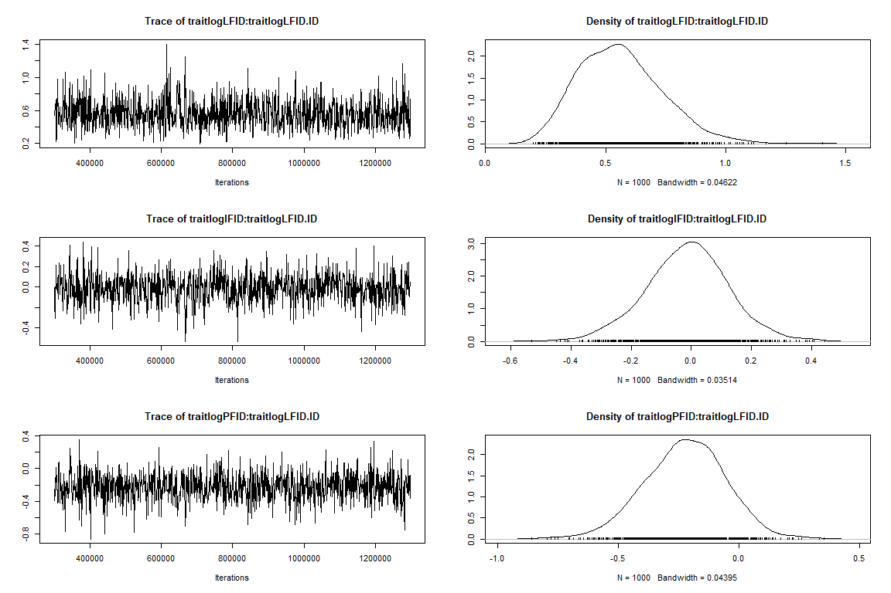<!-- --><!-- --><!-- --><!-- -->

##### **Among-individual covariance-FID**

``` r
c1 <- posterior.cor(m3FID$VCV[,1:9])
round(apply(c1,2,mean),2)
```

    ##  var1  var2  var3  var4  var5  var6  var7  var8  var9 
    ##  1.00 -0.01 -0.35 -0.01  1.00  0.31 -0.35  0.31  1.00

``` r
round(apply(c1,2, quantile, c(0.025, 0.975)),2)
```

    ##       var1  var2  var3  var4 var5  var6  var7  var8 var9
    ## 2.5%     1 -0.50 -0.73 -0.50    1 -0.09 -0.73 -0.09    1
    ## 97.5%    1  0.44  0.18  0.44    1  0.65  0.18  0.65    1

#### **Multivariate: minimum approach distance across breeding contexts**

``` r
m3Min<-MCMCglmm(cbind(logLMinDis, logIMinDis,logPMinDis)~(trait-1),
                random=~us(trait):ID,
                rcov=~idh(trait):units,
                family=c("gaussian","gaussian", "gaussian"),
                prior=prior3var,
                nitt=1300000,thin=1000,burnin=300000, 
                data=data_3c,verbose=FALSE)

summary(m3Min)
```

    ## 
    ##  Iterations = 300001:1299001
    ##  Thinning interval  = 1000
    ##  Sample size  = 1000 
    ## 
    ##  DIC: 843.9864 
    ## 
    ##  G-structure:  ~us(trait):ID
    ## 
    ##                                    post.mean l-95% CI u-95% CI eff.samp
    ## traitlogLMinDis:traitlogLMinDis.ID    0.5333  0.20224   0.8826   1000.0
    ## traitlogIMinDis:traitlogLMinDis.ID    0.1582 -0.09435   0.4377   1000.0
    ## traitlogPMinDis:traitlogLMinDis.ID    0.1368 -0.12976   0.3974   1000.0
    ## traitlogLMinDis:traitlogIMinDis.ID    0.1582 -0.09435   0.4377   1000.0
    ## traitlogIMinDis:traitlogIMinDis.ID    0.5765  0.30347   0.9031   1000.0
    ## traitlogPMinDis:traitlogIMinDis.ID    0.2789  0.02669   0.5121    908.2
    ## traitlogLMinDis:traitlogPMinDis.ID    0.1368 -0.12976   0.3974   1000.0
    ## traitlogIMinDis:traitlogPMinDis.ID    0.2789  0.02669   0.5121    908.2
    ## traitlogPMinDis:traitlogPMinDis.ID    0.6306  0.35179   0.9814   1264.9
    ## 
    ##  R-structure:  ~idh(trait):units
    ## 
    ##                       post.mean l-95% CI u-95% CI eff.samp
    ## traitlogLMinDis.units    0.6785   0.3587   0.9900     1000
    ## traitlogIMinDis.units    0.6093   0.4305   0.8223     1082
    ## traitlogPMinDis.units    0.5818   0.4205   0.7856     1000
    ## 
    ##  Location effects: cbind(logLMinDis, logIMinDis, logPMinDis) ~ (trait - 1) 
    ## 
    ##                 post.mean l-95% CI u-95% CI eff.samp  pMCMC    
    ## traitlogLMinDis     2.995    2.719    3.258     1000 <0.001 ***
    ## traitlogIMinDis     2.727    2.469    2.953     1000 <0.001 ***
    ## traitlogPMinDis     2.416    2.163    2.682     1000 <0.001 ***
    ## ---
    ## Signif. codes:  0 '***' 0.001 '**' 0.01 '*' 0.05 '.' 0.1 ' ' 1

``` r
plot(m3Min)
```

<!-- --><!-- -->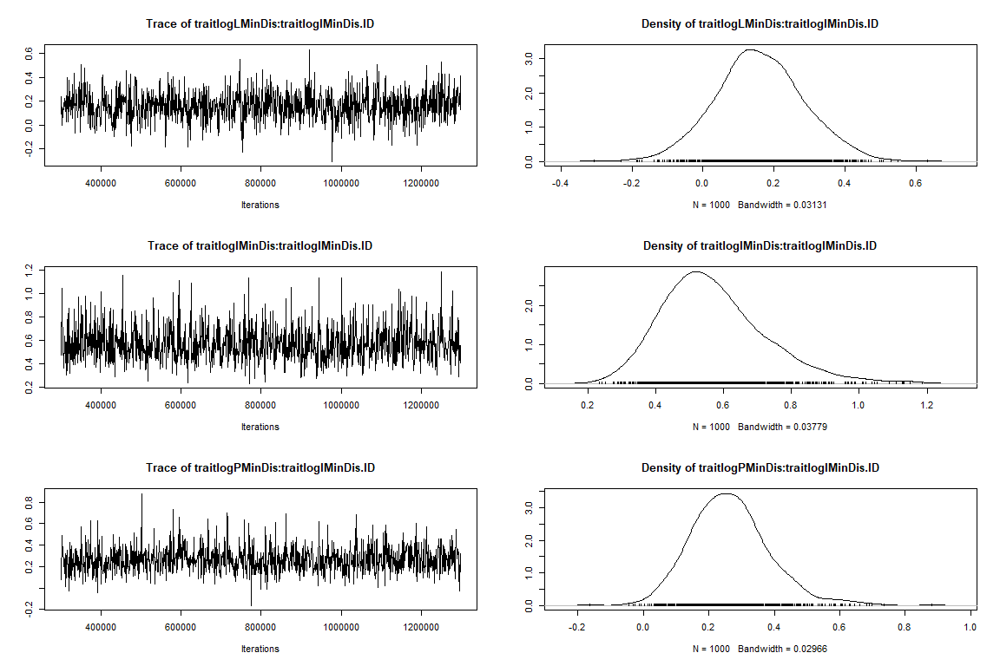<!-- --><!-- --><!-- -->

##### **Among-individual covariance–minimum approach distance across breeding contexts**

``` r
c1 <- posterior.cor(m3Min$VCV[,1:9])
round(apply(c1,2,mean),2)
```

    ## var1 var2 var3 var4 var5 var6 var7 var8 var9 
    ## 1.00 0.28 0.24 0.28 1.00 0.46 0.24 0.46 1.00

``` r
round(apply(c1,2, quantile, c(0.025, 0.975)),2)
```

    ##       var1  var2  var3  var4 var5 var6  var7 var8 var9
    ## 2.5%     1 -0.17 -0.23 -0.17    1 0.10 -0.23 0.10    1
    ## 97.5%    1  0.66  0.62  0.66    1 0.72  0.62 0.72    1

#### **Multivariate: number of dives across breeding contexts**

``` r
m3Dives<-MCMCglmm(cbind(Ldives, Idives,Pdives)~(trait-1),
                random=~us(trait):ID,
                rcov=~idh(trait):units,
                family=c("poisson","poisson", "poisson"), 
                prior=prior3var,
                nitt=1300000,thin=1000,burnin=300000, 
                data=data_3c,verbose=FALSE)

summary(m3Dives)
```

    ## 
    ##  Iterations = 300001:1299001
    ##  Thinning interval  = 1000
    ##  Sample size  = 1000 
    ## 
    ##  DIC: 1273.487 
    ## 
    ##  G-structure:  ~us(trait):ID
    ## 
    ##                            post.mean l-95% CI u-95% CI eff.samp
    ## traitLdives:traitLdives.ID    1.9489 0.570782    3.664   1065.2
    ## traitIdives:traitLdives.ID    0.9421 0.007661    1.810   1000.0
    ## traitPdives:traitLdives.ID    1.6918 0.407414    3.216    983.4
    ## traitLdives:traitIdives.ID    0.9421 0.007661    1.810   1000.0
    ## traitIdives:traitIdives.ID    1.4653 0.596265    2.506    810.9
    ## traitPdives:traitIdives.ID    1.6944 0.568770    2.829   1000.0
    ## traitLdives:traitPdives.ID    1.6918 0.407414    3.216    983.4
    ## traitIdives:traitPdives.ID    1.6944 0.568770    2.829   1000.0
    ## traitPdives:traitPdives.ID    3.4173 1.229850    5.806   1000.0
    ## 
    ##  R-structure:  ~idh(trait):units
    ## 
    ##                   post.mean l-95% CI u-95% CI eff.samp
    ## traitLdives.units     1.876   0.5886    3.440     1000
    ## traitIdives.units     1.238   0.6464    1.989     1000
    ## traitPdives.units     2.214   1.2012    3.405     1000
    ## 
    ##  Location effects: cbind(Ldives, Idives, Pdives) ~ (trait - 1) 
    ## 
    ##             post.mean l-95% CI u-95% CI eff.samp pMCMC   
    ## traitLdives   0.37561 -0.16582  0.88575     1347 0.190   
    ## traitIdives   0.78661  0.37403  1.17434     1000 0.002 **
    ## traitPdives  -0.01935 -0.68246  0.61450     1122 0.990   
    ## ---
    ## Signif. codes:  0 '***' 0.001 '**' 0.01 '*' 0.05 '.' 0.1 ' ' 1

``` r
plot(m3Dives)
```

<!-- --><!-- --><!-- --><!-- --><!-- -->

##### **Among-individual covariance–number of dives across breeding contexts**

``` r
c1 <- posterior.cor(m3Dives$VCV[,1:9])
round(apply(c1,2,mean),2)
```

    ## var1 var2 var3 var4 var5 var6 var7 var8 var9 
    ## 1.00 0.56 0.66 0.56 1.00 0.77 0.66 0.77 1.00

``` r
round(apply(c1,2, quantile, c(0.025, 0.975)),2)
```

    ##       var1 var2 var3 var4 var5 var6 var7 var8 var9
    ## 2.5%     1 0.07 0.23 0.07    1 0.50 0.23 0.50    1
    ## 97.5%    1 0.84 0.89 0.84    1 0.91 0.89 0.91    1

### **3. Bivariate model with minimum distance and number of dives**

-   *Evaluate covariance between each measure of nest defense*

``` r
prior_2var= list(R = list(V = diag(2), nu = 1.002),
                 G = list(G1 = list(V = diag(2), nu = 2,
                                    alpha.mu = rep(0,2),
                                    alpha.V = diag(25^2,2)))) # 3-trait prior w/one random effect
#names(data)

model.2var <- MCMCglmm(
  cbind(LogMin, Dives) ~ trait - 1,
  random = ~ us(trait):ID,
  rcov = ~ us(trait):units,
  family = c("gaussian", "poisson"),
  data = data,
  prior = prior_2var,
  verbose = FALSE,
  nitt = 1300000, thin = 1000, burnin = 300000
  )


summary(model.2var)
```

    ## 
    ##  Iterations = 300001:1299001
    ##  Thinning interval  = 1000
    ##  Sample size  = 1000 
    ## 
    ##  DIC: 2337.511 
    ## 
    ##  G-structure:  ~us(trait):ID
    ## 
    ##                            post.mean l-95% CI u-95% CI eff.samp
    ## traitLogMin:traitLogMin.ID    0.3884   0.2321   0.5611   1000.0
    ## traitDives:traitLogMin.ID    -0.5323  -0.8196  -0.2845    892.2
    ## traitLogMin:traitDives.ID    -0.5323  -0.8196  -0.2845    892.2
    ## traitDives:traitDives.ID      1.2895   0.6721   1.9849    733.0
    ## 
    ##  R-structure:  ~us(trait):units
    ## 
    ##                               post.mean l-95% CI u-95% CI eff.samp
    ## traitLogMin:traitLogMin.units    0.7293   0.6019   0.8530    963.9
    ## traitDives:traitLogMin.units    -0.6279  -0.8281  -0.4463   1000.0
    ## traitLogMin:traitDives.units    -0.6279  -0.8281  -0.4463   1000.0
    ## traitDives:traitDives.units      1.8931   1.3505   2.4588   1000.0
    ## 
    ##  Location effects: cbind(LogMin, Dives) ~ trait - 1 
    ## 
    ##             post.mean l-95% CI u-95% CI eff.samp  pMCMC    
    ## traitLogMin    2.7299   2.5660   2.8749   1000.0 <0.001 ***
    ## traitDives     0.4734   0.1802   0.8105    908.8  0.004 ** 
    ## ---
    ## Signif. codes:  0 '***' 0.001 '**' 0.01 '*' 0.05 '.' 0.1 ' ' 1

``` r
plot(model.2var)
```

<!-- --><!-- --><!-- -->

#### **Among-individual and within-individual covariance–minimum distance and number of dives**

``` r
c1<- posterior.cor(model.2var$VCV[,1:4])
round(apply(c1,2,mean),2)
```

    ##  var1  var2  var3  var4 
    ##  1.00 -0.75 -0.75  1.00

``` r
round(apply(c1,2, quantile, c(0.025, 0.975)),2)
```

    ##       var1  var2  var3 var4
    ## 2.5%     1 -0.90 -0.90    1
    ## 97.5%    1 -0.56 -0.56    1

``` r
#within individual covariance
c2<- posterior.cor(model.2var$VCV[,5:8])
round(apply(c2,2,mean),2)
```

    ##  var1  var2  var3  var4 
    ##  1.00 -0.53 -0.53  1.00

``` r
round(apply(c2,2, quantile, c(0.025, 0.975)),2)
```

    ##       var1  var2  var3 var4
    ## 2.5%     1 -0.63 -0.63    1
    ## 97.5%    1 -0.43 -0.43    1

### **4. Univariate model to estimate short-versus long-term repeatability with interaction**

-   *Interaction is included since we predicted that females would be
    more defensive with increasing nest stages.*

``` r
#no sex:nest stage interaction... Table S3
require(lme4)
m1.0<-lmer(LogMin~ (Sex + NestStage)^2 + Year2+ (1|ID) + (1|ID_Series) ,
         data=data) 
summary(m1.0)
```

    ## Linear mixed model fit by REML ['lmerMod']
    ## Formula: LogMin ~ (Sex + NestStage)^2 + Year2 + (1 | ID) + (1 | ID_Series)
    ##    Data: data
    ## 
    ## REML criterion at convergence: 1003.1
    ## 
    ## Scaled residuals: 
    ##      Min       1Q   Median       3Q      Max 
    ## -2.94297 -0.61202 -0.02309  0.52714  2.76760 
    ## 
    ## Random effects:
    ##  Groups    Name        Variance Std.Dev.
    ##  ID_Series (Intercept) 0.08504  0.2916  
    ##  ID        (Intercept) 0.27454  0.5240  
    ##  Residual              0.65003  0.8062  
    ## Number of obs: 369, groups:  ID_Series, 123; ID, 108
    ## 
    ## Fixed effects:
    ##                                Estimate Std. Error t value
    ## (Intercept)                     2.94076    0.16208  18.144
    ## SexMale                        -0.09501    0.21235  -0.447
    ## NestStage2Incubating           -0.28349    0.16770  -1.690
    ## NestStage3Provisioning         -0.55002    0.15752  -3.492
    ## Year21                          0.29835    0.12778   2.335
    ## SexMale:NestStage2Incubating   -0.10133    0.25100  -0.404
    ## SexMale:NestStage3Provisioning -0.13211    0.24497  -0.539
    ## 
    ## Correlation of Fixed Effects:
    ##             (Intr) SexMal NstS2I NstS3P Year21 SM:NS2
    ## SexMale     -0.628                                   
    ## NstStg2Incb -0.586  0.457                            
    ## NstStg3Prvs -0.602  0.444  0.647                     
    ## Year21      -0.411 -0.016 -0.029  0.045              
    ## SxMl:NstS2I  0.396 -0.642 -0.668 -0.433  0.008       
    ## SxMl:NstS3P  0.369 -0.615 -0.417 -0.641  0.013  0.604

``` r
anova(m1.0)
```

    ## Analysis of Variance Table
    ##               npar  Sum Sq Mean Sq F value
    ## Sex              1  0.4447  0.4447  0.6841
    ## NestStage        2 18.0005  9.0003 13.8459
    ## Year2            1  3.5660  3.5660  5.4859
    ## Sex:NestStage    2  0.1953  0.0976  0.1502

##### **Simulate posterior distribution**

``` r
smod<-sim(m1.0,1000)
posterior.mode(as.mcmc(smod@fixef))
```

    ##                    (Intercept)                        SexMale 
    ##                     2.99004028                    -0.11223104 
    ##           NestStage2Incubating         NestStage3Provisioning 
    ##                    -0.24237417                    -0.53899480 
    ##                         Year21   SexMale:NestStage2Incubating 
    ##                     0.32466542                    -0.00429423 
    ## SexMale:NestStage3Provisioning 
    ##                    -0.14578216

``` r
HPDinterval(as.mcmc(smod@fixef))
```

    ##                                      lower       upper
    ## (Intercept)                     2.63451515  3.23621634
    ## SexMale                        -0.51290980  0.30175083
    ## NestStage2Incubating           -0.60920890  0.02438367
    ## NestStage3Provisioning         -0.83054534 -0.24452821
    ## Year21                          0.05965723  0.54723669
    ## SexMale:NestStage2Incubating   -0.54351202  0.43525663
    ## SexMale:NestStage3Provisioning -0.61031699  0.31593200
    ## attr(,"Probability")
    ## [1] 0.95

``` r
##Between individual variance
bID<-smod@ranef$ID[,,1]
bvar<-as.vector(apply(bID, 1, var)) ##ID variance posterior distribution
require(MCMCglmm)
bvar<-as.mcmc(bvar)
posterior.mode(bvar )## mode of the distribution
```

    ##     var1 
    ## 0.295502

``` r
HPDinterval(bvar)
```

    ##          lower     upper
    ## var1 0.2355051 0.4033009
    ## attr(,"Probability")
    ## [1] 0.95

``` r
##Between individual variance, ID_Series
bID2<-smod@ranef$ID_Series[,,1]
bvar2<-as.vector(apply(bID2, 1, var)) ##ID_Series variance posterior distribution
require(MCMCglmm)
bvar2<-as.mcmc(bvar2)
posterior.mode(bvar2 )## mode of the distribution
```

    ##       var1 
    ## 0.06836296

``` r
HPDinterval(bvar2)
```

    ##           lower      upper
    ## var1 0.05349438 0.09393359
    ## attr(,"Probability")
    ## [1] 0.95

``` r
###residual variance
rvar<-smod@sigma^2
rvar<-as.mcmc(rvar)
posterior.mode(rvar)
```

    ##      var1 
    ## 0.6444458

``` r
HPDinterval(rvar)
```

    ##          lower     upper
    ## var1 0.5715885 0.7481067
    ## attr(,"Probability")
    ## [1] 0.95

##### **Long-term and short-term repeatability**

``` r
### Long-term repeatability
r<-bvar/(rvar+bvar +bvar2 )
posterior.mode(r)
```

    ##      var1 
    ## 0.2949385

``` r
HPDinterval(r)  ##repeatability 
```

    ##          lower     upper
    ## var1 0.2453322 0.3537822
    ## attr(,"Probability")
    ## [1] 0.95

``` r
###Short-term
r1<-(bvar +bvar2  )/(rvar+bvar +bvar2 )
posterior.mode(r1)
```

    ##      var1 
    ## 0.3714664

``` r
HPDinterval(r1)  ##repeatability
```

    ##          lower     upper
    ## var1 0.3242782 0.4220943
    ## attr(,"Probability")
    ## [1] 0.95

### **Main effects similar without including interactions.**

-   *We dropped the interaction since it was not significant. Results
    for main text Table 1*

``` r
cor.test(data$Stage, data$NumberOfChicks)#correlation b/n nest stage and number of chicks. r=0.78 thus drop Number of Chicks from model 
```

    ## 
    ##  Pearson's product-moment correlation
    ## 
    ## data:  data$Stage and data$NumberOfChicks
    ## t = 21.628, df = 367, p-value < 2.2e-16
    ## alternative hypothesis: true correlation is not equal to 0
    ## 95 percent confidence interval:
    ##  0.6999745 0.7902693
    ## sample estimates:
    ##       cor 
    ## 0.7485722

``` r
m1<-lmer(LogMin~ Sex+NestStage + Year2+ (1|ID) + (1|ID_Series) ,
         data=data) 
#summary
summary(m1)
```

    ## Linear mixed model fit by REML ['lmerMod']
    ## Formula: LogMin ~ Sex + NestStage + Year2 + (1 | ID) + (1 | ID_Series)
    ##    Data: data
    ## 
    ## REML criterion at convergence: 1001.1
    ## 
    ## Scaled residuals: 
    ##      Min       1Q   Median       3Q      Max 
    ## -2.90448 -0.60019 -0.01792  0.54558  2.73142 
    ## 
    ## Random effects:
    ##  Groups    Name        Variance Std.Dev.
    ##  ID_Series (Intercept) 0.08652  0.2941  
    ##  ID        (Intercept) 0.27623  0.5256  
    ##  Residual              0.64505  0.8031  
    ## Number of obs: 369, groups:  ID_Series, 123; ID, 108
    ## 
    ## Fixed effects:
    ##                        Estimate Std. Error t value
    ## (Intercept)              2.9759     0.1465  20.317
    ## SexMale                 -0.1718     0.1514  -1.135
    ## NestStage2Incubating    -0.3293     0.1245  -2.646
    ## NestStage3Provisioning  -0.6045     0.1202  -5.029
    ## Year21                   0.3000     0.1279   2.346
    ## 
    ## Correlation of Fixed Effects:
    ##             (Intr) SexMal NstS2I NstS3P
    ## SexMale     -0.510                     
    ## NstStg2Incb -0.472  0.043              
    ## NstStg3Prvs -0.508  0.056  0.614       
    ## Year21      -0.461 -0.010 -0.031  0.070

``` r
#model check
plot(m1)
```

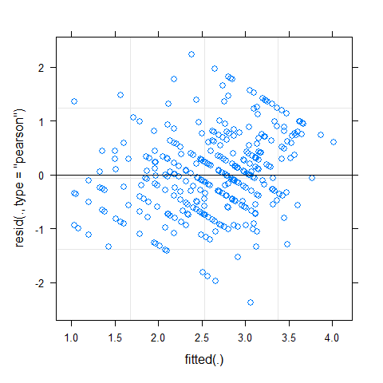<!-- -->

``` r
hist(resid(m1)) # residuals
```

<!-- -->

``` r
lattice::qqmath(m1) #normality of errors
```

<!-- -->

##### **Simulate posterior distribution– Univariate model with no interaction**

``` r
#simulated parameters
require(dplyr)
library(arm)
require(MCMCglmm)
require(ggplot2)
smod<-sim(m1,1000)
describe_posterior(smod, ci = 0.95)
```

    ## Summary of Posterior Distribution
    ## 
    ## Parameter              | Median |         95% CI |     pd |          ROPE | % in ROPE
    ## -------------------------------------------------------------------------------------
    ## (Intercept)            |   2.97 | [ 2.66,  3.26] |   100% | [-0.10, 0.10] |        0%
    ## SexMale                |  -0.17 | [-0.46,  0.12] | 87.00% | [-0.10, 0.10] |    31.26%
    ## NestStage2Incubating   |  -0.33 | [-0.57, -0.10] | 99.80% | [-0.10, 0.10] |        0%
    ## NestStage3Provisioning |  -0.59 | [-0.84, -0.37] |   100% | [-0.10, 0.10] |        0%
    ## Year21                 |   0.30 | [ 0.04,  0.56] | 98.90% | [-0.10, 0.10] |     4.21%

``` r
posterior.mode(as.mcmc(smod@fixef))
```

    ##            (Intercept)                SexMale   NestStage2Incubating 
    ##              2.9764751             -0.1154657             -0.3954422 
    ## NestStage3Provisioning                 Year21 
    ##             -0.6013057              0.2980956

``` r
HPDinterval(as.mcmc(smod@fixef))
```

    ##                              lower      upper
    ## (Intercept)             2.68781361  3.2809129
    ## SexMale                -0.45089363  0.1280920
    ## NestStage2Incubating   -0.57288460 -0.1001800
    ## NestStage3Provisioning -0.83950836 -0.3744826
    ## Year21                  0.04947629  0.5631953
    ## attr(,"Probability")
    ## [1] 0.95

``` r
##Between individual variance
bID<-smod@ranef$ID[,,1]
bvar<-as.vector(apply(bID, 1, var)) ##ID variance posterior distribution

require(MCMCglmm)
bvar4<-as.mcmc(bvar)
posterior.mode(bvar4)## mode of the distribution
```

    ##      var1 
    ## 0.2971639

``` r
HPDinterval(bvar4)
```

    ##          lower     upper
    ## var1 0.2348337 0.4006077
    ## attr(,"Probability")
    ## [1] 0.95

``` r
bvar11<-as.data.frame(bvar) #posterior plot
describe_posterior(bvar11)
```

    ## Summary of Posterior Distribution
    ## 
    ## Parameter | Median |       95% CI |   pd |          ROPE | % in ROPE
    ## --------------------------------------------------------------------
    ## bvar      |   0.32 | [0.24, 0.41] | 100% | [-0.10, 0.10] |        0%

``` r
bv<-describe_posterior(bvar11)#data frame for CrI and median

ggplot(bvar11, aes(x = bvar)) +
  geom_density(fill = "orange") +
  geom_vline(xintercept = median(bv$Median), color="red", size=1)+
   geom_vline(xintercept = (bv$CI_low), color="black", size=1, linetype="longdash")+
  geom_vline(xintercept = (bv$CI_high), color="black", size=1, linetype="longdash")+
  labs(y="Density", x="Between-Individual Variance (ID)")+
  ggtitle(label ="Density Plot Between-Indvidual Variance (ID)",
          subtitle = "Posterior distribution plotted")+
  theme(plot.title = element_text(face = "bold", hjust=0.5), plot.subtitle=element_text(hjust=0.5))
```

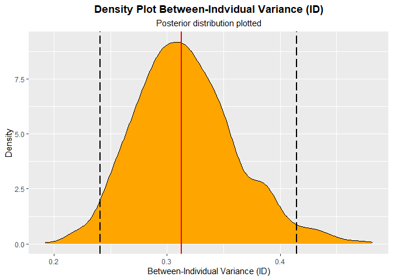<!-- -->

``` r
##Between individual variance, ID_Series
bID2<-smod@ranef$ID_Series[,,1]
bvar2<-as.vector(apply(bID2, 1, var)) ##ID_Series variance posterior distribution
require(MCMCglmm)
bvar22<-as.mcmc(bvar2)
posterior.mode(bvar22)## mode of the distribution
```

    ##       var1 
    ## 0.07304559

``` r
HPDinterval(bvar22)
```

    ##           lower      upper
    ## var1 0.05565204 0.09958481
    ## attr(,"Probability")
    ## [1] 0.95

``` r
bvar112<-as.data.frame(bvar2) #posterior plot
describe_posterior(bvar112)
```

    ## Summary of Posterior Distribution
    ## 
    ## Parameter | Median |       95% CI |   pd |          ROPE | % in ROPE
    ## --------------------------------------------------------------------
    ## bvar2     |   0.07 | [0.05, 0.10] | 100% | [-0.10, 0.10] |      100%

``` r
bv2<-describe_posterior(bvar112)#data frame for CrI and median

ggplot(bvar112, aes(x = bvar2)) +
  geom_density(fill = "orange") +
  geom_vline(xintercept = median(bv2$Median), color="red", size=1)+
   geom_vline(xintercept = (bv2$CI_low), color="black", size=1, linetype="longdash")+
  geom_vline(xintercept = (bv2$CI_high), color="black", size=1, linetype="longdash")+
  labs(y="Density", x="Between-Individual Variance (ID_Series)")+
  ggtitle(label ="Density Plot Between-Indvidual Variance (ID_Series)",
          subtitle = "Posterior distribution plotted")+
  theme(plot.title = element_text(face = "bold", hjust=0.5), plot.subtitle=element_text(hjust=0.5))
```

<!-- -->

``` r
###residual variance
rvar<-smod@sigma^2
rvar<-as.mcmc(rvar)
posterior.mode(rvar)
```

    ##      var1 
    ## 0.6375794

``` r
HPDinterval(rvar)
```

    ##          lower     upper
    ## var1 0.5596659 0.7427404
    ## attr(,"Probability")
    ## [1] 0.95

``` r
rvarr<-smod@sigma^2
describe_posterior(rvarr)
```

    ## Summary of Posterior Distribution
    ## 
    ## Parameter | Median |       95% CI |   pd |          ROPE | % in ROPE
    ## --------------------------------------------------------------------
    ## Posterior |   0.64 | [0.56, 0.75] | 100% | [-0.10, 0.10] |        0%

``` r
rv<-describe_posterior(rvarr)#data frame for CrI and median
rvar11<-as.data.frame(rvarr) #posterior plot
ggplot(rvar11, aes(x = rvarr)) +
  geom_density(fill = "orange") +
  geom_vline(xintercept = median(rv$Median), color="red", size=1)+
   geom_vline(xintercept = (rv$CI_low), color="black", size=1, linetype="longdash")+
  geom_vline(xintercept = (rv$CI_high), color="black", size=1, linetype="longdash")+
  labs(y="Density", x="Residual Variance")+
  ggtitle(label ="Density Plot Residual Variance",
          subtitle = "Posterior distribution plotted")+
  theme(plot.title = element_text(face = "bold", hjust=0.5), plot.subtitle=element_text(hjust=0.5))
```

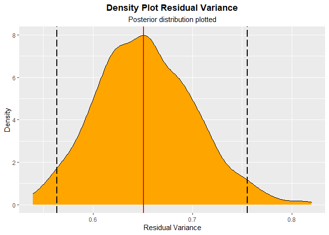<!-- -->

#### **Contrasts differences among-sexes**

``` r
#compute difference among-sexes

p222<-smod@fixef[,1:2]#gather posterior for intercept(female) and Male 
p222<-as.data.frame(p222)#make a dataframe to manipulate easier
colnames(p222)<-c("Female", "SexMale")#change column names
p22<-p222%>%
  summarise(Male= Female+ SexMale)#add posteriors for Intercept to each value of Male

con<-as.data.frame(c(p222, p22))#combine estimates into one dataframe

difference<-con%>%
  summarise(diff= Female - Male)#compute difference

contrast<-as.data.frame(c(con, difference))#dataframe for contrasts

require(bayestestR)
describe_posterior(contrast)# pd is 87% for difference among sexes 
```

    ## Summary of Posterior Distribution
    ## 
    ## Parameter | Median |        95% CI |     pd |          ROPE | % in ROPE
    ## -----------------------------------------------------------------------
    ## Female    |   2.97 | [ 2.66, 3.26] |   100% | [-0.10, 0.10] |        0%
    ## SexMale   |  -0.17 | [-0.46, 0.12] | 87.00% | [-0.10, 0.10] |    31.26%
    ## Male      |   2.81 | [ 2.52, 3.10] |   100% | [-0.10, 0.10] |        0%
    ## diff      |   0.17 | [-0.12, 0.46] | 87.00% | [-0.10, 0.10] |    31.26%

``` r
contable<-describe_posterior(contrast)#estimates for difference b/n male and female nest defense

contab<-contable%>%filter(Parameter=="diff")


ggplot(contrast, aes(x=diff)) + geom_density(fill="orange") +
  geom_vline(xintercept = median(contrast$diff), color="red", size=1)+
   geom_vline(xintercept = (contab$CI_low), color="black", size=1, linetype="longdash")+
  geom_vline(xintercept = (contab$CI_high), color="black", size=1, linetype="longdash")+
  labs(x= "Difference", y="Density")+
  ggtitle(label ="Difference between male and female defense",
          subtitle = "Posterior Distribution, Median, and Highest Density Interval")+
  theme(plot.title = element_text(face = "bold", hjust=0.5), plot.subtitle=element_text(hjust=0.5))
```

<!-- -->

#### **Contrast differences among-nest stages**

``` r
p2223<-smod@fixef[,3:4]#gather posterior for incubation and provisioning nest stages 
p2223<-as.data.frame(p2223)#make a dataframe to manipulate easier
p2224<-smod@fixef[,1]#extract intercept (estimate for egg-laying)
p2224<-as.data.frame(p2224)
colnames(p2224)<-"Intercept"

nestcon<-as.data.frame(c(p2224, p2223))

#compute estimates for each nest stage
neststage<-nestcon%>%
  summarise(Incubation   = Intercept  + NestStage2Incubating,
            Provisioning = Intercept + NestStage3Provisioning,
            EggLaying    = Intercept)#add posteriors for Intercept to each value of Male

#compute differences between nest stage groups
contrasts<-neststage%>%
  summarise(diff_ie = Incubation-EggLaying,
            diff_ip = Incubation-Provisioning,
            diff_ep = EggLaying-Provisioning)
require(bayestestR)
describe_posterior(contrasts)#median, 95% CrI and PD for each difference
```

    ## Summary of Posterior Distribution
    ## 
    ## Parameter | Median |         95% CI |     pd |          ROPE | % in ROPE
    ## ------------------------------------------------------------------------
    ## diff_ie   |  -0.33 | [-0.57, -0.10] | 99.80% | [-0.10, 0.10] |        0%
    ## diff_ip   |   0.27 | [ 0.07,  0.47] | 99.60% | [-0.10, 0.10] |     2.74%
    ## diff_ep   |   0.59 | [ 0.37,  0.84] |   100% | [-0.10, 0.10] |        0%

``` r
contable<-describe_posterior(contrasts)#estimates for difference b/n male and female nest defense
diff_ie<-contable%>%filter(Parameter=="diff_ie")
diff_ip<-contable%>%filter(Parameter=="diff_ip")
diff_ep<-contable%>%filter(Parameter=="diff_ep")

# incubation vs egg-laying
p3<-ggplot(contrasts, aes(x=diff_ie)) + geom_density(fill="orange") +
  geom_vline(xintercept = median(contrasts$diff_ie), color="red", size=1)+
   geom_vline(xintercept = (diff_ie$CI_low), color="black", size=1, linetype="longdash")+
  geom_vline(xintercept = (diff_ie$CI_high), color="black", size=1, linetype="longdash")+
  labs(x= "Difference", y="Density")+
  ggtitle(label ="Difference between incubation and egg laying",
          subtitle = "Posterior Distribution, Median, and Highest Density Interval")+
  theme(plot.title = element_text(face = "bold", hjust=0.5), plot.subtitle=element_text(hjust=0.5))
p3
```

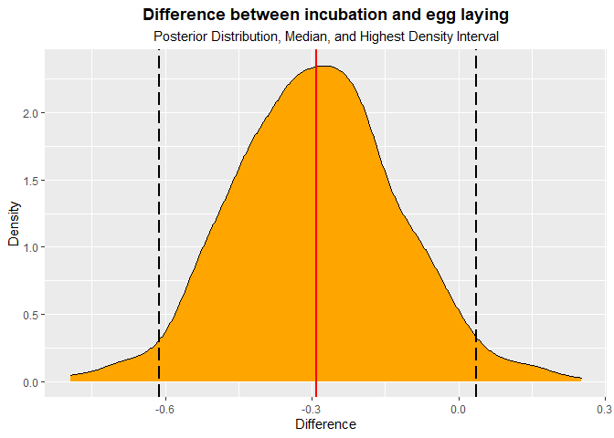<!-- -->

``` r
# incubation vs provisioning
p2<-ggplot(contrasts, aes(x=diff_ip)) + geom_density(fill="orange") +
  geom_vline(xintercept = median(contrasts$diff_ip), color="red", size=1)+
   geom_vline(xintercept = (diff_ip$CI_low), color="black", size=1, linetype="longdash")+
  geom_vline(xintercept = (diff_ip$CI_high), color="black", size=1, linetype="longdash")+
  labs(x= "Difference", y="Density")+
  ggtitle(label ="Difference between incubation and provisioning",
          subtitle = "Posterior Distribution, Median, and Highest Density Interval")+
  theme(plot.title = element_text(face = "bold", hjust=0.5), plot.subtitle=element_text(hjust=0.5))
p2
```

<!-- -->

``` r
# egg laying vs provisioning
p1<-ggplot(contrasts, aes(x=diff_ep)) + geom_density(fill="orange") +
  geom_vline(xintercept = median(contrasts$diff_ep), color="red", size=1)+
   geom_vline(xintercept = (diff_ep$CI_low), color="black", size=1, linetype="longdash")+
  geom_vline(xintercept = (diff_ep$CI_high), color="black", size=1, linetype="longdash")+
  labs(x= "Difference", y="Density")+
  ggtitle(label ="Difference between incubation and provisioning",
          subtitle = "Posterior Distribution, Median, and Highest Density Interval")+
  theme(plot.title = element_text(face = "bold", hjust=0.5), plot.subtitle=element_text(hjust=0.5))
p1
```

<!-- -->

### **Contrast difference among years**

``` r
p55<-smod@fixef[,5]#gather posterior for intercept(female) and Male 
p55<-as.data.frame(p222)#make a dataframe to manipulate easier
colnames(p55)<-c("Year2019")#change column names
p2224<-smod@fixef[,1]#extract intercept (estimate for egg-laying)
p2224<-as.data.frame(p2224)
colnames(p2224)<-"Intercept"

yearcon<-as.data.frame(c(p2224, p55))

p2299<-yearcon%>%
  summarise(Y2019 = Intercept+ Year2019)#add posteriors for Intercept(2018) to each value of Male

ycon<-as.data.frame(c(yearcon, p2299)) 


difference_y<-ycon%>%
  summarise(diff_year= Intercept - Y2019)#compute difference


require(bayestestR)
describe_posterior(difference_y)# pd is 87% for difference among sexes 
```

    ## Summary of Posterior Distribution
    ## 
    ## Parameter | Median |         95% CI |   pd |          ROPE | % in ROPE
    ## ----------------------------------------------------------------------
    ## diff_year |  -2.97 | [-3.26, -2.66] | 100% | [-0.10, 0.10] |        0%

``` r
contable<-describe_posterior(difference_y)#estimates for difference b/n male and female nest defense


ggplot(difference_y, aes(x=diff_year)) + geom_density(fill="orange") +
  geom_vline(xintercept = median(difference_y$diff_year), color="red", size=1)+
   geom_vline(xintercept = (contable$CI_low), color="black", size=1, linetype="longdash")+
  geom_vline(xintercept = (contable$CI_high), color="black", size=1, linetype="longdash")+
  labs(x= "Difference", y="Density")+
  ggtitle(label ="Difference between 2018 and 2019",
          subtitle = "Posterior Distribution, Median, and Highest Density Interval")+
  theme(plot.title = element_text(face = "bold", hjust=0.5), plot.subtitle=element_text(hjust=0.5))
```

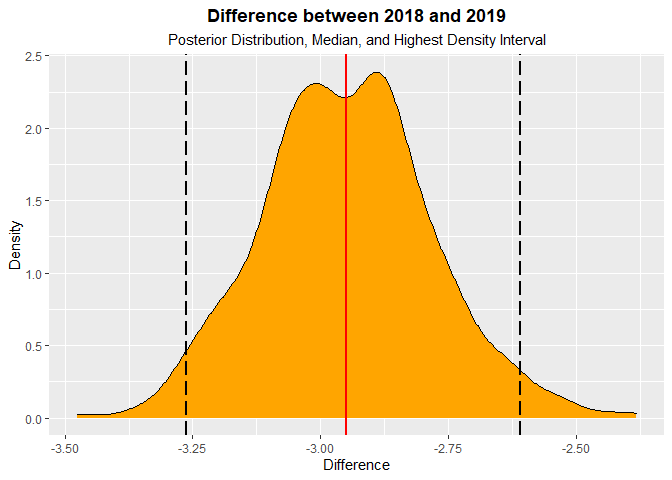<!-- -->

##### **Long-term and short-term repeatability–Univariate model with no interaction**

``` r
### Long-term repeatability
r<-bvar4/(rvar+bvar4 +bvar22)
r<-as.mcmc(r)
posterior.mode(r)
```

    ##      var1 
    ## 0.3216701

``` r
HPDinterval(r)  ##repeatability 
```

    ##          lower     upper
    ## var1 0.2443439 0.3520504
    ## attr(,"Probability")
    ## [1] 0.95

``` r
rpt<-bvar4/(rvar+bvar4 +bvar22)
rpt<-as.data.frame(rpt)
rptt<-describe_posterior(rpt)#data frame for CrI and median
rpt11<-as.data.frame(rpt) #posterior plot
ggplot(rpt11, aes(x = var1)) +
  geom_density(fill = "orange") +
  geom_vline(xintercept = median(rptt$Median), color="red", size=1)+
   geom_vline(xintercept = (rptt$CI_low), color="black", size=1, linetype="longdash")+
  geom_vline(xintercept = (rptt$CI_high), color="black", size=1, linetype="longdash")+
  labs(y="Density", x="Long-term Repeatability")+
  ggtitle(label ="Density Plot Long-term Repeatability",
          subtitle = "Posterior distribution plotted")+
  theme(plot.title = element_text(face = "bold", hjust=0.5), plot.subtitle=element_text(hjust=0.5))
```

<!-- -->

``` r
###Short-term
r1<-(bvar4 +bvar22  )/(rvar+bvar4 +bvar22)
r1<-as.mcmc(r1)
posterior.mode(r1)
```

    ##      var1 
    ## 0.3788275

``` r
HPDinterval(r1)  ##repeatability
```

    ##          lower     upper
    ## var1 0.3269277 0.4237463
    ## attr(,"Probability")
    ## [1] 0.95

``` r
rptr<-(bvar4 +bvar22  )/(rvar+bvar4 +bvar22)
rptr<-as.data.frame(rptr)
describe_posterior(rptr)
```

    ## Summary of Posterior Distribution
    ## 
    ## Parameter | Median |       95% CI |   pd |          ROPE | % in ROPE
    ## --------------------------------------------------------------------
    ## var1      |   0.38 | [0.33, 0.43] | 100% | [-0.10, 0.10] |        0%

``` r
rpttt<-describe_posterior(rptr)#data frame for CrI and median
rpt111<-as.data.frame(rptr) #posterior plot
ggplot(rpt111, aes(x = var1)) +
  geom_density(fill = "orange") +
  geom_vline(xintercept = median(rpttt$Median), color="red", size=1)+
   geom_vline(xintercept = (rpttt$CI_low), color="black", size=1, linetype="longdash")+
  geom_vline(xintercept = (rpttt$CI_high), color="black", size=1, linetype="longdash")+
  labs(y="Density", x="Short-term Repeatability")+
  ggtitle(label ="Density Plot Short-term Repeatability",
          subtitle = "Posterior distribution plotted")+
  theme(plot.title = element_text(face = "bold", hjust=0.5), plot.subtitle=element_text(hjust=0.5))
```

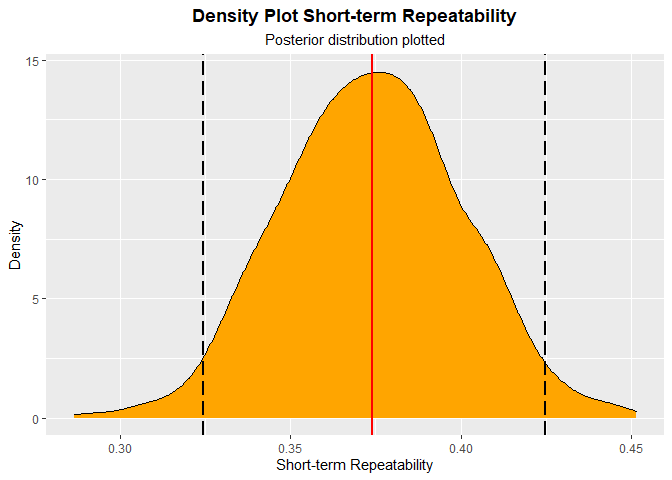<!-- -->

##### **Plot–Univariate model with no interaction**

``` r
#load packages for predictive plot
require(ggplot2)
require(ggeffects)
require(cowplot)

d18<-subset(data, data$Year=="2018")
d19<-subset(data, data$Year=="2019")

#plot
p18<-ggplot(d18, aes(x = NestStage, y = MinDisRaw, factor=NestStage, fill=Sex)) + geom_boxplot() +
  scale_y_continuous("Minimum approach distnace to observer (m)",limits = c(0, 100)) +
  scale_x_discrete("Nest Stage", labels=c('Egg-laying', 'Incubating', 'Provisioning'))+ 
  guides(fill="none")+
  guides(color="none")+ theme_classic(base_size = 12)  +
  ggtitle(label ="2018",
          subtitle = "")+
  theme(plot.title = element_text(face = "bold", hjust=0.5), plot.subtitle=element_text(hjust=0.5))


p19<-ggplot(d19, aes(x = NestStage, y = MinDisRaw, factor=NestStage, fill=Sex)) + geom_boxplot() +
  scale_y_continuous("Minimum approach distnace to observer (m)",limits = c(0, 100)) +
  scale_x_discrete("Nest Stage", labels=c('Egg-laying', 'Incubating', 'Provisioning'))+ 
  guides(color="none")+ theme_classic(base_size = 12)  +
  ggtitle(label ="2019",
          subtitle = "")+
  theme(plot.title = element_text(face = "bold", hjust=0.5), plot.subtitle=element_text(hjust=0.5))

plot_grid(p18,p19)
```

<!-- -->

``` r
#posterior of difference plots for groups in main effects (supp material)
cowplot::plot_grid(p3, p2, p1, nrow = 2,labels = c("A.", "B.", "C."))
```

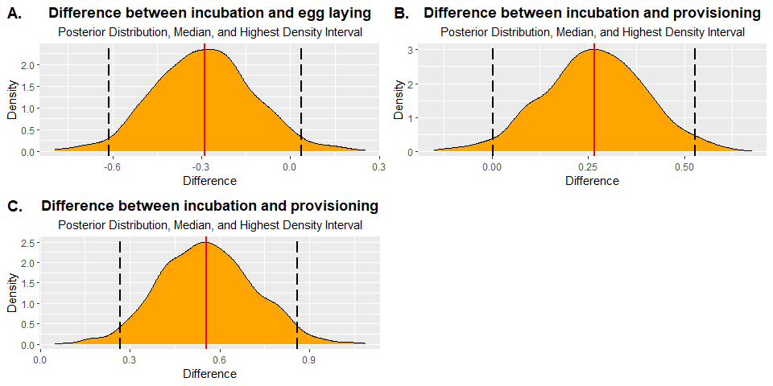<!-- -->

#### **Density plots of behavioral types**

``` r
## density plots

post1<-smod@ranef$ID
post1<-as.data.frame(post1)

colnames(post1)<-(c("01H", "03M", "119Female", 
                         "119Male", "11A", "12Female",
                         "12Male", "145Male","14H","155Female",
                         "155Male", "156Female", "156Male", 
                         "157Female", "15C ", "160Male",
                         "168Female", "168Male","175Male",
                         "179Female", "179Male","184Male", 
                         "186Female", "18K", "193Male", 
                         "196Male", "19K", "1Male",
                         "201Female", "20H", "214Male", 
                         "215Female", "215Male", "217Female",       
                         "217Male", "219Female","219Male",     
                         "223Female", "223Male", "227Male", 
                         "228Female", "228Male", "231Female",       
                         "234Male", "236Female", "23Female",
                         "23Male",  "241Female", "241Male",
                         "244Female", "244Male", "24K",     
                         "251Female", "253Male", "254Female" ,      
                         "254Male", "256Female", "25K",
                         "304Female", "304Male", "30Female",
                         "30Male", "318Female", "318Male", 
                         "319Male", "32K", "38A",       
                         "39E", "40Male", "41H",
                         "43A", "43H", "44H",
                         "45K", "46K", "47E", "47Female",
                         "47Male","49E", "49H", 
                         "4Female", "4Male", "50H",
                         "53Female", "53Male", "55K",       
                         "57Male", "58Male" , "59Male",
                         "75B", "78Male", "80Female", "83K",
                         "85C", "86C", "87C",
                         "87K", "88C",  "89C",
                         "89E", "90C", "91C",
                         "92H", "93E", "97Female",
                         "97Male", "98Female", "98Male"))


#convert data to long format for plotting
require(tidyr)
plot_data<-post1%>% 
  pivot_longer(c("01H", "03M", "119Female", 
                         "119Male", "11A", "12Female",
                         "12Male", "145Male","14H","155Female",
                         "155Male", "156Female", "156Male", 
                         "157Female", "15C ", "160Male",
                         "168Female", "168Male","175Male",
                         "179Female", "179Male","184Male", 
                         "186Female", "18K", "193Male", 
                         "196Male", "19K", "1Male",
                         "201Female", "20H", "214Male", 
                         "215Female", "215Male", "217Female",       
                         "217Male", "219Female","219Male",     
                         "223Female", "223Male", "227Male", 
                         "228Female", "228Male", "231Female",       
                         "234Male", "236Female", "23Female",
                         "23Male",  "241Female", "241Male",
                         "244Female", "244Male", "24K",     
                         "251Female", "253Male", "254Female" ,      
                         "254Male", "256Female", "25K",
                         "304Female", "304Male", "30Female",
                         "30Male", "318Female", "318Male", 
                         "319Male", "32K", "38A",       
                         "39E", "40Male", "41H",
                         "43A", "43H", "44H",
                         "45K", "46K", "47E", "47Female",
                         "47Male","49E", "49H", 
                         "4Female", "4Male", "50H",
                         "53Female", "53Male", "55K",       
                         "57Male", "58Male" , "59Male",
                         "75B", "78Male", "80Female", "83K",
                         "85C", "86C", "87C",
                         "87K", "88C",  "89C",
                         "89E", "90C", "91C",
                         "92H", "93E", "97Female",
                         "97Male", "98Female", "98Male"), names_to="ID", values_to="value")


# add population level mean residual variance
plot_data$value <-
plot_data$value +
fixef(m1, pars = "Intercept")[1]


BT<-plot_data%>%
  dplyr:: group_by(ID)%>%
  dplyr:: mutate(meanBT=mean(value))%>%
  dplyr:: ungroup()


data_r<-data%>%
  dplyr::select(ID,Sex)

ref<-data_r[!duplicated(data_r),]


bTT<-merge(BT, ref, all.x = T, no.dups = T)

BTT<-bTT%>%replace_na(list(Sex='Male'))


bt<-ggplot()+
  ggridges::geom_density_ridges(data=BTT,
                                aes(x=value,
                                    y=reorder(as.factor(ID), meanBT),
                                    height=..density..,
                                    fill=ID, scale=3), alpha=0.6) +
  geom_point(data = BTT[!duplicated(BTT$ID),],
             aes(x = meanBT,
                 y = as.factor(ID),
                 col = Sex),
             size = 1.8)+
  labs(y="Tag ID", x="Behavioral Types (Log-transformed Nest Defense)")+
  ggtitle(label ="Among-individual differences in nest defense",
          subtitle = "Posterior distribution for each individual is plotted")+
  theme(plot.title = element_text(face = "bold", hjust=0.5), plot.subtitle=element_text(hjust=0.7), 
        text = element_text(size=18),axis.ticks.y=element_blank(),axis.text.y=element_blank()) #remove y axis ticks)
bt + theme(aspect.ratio=12/5)#+guides(fill="none")+ scale_fill_discrete(guide="none")+ theme(legend.position="none")
```

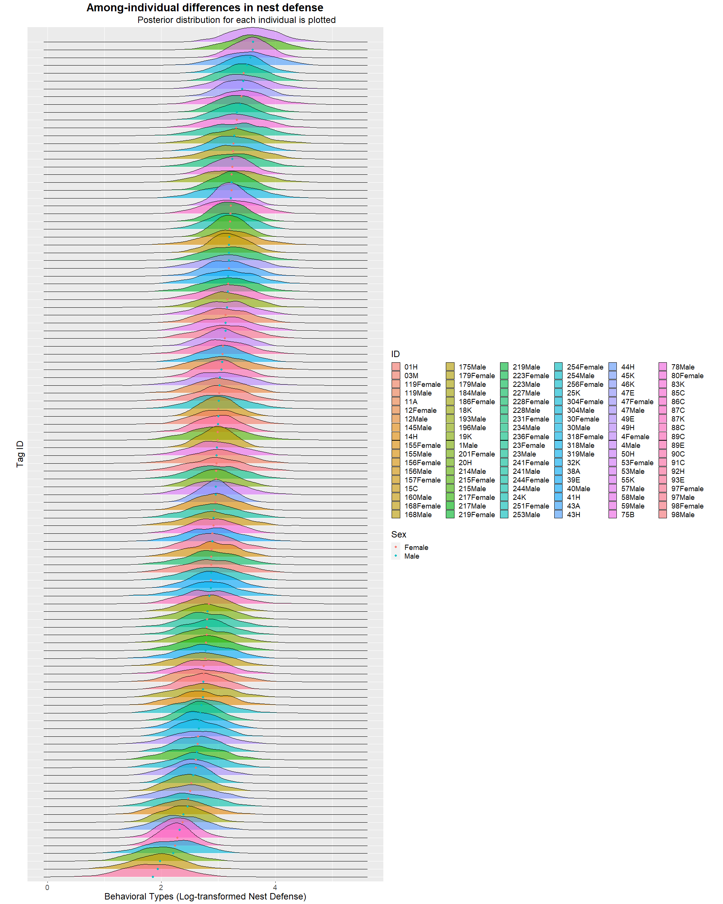<!-- -->

### **5. Models of (dis-)assortative mating + relative fitness**

-   *Multivariate models that estimate assortative mating (among-pair
    correlation), response to labile environment (within-pair
    correlation), and selection gradients for each combination of sex
    and year.*

#### **2018 3 trait model**

``` r
mod.12 <- MCMCglmm(cbind(Male, Female, rfit) ~ (trait-1),  
                   random = ~us(trait):NestID ,
                   rcov = ~us(trait):units, 
                   family = c("gaussian", "gaussian", "gaussian"),
                   data=data2018, 
                   prior = prior_E_B_fit_1px, 
                   verbose = FALSE,
                   nitt=990000,thin=500,burnin=90000
                   )
summary(mod.12)
```

    ## 
    ##  Iterations = 90001:989501
    ##  Thinning interval  = 500
    ##  Sample size  = 1800 
    ## 
    ##  DIC: 116.4535 
    ## 
    ##  G-structure:  ~us(trait):NestID
    ## 
    ##                                post.mean   l-95% CI u-95% CI eff.samp
    ## traitMale:traitMale.NestID       0.57928  1.186e-01   1.1453   1670.6
    ## traitFemale:traitMale.NestID     0.04094 -1.132e-01   0.2134   1800.0
    ## traitrfit:traitMale.NestID       0.02141 -3.712e-01   0.3698   1800.0
    ## traitMale:traitFemale.NestID     0.04094 -1.132e-01   0.2134   1800.0
    ## traitFemale:traitFemale.NestID   0.08985  9.430e-07   0.2313   1991.8
    ## traitrfit:traitFemale.NestID     0.10501 -5.503e-02   0.3232   1800.0
    ## traitMale:traitrfit.NestID       0.02141 -3.712e-01   0.3698   1800.0
    ## traitFemale:traitrfit.NestID     0.10501 -5.503e-02   0.3232   1800.0
    ## traitrfit:traitrfit.NestID       0.89156  4.386e-01   1.4469    583.5
    ## 
    ##  R-structure:  ~us(trait):units
    ## 
    ##                                post.mean  l-95% CI u-95% CI eff.samp
    ## traitMale:traitMale.units      6.307e-01  0.365953 0.883635     1800
    ## traitFemale:traitMale.units    4.264e-02 -0.092890 0.182650     1492
    ## traitrfit:traitMale.units      2.200e-05 -0.006774 0.005944     1532
    ## traitMale:traitFemale.units    4.264e-02 -0.092890 0.182650     1492
    ## traitFemale:traitFemale.units  3.814e-01  0.242278 0.531708     1800
    ## traitrfit:traitFemale.units   -3.564e-05 -0.004603 0.004399     1800
    ## traitMale:traitrfit.units      2.200e-05 -0.006774 0.005944     1532
    ## traitFemale:traitrfit.units   -3.564e-05 -0.004603 0.004399     1800
    ## traitrfit:traitrfit.units      1.000e-04  0.000100 0.000100        0
    ## 
    ##  Location effects: cbind(Male, Female, rfit) ~ (trait - 1) 
    ## 
    ##             post.mean l-95% CI u-95% CI eff.samp  pMCMC    
    ## traitMale     -2.3700  -2.7409  -1.9867     1800 <6e-04 ***
    ## traitFemale   -2.5845  -2.8071  -2.3882     1800 <6e-04 ***
    ## traitrfit      0.7886   0.4364   1.1564     1800 <6e-04 ***
    ## ---
    ## Signif. codes:  0 '***' 0.001 '**' 0.01 '*' 0.05 '.' 0.1 ' ' 1

``` r
plot(mod.12)
```

<!-- --><!-- -->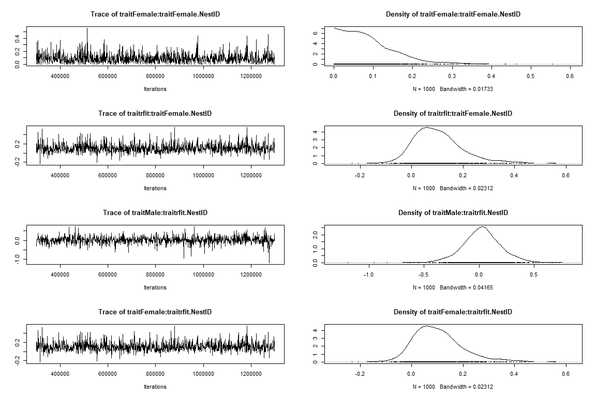<!-- --><!-- --><!-- -->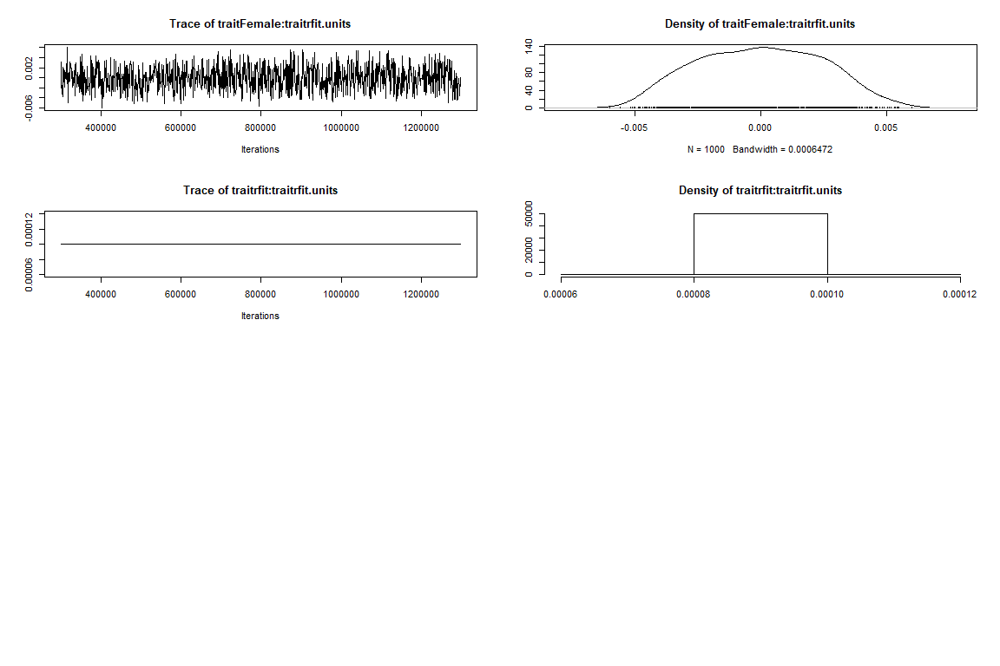<!-- -->

``` r
#auto-correlation
autocorr.diag(mod.12$VCV)
```

    ##           traitMale:traitMale.NestID traitFemale:traitMale.NestID
    ## Lag 0                    1.000000000                  1.000000000
    ## Lag 500                  0.037016833                  0.018640547
    ## Lag 2500                -0.019553796                 -0.017677559
    ## Lag 5000                -0.009698007                  0.004147341
    ## Lag 25000                0.029964668                  0.012055495
    ##           traitrfit:traitMale.NestID traitMale:traitFemale.NestID
    ## Lag 0                    1.000000000                  1.000000000
    ## Lag 500                  0.015591481                  0.018640547
    ## Lag 2500                -0.014064797                 -0.017677559
    ## Lag 5000                -0.022546487                  0.004147341
    ## Lag 25000                0.001437017                  0.012055495
    ##           traitFemale:traitFemale.NestID traitrfit:traitFemale.NestID
    ## Lag 0                        1.000000000                 1.0000000000
    ## Lag 500                     -0.050872101                 0.0103970271
    ## Lag 2500                    -0.003509523                 0.0056864634
    ## Lag 5000                    -0.041018698                 0.0028263843
    ## Lag 25000                   -0.008370490                 0.0001058785
    ##           traitMale:traitrfit.NestID traitFemale:traitrfit.NestID
    ## Lag 0                    1.000000000                 1.0000000000
    ## Lag 500                  0.015591481                 0.0103970271
    ## Lag 2500                -0.014064797                 0.0056864634
    ## Lag 5000                -0.022546487                 0.0028263843
    ## Lag 25000                0.001437017                 0.0001058785
    ##           traitrfit:traitrfit.NestID traitMale:traitMale.units
    ## Lag 0                     1.00000000               1.000000000
    ## Lag 500                   0.03732001               0.011447688
    ## Lag 2500                  0.07694835              -0.024363496
    ## Lag 5000                  0.04744881              -0.018021862
    ## Lag 25000                 0.04760822               0.006802154
    ##           traitFemale:traitMale.units traitrfit:traitMale.units
    ## Lag 0                      1.00000000                1.00000000
    ## Lag 500                    0.05806897                0.08006010
    ## Lag 2500                  -0.02181786               -0.01470009
    ## Lag 5000                   0.02681301                0.03820286
    ## Lag 25000                  0.01094225               -0.03094655
    ##           traitMale:traitFemale.units traitFemale:traitFemale.units
    ## Lag 0                      1.00000000                   1.000000000
    ## Lag 500                    0.05806897                   0.013110646
    ## Lag 2500                  -0.02181786                   0.010462103
    ## Lag 5000                   0.02681301                  -0.017490557
    ## Lag 25000                  0.01094225                   0.004384246
    ##           traitrfit:traitFemale.units traitMale:traitrfit.units
    ## Lag 0                     1.000000000                1.00000000
    ## Lag 500                  -0.001561069                0.08006010
    ## Lag 2500                 -0.039861345               -0.01470009
    ## Lag 5000                 -0.017378433                0.03820286
    ## Lag 25000                 0.003005932               -0.03094655
    ##           traitFemale:traitrfit.units traitrfit:traitrfit.units
    ## Lag 0                     1.000000000                       NaN
    ## Lag 500                  -0.001561069                       NaN
    ## Lag 2500                 -0.039861345                       NaN
    ## Lag 5000                 -0.017378433                       NaN
    ## Lag 25000                 0.003005932                       NaN

``` r
autocorr(mod.12$Sol)
```

    ## , , traitMale
    ## 
    ##              traitMale traitFemale    traitrfit
    ## Lag 0      1.000000000  0.12141152  0.060042573
    ## Lag 500    0.027251435 -0.01297140  0.040463053
    ## Lag 2500   0.007105628  0.02338829 -0.003894572
    ## Lag 5000   0.001206619 -0.04268881 -0.014811481
    ## Lag 25000 -0.005690482 -0.04625402  0.009822054
    ## 
    ## , , traitFemale
    ## 
    ##             traitMale  traitFemale    traitrfit
    ## Lag 0      0.12141152  1.000000000  0.218086213
    ## Lag 500   -0.03481291  0.001436542 -0.044584809
    ## Lag 2500   0.03201610  0.003540845  0.007332536
    ## Lag 5000   0.01016113 -0.030212613 -0.012984788
    ## Lag 25000 -0.03851143  0.022071841 -0.016653359
    ## 
    ## , , traitrfit
    ## 
    ##             traitMale  traitFemale    traitrfit
    ## Lag 0      0.06004257  0.218086213  1.000000000
    ## Lag 500    0.03433408  0.007956029 -0.015026316
    ## Lag 2500  -0.03114086 -0.010304118  0.005717887
    ## Lag 5000   0.04928350  0.025902277  0.035224721
    ## Lag 25000  0.01326803 -0.004390250  0.008003297

##### **Among and within-pair correlations and selection gradients– 2018 3 trait model**

``` r
# posteriors
posteriors_3<-as.mcmc(mod.12$VCV)
posterior.mode(posteriors_3)
```

    ##     traitMale:traitMale.NestID   traitFemale:traitMale.NestID 
    ##                   0.4555889300                  -0.0008547969 
    ##     traitrfit:traitMale.NestID   traitMale:traitFemale.NestID 
    ##                   0.0360715027                  -0.0008547969 
    ## traitFemale:traitFemale.NestID   traitrfit:traitFemale.NestID 
    ##                   0.0016963954                   0.0473857992 
    ##     traitMale:traitrfit.NestID   traitFemale:traitrfit.NestID 
    ##                   0.0360715027                   0.0473857992 
    ##     traitrfit:traitrfit.NestID      traitMale:traitMale.units 
    ##                   0.7188859437                   0.5675459410 
    ##    traitFemale:traitMale.units      traitrfit:traitMale.units 
    ##                   0.0340612093                   0.0041415117 
    ##    traitMale:traitFemale.units  traitFemale:traitFemale.units 
    ##                   0.0340612093                   0.3708294109 
    ##    traitrfit:traitFemale.units      traitMale:traitrfit.units 
    ##                  -0.0007442917                   0.0041415117 
    ##    traitFemale:traitrfit.units      traitrfit:traitrfit.units 
    ##                  -0.0007442917                   0.0000999882

``` r
# among-pair correlations
pair.correlation_3<-posteriors_3[,"traitFemale:traitMale.NestID"]/
  sqrt(posteriors_3[,"traitFemale:traitFemale.NestID"]*
         posteriors_3[,"traitMale:traitMale.NestID"])


posterior.mode(pair.correlation_3)
```

    ##      var1 
    ## 0.2971707

``` r
HPDinterval(pair.correlation_3)
```

    ##           lower     upper
    ## var1 -0.4643665 0.8068863
    ## attr(,"Probability")
    ## [1] 0.95

``` r
pair<-pair.correlation_3
pair<-as.data.frame(pair)
describe_posterior(pair)
```

    ## Summary of Posterior Distribution
    ## 
    ## Parameter | Median |        95% CI |     pd |          ROPE | % in ROPE
    ## -----------------------------------------------------------------------
    ## var1      |   0.21 | [-0.50, 0.78] | 71.56% | [-0.10, 0.10] |    19.71%

``` r
rptt<-describe_posterior(pair)#data frame for CrI and median
rpt11<-as.data.frame(pair) #posterior plot
ggplot(rpt11, aes(x = var1)) +
  geom_density(fill = "orange") +
  geom_vline(xintercept = median(rptt$Median), color="red", size=1)+
   geom_vline(xintercept = (rptt$CI_low), color="black", size=1, linetype="longdash")+
  geom_vline(xintercept = (rptt$CI_high), color="black", size=1, linetype="longdash")+
  labs(y="Density", x="Among-Pair correlation")+
  ggtitle(label ="Density Plot Among-Pair Correlation 2018",
          subtitle = "Posterior distribution plotted")+
  theme(plot.title = element_text(face = "bold", hjust=0.5), plot.subtitle=element_text(hjust=0.5))
```

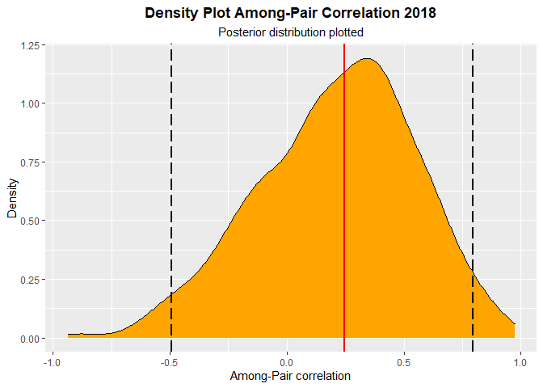<!-- -->

``` r
# within-pair correlations (residuals)
residual.correlation_3<-posteriors_3[,"traitFemale:traitMale.units"]/
  sqrt(posteriors_3[,"traitFemale:traitFemale.units"]*
         posteriors_3[,"traitMale:traitMale.units"])

posterior.mode(residual.correlation_3)
```

    ##       var1 
    ## 0.06866705

``` r
HPDinterval(residual.correlation_3)
```

    ##           lower     upper
    ## var1 -0.1677134 0.3407447
    ## attr(,"Probability")
    ## [1] 0.95

``` r
wpair<-as.data.frame(residual.correlation_3)

describe_posterior(wpair)
```

    ## Summary of Posterior Distribution
    ## 
    ## Parameter | Median |        95% CI |     pd |          ROPE | % in ROPE
    ## -----------------------------------------------------------------------
    ## var1      |   0.09 | [-0.17, 0.35] | 72.28% | [-0.10, 0.10] |    47.08%

``` r
rptt<-describe_posterior(wpair)#data frame for CrI and median
rpt11<-as.data.frame(wpair) #posterior plot
ggplot(rpt11, aes(x = var1)) +
  geom_density(fill = "orange") +
  geom_vline(xintercept = median(rptt$Median), color="red", size=1)+
   geom_vline(xintercept = (rptt$CI_low), color="black", size=1, linetype="longdash")+
  geom_vline(xintercept = (rptt$CI_high), color="black", size=1, linetype="longdash")+
  labs(y="Density", x="Within-Pair correlation")+
  ggtitle(label ="Density Plot Within-Pair Correlation 2018",
          subtitle = "Posterior distribution plotted")+
  theme(plot.title = element_text(face = "bold", hjust=0.5), plot.subtitle=element_text(hjust=0.5))
```

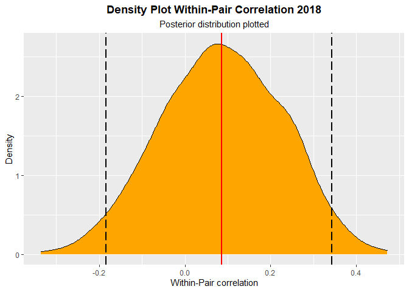<!-- -->

``` r
#male selection gradient
Male_sel_18<- posteriors_3[,"traitrfit:traitMale.NestID"]/
  (sqrt(posteriors_3[,"traitrfit:traitrfit.NestID"])*
     sqrt(posteriors_3[,"traitMale:traitMale.NestID"]))
posterior.mode(Male_sel_18)
```

    ##     var1 
    ## 0.085321

``` r
HPDinterval(Male_sel_18)
```

    ##           lower    upper
    ## var1 -0.4317528 0.485562
    ## attr(,"Probability")
    ## [1] 0.95

``` r
male18<-as.data.frame(Male_sel_18)
describe_posterior(male18)
```

    ## Summary of Posterior Distribution
    ## 
    ## Parameter | Median |        95% CI |     pd |          ROPE | % in ROPE
    ## -----------------------------------------------------------------------
    ## var1      |   0.04 | [-0.45, 0.48] | 55.89% | [-0.10, 0.10] |    31.75%

``` r
rptt<-describe_posterior(male18)#data frame for CrI and median
rpt11<-as.data.frame(male18) #posterior plot
ggplot(rpt11, aes(x = var1)) +
  geom_density(fill = "orange") +
  geom_vline(xintercept = median(rptt$Median), color="red", size=1)+
   geom_vline(xintercept = (rptt$CI_low), color="black", size=1, linetype="longdash")+
  geom_vline(xintercept = (rptt$CI_high), color="black", size=1, linetype="longdash")+
  labs(y="Density", x="Male Selection Gradient")+
  ggtitle(label ="Density Plot Male Selection Gradient 2018",
          subtitle = "Posterior distribution plotted")+
  theme(plot.title = element_text(face = "bold", hjust=0.5), plot.subtitle=element_text(hjust=0.5))
```

<!-- -->

``` r
#female selection gradient
Female_sel_18<- posteriors_3[,"traitrfit:traitFemale.NestID"]/
  (sqrt(posteriors_3[,"traitrfit:traitrfit.NestID"])*
     sqrt(posteriors_3[,"traitFemale:traitFemale.NestID"]))
posterior.mode(Female_sel_18)
```

    ##      var1 
    ## 0.5400758

``` r
HPDinterval(Female_sel_18)
```

    ##           lower     upper
    ## var1 -0.2003112 0.8905785
    ## attr(,"Probability")
    ## [1] 0.95

``` r
female18<-as.data.frame(Female_sel_18)
describe_posterior(female18)
```

    ## Summary of Posterior Distribution
    ## 
    ## Parameter | Median |        95% CI |     pd |          ROPE | % in ROPE
    ## -----------------------------------------------------------------------
    ## var1      |   0.42 | [-0.30, 0.84] | 89.17% | [-0.10, 0.10] |     9.82%

``` r
rptt<-describe_posterior(female18)#data frame for CrI and median
rpt11<-as.data.frame(female18) #posterior plot
ggplot(rpt11, aes(x = var1)) +
  geom_density(fill = "orange") +
  geom_vline(xintercept = median(rptt$Median), color="red", size=1)+
   geom_vline(xintercept = (rptt$CI_low), color="black", size=1, linetype="longdash")+
  geom_vline(xintercept = (rptt$CI_high), color="black", size=1, linetype="longdash")+
  labs(y="Density", x="Female Selection Gradient")+
  ggtitle(label ="Density Plot Female Selection Gradient 2018",
          subtitle = "Posterior distribution plotted")+
  theme(plot.title = element_text(face = "bold", hjust=0.5), plot.subtitle=element_text(hjust=0.5))
```

<!-- -->

#### **2019 3 trait model**

``` r
#prior for three trait- Houslay tutorial 
prior_E_B_fit_1px = list(R = list(V = diag(c(1,1,0.0001),3,3), nu = 1.002, fix = 3),
                         G = list(G1 = list(V = diag(3), nu = 3,
                                            alpha.mu = rep(0,3),
                                            alpha.V = diag(25^2,3,3))))

#model
mod.13 <- MCMCglmm(cbind(Male, Female, rfit) ~ (trait-1),  
                   random = ~us(trait):NestID ,
                   rcov = ~us(trait):units, 
                   family = c("gaussian", "gaussian", "gaussian"),
                   data=data2019, 
                   prior = prior_E_B_fit_1px, 
                   verbose = FALSE,
                   nitt=990000,thin=500,burnin=90000)
summary(mod.13)
```

    ## 
    ##  Iterations = 90001:989501
    ##  Thinning interval  = 500
    ##  Sample size  = 1800 
    ## 
    ##  DIC: 116.5178 
    ## 
    ##  G-structure:  ~us(trait):NestID
    ## 
    ##                                post.mean   l-95% CI u-95% CI eff.samp
    ## traitMale:traitMale.NestID        0.7505  1.558e-01  1.50215     1501
    ## traitFemale:traitMale.NestID     -0.2583 -6.502e-01  0.06618     1800
    ## traitrfit:traitMale.NestID        0.5041 -2.166e-01  1.30701     1800
    ## traitMale:traitFemale.NestID     -0.2583 -6.502e-01  0.06618     1800
    ## traitFemale:traitFemale.NestID    0.4664  9.474e-05  1.04785     1675
    ## traitrfit:traitFemale.NestID     -0.2580 -1.041e+00  0.29639     1800
    ## traitMale:traitrfit.NestID        0.5041 -2.166e-01  1.30701     1800
    ## traitFemale:traitrfit.NestID     -0.2580 -1.041e+00  0.29639     1800
    ## traitrfit:traitrfit.NestID        3.3362  1.655e+00  5.44117     1800
    ## 
    ##  R-structure:  ~us(trait):units
    ## 
    ##                               post.mean  l-95% CI u-95% CI eff.samp
    ## traitMale:traitMale.units     9.204e-01  0.548548 1.369726     1800
    ## traitFemale:traitMale.units   2.915e-01  0.058312 0.625371     1998
    ## traitrfit:traitMale.units     5.968e-05 -0.008015 0.007941     1800
    ## traitMale:traitFemale.units   2.915e-01  0.058312 0.625371     1998
    ## traitFemale:traitFemale.units 7.825e-01  0.440084 1.160666     1948
    ## traitrfit:traitFemale.units   7.888e-05 -0.006979 0.007309     1678
    ## traitMale:traitrfit.units     5.968e-05 -0.008015 0.007941     1800
    ## traitFemale:traitrfit.units   7.888e-05 -0.006979 0.007309     1678
    ## traitrfit:traitrfit.units     1.000e-04  0.000100 0.000100        0
    ## 
    ##  Location effects: cbind(Male, Female, rfit) ~ (trait - 1) 
    ## 
    ##             post.mean  l-95% CI  u-95% CI eff.samp  pMCMC    
    ## traitMale   -2.400591 -2.831994 -1.977850     1800 <6e-04 ***
    ## traitFemale -2.727929 -3.067994 -2.370892     2259 <6e-04 ***
    ## traitrfit    0.668788  0.001153  1.377467     1800 0.0589 .  
    ## ---
    ## Signif. codes:  0 '***' 0.001 '**' 0.01 '*' 0.05 '.' 0.1 ' ' 1

``` r
plot(mod.13)
```

<!-- --><!-- --><!-- -->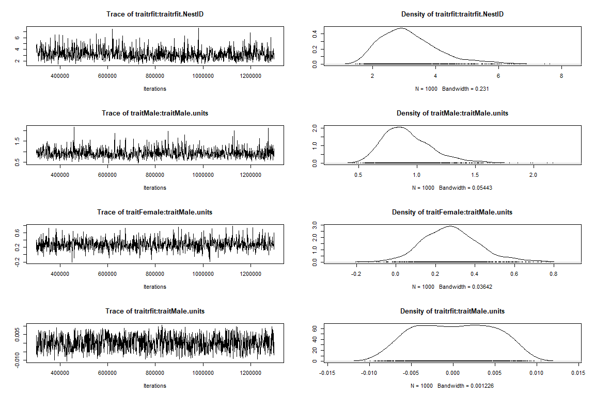<!-- --><!-- -->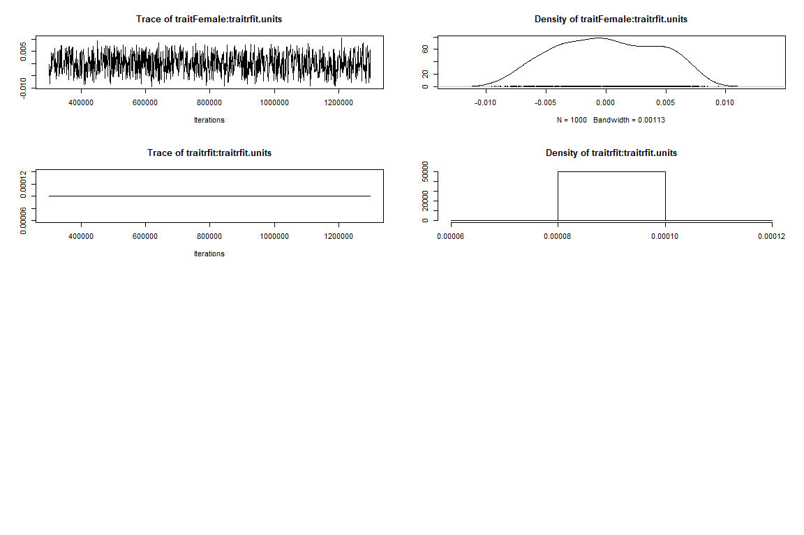<!-- -->

``` r
#auto-correlation
autocorr.diag(mod.13$VCV)
```

    ##           traitMale:traitMale.NestID traitFemale:traitMale.NestID
    ## Lag 0                     1.00000000                  1.000000000
    ## Lag 500                  -0.01128070                 -0.019381761
    ## Lag 2500                  0.01264422                 -0.003926246
    ## Lag 5000                 -0.02855232                  0.007527224
    ## Lag 25000                 0.01949374                  0.007778467
    ##           traitrfit:traitMale.NestID traitMale:traitFemale.NestID
    ## Lag 0                    1.000000000                  1.000000000
    ## Lag 500                 -0.012250467                 -0.019381761
    ## Lag 2500                 0.005318399                 -0.003926246
    ## Lag 5000                -0.015631502                  0.007527224
    ## Lag 25000               -0.025848635                  0.007778467
    ##           traitFemale:traitFemale.NestID traitrfit:traitFemale.NestID
    ## Lag 0                        1.000000000                  1.000000000
    ## Lag 500                     -0.023026612                 -0.022624828
    ## Lag 2500                    -0.006114478                  0.022416733
    ## Lag 5000                     0.021130929                 -0.003860327
    ## Lag 25000                   -0.014945250                 -0.001599088
    ##           traitMale:traitrfit.NestID traitFemale:traitrfit.NestID
    ## Lag 0                    1.000000000                  1.000000000
    ## Lag 500                 -0.012250467                 -0.022624828
    ## Lag 2500                 0.005318399                  0.022416733
    ## Lag 5000                -0.015631502                 -0.003860327
    ## Lag 25000               -0.025848635                 -0.001599088
    ##           traitrfit:traitrfit.NestID traitMale:traitMale.units
    ## Lag 0                    1.000000000                1.00000000
    ## Lag 500                 -0.005160083               -0.01900834
    ## Lag 2500                 0.043211373                0.04124249
    ## Lag 5000                 0.003493097               -0.02927945
    ## Lag 25000                0.000193381               -0.01782423
    ##           traitFemale:traitMale.units traitrfit:traitMale.units
    ## Lag 0                     1.000000000              1.0000000000
    ## Lag 500                  -0.052482422              0.0281554445
    ## Lag 2500                  0.003020487             -0.0204171820
    ## Lag 5000                  0.009956836             -0.0007568502
    ## Lag 25000                -0.031911867              0.0003228134
    ##           traitMale:traitFemale.units traitFemale:traitFemale.units
    ## Lag 0                     1.000000000                    1.00000000
    ## Lag 500                  -0.052482422                   -0.03968133
    ## Lag 2500                  0.003020487                    0.01604227
    ## Lag 5000                  0.009956836                    0.01092054
    ## Lag 25000                -0.031911867                   -0.03996131
    ##           traitrfit:traitFemale.units traitMale:traitrfit.units
    ## Lag 0                     1.000000000              1.0000000000
    ## Lag 500                  -0.020277189              0.0281554445
    ## Lag 2500                  0.010755313             -0.0204171820
    ## Lag 5000                 -0.005430626             -0.0007568502
    ## Lag 25000                 0.004161571              0.0003228134
    ##           traitFemale:traitrfit.units traitrfit:traitrfit.units
    ## Lag 0                     1.000000000                       NaN
    ## Lag 500                  -0.020277189                       NaN
    ## Lag 2500                  0.010755313                       NaN
    ## Lag 5000                 -0.005430626                       NaN
    ## Lag 25000                 0.004161571                       NaN

``` r
autocorr(mod.13$Sol)
```

    ## , , traitMale
    ## 
    ##              traitMale  traitFemale    traitrfit
    ## Lag 0      1.000000000 -0.112871019  0.250339018
    ## Lag 500   -0.011185828  0.007002435  0.009230580
    ## Lag 2500   0.013217573  0.002520734 -0.008097385
    ## Lag 5000  -0.024708685  0.006441956 -0.022526143
    ## Lag 25000 -0.005806079 -0.010692562  0.015856432
    ## 
    ## , , traitFemale
    ## 
    ##              traitMale  traitFemale     traitrfit
    ## Lag 0     -0.112871019  1.000000000 -0.1166959674
    ## Lag 500   -0.007248403 -0.018475494  0.0040612319
    ## Lag 2500  -0.004126361 -0.023720016  0.0008736601
    ## Lag 5000   0.046242538 -0.009283763  0.0267488404
    ## Lag 25000 -0.011791241  0.007823252 -0.0133650385
    ## 
    ## , , traitrfit
    ## 
    ##              traitMale traitFemale    traitrfit
    ## Lag 0      0.250339018 -0.11669597  1.000000000
    ## Lag 500    0.026982059 -0.03171077 -0.009515218
    ## Lag 2500   0.019033314 -0.01293963  0.017795420
    ## Lag 5000  -0.008625091 -0.06289227 -0.004567211
    ## Lag 25000 -0.015912278 -0.01920170  0.001128396

``` r
# posteriors
posteriors1<-as.mcmc(mod.13$VCV)
posterior.mode(posteriors1)
```

    ##     traitMale:traitMale.NestID   traitFemale:traitMale.NestID 
    ##                   0.5622346673                  -0.1568700036 
    ##     traitrfit:traitMale.NestID   traitMale:traitFemale.NestID 
    ##                   0.2439583155                  -0.1568700036 
    ## traitFemale:traitFemale.NestID   traitrfit:traitFemale.NestID 
    ##                   0.2755305949                  -0.2096100111 
    ##     traitMale:traitrfit.NestID   traitFemale:traitrfit.NestID 
    ##                   0.2439583155                  -0.2096100111 
    ##     traitrfit:traitrfit.NestID      traitMale:traitMale.units 
    ##                   2.8765335489                   0.7638349372 
    ##    traitFemale:traitMale.units      traitrfit:traitMale.units 
    ##                   0.2848984534                   0.0051607015 
    ##    traitMale:traitFemale.units  traitFemale:traitFemale.units 
    ##                   0.2848984534                   0.6350332830 
    ##    traitrfit:traitFemale.units      traitMale:traitrfit.units 
    ##                   0.0030338283                   0.0051607015 
    ##    traitFemale:traitrfit.units      traitrfit:traitrfit.units 
    ##                   0.0030338283                   0.0000999882

##### **Among and within-pair correlations and selection gradients– 2019 3 trait model**

``` r
# among-pair correlations
pair.correlation_4<-posteriors1[,"traitFemale:traitMale.NestID"]/
  sqrt(posteriors1[,"traitFemale:traitFemale.NestID"]*
         posteriors1[,"traitMale:traitMale.NestID"])

posterior.mode(pair.correlation_4)
```

    ##       var1 
    ## -0.6376934

``` r
HPDinterval(pair.correlation_4)
```

    ##           lower      upper
    ## var1 -0.9289146 0.06908949
    ## attr(,"Probability")
    ## [1] 0.95

``` r
pair<-as.data.frame(pair.correlation_4)
describe_posterior(pair)
```

    ## Summary of Posterior Distribution
    ## 
    ## Parameter | Median |        95% CI |     pd |          ROPE | % in ROPE
    ## -----------------------------------------------------------------------
    ## var1      |  -0.53 | [-0.91, 0.12] | 93.83% | [-0.10, 0.10] |     7.66%

``` r
rptt<-describe_posterior(pair)#data frame for CrI and median
rpt11<-as.data.frame(pair) #posterior plot
ggplot(rpt11, aes(x = var1)) +
  geom_density(fill = "orange") +
  geom_vline(xintercept = median(rptt$Median), color="red", size=1)+
   geom_vline(xintercept = (rptt$CI_low), color="black", size=1, linetype="longdash")+
  geom_vline(xintercept = (rptt$CI_high), color="black", size=1, linetype="longdash")+
  labs(y="Density", x="Among-Pair correlation")+
  ggtitle(label ="Density Plot Among-Pair Correlation 2019",
          subtitle = "Posterior distribution plotted")+
  theme(plot.title = element_text(face = "bold", hjust=0.5), plot.subtitle=element_text(hjust=0.5))
```

<!-- -->

``` r
# within-pair correlations (residuals)
residual.correlation4<-posteriors1[,"traitFemale:traitMale.units"]/
  sqrt(posteriors1[,"traitFemale:traitFemale.units"]*
         posteriors1[,"traitMale:traitMale.units"])

posterior.mode(residual.correlation4)
```

    ##      var1 
    ## 0.3462347

``` r
HPDinterval(residual.correlation4)
```

    ##           lower     upper
    ## var1 0.07206879 0.6116736
    ## attr(,"Probability")
    ## [1] 0.95

``` r
wpair<-as.data.frame(residual.correlation4)
describe_posterior(wpair)
```

    ## Summary of Posterior Distribution
    ## 
    ## Parameter | Median |       95% CI |     pd |          ROPE | % in ROPE
    ## ----------------------------------------------------------------------
    ## var1      |   0.35 | [0.04, 0.60] | 98.50% | [-0.10, 0.10] |     2.51%

``` r
rptt<-describe_posterior(wpair)#data frame for CrI and median
rpt11<-as.data.frame(wpair) #posterior plot
ggplot(rpt11, aes(x = var1)) +
  geom_density(fill = "orange") +
  geom_vline(xintercept = median(rptt$Median), color="red", size=1)+
   geom_vline(xintercept = (rptt$CI_low), color="black", size=1, linetype="longdash")+
  geom_vline(xintercept = (rptt$CI_high), color="black", size=1, linetype="longdash")+
  labs(y="Density", x="Within-Pair correlation")+
  ggtitle(label ="Density Plot Within-Pair Correlation 2019",
          subtitle = "Posterior distribution plotted")+
  theme(plot.title = element_text(face = "bold", hjust=0.5), plot.subtitle=element_text(hjust=0.5))
```

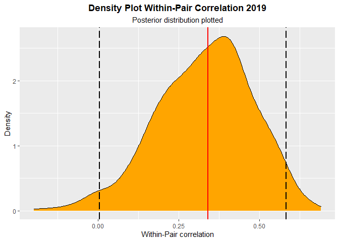<!-- -->

``` r
#male selection gradient
Male_sel_19<- posteriors1[,"traitrfit:traitMale.NestID"]/
  (sqrt(posteriors1[,"traitrfit:traitrfit.NestID"])*
     sqrt(posteriors1[,"traitMale:traitMale.NestID"]))
posterior.mode(Male_sel_19)
```

    ##      var1 
    ## 0.4587066

``` r
HPDinterval(Male_sel_19)
```

    ##            lower     upper
    ## var1 -0.08392302 0.6828655
    ## attr(,"Probability")
    ## [1] 0.95

``` r
male19<-as.data.frame(Male_sel_19)
describe_posterior(male19)
```

    ## Summary of Posterior Distribution
    ## 
    ## Parameter | Median |        95% CI |     pd |          ROPE | % in ROPE
    ## -----------------------------------------------------------------------
    ## var1      |   0.34 | [-0.10, 0.67] | 92.83% | [-0.10, 0.10] |    11.81%

``` r
rptt<-describe_posterior(male19)#data frame for CrI and median
rpt11<-as.data.frame(male19) #posterior plot
ggplot(rpt11, aes(x = var1)) +
  geom_density(fill = "orange") +
  geom_vline(xintercept = median(rptt$Median), color="red", size=1)+
   geom_vline(xintercept = (rptt$CI_low), color="black", size=1, linetype="longdash")+
  geom_vline(xintercept = (rptt$CI_high), color="black", size=1, linetype="longdash")+
  labs(y="Density", x="Male Selection Gradient")+
  ggtitle(label ="Density Plot Male Selection Gradient 2019",
          subtitle = "Posterior distribution plotted")+
  theme(plot.title = element_text(face = "bold", hjust=0.5), plot.subtitle=element_text(hjust=0.5))
```

<!-- -->

``` r
#female selection gradient
Female_sel_19<- posteriors1[,"traitrfit:traitFemale.NestID"]/
  (sqrt(posteriors1[,"traitrfit:traitrfit.NestID"])*
     sqrt(posteriors1[,"traitFemale:traitFemale.NestID"]))
posterior.mode(Female_sel_19)
```

    ##       var1 
    ## -0.2126791

``` r
HPDinterval(Female_sel_19)
```

    ##           lower     upper
    ## var1 -0.7292013 0.2356932
    ## attr(,"Probability")
    ## [1] 0.95

``` r
female19<-as.data.frame(Female_sel_19)
describe_posterior(female19)
```

    ## Summary of Posterior Distribution
    ## 
    ## Parameter | Median |        95% CI |     pd |          ROPE | % in ROPE
    ## -----------------------------------------------------------------------
    ## var1      |  -0.23 | [-0.69, 0.30] | 80.78% | [-0.10, 0.10] |    21.46%

``` r
rptt<-describe_posterior(female19)#data frame for CrI and median
rpt11<-as.data.frame(female19) #posterior plot
ggplot(rpt11, aes(x = var1)) +
  geom_density(fill = "orange") +
  geom_vline(xintercept = median(rptt$Median), color="red", size=1)+
   geom_vline(xintercept = (rptt$CI_low), color="black", size=1, linetype="longdash")+
  geom_vline(xintercept = (rptt$CI_high), color="black", size=1, linetype="longdash")+
  labs(y="Density", x="Female Selection Gradient")+
  ggtitle(label ="Density Plot Female Selection Gradient 2019",
          subtitle = "Posterior distribution plotted")+
  theme(plot.title = element_text(face = "bold", hjust=0.5), plot.subtitle=element_text(hjust=0.5))
```

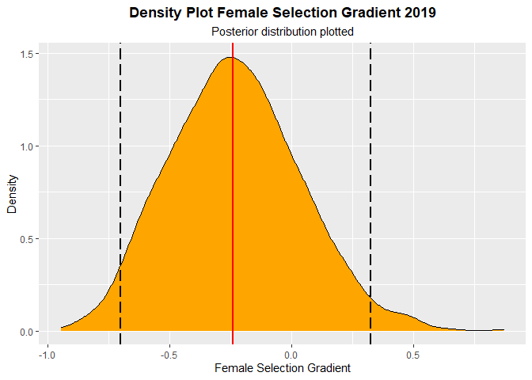<!-- -->

##### **Comparing 2018 and 2019**

``` r
#among
y2018a<-ifelse(pair.correlation_3<0.04291904,1,0)
sum(y2018a)
```

    ## [1] 579

``` r
y2018b<-ifelse(pair.correlation_3>0.04291904,1,0)
sum(y2018b)
```

    ## [1] 1221

``` r
y2019a<-ifelse(pair.correlation_4>(-0.334157 ),1,0)
sum(y2019a)
```

    ## [1] 507

``` r
y2019b<-ifelse(pair.correlation_4<(-0.334157 ),1,0)
sum(y2019b)
```

    ## [1] 1293

``` r
p<-(sum(y2018a)/1000)*(sum(y2019a)/1000)
p
```

    ## [1] 0.293553

``` r
#within
y2018w<-ifelse(residual.correlation_3>0.04291904,1,0)
sum(y2018w)
```

    ## [1] 1125

``` r
y2018x<-ifelse(residual.correlation_3<0.04291904,1,0)
sum(y2018x)
```

    ## [1] 675

``` r
y2019w<-ifelse(residual.correlation4<0.3588893,1,0)
sum(y2019w)
```

    ## [1] 940

``` r
y2019x<-ifelse(residual.correlation4>0.3588893,1,0)
sum(y2019x)
```

    ## [1] 860

``` r
p<-sum(y2018w)/1000*sum(y2019w)/1000
p
```

    ## [1] 1.0575

``` r
##compare sexes within years
m2018<-ifelse(Male_sel_18<0.09374586,1,0)
m2018b<-ifelse(Male_sel_18<0.09374586,0,1)
f2018<-ifelse(Female_sel_18>(-0.4853156),1,0)
f2018b<-ifelse(Female_sel_18>(-0.4853156),0,1)

sum(m2018)
```

    ## [1] 1078

``` r
sum(m2018b)
```

    ## [1] 722

``` r
sum(f2018)
```

    ## [1] 1779

``` r
sum(f2018b)
```

    ## [1] 21

``` r
p<-sum(m2018)/1000*sum(f2018)/1000
p
```

    ## [1] 1.917762

``` r
m2019<-ifelse(Male_sel_19>-0.2069016,1,0)
m2019b<-ifelse(Male_sel_19>-0.2069016,0,1)
f2019<-ifelse(Female_sel_19<0.08781835,1,0)
f2019b<-ifelse(Female_sel_19<0.08781835,0,1)

sum(m2019)
```

    ## [1] 1782

``` r
sum(m2019b)
```

    ## [1] 18

``` r
sum(f2019)
```

    ## [1] 1600

``` r
sum(f2019b)
```

    ## [1] 200

``` r
p<-sum(m2019)/1000*sum(f2019)/1000
p
```

    ## [1] 2.8512

``` r
##compare within sex across years
#females
f2018<-ifelse(Female_sel_18>(-0.2069016),1,0)
f2018b<-ifelse(Female_sel_18>(-0.2069016),0,1)
f2019<-ifelse(Female_sel_19<0.09374586,1,0)
f2019b<-ifelse(Female_sel_19<0.09374586,0,1)

sum(f2018)
```

    ## [1] 1726

``` r
sum(f2018b)
```

    ## [1] 74

``` r
sum(f2019)
```

    ## [1] 1603

``` r
sum(f2019b)
```

    ## [1] 197

``` r
p<-sum(f2018)/1000*sum(f2019)/1000
p
```

    ## [1] 2.766778

``` r
#males
m2018<-ifelse(Male_sel_18<(0.08781835),1,0)
m2018b<-ifelse(Male_sel_18<(0.08781835),0,1)
m2019<-ifelse(Male_sel_19>(-0.4853156),1,0)
m2019b<-ifelse(Male_sel_19>(-0.4853156),0,1)

sum(m2018)
```

    ## [1] 1058

``` r
sum(m2018b)
```

    ## [1] 742

``` r
sum(m2019)
```

    ## [1] 1799

``` r
sum(m2019b)
```

    ## [1] 1

``` r
p<-sum(m2018)/1000*sum(m2019)/1000
p
```

    ## [1] 1.903342

##### **2018/2019 3 trait model**

``` r
#pooled years----

require(readr)
require(tidyr)
require(MCMCglmm)
#data
data2018<-read.csv("C:/Users/nickg/OneDrive/Desktop/R projects/krmp_nest-defense/data/data_2018.csv")
data2019<-read.csv("C:/Users/nickg/OneDrive/Desktop/R projects/krmp_nest-defense/data/data_2019.csv")


require(dplyr)
data2018<-data2018%>%mutate(Site=SiteID)
require(tidyr)
data2018<-data2018%>% 
  unite(SiteID_Series,c("SiteID", "Year"))
data2018<-data2018%>%mutate(Year="2018")


data2019<-data2019%>%mutate(Site=SiteID)
data2019<-data2019%>% 
  unite(SiteID_Series,c("SiteID", "Year"))
data2019<-data2019%>%mutate(Year="2019")


data_2<-full_join(data2018, data2019) #join datasets
data_2$Male<-log(data_2$male_raw+1)*-1 #log transform
data_2$Female<-log(data_2$female_raw+1)*-1 #log transform
#prior for three traits- from Houslay tutorial
prior_E_B_fit_1px = list(R = list(V = diag(c(1,1,0.0001),3,3), nu = 1.002, fix = 3),
                         G = list(G1 = list(V = diag(3), nu = 3,
                                            alpha.mu = rep(0,3),
                                            alpha.V = diag(25^2,3,3))))
#set residual variance for fitness near 0
prior_E_B_fit_1px$R$V[3,3]<-0.0001

#2018/2019 3 trait model ----
mod.122 <- MCMCglmm(cbind(Male, Female, rfit) ~ (trait-1),  
                   random = ~us(trait):SiteID_Series ,
                   rcov = ~us(trait):units, 
                   family = c("gaussian", "gaussian", "gaussian"),
                   data=data_2, 
                   prior = prior_E_B_fit_1px, 
                   verbose = FALSE,
                   nitt=990000,thin=500,burnin=90000
)

plot(mod.122)
```

<!-- --><!-- --><!-- --><!-- -->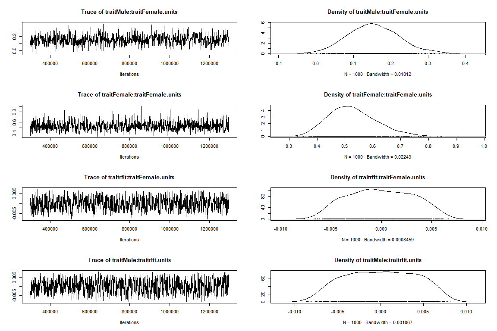<!-- --><!-- -->

``` r
summary(mod.122)
```

    ## 
    ##  Iterations = 90001:989501
    ##  Thinning interval  = 500
    ##  Sample size  = 1800 
    ## 
    ##  DIC: 236.0099 
    ## 
    ##  G-structure:  ~us(trait):SiteID_Series
    ## 
    ##                                       post.mean l-95% CI u-95% CI eff.samp
    ## traitMale:traitMale.SiteID_Series       0.60057  0.28514  1.04570   1652.7
    ## traitFemale:traitMale.SiteID_Series    -0.11458 -0.29697  0.07553   1948.2
    ## traitrfit:traitMale.SiteID_Series       0.26389 -0.12485  0.63779   1800.0
    ## traitMale:traitFemale.SiteID_Series    -0.11458 -0.29697  0.07553   1948.2
    ## traitFemale:traitFemale.SiteID_Series   0.25581  0.06621  0.48380   1800.0
    ## traitrfit:traitFemale.SiteID_Series    -0.06349 -0.30586  0.21439   1800.0
    ## traitMale:traitrfit.SiteID_Series       0.26389 -0.12485  0.63779   1800.0
    ## traitFemale:traitrfit.SiteID_Series    -0.06349 -0.30586  0.21439   1800.0
    ## traitrfit:traitrfit.SiteID_Series       2.02180  1.34112  2.94417    869.7
    ## 
    ##  R-structure:  ~us(trait):units
    ## 
    ##                                post.mean  l-95% CI u-95% CI eff.samp
    ## traitMale:traitMale.units      7.139e-01  0.510522 0.936968     1800
    ## traitFemale:traitMale.units    1.507e-01  0.011136 0.295957     1925
    ## traitrfit:traitMale.units      2.171e-05 -0.006460 0.006818     1285
    ## traitMale:traitFemale.units    1.507e-01  0.011136 0.295957     1925
    ## traitFemale:traitFemale.units  5.289e-01  0.364937 0.688304     1800
    ## traitrfit:traitFemale.units   -3.473e-05 -0.005629 0.005431     1417
    ## traitMale:traitrfit.units      2.171e-05 -0.006460 0.006818     1285
    ## traitFemale:traitrfit.units   -3.473e-05 -0.005629 0.005431     1417
    ## traitrfit:traitrfit.units      1.000e-04  0.000100 0.000100        0
    ## 
    ##  Location effects: cbind(Male, Female, rfit) ~ (trait - 1) 
    ## 
    ##             post.mean l-95% CI u-95% CI eff.samp  pMCMC    
    ## traitMale     -2.3765  -2.6388  -2.1053     1800 <6e-04 ***
    ## traitFemale   -2.6513  -2.8332  -2.4577     1660 <6e-04 ***
    ## traitrfit      0.7339   0.3536   1.1069     1642 <6e-04 ***
    ## ---
    ## Signif. codes:  0 '***' 0.001 '**' 0.01 '*' 0.05 '.' 0.1 ' ' 1

``` r
#auto-correlation
autocorr.diag(mod.122$VCV)
```

    ##           traitMale:traitMale.SiteID_Series traitFemale:traitMale.SiteID_Series
    ## Lag 0                           1.000000000                         1.000000000
    ## Lag 500                         0.022646250                         0.018516143
    ## Lag 2500                        0.016873016                         0.027010183
    ## Lag 5000                        0.008247662                        -0.003847017
    ## Lag 25000                      -0.009630781                        -0.017691861
    ##           traitrfit:traitMale.SiteID_Series traitMale:traitFemale.SiteID_Series
    ## Lag 0                           1.000000000                         1.000000000
    ## Lag 500                         0.018561052                         0.018516143
    ## Lag 2500                        0.012158253                         0.027010183
    ## Lag 5000                        0.007557368                        -0.003847017
    ## Lag 25000                       0.010305965                        -0.017691861
    ##           traitFemale:traitFemale.SiteID_Series
    ## Lag 0                              1.0000000000
    ## Lag 500                           -0.0106826292
    ## Lag 2500                          -0.0070241439
    ## Lag 5000                          -0.0332918654
    ## Lag 25000                         -0.0003938133
    ##           traitrfit:traitFemale.SiteID_Series traitMale:traitrfit.SiteID_Series
    ## Lag 0                             1.000000000                       1.000000000
    ## Lag 500                          -0.022771086                       0.018561052
    ## Lag 2500                         -0.009162853                       0.012158253
    ## Lag 5000                          0.030903060                       0.007557368
    ## Lag 25000                         0.001380425                       0.010305965
    ##           traitFemale:traitrfit.SiteID_Series traitrfit:traitrfit.SiteID_Series
    ## Lag 0                             1.000000000                       1.000000000
    ## Lag 500                          -0.022771086                       0.024010022
    ## Lag 2500                         -0.009162853                       0.074576395
    ## Lag 5000                          0.030903060                       0.009986120
    ## Lag 25000                         0.001380425                      -0.006241779
    ##           traitMale:traitMale.units traitFemale:traitMale.units
    ## Lag 0                   1.000000000                  1.00000000
    ## Lag 500                -0.006887788                 -0.02689619
    ## Lag 2500                0.013005352                  0.04764788
    ## Lag 5000               -0.050507172                  0.02180172
    ## Lag 25000               0.001903627                 -0.02851998
    ##           traitrfit:traitMale.units traitMale:traitFemale.units
    ## Lag 0                   1.000000000                  1.00000000
    ## Lag 500                 0.211391244                 -0.02689619
    ## Lag 2500               -0.026218626                  0.04764788
    ## Lag 5000               -0.009473918                  0.02180172
    ## Lag 25000               0.026326956                 -0.02851998
    ##           traitFemale:traitFemale.units traitrfit:traitFemale.units
    ## Lag 0                       1.000000000                  1.00000000
    ## Lag 500                     0.017194554                  0.11875011
    ## Lag 2500                    0.008008636                 -0.05139384
    ## Lag 5000                    0.023127528                 -0.05043282
    ## Lag 25000                  -0.005395888                 -0.01715055
    ##           traitMale:traitrfit.units traitFemale:traitrfit.units
    ## Lag 0                   1.000000000                  1.00000000
    ## Lag 500                 0.211391244                  0.11875011
    ## Lag 2500               -0.026218626                 -0.05139384
    ## Lag 5000               -0.009473918                 -0.05043282
    ## Lag 25000               0.026326956                 -0.01715055
    ##           traitrfit:traitrfit.units
    ## Lag 0                           NaN
    ## Lag 500                         NaN
    ## Lag 2500                        NaN
    ## Lag 5000                        NaN
    ## Lag 25000                       NaN

``` r
autocorr(mod.122$Sol)
```

    ## , , traitMale
    ## 
    ##              traitMale  traitFemale   traitrfit
    ## Lag 0      1.000000000 -0.036402703  0.20605996
    ## Lag 500   -0.032997121  0.010194677 -0.01632654
    ## Lag 2500  -0.002796034 -0.028313834  0.00483087
    ## Lag 5000   0.027617918 -0.007726388  0.02462384
    ## Lag 25000 -0.016148223 -0.004230225  0.02534535
    ## 
    ## , , traitFemale
    ## 
    ##              traitMale  traitFemale    traitrfit
    ## Lag 0     -0.036402703  1.000000000 -0.092868931
    ## Lag 500   -0.012938804  0.040142780  0.004218786
    ## Lag 2500   0.005914482 -0.004723751 -0.038915722
    ## Lag 5000  -0.028532477  0.024945797 -0.010729631
    ## Lag 25000 -0.052047543  0.016156203 -0.051065241
    ## 
    ## , , traitrfit
    ## 
    ##               traitMale  traitFemale   traitrfit
    ## Lag 0      0.2060599641 -0.092868931  1.00000000
    ## Lag 500   -0.0088971956  0.042263939  0.04570278
    ## Lag 2500   0.0008084679  0.008117159 -0.02920836
    ## Lag 5000   0.0021098719 -0.006284550  0.01999096
    ## Lag 25000  0.0517472009 -0.019942417  0.02529816

##### **Among and within-pair correlations and selection gradients– 2018/2019 3 trait model**

``` r
# posteriors
require(bayestestR)
require(ggplot2)
posteriors_3<-as.mcmc(mod.122$VCV)


# among-pair correlations
pair.correlation_33<-posteriors_3[,"traitFemale:traitMale.SiteID_Series"]/
  sqrt(posteriors_3[,"traitFemale:traitFemale.SiteID_Series"]*
         posteriors_3[,"traitMale:traitMale.SiteID_Series"])

posterior.mode(pair.correlation_33)
```

    ##       var1 
    ## -0.3605427

``` r
HPDinterval(pair.correlation_33)
```

    ##           lower    upper
    ## var1 -0.7436908 0.181684
    ## attr(,"Probability")
    ## [1] 0.95

``` r
pair<-as.data.frame(pair.correlation_33)
describe_posterior(pair)
```

    ## Summary of Posterior Distribution
    ## 
    ## Parameter | Median |        95% CI |     pd |          ROPE | % in ROPE
    ## -----------------------------------------------------------------------
    ## var1      |  -0.32 | [-0.76, 0.17] | 90.50% | [-0.10, 0.10] |    14.85%

``` r
rptt<-describe_posterior(pair)#data frame for CrI and median
rpt11<-as.data.frame(pair) #posterior plot
ggplot(rpt11, aes(x = var1)) +
  geom_density(fill = "orange") +
  geom_vline(xintercept = median(rptt$Median), color="red", size=1)+
   geom_vline(xintercept = (rptt$CI_low), color="black", size=1, linetype="longdash")+
  geom_vline(xintercept = (rptt$CI_high), color="black", size=1, linetype="longdash")+
  labs(y="Density", x="Among-Pair correlation")+
  ggtitle(label ="Density Plot Among-Pair Correlation 2018/2019",
          subtitle = "Posterior distribution plotted")+
  theme(plot.title = element_text(face = "bold", hjust=0.5), plot.subtitle=element_text(hjust=0.5))
```

<!-- -->

``` r
# within-pair correlations (residuals)
residual.correlation_33<-posteriors_3[,"traitFemale:traitMale.units"]/
  sqrt(posteriors_3[,"traitFemale:traitFemale.units"]*
         posteriors_3[,"traitMale:traitMale.units"])

posterior.mode(residual.correlation_33)
```

    ##      var1 
    ## 0.2706948

``` r
HPDinterval(residual.correlation_33)
```

    ##           lower     upper
    ## var1 0.03027768 0.4415552
    ## attr(,"Probability")
    ## [1] 0.95

``` r
wpair<-as.data.frame(residual.correlation_33)
describe_posterior(wpair)
```

    ## Summary of Posterior Distribution
    ## 
    ## Parameter | Median |       95% CI |     pd |          ROPE | % in ROPE
    ## ----------------------------------------------------------------------
    ## var1      |   0.25 | [0.03, 0.45] | 98.67% | [-0.10, 0.10] |     6.55%

``` r
rptt<-describe_posterior(wpair)#data frame for CrI and median
rpt11<-as.data.frame(wpair) #posterior plot
ggplot(rpt11, aes(x = var1)) +
  geom_density(fill = "orange") +
  geom_vline(xintercept = median(rptt$Median), color="red", size=1)+
   geom_vline(xintercept = (rptt$CI_low), color="black", size=1, linetype="longdash")+
  geom_vline(xintercept = (rptt$CI_high), color="black", size=1, linetype="longdash")+
  labs(y="Density", x="Within-Pair correlation")+
  ggtitle(label ="Density Plot Within-Pair Correlation 2018/2019",
          subtitle = "Posterior distribution plotted")+
  theme(plot.title = element_text(face = "bold", hjust=0.5), plot.subtitle=element_text(hjust=0.5))
```

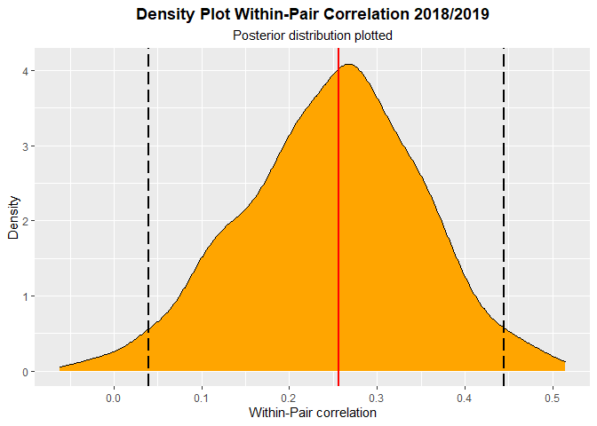<!-- -->

``` r
#male selection gradient
Male_sel<- posteriors_3[,"traitrfit:traitMale.SiteID_Series"]/
  (sqrt(posteriors_3[,"traitrfit:traitrfit.SiteID_Series"])*
     sqrt(posteriors_3[,"traitMale:traitMale.SiteID_Series"]))
posterior.mode(Male_sel)
```

    ##      var1 
    ## 0.2632989

``` r
HPDinterval(Male_sel)
```

    ##            lower     upper
    ## var1 -0.06014589 0.5462047
    ## attr(,"Probability")
    ## [1] 0.95

``` r
male<-as.data.frame(Male_sel)
describe_posterior(male)
```

    ## Summary of Posterior Distribution
    ## 
    ## Parameter | Median |        95% CI |     pd |          ROPE | % in ROPE
    ## -----------------------------------------------------------------------
    ## var1      |   0.25 | [-0.08, 0.53] | 92.83% | [-0.10, 0.10] |    17.31%

``` r
rptt<-describe_posterior(male)#data frame for CrI and median
rpt11<-as.data.frame(male) #posterior plot
ggplot(rpt11, aes(x = var1)) +
  geom_density(fill = "orange") +
  geom_vline(xintercept = median(rptt$Median), color="red", size=1)+
   geom_vline(xintercept = (rptt$CI_low), color="black", size=1, linetype="longdash")+
  geom_vline(xintercept = (rptt$CI_high), color="black", size=1, linetype="longdash")+
  labs(y="Density", x="Male Selection Gradient")+
  ggtitle(label ="Density Plot Male Selection Gradient 2018/2019",
          subtitle = "Posterior distribution plotted")+
  theme(plot.title = element_text(face = "bold", hjust=0.5), plot.subtitle=element_text(hjust=0.5))
```

<!-- -->

``` r
#female selection gradient
Female_sel<- posteriors_3[,"traitrfit:traitFemale.SiteID_Series"]/
  (sqrt(posteriors_3[,"traitrfit:traitrfit.SiteID_Series"])*
     sqrt(posteriors_3[,"traitFemale:traitFemale.SiteID_Series"]))
posterior.mode(Female_sel)
```

    ##        var1 
    ## -0.09463047

``` r
HPDinterval(Female_sel)
```

    ##           lower     upper
    ## var1 -0.4373414 0.2772738
    ## attr(,"Probability")
    ## [1] 0.95

``` r
female<-as.data.frame(Female_sel)
describe_posterior(female)
```

    ## Summary of Posterior Distribution
    ## 
    ## Parameter | Median |        95% CI |     pd |          ROPE | % in ROPE
    ## -----------------------------------------------------------------------
    ## var1      |  -0.10 | [-0.46, 0.27] | 69.17% | [-0.10, 0.10] |    38.13%

``` r
rptt<-describe_posterior(female)#data frame for CrI and median
rpt11<-as.data.frame(female) #posterior plot
ggplot(rpt11, aes(x = var1)) +
  geom_density(fill = "orange") +
  geom_vline(xintercept = median(rptt$Median), color="red", size=1)+
   geom_vline(xintercept = (rptt$CI_low), color="black", size=1, linetype="longdash")+
  geom_vline(xintercept = (rptt$CI_high), color="black", size=1, linetype="longdash")+
  labs(y="Density", x="Female Selection Gradient")+
  ggtitle(label ="Density Plot Female Selection Gradient 2018/2019",
          subtitle = "Posterior distribution plotted")+
  theme(plot.title = element_text(face = "bold", hjust=0.5), plot.subtitle=element_text(hjust=0.5))
```

<!-- -->

##### **Correlation Plot**

``` r
### create data frame and within-subject center for plot

require(tidyr)

df_mcmc_cors <- data_frame(Traits = c("Among-pair (2018)",    
                                      "Within-pair (2018)",
                                      "Among-pair (2019)",
                                      "Within-pair (2019)",
                                      "Among-pair (Pooled)",
                                      "Within-pair (Pooled)"
                                        ),
                           Estimate = c(posterior.mode(pair.correlation_3),
                                        posterior.mode(residual.correlation_3),
                                        posterior.mode(pair.correlation_4),
                                        posterior.mode(residual.correlation4),
                                        posterior.mode(pair.correlation_33),
                                        posterior.mode(residual.correlation_33)),
                           Lower = c(HPDinterval(pair.correlation_3)[,"lower"],
                                     HPDinterval(residual.correlation_3)[,"lower"],
                                     HPDinterval(pair.correlation_4)[,"lower"],
                                     HPDinterval(residual.correlation4)[,"lower"],
                                     HPDinterval(pair.correlation_33)[,"lower"],
                                     HPDinterval(residual.correlation_33)[,"lower"]
                                     ),
                           Upper = c(HPDinterval(pair.correlation_3)[,"upper"],
                                     HPDinterval(residual.correlation_3)[,"upper"],
                                     HPDinterval(pair.correlation_4)[,"upper"],
                                     HPDinterval(residual.correlation4)[,"upper"],
                                     HPDinterval(pair.correlation_33)[,"upper"],
                                     HPDinterval(residual.correlation_33)[,"upper"]
                                     ))


correlation1<-ggplot(df_mcmc_cors, aes(x = Traits, y = Estimate)) +
  geom_pointrange(aes(ymin = Lower,
                      ymax = Upper)) +
  geom_hline(yintercept = 0,
             linetype = "dotted",alpha = 0.35, size=0.3) +
  labs(x = "",
       y = "Correlation (Estimate +/- 95% CIs)") +
  ylim(-1,1) +
  coord_flip() + theme_classic()


df_mcmc_cors1 <- data_frame(Traits = c("Female (2018)",    
                                      "Male (2018)",
                                      "Female (2019)",
                                      "Male (2019)",
                                      "Female (Pooled)",
                                      "Male (Pooled)"
),
Estimate = c(posterior.mode(Female_sel_18),
             posterior.mode(Male_sel_18),
             posterior.mode(Female_sel_19),
             posterior.mode(Male_sel_19),
             posterior.mode(Female_sel),
             posterior.mode(Male_sel)
             ),
Lower = c(HPDinterval(Female_sel_18)[,"lower"],
          HPDinterval(Male_sel_18)[,"lower"],
          HPDinterval(Female_sel_19)[,"lower"],
          HPDinterval(Male_sel_19)[,"lower"],
          HPDinterval(Female_sel)[,"lower"],
          HPDinterval(Male_sel)[,"lower"]
),
Upper = c(HPDinterval(Female_sel_18)[,"upper"],
          HPDinterval(Male_sel_18)[,"upper"],
          HPDinterval(Female_sel_19)[,"upper"],
          HPDinterval(Male_sel_19)[,"upper"],
          HPDinterval(Female_sel)[,"upper"],
          HPDinterval(Male_sel)[,"upper"]
          ))


correlation2<-ggplot(df_mcmc_cors1, aes(x = Traits, y = Estimate)) +
  geom_pointrange(aes(ymin = Lower,
                      ymax = Upper)) +
  geom_hline(yintercept = 0,
             linetype = "dotted",alpha = 0.35, size=0.3) +
  labs(x = "",
       y = "Correlation (Estimate +/- 95% CIs)") +
  ylim(-1,1) +
  coord_flip() + theme_classic()

require(cowplot)
plot_grid(correlation1,correlation2, labels = c("A.", "B."), nrow = 1)
```

<!-- -->
