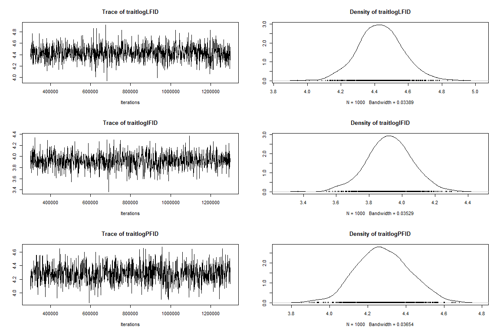
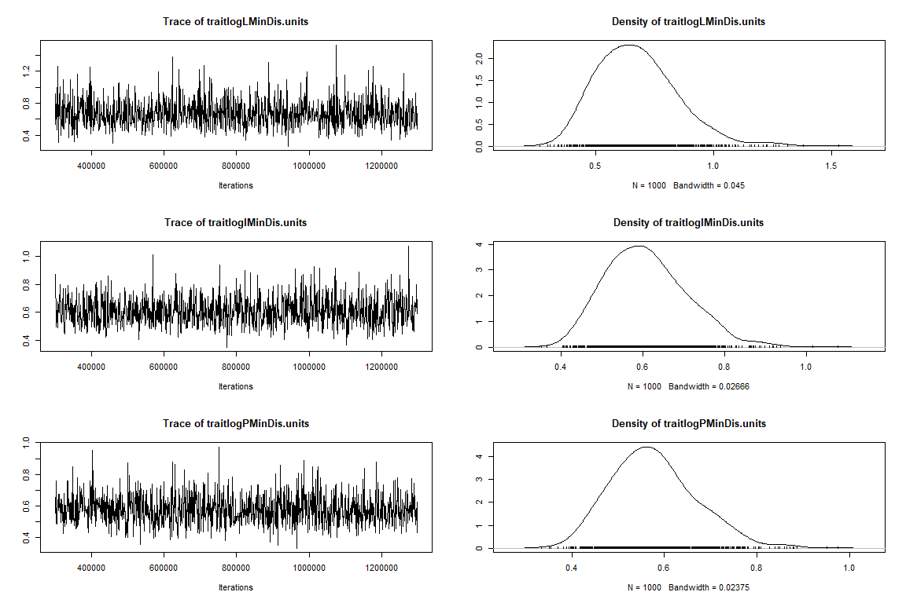
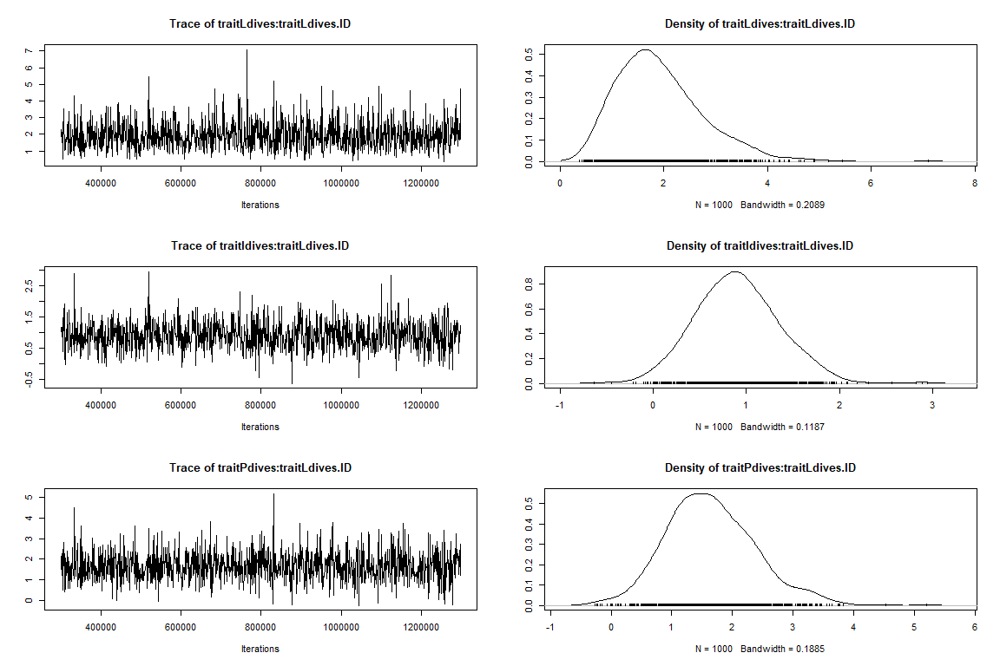
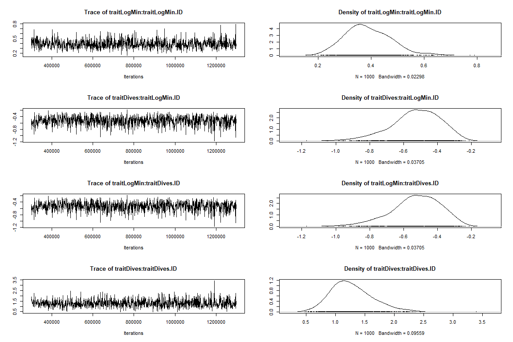
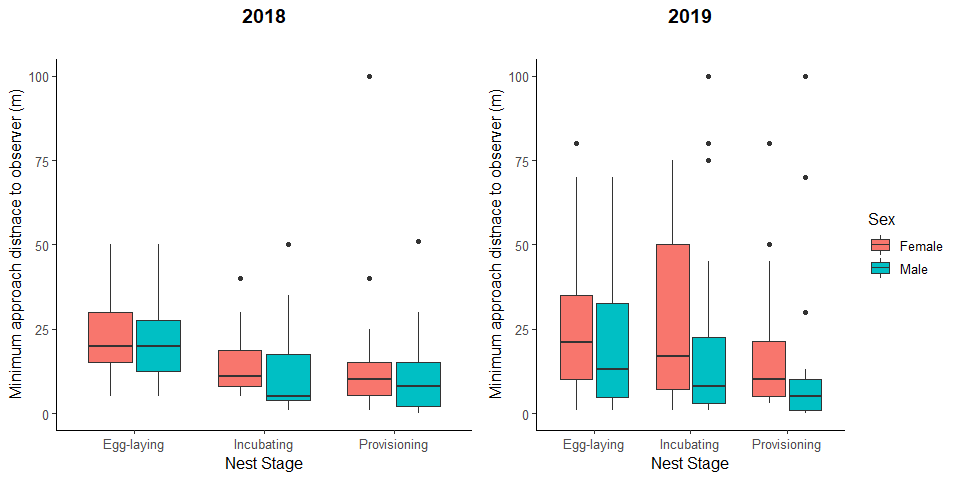
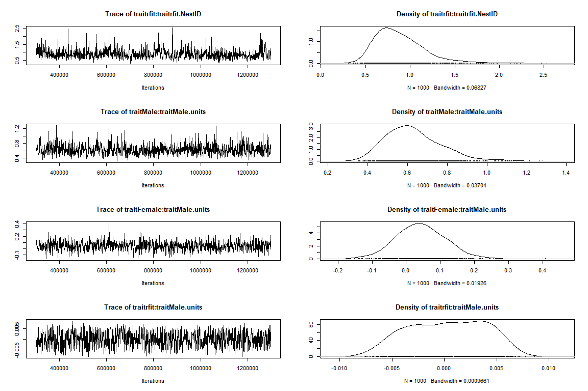
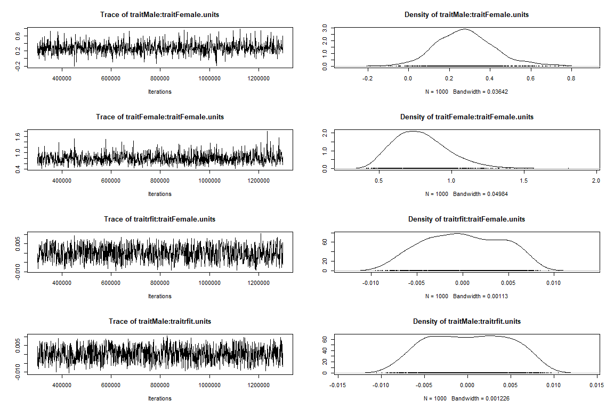

R Script: Does fluctuating selection maintain variation in nest defense
behavior in Arctic peregrine falcons (Falco peregrinus tundrius)?
================

``` r
#required packages
require(readr)
require(lme4)
require(MCMCglmm)
require(dplyr)
require(ggplot2)
require(rlang)
require(tidyverse)
require(rlang)
require(ggeffects)
require(arm)
require(bayestestR)

# Set wd
setwd("C:/Users/nickg/OneDrive/Desktop/R projects/krmp_nest-defense")
#load data
data<-read.csv("C:/Users/nickg/OneDrive/Desktop/R projects/krmp_nest-defense/data/nest_defense_test_final.csv")
names(data)
```

##### **Make Year,ID, and ID_Series factors. Inspect raw data and transform.**

``` r
data$Year2<-as.factor(data$Year2)
data$ID_Series<-as.factor(data$ID_Series)
data$ID<-as.factor(data$ID)

summary(data$MinDisRaw)
```

    ##    Min. 1st Qu.  Median    Mean 3rd Qu.    Max. 
    ##    0.10    5.00   15.00   27.72   25.00  600.00

``` r
data$MinDis100<-ifelse(data$MinDisRaw>100,100,data$MinDisRaw)
data$LogMin<-log(data$MinDis100+1)
```

##### **Minimum distance is capped at 100 meters (i.e., \>100 is not a response)**

``` r
data2<-subset(data, data$MinDisRaw<=100)
hist(data2$MinDisRaw)
```

<!-- -->

``` r
data2$logMin<-log(data2$MinDisRaw+1)
hist(data2$logMin)
```

<!-- -->

### **1. Sources of variation in nest defense**

-   *Univariate analyses of each of the three measures to i) evaluate if
    all three behaviors are representations of nest defense, and ii)
    choose best measure to use in main text.*

#### **Univariate model– Log-transformed minimum distance**

``` r
#Minimum distance---- 
require(lme4)
m1<-lmer(logMin~ Sex + NestStage + Year2+ (1|ID)+(1|Observer) ,
         data=data2) 

#summary
summary(m1)
```

    ## Linear mixed model fit by REML ['lmerMod']
    ## Formula: logMin ~ Sex + NestStage + Year2 + (1 | ID) + (1 | Observer)
    ##    Data: data2
    ## 
    ## REML criterion at convergence: 883.8
    ## 
    ## Scaled residuals: 
    ##      Min       1Q   Median       3Q      Max 
    ## -2.46859 -0.64241 -0.00094  0.59131  2.53522 
    ## 
    ## Random effects:
    ##  Groups   Name        Variance Std.Dev.
    ##  ID       (Intercept) 0.29899  0.5468  
    ##  Observer (Intercept) 0.03097  0.1760  
    ##  Residual             0.52508  0.7246  
    ## Number of obs: 351, groups:  ID, 103; Observer, 8
    ## 
    ## Fixed effects:
    ##                        Estimate Std. Error t value
    ## (Intercept)             2.97079    0.15338  19.369
    ## SexMale                -0.30939    0.14235  -2.173
    ## NestStage2Incubating   -0.24865    0.11971  -2.077
    ## NestStage3Provisioning -0.56368    0.12764  -4.416
    ## Year21                  0.08779    0.12461   0.704
    ## 
    ## Correlation of Fixed Effects:
    ##             (Intr) SexMal NstS2I NstS3P
    ## SexMale     -0.437                     
    ## NstStg2Incb -0.453  0.038              
    ## NstStg3Prvs -0.464  0.040  0.622       
    ## Year21      -0.409 -0.014  0.008  0.166

``` r
#model check
plot(m1)
```

<!-- -->

``` r
hist(resid(m1)) # residuals
```

<!-- -->

``` r
lattice::qqmath(m1) #normality of errors
```

<!-- -->

##### **Simulate posterior distribution–Log-transformed minimum distance**

``` r
sm1<-sim(m1)
smfixef=sm1@fixef
smranef=sm1@ranef
smfixef=as.mcmc(smfixef)
posterior.mode(smfixef)
```

    ##            (Intercept)                SexMale   NestStage2Incubating 
    ##             2.89717598            -0.29371164            -0.28069348 
    ## NestStage3Provisioning                 Year21 
    ##            -0.57754646             0.08645601

``` r
HPDinterval(smfixef)
```

    ##                              lower        upper
    ## (Intercept)             2.67829809  3.204728692
    ## SexMale                -0.52214993 -0.000772569
    ## NestStage2Incubating   -0.47356479 -0.060410994
    ## NestStage3Provisioning -0.81966028 -0.361638711
    ## Year21                 -0.08904878  0.371536955
    ## attr(,"Probability")
    ## [1] 0.95

``` r
bID<-sm1@ranef$ID
bvar<-as.vector(apply(bID, 1, var)) ##between individual variance posterior distribution
bvar<-as.mcmc(bvar)
posterior.mode(bvar )## mode of the distribution
```

    ##      var1 
    ## 0.2973085

``` r
HPDinterval(bvar)
```

    ##          lower     upper
    ## var1 0.2289237 0.3731035
    ## attr(,"Probability")
    ## [1] 0.95

``` r
bObs<-sm1@ranef$Observer
ObsVar<-as.vector(apply(bObs, 1, var)) ##between individual variance posterior distribution
ObsVar<-as.mcmc(ObsVar)
posterior.mode(ObsVar )## mode of the distribution
```

    ##       var1 
    ## 0.02234869

``` r
HPDinterval(ObsVar)
```

    ##           lower      upper
    ## var1 0.01095548 0.06091907
    ## attr(,"Probability")
    ## [1] 0.95

``` r
rvar<-sm1@sigma^2
rvar<-as.mcmc(rvar)
posterior.mode(rvar)
```

    ##      var1 
    ## 0.4971504

``` r
HPDinterval(rvar)
```

    ##          lower     upper
    ## var1 0.4573656 0.6183239
    ## attr(,"Probability")
    ## [1] 0.95

##### **Repeatability–Log-transformed minimum distance**

``` r
r <- bvar/(bvar + rvar) ###individual
posterior.mode(r)
```

    ##      var1 
    ## 0.3534376

``` r
HPDinterval(r)
```

    ##          lower     upper
    ## var1 0.3019883 0.4227382
    ## attr(,"Probability")
    ## [1] 0.95

##### **Univariate model– Log-transformed truncated minimum distance to the observer (i.e., \>100m is not response)**

``` r
###min distance (truncated to max of 100)----
data$MinDis100<-ifelse(data$MinDisRaw>100,100,data$MinDisRaw)
data$logMinDis100<-log(data$MinDis100+1)
hist(data$logMinDis100)
```

<!-- -->

``` r
m1.1<-lmer(logMinDis100~ Sex + NestStage + Year2+ (1|ID)+(1|Observer) ,
         data=data) 
#summary
summary(m1.1)
```

    ## Linear mixed model fit by REML ['lmerMod']
    ## Formula: logMinDis100 ~ Sex + NestStage + Year2 + (1 | ID) + (1 | Observer)
    ##    Data: data
    ## 
    ## REML criterion at convergence: 986.4
    ## 
    ## Scaled residuals: 
    ##     Min      1Q  Median      3Q     Max 
    ## -2.7813 -0.6582 -0.0389  0.6082  2.3707 
    ## 
    ## Random effects:
    ##  Groups   Name        Variance Std.Dev.
    ##  ID       (Intercept) 0.33362  0.5776  
    ##  Observer (Intercept) 0.07101  0.2665  
    ##  Residual             0.61580  0.7847  
    ## Number of obs: 369, groups:  ID, 108; Observer, 8
    ## 
    ## Fixed effects:
    ##                        Estimate Std. Error t value
    ## (Intercept)              3.0078     0.1764  17.054
    ## SexMale                 -0.1685     0.1478  -1.140
    ## NestStage2Incubating    -0.3290     0.1245  -2.642
    ## NestStage3Provisioning  -0.5716     0.1349  -4.236
    ## Year21                   0.1734     0.1367   1.268
    ## 
    ## Correlation of Fixed Effects:
    ##             (Intr) SexMal NstS2I NstS3P
    ## SexMale     -0.400                     
    ## NstStg2Incb -0.405  0.036              
    ## NstStg3Prvs -0.411  0.030  0.604       
    ## Year21      -0.386 -0.022  0.033  0.203

``` r
#model check
plot(m1.1)
```

<!-- -->

``` r
hist(resid(m1.1)) # residuals
```

<!-- -->

``` r
lattice::qqmath(m1.1) #normality of errors
```

<!-- -->

##### **Simulate posterior distribution–Log-transformed truncated minimum distance to the observer (i.e., \>100m is not response)**

``` r
sm1<-sim(m1.1)
smfixef=sm1@fixef
smranef=sm1@ranef
smfixef=as.mcmc(smfixef)
posterior.mode(smfixef)
```

    ##            (Intercept)                SexMale   NestStage2Incubating 
    ##              2.9696132             -0.1977570             -0.2780958 
    ## NestStage3Provisioning                 Year21 
    ##             -0.5291595              0.1037328

``` r
HPDinterval(smfixef)
```

    ##                              lower       upper
    ## (Intercept)             2.62216238  3.33796733
    ## SexMale                -0.48840287  0.06838095
    ## NestStage2Incubating   -0.55852170 -0.11144929
    ## NestStage3Provisioning -0.91778865 -0.34611371
    ## Year21                 -0.08761815  0.41085644
    ## attr(,"Probability")
    ## [1] 0.95

``` r
bID<-sm1@ranef$ID
bvar<-as.vector(apply(bID, 1, var)) ##between individual variance posterior distribution
bvar<-as.mcmc(bvar)
posterior.mode(bvar )## mode of the distribution
```

    ##      var1 
    ## 0.3116095

``` r
HPDinterval(bvar)
```

    ##          lower    upper
    ## var1 0.2582563 0.415859
    ## attr(,"Probability")
    ## [1] 0.95

``` r
bObs<-sm1@ranef$Observer
ObsVar<-as.vector(apply(bObs, 1, var)) ##between individual variance posterior distribution
ObsVar<-as.mcmc(ObsVar)
posterior.mode(ObsVar )## mode of the distribution
```

    ##       var1 
    ## 0.07303963

``` r
HPDinterval(ObsVar)
```

    ##           lower     upper
    ## var1 0.02016159 0.1183605
    ## attr(,"Probability")
    ## [1] 0.95

``` r
rvar<-sm1@sigma^2
rvar<-as.mcmc(rvar)
posterior.mode(rvar)
```

    ##      var1 
    ## 0.6132492

``` r
HPDinterval(rvar)
```

    ##          lower     upper
    ## var1 0.5456612 0.7205255
    ## attr(,"Probability")
    ## [1] 0.95

##### **Repeatability–Log-transformed truncated minimum distance to the observer (i.e., \>100m is not response)**

``` r
r <- bvar/(bvar + rvar)        ###individual
posterior.mode(r)
```

    ##      var1 
    ## 0.3565981

``` r
HPDinterval(r)
```

    ##          lower     upper
    ## var1 0.3037555 0.4058026
    ## attr(,"Probability")
    ## [1] 0.95

#### **Univariate model– Number of Stoops**

``` r
###Number of stoops----
#names(data)
m2<-glmer(Dives~ Sex + NestStage + Year2+ (1|ID)+ (1|Observer) ,
         data=data, family="poisson") 
#summary
summary(m2)
```

    ## Generalized linear mixed model fit by maximum likelihood (Laplace
    ##   Approximation) [glmerMod]
    ##  Family: poisson  ( log )
    ## Formula: Dives ~ Sex + NestStage + Year2 + (1 | ID) + (1 | Observer)
    ##    Data: data
    ## 
    ##      AIC      BIC   logLik deviance df.resid 
    ##   2510.4   2537.7  -1248.2   2496.4      362 
    ## 
    ## Scaled residuals: 
    ##     Min      1Q  Median      3Q     Max 
    ## -3.5774 -1.3142 -0.5969  0.8893  6.7682 
    ## 
    ## Random effects:
    ##  Groups   Name        Variance Std.Dev.
    ##  ID       (Intercept) 1.4901   1.2207  
    ##  Observer (Intercept) 0.2758   0.5252  
    ## Number of obs: 369, groups:  ID, 108; Observer, 8
    ## 
    ## Fixed effects:
    ##                        Estimate Std. Error z value Pr(>|z|)    
    ## (Intercept)             0.58284    0.27920   2.088 0.036839 *  
    ## SexMale                 0.55899    0.25335   2.206 0.027356 *  
    ## NestStage2Incubating    0.19798    0.08685   2.280 0.022636 *  
    ## NestStage3Provisioning  0.20617    0.09424   2.188 0.028683 *  
    ## Year21                 -0.33174    0.10022  -3.310 0.000932 ***
    ## ---
    ## Signif. codes:  0 '***' 0.001 '**' 0.01 '*' 0.05 '.' 0.1 ' ' 1
    ## 
    ## Correlation of Fixed Effects:
    ##             (Intr) SexMal NstS2I NstS3P
    ## SexMale     -0.464                     
    ## NstStg2Incb -0.177  0.019              
    ## NstStg3Prvs -0.167  0.015  0.734       
    ## Year21      -0.149 -0.005  0.081  0.226

##### **Simulate posterior distribution–Number of Stoops**

``` r
sm2<-sim(m2)
smfixef=sm2@fixef
smranef=sm2@ranef
smfixef=as.mcmc(smfixef)
posterior.mode(smfixef)
```

    ##            (Intercept)                SexMale   NestStage2Incubating 
    ##              0.6521204              0.6416171              0.2379964 
    ## NestStage3Provisioning                 Year21 
    ##              0.2076656             -0.2766230

``` r
HPDinterval(smfixef)
```

    ##                                lower      upper
    ## (Intercept)             0.0022293860  1.0612282
    ## SexMale                -0.0512039715  1.0074591
    ## NestStage2Incubating    0.0125066644  0.3727368
    ## NestStage3Provisioning  0.0005889424  0.3885422
    ## Year21                 -0.5378315280 -0.1336838
    ## attr(,"Probability")
    ## [1] 0.95

``` r
bID<-sm2@ranef$ID
bvar<-as.vector(apply(bID, 1, var)) ##between individual variance posterior distribution
bvar<-as.mcmc(bvar)
posterior.mode(bvar )## mode of the distribution
```

    ##    var1 
    ## 1.35534

``` r
HPDinterval(bvar)
```

    ##         lower    upper
    ## var1 1.175941 1.669042
    ## attr(,"Probability")
    ## [1] 0.95

``` r
bObs<-sm2@ranef$Observer
ObsVar<-as.vector(apply(bObs, 1, var)) ##between individual variance posterior distribution
ObsVar<-as.mcmc(ObsVar)
posterior.mode(ObsVar )## mode of the distribution
```

    ##      var1 
    ## 0.2481952

``` r
HPDinterval(ObsVar)
```

    ##          lower     upper
    ## var1 0.1898159 0.4172285
    ## attr(,"Probability")
    ## [1] 0.95

##### **Repeatability– Number of Stoops**

``` r
r <- bvar/(bvar + 1)        ###individual
posterior.mode(r)
```

    ##      var1 
    ## 0.5754454

``` r
HPDinterval(r)
```

    ##          lower     upper
    ## var1 0.5404287 0.6253337
    ## attr(,"Probability")
    ## [1] 0.95

#### **Univariate model– Log-transformed FID**

``` r
###FID----
data3<-subset(data, data$FID>0)
hist(data3$FID)
```

<!-- -->

``` r
data3$logFID<-log(data3$FID+1)
hist(data3$logFID)
```

<!-- -->

``` r
m3<-lmer(logFID~ Sex + NestStage + Year2+ (1|ID)+(1|Observer) ,
         data=data3) 
#summary
summary(m3)
```

    ## Linear mixed model fit by REML ['lmerMod']
    ## Formula: logFID ~ Sex + NestStage + Year2 + (1 | ID) + (1 | Observer)
    ##    Data: data3
    ## 
    ## REML criterion at convergence: 938.5
    ## 
    ## Scaled residuals: 
    ##     Min      1Q  Median      3Q     Max 
    ## -2.9408 -0.5841  0.1320  0.6995  2.2551 
    ## 
    ## Random effects:
    ##  Groups   Name        Variance Std.Dev.
    ##  ID       (Intercept) 0.2042   0.4519  
    ##  Observer (Intercept) 0.0000   0.0000  
    ##  Residual             0.9121   0.9550  
    ## Number of obs: 321, groups:  ID, 105; Observer, 8
    ## 
    ## Fixed effects:
    ##                        Estimate Std. Error t value
    ## (Intercept)             4.38743    0.15729  27.894
    ## SexMale                 0.39660    0.15040   2.637
    ## NestStage2Incubating   -0.47823    0.15153  -3.156
    ## NestStage3Provisioning -0.05798    0.14886  -0.390
    ## Year21                 -0.27550    0.13033  -2.114
    ## 
    ## Correlation of Fixed Effects:
    ##             (Intr) SexMal NstS2I NstS3P
    ## SexMale     -0.432                     
    ## NstStg2Incb -0.560  0.054              
    ## NstStg3Prvs -0.627  0.073  0.613       
    ## Year21      -0.457 -0.026 -0.030  0.109
    ## optimizer (nloptwrap) convergence code: 0 (OK)
    ## boundary (singular) fit: see ?isSingular

``` r
#model check
plot(m3)
```

<!-- -->

``` r
hist(resid(m3)) # residuals
```

<!-- -->

``` r
lattice::qqmath(m3) #normality of errors
```

<!-- -->

##### **Simulate posterior distribution– Log-transformed FID**

``` r
sm3<-sim(m3)
smfixef=sm3@fixef
smranef=sm3@ranef
smfixef=as.mcmc(smfixef)
posterior.mode(smfixef)
```

    ##            (Intercept)                SexMale   NestStage2Incubating 
    ##             4.44150844             0.43889707            -0.42573689 
    ## NestStage3Provisioning                 Year21 
    ##            -0.07705107            -0.28253521

``` r
HPDinterval(smfixef)
```

    ##                             lower       upper
    ## (Intercept)             4.1232886  4.70957132
    ## SexMale                 0.1170716  0.67051374
    ## NestStage2Incubating   -0.8091707 -0.25091218
    ## NestStage3Provisioning -0.3111489  0.23609059
    ## Year21                 -0.5138796 -0.02719079
    ## attr(,"Probability")
    ## [1] 0.95

``` r
bID<-sm3@ranef$ID
bvar<-as.vector(apply(bID, 1, var)) ##between individual variance posterior distribution
bvar<-as.mcmc(bvar)
posterior.mode(bvar )## mode of the distribution
```

    ##      var1 
    ## 0.1770866

``` r
HPDinterval(bvar)
```

    ##          lower     upper
    ## var1 0.1500324 0.2617737
    ## attr(,"Probability")
    ## [1] 0.95

``` r
bObs<-sm3@ranef$Observer
ObsVar<-as.vector(apply(bObs, 1, var)) ##between individual variance posterior distribution
ObsVar<-as.mcmc(ObsVar)
posterior.mode(ObsVar )## mode of the distribution
```

    ##          var1 
    ## -0.0002103502

``` r
HPDinterval(ObsVar)
```

    ##      lower upper
    ## var1     0     0
    ## attr(,"Probability")
    ## [1] 0.95

``` r
rvar<-sm1@sigma^2
rvar<-as.mcmc(rvar)
posterior.mode(rvar)
```

    ##      var1 
    ## 0.6132492

``` r
HPDinterval(rvar)
```

    ##          lower     upper
    ## var1 0.5456612 0.7205255
    ## attr(,"Probability")
    ## [1] 0.95

##### **Repeatability– Log-transformed FID**

``` r
r <- bvar/(bvar + rvar)        ###individual
posterior.mode(r)
```

    ##      var1 
    ## 0.2362485

``` r
HPDinterval(r)
```

    ##          lower     upper
    ## var1 0.1954235 0.3002791
    ## attr(,"Probability")
    ## [1] 0.95

### **2. Multivariate model with 9 nest defense traits (across contexts)**

-   *Since we had variable effects of nest stage with each behavior
    measured, we constructed three multivariate models to understand the
    correlation of each measure of nest defense with nest stage.*

#### **Multivariate: FID across breeding contexts**

``` r
prior3var=list(R=list(V=diag(3),nu=3.002),G=list(G1=list(V=diag(3), nu=3.002))) #3 trait prior w/one random effect

m3FID<-MCMCglmm(cbind(logLFID, logIFID,logPFID)~(trait-1),
             random=~us(trait):ID,
             rcov=~idh(trait):units,
             family=c("gaussian","gaussian", "gaussian"),
             prior=prior3var,
             nitt=1300000,thin=1000,burnin=300000, 
             data=data_3c,verbose=F)

summary(m3FID)
```

    ## 
    ##  Iterations = 300001:1299001
    ##  Thinning interval  = 1000
    ##  Sample size  = 1000 
    ## 
    ##  DIC: 908.1493 
    ## 
    ##  G-structure:  ~us(trait):ID
    ## 
    ##                              post.mean l-95% CI u-95% CI eff.samp
    ## traitlogLFID:traitlogLFID.ID   0.55428  0.25651   0.8911    781.5
    ## traitlogIFID:traitlogLFID.ID  -0.01683 -0.28228   0.2506   1085.1
    ## traitlogPFID:traitlogLFID.ID  -0.22163 -0.52337   0.1246   1000.0
    ## traitlogLFID:traitlogIFID.ID  -0.01683 -0.28228   0.2506   1085.1
    ## traitlogIFID:traitlogIFID.ID   0.47176  0.22546   0.7441   1080.1
    ## traitlogPFID:traitlogIFID.ID   0.17286 -0.06848   0.4358   1000.0
    ## traitlogLFID:traitlogPFID.ID  -0.22163 -0.52337   0.1246   1000.0
    ## traitlogIFID:traitlogPFID.ID   0.17286 -0.06848   0.4358   1000.0
    ## traitlogPFID:traitlogPFID.ID   0.64587  0.33544   1.1095   1000.0
    ## 
    ##  R-structure:  ~idh(trait):units
    ## 
    ##                    post.mean l-95% CI u-95% CI eff.samp
    ## traitlogLFID.units    0.5547   0.3147   0.8278     1096
    ## traitlogIFID.units    0.9780   0.6990   1.2797     1000
    ## traitlogPFID.units    0.7308   0.5275   0.9626     1000
    ## 
    ##  Location effects: cbind(logLFID, logIFID, logPFID) ~ (trait - 1) 
    ## 
    ##              post.mean l-95% CI u-95% CI eff.samp  pMCMC    
    ## traitlogLFID     4.421    4.164    4.663     1479 <0.001 ***
    ## traitlogIFID     3.912    3.654    4.147     1000 <0.001 ***
    ## traitlogPFID     4.287    4.018    4.548     1000 <0.001 ***
    ## ---
    ## Signif. codes:  0 '***' 0.001 '**' 0.01 '*' 0.05 '.' 0.1 ' ' 1

``` r
plot(m3FID)
```

<!-- --><!-- --><!-- --><!-- --><!-- -->

##### **Among-individual covariance-FID**

``` r
c1 <- posterior.cor(m3FID$VCV[,1:9])
round(apply(c1,2,mean),2)
```

    ##  var1  var2  var3  var4  var5  var6  var7  var8  var9 
    ##  1.00 -0.03 -0.36 -0.03  1.00  0.31 -0.36  0.31  1.00

``` r
round(apply(c1,2, quantile, c(0.025, 0.975)),2)
```

    ##       var1  var2  var3  var4 var5  var6  var7  var8 var9
    ## 2.5%     1 -0.50 -0.73 -0.50    1 -0.12 -0.73 -0.12    1
    ## 97.5%    1  0.48  0.19  0.48    1  0.64  0.19  0.64    1

#### **Multivariate: minimum approach distance across breeding contexts**

``` r
m3Min<-MCMCglmm(cbind(logLMinDis, logIMinDis,logPMinDis)~(trait-1),
                random=~us(trait):ID,
                rcov=~idh(trait):units,
                family=c("gaussian","gaussian", "gaussian"),
                prior=prior3var,
                nitt=1300000,thin=1000,burnin=300000, 
                data=data_3c,verbose=FALSE)

summary(m3Min)
```

    ## 
    ##  Iterations = 300001:1299001
    ##  Thinning interval  = 1000
    ##  Sample size  = 1000 
    ## 
    ##  DIC: 844.0919 
    ## 
    ##  G-structure:  ~us(trait):ID
    ## 
    ##                                    post.mean l-95% CI u-95% CI eff.samp
    ## traitlogLMinDis:traitlogLMinDis.ID    0.5512  0.22739   0.9405   1052.4
    ## traitlogIMinDis:traitlogLMinDis.ID    0.1599 -0.10358   0.3875    942.3
    ## traitlogPMinDis:traitlogLMinDis.ID    0.1411 -0.12306   0.4350   1000.0
    ## traitlogLMinDis:traitlogIMinDis.ID    0.1599 -0.10358   0.3875    942.3
    ## traitlogIMinDis:traitlogIMinDis.ID    0.5838  0.30677   0.8851   1000.0
    ## traitlogPMinDis:traitlogIMinDis.ID    0.2706  0.03612   0.5303   1000.0
    ## traitlogLMinDis:traitlogPMinDis.ID    0.1411 -0.12306   0.4350   1000.0
    ## traitlogIMinDis:traitlogPMinDis.ID    0.2706  0.03612   0.5303   1000.0
    ## traitlogPMinDis:traitlogPMinDis.ID    0.6237  0.32355   0.9568   1000.0
    ## 
    ##  R-structure:  ~idh(trait):units
    ## 
    ##                       post.mean l-95% CI u-95% CI eff.samp
    ## traitlogLMinDis.units    0.6827   0.3862   1.0475     1000
    ## traitlogIMinDis.units    0.6096   0.4166   0.8287     1000
    ## traitlogPMinDis.units    0.5797   0.4012   0.7525     1000
    ## 
    ##  Location effects: cbind(logLMinDis, logIMinDis, logPMinDis) ~ (trait - 1) 
    ## 
    ##                 post.mean l-95% CI u-95% CI eff.samp  pMCMC    
    ## traitlogLMinDis     2.996    2.736    3.258    891.3 <0.001 ***
    ## traitlogIMinDis     2.730    2.491    2.967   1000.0 <0.001 ***
    ## traitlogPMinDis     2.415    2.159    2.673   1000.0 <0.001 ***
    ## ---
    ## Signif. codes:  0 '***' 0.001 '**' 0.01 '*' 0.05 '.' 0.1 ' ' 1

``` r
plot(m3Min)
```

<!-- --><!-- --><!-- --><!-- --><!-- -->

##### **Among-individual covariance–minimum approach distance across breeding contexts**

``` r
c1 <- posterior.cor(m3Min$VCV[,1:9])
round(apply(c1,2,mean),2)
```

    ## var1 var2 var3 var4 var5 var6 var7 var8 var9 
    ## 1.00 0.28 0.24 0.28 1.00 0.45 0.24 0.45 1.00

``` r
round(apply(c1,2, quantile, c(0.025, 0.975)),2)
```

    ##       var1  var2  var3  var4 var5 var6  var7 var8 var9
    ## 2.5%     1 -0.17 -0.24 -0.17    1 0.05 -0.24 0.05    1
    ## 97.5%    1  0.64  0.60  0.64    1 0.74  0.60 0.74    1

#### **Multivariate: number of dives across breeding contexts**

``` r
m3Dives<-MCMCglmm(cbind(Ldives, Idives,Pdives)~(trait-1),
                random=~us(trait):ID,
                rcov=~idh(trait):units,
                family=c("poisson","poisson", "poisson"), 
                prior=prior3var,
                nitt=1300000,thin=1000,burnin=300000, 
                data=data_3c,verbose=FALSE)

summary(m3Dives)
```

    ## 
    ##  Iterations = 300001:1299001
    ##  Thinning interval  = 1000
    ##  Sample size  = 1000 
    ## 
    ##  DIC: 1273.549 
    ## 
    ##  G-structure:  ~us(trait):ID
    ## 
    ##                            post.mean l-95% CI u-95% CI eff.samp
    ## traitLdives:traitLdives.ID    1.9205  0.57131    3.540   1000.0
    ## traitIdives:traitLdives.ID    0.9164  0.04189    1.791   1000.0
    ## traitPdives:traitLdives.ID    1.6899  0.33823    3.359   1000.0
    ## traitLdives:traitIdives.ID    0.9164  0.04189    1.791   1000.0
    ## traitIdives:traitIdives.ID    1.4267  0.52085    2.442    857.8
    ## traitPdives:traitIdives.ID    1.6489  0.66932    2.930   1000.0
    ## traitLdives:traitPdives.ID    1.6899  0.33823    3.359   1000.0
    ## traitIdives:traitPdives.ID    1.6489  0.66932    2.930   1000.0
    ## traitPdives:traitPdives.ID    3.3563  1.41273    6.043   1000.0
    ## 
    ##  R-structure:  ~idh(trait):units
    ## 
    ##                   post.mean l-95% CI u-95% CI eff.samp
    ## traitLdives.units     1.858   0.5207    3.177     1000
    ## traitIdives.units     1.233   0.5992    1.908     1000
    ## traitPdives.units     2.185   1.1460    3.359     1000
    ## 
    ##  Location effects: cbind(Ldives, Idives, Pdives) ~ (trait - 1) 
    ## 
    ##             post.mean l-95% CI u-95% CI eff.samp  pMCMC    
    ## traitLdives   0.39763 -0.21194  0.91212     1000  0.192    
    ## traitIdives   0.77932  0.35830  1.18494     1000 <0.001 ***
    ## traitPdives   0.00484 -0.64251  0.68019     1000  0.928    
    ## ---
    ## Signif. codes:  0 '***' 0.001 '**' 0.01 '*' 0.05 '.' 0.1 ' ' 1

``` r
plot(m3Dives)
```

<!-- --><!-- --><!-- --><!-- --><!-- -->

##### **Among-individual covariance–number of dives across breeding contexts**

``` r
c1 <- posterior.cor(m3Dives$VCV[,1:9])
round(apply(c1,2,mean),2)
```

    ## var1 var2 var3 var4 var5 var6 var7 var8 var9 
    ## 1.00 0.56 0.67 0.56 1.00 0.76 0.67 0.76 1.00

``` r
round(apply(c1,2, quantile, c(0.025, 0.975)),2)
```

    ##       var1 var2 var3 var4 var5 var6 var7 var8 var9
    ## 2.5%     1 0.09 0.19 0.09    1 0.48 0.19 0.48    1
    ## 97.5%    1 0.83 0.91 0.83    1 0.91 0.91 0.91    1

### **3. Bivariate model with minimum distance and number of dives**

-   *Evaluate covariance between each measure of nest defense*

``` r
prior_2var= list(R = list(V = diag(2), nu = 1.002),
                 G = list(G1 = list(V = diag(2), nu = 2,
                                    alpha.mu = rep(0,2),
                                    alpha.V = diag(25^2,2)))) # 3-trait prior w/one random effect
#names(data)

model.2var <- MCMCglmm(
  cbind(LogMin, Dives) ~ trait - 1,
  random = ~ us(trait):ID,
  rcov = ~ us(trait):units,
  family = c("gaussian", "poisson"),
  data = data,
  prior = prior_2var,
  verbose = FALSE,
  nitt = 1300000, thin = 1000, burnin = 300000
  )


summary(model.2var)
```

    ## 
    ##  Iterations = 300001:1299001
    ##  Thinning interval  = 1000
    ##  Sample size  = 1000 
    ## 
    ##  DIC: 2337.748 
    ## 
    ##  G-structure:  ~us(trait):ID
    ## 
    ##                            post.mean l-95% CI u-95% CI eff.samp
    ## traitLogMin:traitLogMin.ID    0.3882   0.2135   0.5708    860.6
    ## traitDives:traitLogMin.ID    -0.5294  -0.8144  -0.2465    902.2
    ## traitLogMin:traitDives.ID    -0.5294  -0.8144  -0.2465    902.2
    ## traitDives:traitDives.ID      1.2826   0.6590   1.9658    899.1
    ## 
    ##  R-structure:  ~us(trait):units
    ## 
    ##                               post.mean l-95% CI u-95% CI eff.samp
    ## traitLogMin:traitLogMin.units    0.7308   0.6184   0.8515   1000.0
    ## traitDives:traitLogMin.units    -0.6339  -0.8197  -0.4442    953.4
    ## traitLogMin:traitDives.units    -0.6339  -0.8197  -0.4442    953.4
    ## traitDives:traitDives.units      1.9134   1.3652   2.4700   1000.0
    ## 
    ##  Location effects: cbind(LogMin, Dives) ~ trait - 1 
    ## 
    ##             post.mean l-95% CI u-95% CI eff.samp  pMCMC    
    ## traitLogMin    2.7261   2.5670   2.8767     1000 <0.001 ***
    ## traitDives     0.4746   0.1608   0.7717     1000  0.006 ** 
    ## ---
    ## Signif. codes:  0 '***' 0.001 '**' 0.01 '*' 0.05 '.' 0.1 ' ' 1

``` r
plot(model.2var)
```

<!-- --><!-- --><!-- -->

#### **Among-individual and within-individual covariance–minimum distance and number of dives**

``` r
c1<- posterior.cor(model.2var$VCV[,1:4])
round(apply(c1,2,mean),2)
```

    ##  var1  var2  var3  var4 
    ##  1.00 -0.75 -0.75  1.00

``` r
round(apply(c1,2, quantile, c(0.025, 0.975)),2)
```

    ##       var1  var2  var3 var4
    ## 2.5%     1 -0.89 -0.89    1
    ## 97.5%    1 -0.56 -0.56    1

``` r
#within individual covariance
c2<- posterior.cor(model.2var$VCV[,5:8])
round(apply(c2,2,mean),2)
```

    ##  var1  var2  var3  var4 
    ##  1.00 -0.54 -0.54  1.00

``` r
round(apply(c2,2, quantile, c(0.025, 0.975)),2)
```

    ##       var1  var2  var3 var4
    ## 2.5%     1 -0.63 -0.63    1
    ## 97.5%    1 -0.42 -0.42    1

### **4. Univariate model to estimate short-versus long-term repeatability with interaction**

-   *Interaction is included since we predicted that females would be
    more defensive with increasing nest stages.*

``` r
#no sex:nest stage interaction... Table S3
require(lme4)
m1.0<-lmer(LogMin~ (Sex + NestStage)^2 + Year2+ (1|ID) + (1|ID_Series) ,
         data=data) 
summary(m1.0)
```

    ## Linear mixed model fit by REML ['lmerMod']
    ## Formula: LogMin ~ (Sex + NestStage)^2 + Year2 + (1 | ID) + (1 | ID_Series)
    ##    Data: data
    ## 
    ## REML criterion at convergence: 1003.1
    ## 
    ## Scaled residuals: 
    ##      Min       1Q   Median       3Q      Max 
    ## -2.94297 -0.61202 -0.02309  0.52714  2.76760 
    ## 
    ## Random effects:
    ##  Groups    Name        Variance Std.Dev.
    ##  ID_Series (Intercept) 0.08504  0.2916  
    ##  ID        (Intercept) 0.27454  0.5240  
    ##  Residual              0.65003  0.8062  
    ## Number of obs: 369, groups:  ID_Series, 123; ID, 108
    ## 
    ## Fixed effects:
    ##                                Estimate Std. Error t value
    ## (Intercept)                     2.94076    0.16208  18.144
    ## SexMale                        -0.09501    0.21235  -0.447
    ## NestStage2Incubating           -0.28349    0.16770  -1.690
    ## NestStage3Provisioning         -0.55002    0.15752  -3.492
    ## Year21                          0.29835    0.12778   2.335
    ## SexMale:NestStage2Incubating   -0.10133    0.25100  -0.404
    ## SexMale:NestStage3Provisioning -0.13211    0.24497  -0.539
    ## 
    ## Correlation of Fixed Effects:
    ##             (Intr) SexMal NstS2I NstS3P Year21 SM:NS2
    ## SexMale     -0.628                                   
    ## NstStg2Incb -0.586  0.457                            
    ## NstStg3Prvs -0.602  0.444  0.647                     
    ## Year21      -0.411 -0.016 -0.029  0.045              
    ## SxMl:NstS2I  0.396 -0.642 -0.668 -0.433  0.008       
    ## SxMl:NstS3P  0.369 -0.615 -0.417 -0.641  0.013  0.604

``` r
anova(m1.0)
```

    ## Analysis of Variance Table
    ##               npar  Sum Sq Mean Sq F value
    ## Sex              1  0.4447  0.4447  0.6841
    ## NestStage        2 18.0005  9.0003 13.8459
    ## Year2            1  3.5660  3.5660  5.4859
    ## Sex:NestStage    2  0.1953  0.0976  0.1502

##### **Simulate posterior distribution**

``` r
smod<-sim(m1.0,1000)
posterior.mode(as.mcmc(smod@fixef))
```

    ##                    (Intercept)                        SexMale 
    ##                     3.00581930                    -0.04508487 
    ##           NestStage2Incubating         NestStage3Provisioning 
    ##                    -0.33947051                    -0.51193977 
    ##                         Year21   SexMale:NestStage2Incubating 
    ##                     0.33950898                    -0.01509641 
    ## SexMale:NestStage3Provisioning 
    ##                    -0.04398828

``` r
HPDinterval(as.mcmc(smod@fixef))
```

    ##                                      lower       upper
    ## (Intercept)                     2.61578457  3.26308158
    ## SexMale                        -0.52431669  0.32780007
    ## NestStage2Incubating           -0.58455223  0.05599801
    ## NestStage3Provisioning         -0.83125643 -0.21027323
    ## Year21                          0.05278015  0.56487251
    ## SexMale:NestStage2Incubating   -0.63070231  0.33575931
    ## SexMale:NestStage3Provisioning -0.60816495  0.35452905
    ## attr(,"Probability")
    ## [1] 0.95

``` r
##Between individual variance
bID<-smod@ranef$ID[,,1]
bvar<-as.vector(apply(bID, 1, var)) ##ID variance posterior distribution
require(MCMCglmm)
bvar<-as.mcmc(bvar)
posterior.mode(bvar )## mode of the distribution
```

    ##     var1 
    ## 0.304029

``` r
HPDinterval(bvar)
```

    ##        lower     upper
    ## var1 0.23877 0.3983834
    ## attr(,"Probability")
    ## [1] 0.95

``` r
##Between individual variance, ID_Series
bID2<-smod@ranef$ID_Series[,,1]
bvar2<-as.vector(apply(bID2, 1, var)) ##ID_Series variance posterior distribution
require(MCMCglmm)
bvar2<-as.mcmc(bvar2)
posterior.mode(bvar2 )## mode of the distribution
```

    ##       var1 
    ## 0.07385361

``` r
HPDinterval(bvar2)
```

    ##           lower      upper
    ## var1 0.05393063 0.09598821
    ## attr(,"Probability")
    ## [1] 0.95

``` r
###residual variance
rvar<-smod@sigma^2
rvar<-as.mcmc(rvar)
posterior.mode(rvar)
```

    ##      var1 
    ## 0.6637409

``` r
HPDinterval(rvar)
```

    ##         lower     upper
    ## var1 0.561461 0.7459688
    ## attr(,"Probability")
    ## [1] 0.95

##### **Long-term and short-term repeatability**

``` r
### Long-term repeatability
r<-bvar/(rvar+bvar +bvar2 )
posterior.mode(r)
```

    ##      var1 
    ## 0.2963763

``` r
HPDinterval(r)  ##repeatability 
```

    ##          lower     upper
    ## var1 0.2482933 0.3545345
    ## attr(,"Probability")
    ## [1] 0.95

``` r
###Short-term
r1<-(bvar +bvar2  )/(rvar+bvar +bvar2 )
posterior.mode(r1)
```

    ##      var1 
    ## 0.3781994

``` r
HPDinterval(r1)  ##repeatability
```

    ##          lower     upper
    ## var1 0.3243729 0.4233011
    ## attr(,"Probability")
    ## [1] 0.95

### **Main effects similar without including interactions.**

-   *We dropped the interaction since it was not significant. Results
    for main text Table 1*

``` r
cor.test(data$Stage, data$NumberOfChicks)#correlation b/n nest stage and number of chicks. r=0.78 thus drop Number of Chicks from model 
```

    ## 
    ##  Pearson's product-moment correlation
    ## 
    ## data:  data$Stage and data$NumberOfChicks
    ## t = 21.628, df = 367, p-value < 2.2e-16
    ## alternative hypothesis: true correlation is not equal to 0
    ## 95 percent confidence interval:
    ##  0.6999745 0.7902693
    ## sample estimates:
    ##       cor 
    ## 0.7485722

``` r
m1<-lmer(LogMin~ Sex + NestStage +Year2+ (1|ID) + (1|ID_Series) ,
         data=data) 
#summary
summary(m1)
```

    ## Linear mixed model fit by REML ['lmerMod']
    ## Formula: LogMin ~ Sex + NestStage + Year2 + (1 | ID) + (1 | ID_Series)
    ##    Data: data
    ## 
    ## REML criterion at convergence: 1001.1
    ## 
    ## Scaled residuals: 
    ##      Min       1Q   Median       3Q      Max 
    ## -2.90448 -0.60019 -0.01792  0.54558  2.73142 
    ## 
    ## Random effects:
    ##  Groups    Name        Variance Std.Dev.
    ##  ID_Series (Intercept) 0.08652  0.2941  
    ##  ID        (Intercept) 0.27623  0.5256  
    ##  Residual              0.64505  0.8031  
    ## Number of obs: 369, groups:  ID_Series, 123; ID, 108
    ## 
    ## Fixed effects:
    ##                        Estimate Std. Error t value
    ## (Intercept)              2.9759     0.1465  20.317
    ## SexMale                 -0.1718     0.1514  -1.135
    ## NestStage2Incubating    -0.3293     0.1245  -2.646
    ## NestStage3Provisioning  -0.6045     0.1202  -5.029
    ## Year21                   0.3000     0.1279   2.346
    ## 
    ## Correlation of Fixed Effects:
    ##             (Intr) SexMal NstS2I NstS3P
    ## SexMale     -0.510                     
    ## NstStg2Incb -0.472  0.043              
    ## NstStg3Prvs -0.508  0.056  0.614       
    ## Year21      -0.461 -0.010 -0.031  0.070

``` r
#model check
plot(m1)
```

<!-- -->

``` r
hist(resid(m1)) # residuals
```

<!-- -->

``` r
lattice::qqmath(m1) #normality of errors
```

<!-- -->

##### **Simulate posterior distribution– Univariate model with no interaction**

``` r
#simulated parameters
require(dplyr)
library(arm)
require(MCMCglmm)
smod<-sim(m1,1000)
posterior.mode(as.mcmc(smod@fixef))
```

    ##            (Intercept)                SexMale   NestStage2Incubating 
    ##              2.9103145             -0.1618972             -0.3611525 
    ## NestStage3Provisioning                 Year21 
    ##             -0.5845942              0.2967833

``` r
HPDinterval(as.mcmc(smod@fixef))
```

    ##                              lower       upper
    ## (Intercept)             2.71536103  3.26703475
    ## SexMale                -0.47272874  0.09878986
    ## NestStage2Incubating   -0.53747402 -0.06164413
    ## NestStage3Provisioning -0.85023519 -0.38134839
    ## Year21                  0.06097488  0.54272024
    ## attr(,"Probability")
    ## [1] 0.95

``` r
##Between individual variance
bID<-smod@ranef$ID[,,1]
bvar<-as.vector(apply(bID, 1, var)) ##ID variance posterior distribution
require(MCMCglmm)
bvar<-as.mcmc(bvar)
posterior.mode(bvar )## mode of the distribution
```

    ##      var1 
    ## 0.3113781

``` r
HPDinterval(bvar)
```

    ##          lower     upper
    ## var1 0.2405023 0.4150043
    ## attr(,"Probability")
    ## [1] 0.95

``` r
##Between individual variance, ID_Series
bID2<-smod@ranef$ID_Series[,,1]
bvar2<-as.vector(apply(bID2, 1, var)) ##ID_Series variance posterior distribution
require(MCMCglmm)
bvar2<-as.mcmc(bvar2)
posterior.mode(bvar2 )## mode of the distribution
```

    ##       var1 
    ## 0.07557007

``` r
HPDinterval(bvar2)
```

    ##           lower      upper
    ## var1 0.05565831 0.09821757
    ## attr(,"Probability")
    ## [1] 0.95

``` r
###residual variance
rvar<-smod@sigma^2
rvar<-as.mcmc(rvar)
posterior.mode(rvar)
```

    ##      var1 
    ## 0.6522598

``` r
HPDinterval(rvar)
```

    ##          lower     upper
    ## var1 0.5504014 0.7434739
    ## attr(,"Probability")
    ## [1] 0.95

#### **Contrasts differences among-sexes**

``` r
#compute difference among-sexes

p222<-smod@fixef[,1:2]#gather posterior for intercept(female) and Male 
p222<-as.data.frame(p222)#make a dataframe to manipulate easier
colnames(p222)<-c("Female", "SexMale")#change column names
p22<-p222%>%
  summarise(Male= Female+ SexMale)#add posteriors for Intercept to each value of Male

con<-as.data.frame(c(p222, p22))#combine estimates into one dataframe

difference<-con%>%
  summarise(diff= Female - Male)#compute difference

contrast<-as.data.frame(c(con, difference))#dataframe for contrasts

require(bayestestR)
describe_posterior(contrast)# pd is 87% for difference among sexes 
```

    ## Summary of Posterior Distribution
    ## 
    ## Parameter | Median |        95% CI |     pd |          ROPE | % in ROPE
    ## -----------------------------------------------------------------------
    ## Female    |   2.98 | [ 2.71, 3.26] |   100% | [-0.10, 0.10] |        0%
    ## SexMale   |  -0.17 | [-0.47, 0.10] | 88.40% | [-0.10, 0.10] |    28.63%
    ## Male      |   2.80 | [ 2.50, 3.08] |   100% | [-0.10, 0.10] |        0%
    ## diff      |   0.17 | [-0.10, 0.47] | 88.40% | [-0.10, 0.10] |    28.63%

``` r
contable<-describe_posterior(contrast)#estimates for difference b/n male and female nest defense

contab<-contable%>%filter(Parameter=="diff")


plot(pd(contrast$diff))+theme_classic()
```

<!-- -->

``` r
ggplot(contrast, aes(x=diff)) + geom_density(fill="orange") +
  geom_vline(xintercept = median(contrast$diff), color="red", size=1)+
   geom_vline(xintercept = (contab$CI_low), color="black", size=1, linetype="longdash")+
  geom_vline(xintercept = (contab$CI_high), color="black", size=1, linetype="longdash")+
  labs(x= "Difference", y="Density")+
  ggtitle(label ="Difference between male and female defense",
          subtitle = "Posterior Distribution, Median, and Highest Density Interval")+
  theme(plot.title = element_text(face = "bold", hjust=0.5), plot.subtitle=element_text(hjust=0.5))
```

<!-- -->

#### **Contrast differences among-nest stages**

``` r
p2223<-smod@fixef[,3:4]#gather posterior for incubation and provisioning nest stages 
p2223<-as.data.frame(p2223)#make a dataframe to manipulate easier
p2224<-smod@fixef[,1]#extract intercept (estimate for egg-laying)
p2224<-as.data.frame(p2224)
colnames(p2224)<-"Intercept"

nestcon<-as.data.frame(c(p2224, p2223))

#compute estimates for each nest stage
neststage<-nestcon%>%
  summarise(Incubation   = Intercept  + NestStage2Incubating,
            Provisioning = Intercept + NestStage3Provisioning,
            EggLaying    = Intercept)#add posteriors for Intercept to each value of Male

#compute differences between nest stage groups
contrasts<-neststage%>%
  summarise(diff_ie = Incubation-EggLaying,
            diff_ip = Incubation-Provisioning,
            diff_ep = EggLaying-Provisioning)
require(bayestestR)
describe_posterior(contrasts)#median, 95% CrI and PD for each difference
```

    ## Summary of Posterior Distribution
    ## 
    ## Parameter | Median |         95% CI |     pd |          ROPE | % in ROPE
    ## ------------------------------------------------------------------------
    ## diff_ie   |  -0.32 | [-0.57, -0.08] | 99.70% | [-0.10, 0.10] |     1.05%
    ## diff_ip   |   0.28 | [ 0.06,  0.49] | 99.10% | [-0.10, 0.10] |     2.95%
    ## diff_ep   |   0.60 | [ 0.37,  0.84] |   100% | [-0.10, 0.10] |        0%

``` r
contable<-describe_posterior(contrasts)#estimates for difference b/n male and female nest defense
diff_ie<-contable%>%filter(Parameter=="diff_ie")
diff_ip<-contable%>%filter(Parameter=="diff_ip")
diff_ep<-contable%>%filter(Parameter=="diff_ep")

# incubation vs egg-laying
p3<-ggplot(contrasts, aes(x=diff_ie)) + geom_density(fill="orange") +
  geom_vline(xintercept = median(contrasts$diff_ie), color="red", size=1)+
   geom_vline(xintercept = (diff_ie$CI_low), color="black", size=1, linetype="longdash")+
  geom_vline(xintercept = (diff_ie$CI_high), color="black", size=1, linetype="longdash")+
  labs(x= "Difference", y="Density")+
  ggtitle(label ="Difference between incubation and egg laying",
          subtitle = "Posterior Distribution, Median, and Highest Density Interval")+
  theme(plot.title = element_text(face = "bold", hjust=0.5), plot.subtitle=element_text(hjust=0.5))
p3
```

<!-- -->

``` r
# pd plot incubation vs egg-laying
plot(pd(contrasts$diff_ie))+theme_classic()
```

<!-- -->

``` r
# incubation vs provisioning
p2<-ggplot(contrasts, aes(x=diff_ip)) + geom_density(fill="orange") +
  geom_vline(xintercept = median(contrasts$diff_ip), color="red", size=1)+
   geom_vline(xintercept = (diff_ip$CI_low), color="black", size=1, linetype="longdash")+
  geom_vline(xintercept = (diff_ip$CI_high), color="black", size=1, linetype="longdash")+
  labs(x= "Difference", y="Density")+
  ggtitle(label ="Difference between incubation and provisioning",
          subtitle = "Posterior Distribution, Median, and Highest Density Interval")+
  theme(plot.title = element_text(face = "bold", hjust=0.5), plot.subtitle=element_text(hjust=0.5))
p2
```

<!-- -->

``` r
# pd plot incubation vs egg-laying
plot(pd(contrasts$diff_ip))+theme_classic()
```

<!-- -->

``` r
# egg laying vs provisioning
p1<-ggplot(contrasts, aes(x=diff_ep)) + geom_density(fill="orange") +
  geom_vline(xintercept = median(contrasts$diff_ep), color="red", size=1)+
   geom_vline(xintercept = (diff_ep$CI_low), color="black", size=1, linetype="longdash")+
  geom_vline(xintercept = (diff_ep$CI_high), color="black", size=1, linetype="longdash")+
  labs(x= "Difference", y="Density")+
  ggtitle(label ="Difference between incubation and provisioning",
          subtitle = "Posterior Distribution, Median, and Highest Density Interval")+
  theme(plot.title = element_text(face = "bold", hjust=0.5), plot.subtitle=element_text(hjust=0.5))
p1
```

<!-- -->

``` r
# pd plot egg laying vs provisioning
plot(pd(contrasts$diff_ep))+theme_classic()
```

<!-- -->

### **Contrast difference among years**

``` r
p55<-smod@fixef[,5]#gather posterior for intercept(female) and Male 
p55<-as.data.frame(p222)#make a dataframe to manipulate easier
colnames(p55)<-c("Year2019")#change column names
p2224<-smod@fixef[,1]#extract intercept (estimate for egg-laying)
p2224<-as.data.frame(p2224)
colnames(p2224)<-"Intercept"

yearcon<-as.data.frame(c(p2224, p55))

p2299<-yearcon%>%
  summarise(Y2019 = Intercept+ Year2019)#add posteriors for Intercept(2018) to each value of Male

ycon<-as.data.frame(c(yearcon, p2299)) 


difference_y<-ycon%>%
  summarise(diff_year= Intercept - Y2019)#compute difference


require(bayestestR)
describe_posterior(difference_y)# pd is 87% for difference among sexes 
```

    ## Summary of Posterior Distribution
    ## 
    ## Parameter | Median |         95% CI |   pd |          ROPE | % in ROPE
    ## ----------------------------------------------------------------------
    ## diff_year |  -2.98 | [-3.26, -2.71] | 100% | [-0.10, 0.10] |        0%

``` r
contable<-describe_posterior(difference_y)#estimates for difference b/n male and female nest defense


ggplot(difference_y, aes(x=diff_year)) + geom_density(fill="orange") +
  geom_vline(xintercept = median(difference_y$diff_year), color="red", size=1)+
   geom_vline(xintercept = (contable$CI_low), color="black", size=1, linetype="longdash")+
  geom_vline(xintercept = (contable$CI_high), color="black", size=1, linetype="longdash")+
  labs(x= "Difference", y="Density")+
  ggtitle(label ="Difference between 2018 and 2019",
          subtitle = "Posterior Distribution, Median, and Highest Density Interval")+
  theme(plot.title = element_text(face = "bold", hjust=0.5), plot.subtitle=element_text(hjust=0.5))
```

<!-- -->

``` r
plot(pd(difference_y$diff_year))+theme_classic()
```

<!-- -->

##### **Long-term and short-term repeatability–Univariate model with no interaction**

``` r
### Long-term repeatability
r<-bvar/(rvar+bvar +bvar2 )
posterior.mode(r)
```

    ##      var1 
    ## 0.2915927

``` r
HPDinterval(r)  ##repeatability 
```

    ##          lower     upper
    ## var1 0.2546604 0.3666297
    ## attr(,"Probability")
    ## [1] 0.95

``` r
###Short-term
r1<-(bvar +bvar2  )/(rvar+bvar +bvar2 )
posterior.mode(r1)
```

    ##      var1 
    ## 0.3742877

``` r
HPDinterval(r1)  ##repeatability
```

    ##          lower     upper
    ## var1 0.3269045 0.4292071
    ## attr(,"Probability")
    ## [1] 0.95

##### **Plot–Univariate model with no interaction**

``` r
#load packages for predictive plot
require(ggplot2)
require(ggeffects)
require(cowplot)

d18<-subset(data, data$Year=="2018")
d19<-subset(data, data$Year=="2019")

#plot
p18<-ggplot(d18, aes(x = NestStage, y = MinDisRaw, factor=NestStage, fill=Sex)) + geom_boxplot() +
  scale_y_continuous("Minimum approach distnace to observer (m)",limits = c(0, 100)) +
  scale_x_discrete("Nest Stage", labels=c('Egg-laying', 'Incubating', 'Provisioning'))+ 
  guides(fill="none")+
  guides(color="none")+ theme_classic(base_size = 12)  +
  ggtitle(label ="2018",
          subtitle = "")+
  theme(plot.title = element_text(face = "bold", hjust=0.5), plot.subtitle=element_text(hjust=0.5))


p19<-ggplot(d19, aes(x = NestStage, y = MinDisRaw, factor=NestStage, fill=Sex)) + geom_boxplot() +
  scale_y_continuous("Minimum approach distnace to observer (m)",limits = c(0, 100)) +
  scale_x_discrete("Nest Stage", labels=c('Egg-laying', 'Incubating', 'Provisioning'))+ 
  guides(color="none")+ theme_classic(base_size = 12)  +
  ggtitle(label ="2019",
          subtitle = "")+
  theme(plot.title = element_text(face = "bold", hjust=0.5), plot.subtitle=element_text(hjust=0.5))

plot_grid(p18,p19)
```

<!-- -->

``` r
#posterior of difference plots for groups in main effects (supp material)
cowplot::plot_grid(p3, p2, p1, nrow = 2,labels = c("A.", "B.", "C."))
```

<!-- -->

### **5. Models of (dis-)assortative mating + relative fitness**

-   *Multivariate models that estimate assortative mating (among-pair
    correlation), response to labile environment (within-pair
    correlation), and selection gradients for each combination of sex
    and year.*

#### **2018 3 trait model**

``` r
mod.12 <- MCMCglmm(cbind(Male, Female, rfit) ~ (trait-1),  
                   random = ~us(trait):NestID ,
                   rcov = ~us(trait):units, 
                   family = c("gaussian", "gaussian", "gaussian"),
                   data=data2018, 
                   prior = prior_E_B_fit_1px, 
                   verbose = FALSE,
                   nitt=590000,thin=500,burnin=90000
                   )
summary(mod.12)
```

    ## 
    ##  Iterations = 90001:589501
    ##  Thinning interval  = 500
    ##  Sample size  = 1000 
    ## 
    ##  DIC: 117.3584 
    ## 
    ##  G-structure:  ~us(trait):NestID
    ## 
    ##                                post.mean   l-95% CI u-95% CI eff.samp
    ## traitMale:traitMale.NestID       0.55681  7.482e-02   1.1071     1000
    ## traitFemale:traitMale.NestID     0.04065 -9.498e-02   0.2023     1101
    ## traitrfit:traitMale.NestID       0.02137 -2.806e-01   0.3766     1000
    ## traitMale:traitFemale.NestID     0.04065 -9.498e-02   0.2023     1101
    ## traitFemale:traitFemale.NestID   0.09378  1.387e-06   0.2454     1148
    ## traitrfit:traitFemale.NestID     0.11443 -8.252e-02   0.3439     1000
    ## traitMale:traitrfit.NestID       0.02137 -2.806e-01   0.3766     1000
    ## traitFemale:traitrfit.NestID     0.11443 -8.252e-02   0.3439     1000
    ## traitrfit:traitrfit.NestID       0.87365  4.467e-01   1.4161     1000
    ## 
    ##  R-structure:  ~us(trait):units
    ## 
    ##                                post.mean  l-95% CI u-95% CI eff.samp
    ## traitMale:traitMale.units      6.407e-01  0.399087 0.927131     1000
    ## traitFemale:traitMale.units    4.345e-02 -0.089171 0.188966     1000
    ## traitrfit:traitMale.units     -7.933e-05 -0.006686 0.006118     1000
    ## traitMale:traitFemale.units    4.345e-02 -0.089171 0.188966     1000
    ## traitFemale:traitFemale.units  3.826e-01  0.240936 0.534901     1000
    ## traitrfit:traitFemale.units   -9.103e-05 -0.004659 0.004295     1000
    ## traitMale:traitrfit.units     -7.933e-05 -0.006686 0.006118     1000
    ## traitFemale:traitrfit.units   -9.103e-05 -0.004659 0.004295     1000
    ## traitrfit:traitrfit.units      1.000e-04  0.000100 0.000100        0
    ## 
    ##  Location effects: cbind(Male, Female, rfit) ~ (trait - 1) 
    ## 
    ##             post.mean l-95% CI u-95% CI eff.samp  pMCMC    
    ## traitMale     -2.3660  -2.7128  -1.9777     1000 <0.001 ***
    ## traitFemale   -2.5849  -2.8027  -2.3905     1000 <0.001 ***
    ## traitrfit      0.7847   0.4282   1.1434     1000 <0.001 ***
    ## ---
    ## Signif. codes:  0 '***' 0.001 '**' 0.01 '*' 0.05 '.' 0.1 ' ' 1

``` r
plot(mod.12)
```

<!-- --><!-- --><!-- --><!-- --><!-- --><!-- -->

``` r
#auto-correlation
autocorr.diag(mod.12$VCV)
```

    ##           traitMale:traitMale.NestID traitFemale:traitMale.NestID
    ## Lag 0                     1.00000000                   1.00000000
    ## Lag 500                  -0.00590798                  -0.04852798
    ## Lag 2500                 -0.05651936                   0.04819168
    ## Lag 5000                  0.02849251                   0.04606336
    ## Lag 25000                -0.02383404                  -0.01074324
    ##           traitrfit:traitMale.NestID traitMale:traitFemale.NestID
    ## Lag 0                     1.00000000                   1.00000000
    ## Lag 500                  -0.02453102                  -0.04852798
    ## Lag 2500                 -0.07522580                   0.04819168
    ## Lag 5000                 -0.04330179                   0.04606336
    ## Lag 25000                -0.01093194                  -0.01074324
    ##           traitFemale:traitFemale.NestID traitrfit:traitFemale.NestID
    ## Lag 0                        1.000000000                  1.000000000
    ## Lag 500                     -0.069555580                  0.006903703
    ## Lag 2500                    -0.009347913                  0.025224561
    ## Lag 5000                     0.029595341                  0.041596940
    ## Lag 25000                   -0.060269869                 -0.014642850
    ##           traitMale:traitrfit.NestID traitFemale:traitrfit.NestID
    ## Lag 0                     1.00000000                  1.000000000
    ## Lag 500                  -0.02453102                  0.006903703
    ## Lag 2500                 -0.07522580                  0.025224561
    ## Lag 5000                 -0.04330179                  0.041596940
    ## Lag 25000                -0.01093194                 -0.014642850
    ##           traitrfit:traitrfit.NestID traitMale:traitMale.units
    ## Lag 0                     1.00000000              1.0000000000
    ## Lag 500                   0.01544114              0.0005963082
    ## Lag 2500                  0.04323003             -0.0574085595
    ## Lag 5000                  0.03665005              0.0140298447
    ## Lag 25000                 0.03310102              0.0409653226
    ##           traitFemale:traitMale.units traitrfit:traitMale.units
    ## Lag 0                     1.000000000              1.000000e+00
    ## Lag 500                  -0.004898016              3.266548e-02
    ## Lag 2500                  0.023692949             -4.851424e-02
    ## Lag 5000                 -0.039558169             -8.117996e-03
    ## Lag 25000                -0.046751630             -1.579025e-05
    ##           traitMale:traitFemale.units traitFemale:traitFemale.units
    ## Lag 0                     1.000000000                   1.000000000
    ## Lag 500                  -0.004898016                  -0.006890190
    ## Lag 2500                  0.023692949                  -0.002637828
    ## Lag 5000                 -0.039558169                  -0.009027326
    ## Lag 25000                -0.046751630                  -0.051855624
    ##           traitrfit:traitFemale.units traitMale:traitrfit.units
    ## Lag 0                     1.000000000              1.000000e+00
    ## Lag 500                   0.024268011              3.266548e-02
    ## Lag 2500                 -0.007059151             -4.851424e-02
    ## Lag 5000                 -0.003624987             -8.117996e-03
    ## Lag 25000                 0.022609747             -1.579025e-05
    ##           traitFemale:traitrfit.units traitrfit:traitrfit.units
    ## Lag 0                     1.000000000                       NaN
    ## Lag 500                   0.024268011                       NaN
    ## Lag 2500                 -0.007059151                       NaN
    ## Lag 5000                 -0.003624987                       NaN
    ## Lag 25000                 0.022609747                       NaN

``` r
autocorr(mod.12$Sol)
```

    ## , , traitMale
    ## 
    ##              traitMale traitFemale   traitrfit
    ## Lag 0      1.000000000  0.12059199  0.01016852
    ## Lag 500   -0.037068941 -0.01974930 -0.01203416
    ## Lag 2500   0.010047809 -0.03200928 -0.00391346
    ## Lag 5000  -0.003289253 -0.02277742 -0.03293865
    ## Lag 25000  0.029251727  0.03760618  0.02379186
    ## 
    ## , , traitFemale
    ## 
    ##              traitMale  traitFemale    traitrfit
    ## Lag 0      0.120591994  1.000000000 0.2171492973
    ## Lag 500   -0.049024923 -0.023420757 0.0006070366
    ## Lag 2500   0.001410024  0.029152949 0.0094092802
    ## Lag 5000  -0.010126326  0.007603484 0.0004327539
    ## Lag 25000 -0.029199160  0.006540495 0.0232829291
    ## 
    ## , , traitrfit
    ## 
    ##              traitMale traitFemale    traitrfit
    ## Lag 0      0.010168517  0.21714930  1.000000000
    ## Lag 500   -0.007646902  0.01775367 -0.006192811
    ## Lag 2500   0.011619608  0.04880952  0.007830925
    ## Lag 5000  -0.039867187 -0.02930561  0.044728445
    ## Lag 25000  0.076788643 -0.01026760 -0.047084804

##### **Among and within-pair correlations and selection gradients– 2018 3 trait model**

``` r
# posteriors
posteriors_3<-as.mcmc(mod.12$VCV)
posterior.mode(posteriors_3)
```

    ##     traitMale:traitMale.NestID   traitFemale:traitMale.NestID 
    ##                   5.154114e-01                   3.415460e-03 
    ##     traitrfit:traitMale.NestID   traitMale:traitFemale.NestID 
    ##                  -3.125031e-02                   3.415460e-03 
    ## traitFemale:traitFemale.NestID   traitrfit:traitFemale.NestID 
    ##                   1.668040e-03                   5.967789e-02 
    ##     traitMale:traitrfit.NestID   traitFemale:traitrfit.NestID 
    ##                  -3.125031e-02                   5.967789e-02 
    ##     traitrfit:traitrfit.NestID      traitMale:traitMale.units 
    ##                   6.481893e-01                   5.628180e-01 
    ##    traitFemale:traitMale.units      traitrfit:traitMale.units 
    ##                   3.133030e-02                  -2.319409e-04 
    ##    traitMale:traitFemale.units  traitFemale:traitFemale.units 
    ##                   3.133030e-02                   3.828458e-01 
    ##    traitrfit:traitFemale.units      traitMale:traitrfit.units 
    ##                  -5.361182e-05                  -2.319409e-04 
    ##    traitFemale:traitrfit.units      traitrfit:traitrfit.units 
    ##                  -5.361182e-05                   9.998673e-05

``` r
# among-pair correlations
pair.correlation_3<-posteriors_3[,"traitFemale:traitMale.NestID"]/
  sqrt(posteriors_3[,"traitFemale:traitFemale.NestID"]*
         posteriors_3[,"traitMale:traitMale.NestID"])

posterior.mode(pair.correlation_3)
```

    ##      var1 
    ## 0.2720171

``` r
HPDinterval(pair.correlation_3)
```

    ##           lower     upper
    ## var1 -0.4020589 0.8710617
    ## attr(,"Probability")
    ## [1] 0.95

``` r
# within-pair correlations (residuals)
residual.correlation_3<-posteriors_3[,"traitFemale:traitMale.units"]/
  sqrt(posteriors_3[,"traitFemale:traitFemale.units"]*
         posteriors_3[,"traitMale:traitMale.units"])

posterior.mode(residual.correlation_3)
```

    ##      var1 
    ## 0.1508255

``` r
HPDinterval(residual.correlation_3)
```

    ##          lower    upper
    ## var1 -0.179155 0.347999
    ## attr(,"Probability")
    ## [1] 0.95

``` r
#male selection gradient
Male_sel_18<- posteriors_3[,"traitrfit:traitMale.NestID"]/
  (sqrt(posteriors_3[,"traitrfit:traitrfit.NestID"])*
     sqrt(posteriors_3[,"traitMale:traitMale.NestID"]))
posterior.mode(Male_sel_18)
```

    ##        var1 
    ## -0.07385437

``` r
HPDinterval(Male_sel_18)
```

    ##           lower     upper
    ## var1 -0.4160942 0.4553901
    ## attr(,"Probability")
    ## [1] 0.95

``` r
#female selection gradient
Female_sel_18<- posteriors_3[,"traitrfit:traitFemale.NestID"]/
  (sqrt(posteriors_3[,"traitrfit:traitrfit.NestID"])*
     sqrt(posteriors_3[,"traitFemale:traitFemale.NestID"]))
posterior.mode(Female_sel_18)
```

    ##      var1 
    ## 0.5564416

``` r
HPDinterval(Female_sel_18)
```

    ##           lower     upper
    ## var1 -0.2858206 0.9097366
    ## attr(,"Probability")
    ## [1] 0.95

#### **2019 3 trait model**

``` r
#prior for three trait- Houslay tutorial 
prior_E_B_fit_1px = list(R = list(V = diag(c(1,1,0.0001),3,3), nu = 1.002, fix = 3),
                         G = list(G1 = list(V = diag(3), nu = 3,
                                            alpha.mu = rep(0,3),
                                            alpha.V = diag(25^2,3,3))))

#model
mod.13 <- MCMCglmm(cbind(Male, Female, rfit) ~ (trait-1),  
                   random = ~us(trait):NestID ,
                   rcov = ~us(trait):units, 
                   family = c("gaussian", "gaussian", "gaussian"),
                   data=data2019, 
                   prior = prior_E_B_fit_1px, 
                   verbose = FALSE,
                   nitt=590000,thin=500,burnin=90000)
summary(mod.13)
```

    ## 
    ##  Iterations = 90001:589501
    ##  Thinning interval  = 500
    ##  Sample size  = 1000 
    ## 
    ##  DIC: 117.302 
    ## 
    ##  G-structure:  ~us(trait):NestID
    ## 
    ##                                post.mean   l-95% CI u-95% CI eff.samp
    ## traitMale:traitMale.NestID        0.7320  0.1723896  1.48423     1000
    ## traitFemale:traitMale.NestID     -0.2430 -0.5861728  0.05939     1000
    ## traitrfit:traitMale.NestID        0.4800 -0.2748240  1.28847     1000
    ## traitMale:traitFemale.NestID     -0.2430 -0.5861728  0.05939     1000
    ## traitFemale:traitFemale.NestID    0.4290  0.0009894  0.89833     1000
    ## traitrfit:traitFemale.NestID     -0.2411 -0.8569456  0.26064     1000
    ## traitMale:traitrfit.NestID        0.4800 -0.2748240  1.28847     1000
    ## traitFemale:traitrfit.NestID     -0.2411 -0.8569456  0.26064     1000
    ## traitrfit:traitrfit.NestID        3.3151  1.7793637  5.25337     1000
    ## 
    ##  R-structure:  ~us(trait):units
    ## 
    ##                               post.mean  l-95% CI u-95% CI eff.samp
    ## traitMale:traitMale.units     9.182e-01  0.529277 1.284366    955.8
    ## traitFemale:traitMale.units   2.871e-01  0.020941 0.585981    986.5
    ## traitrfit:traitMale.units     1.356e-04 -0.007892 0.008037   1000.0
    ## traitMale:traitFemale.units   2.871e-01  0.020941 0.585981    986.5
    ## traitFemale:traitFemale.units 7.846e-01  0.471921 1.170320   1000.0
    ## traitrfit:traitFemale.units   4.603e-05 -0.006890 0.007939   1000.0
    ## traitMale:traitrfit.units     1.356e-04 -0.007892 0.008037   1000.0
    ## traitFemale:traitrfit.units   4.603e-05 -0.006890 0.007939   1000.0
    ## traitrfit:traitrfit.units     1.000e-04  0.000100 0.000100      0.0
    ## 
    ##  Location effects: cbind(Male, Female, rfit) ~ (trait - 1) 
    ## 
    ##             post.mean l-95% CI u-95% CI eff.samp  pMCMC    
    ## traitMale    -2.40090 -2.78301 -1.98072   1000.0 <0.001 ***
    ## traitFemale  -2.72791 -3.11267 -2.42178    849.9 <0.001 ***
    ## traitrfit     0.66407 -0.04594  1.32343   1000.0  0.062 .  
    ## ---
    ## Signif. codes:  0 '***' 0.001 '**' 0.01 '*' 0.05 '.' 0.1 ' ' 1

``` r
plot(mod.13)
```

<!-- --><!-- --><!-- --><!-- --><!-- --><!-- -->

``` r
#auto-correlation
autocorr.diag(mod.13$VCV)
```

    ##           traitMale:traitMale.NestID traitFemale:traitMale.NestID
    ## Lag 0                    1.000000000                   1.00000000
    ## Lag 500                 -0.008929765                  -0.00961660
    ## Lag 2500                -0.029120552                  -0.01549862
    ## Lag 5000                 0.014905811                  -0.08239404
    ## Lag 25000                0.034963205                  -0.01515716
    ##           traitrfit:traitMale.NestID traitMale:traitFemale.NestID
    ## Lag 0                     1.00000000                   1.00000000
    ## Lag 500                  -0.03777172                  -0.00961660
    ## Lag 2500                  0.01021625                  -0.01549862
    ## Lag 5000                 -0.01380465                  -0.08239404
    ## Lag 25000                 0.01580006                  -0.01515716
    ##           traitFemale:traitFemale.NestID traitrfit:traitFemale.NestID
    ## Lag 0                        1.000000000                  1.000000000
    ## Lag 500                     -0.013628270                  0.031405749
    ## Lag 2500                     0.001626841                  0.017269324
    ## Lag 5000                    -0.021195413                  0.003747326
    ## Lag 25000                    0.024680307                  0.039550887
    ##           traitMale:traitrfit.NestID traitFemale:traitrfit.NestID
    ## Lag 0                     1.00000000                  1.000000000
    ## Lag 500                  -0.03777172                  0.031405749
    ## Lag 2500                  0.01021625                  0.017269324
    ## Lag 5000                 -0.01380465                  0.003747326
    ## Lag 25000                 0.01580006                  0.039550887
    ##           traitrfit:traitrfit.NestID traitMale:traitMale.units
    ## Lag 0                     1.00000000                1.00000000
    ## Lag 500                  -0.02295552               -0.03606922
    ## Lag 2500                 -0.01325178               -0.01466871
    ## Lag 5000                 -0.03374308                0.02958028
    ## Lag 25000                 0.04553946               -0.03038784
    ##           traitFemale:traitMale.units traitrfit:traitMale.units
    ## Lag 0                      1.00000000              1.0000000000
    ## Lag 500                   -0.05310288             -0.0070118633
    ## Lag 2500                   0.02509032              0.0183686376
    ## Lag 5000                   0.04591195             -0.0439777746
    ## Lag 25000                  0.01380743             -0.0005559075
    ##           traitMale:traitFemale.units traitFemale:traitFemale.units
    ## Lag 0                      1.00000000                    1.00000000
    ## Lag 500                   -0.05310288                   -0.03474130
    ## Lag 2500                   0.02509032                   -0.02471865
    ## Lag 5000                   0.04591195                   -0.02768459
    ## Lag 25000                  0.01380743                   -0.01504780
    ##           traitrfit:traitFemale.units traitMale:traitrfit.units
    ## Lag 0                     1.000000000              1.0000000000
    ## Lag 500                   0.008593473             -0.0070118633
    ## Lag 2500                  0.029498061              0.0183686376
    ## Lag 5000                 -0.017904865             -0.0439777746
    ## Lag 25000                -0.004235250             -0.0005559075
    ##           traitFemale:traitrfit.units traitrfit:traitrfit.units
    ## Lag 0                     1.000000000                       NaN
    ## Lag 500                   0.008593473                       NaN
    ## Lag 2500                  0.029498061                       NaN
    ## Lag 5000                 -0.017904865                       NaN
    ## Lag 25000                -0.004235250                       NaN

``` r
autocorr(mod.13$Sol)
```

    ## , , traitMale
    ## 
    ##              traitMale traitFemale    traitrfit
    ## Lag 0      1.000000000 -0.16807559  0.248877561
    ## Lag 500   -0.007497388 -0.02902453  0.001061127
    ## Lag 2500  -0.036077273  0.01629647 -0.040344195
    ## Lag 5000   0.010195497 -0.01542003 -0.018509988
    ## Lag 25000 -0.004732213 -0.03824993  0.020103873
    ## 
    ## , , traitFemale
    ## 
    ##             traitMale  traitFemale    traitrfit
    ## Lag 0     -0.16807559  1.000000000 -0.159815795
    ## Lag 500   -0.02612150  0.080632441 -0.042569574
    ## Lag 2500  -0.04553705 -0.044265981 -0.007174721
    ## Lag 5000  -0.01297551  0.008779721  0.047812455
    ## Lag 25000  0.01039837 -0.029293492 -0.013775622
    ## 
    ## , , traitrfit
    ## 
    ##              traitMale  traitFemale   traitrfit
    ## Lag 0      0.248877561 -0.159815795  1.00000000
    ## Lag 500    0.063421787  0.016818848  0.03880655
    ## Lag 2500  -0.027121888 -0.009856674 -0.03760175
    ## Lag 5000   0.021755072 -0.040988118  0.00189954
    ## Lag 25000  0.003256634  0.014942166  0.04461930

``` r
# posteriors
posteriors1<-as.mcmc(mod.13$VCV)
posterior.mode(posteriors1)
```

    ##     traitMale:traitMale.NestID   traitFemale:traitMale.NestID 
    ##                   6.486047e-01                  -1.852540e-01 
    ##     traitrfit:traitMale.NestID   traitMale:traitFemale.NestID 
    ##                   2.922190e-01                  -1.852540e-01 
    ## traitFemale:traitFemale.NestID   traitrfit:traitFemale.NestID 
    ##                   4.556852e-01                  -2.687323e-01 
    ##     traitMale:traitrfit.NestID   traitFemale:traitrfit.NestID 
    ##                   2.922190e-01                  -2.687323e-01 
    ##     traitrfit:traitrfit.NestID      traitMale:traitMale.units 
    ##                   2.692989e+00                   8.490364e-01 
    ##    traitFemale:traitMale.units      traitrfit:traitMale.units 
    ##                   2.713884e-01                  -3.298053e-03 
    ##    traitMale:traitFemale.units  traitFemale:traitFemale.units 
    ##                   2.713884e-01                   6.394689e-01 
    ##    traitrfit:traitFemale.units      traitMale:traitrfit.units 
    ##                  -1.119855e-03                  -3.298053e-03 
    ##    traitFemale:traitrfit.units      traitrfit:traitrfit.units 
    ##                  -1.119855e-03                   9.998673e-05

##### **Among and within-pair correlations and selection gradients– 2019 3 trait model**

``` r
# among-pair correlations
pair.correlation_4<-posteriors1[,"traitFemale:traitMale.NestID"]/
  sqrt(posteriors1[,"traitFemale:traitFemale.NestID"]*
         posteriors1[,"traitMale:traitMale.NestID"])

posterior.mode(pair.correlation_4)
```

    ##       var1 
    ## -0.6348683

``` r
HPDinterval(pair.correlation_4)
```

    ##           lower      upper
    ## var1 -0.9488455 0.03731951
    ## attr(,"Probability")
    ## [1] 0.95

``` r
# within-pair correlations (residuals)
residual.correlation4<-posteriors1[,"traitFemale:traitMale.units"]/
  sqrt(posteriors1[,"traitFemale:traitFemale.units"]*
         posteriors1[,"traitMale:traitMale.units"])

posterior.mode(residual.correlation4)
```

    ##      var1 
    ## 0.4521559

``` r
HPDinterval(residual.correlation4)
```

    ##           lower     upper
    ## var1 0.05910054 0.6245375
    ## attr(,"Probability")
    ## [1] 0.95

``` r
#male selection gradient
Male_sel_19<- posteriors1[,"traitrfit:traitMale.NestID"]/
  (sqrt(posteriors1[,"traitrfit:traitrfit.NestID"])*
     sqrt(posteriors1[,"traitMale:traitMale.NestID"]))
posterior.mode(Male_sel_19)
```

    ##      var1 
    ## 0.3174092

``` r
HPDinterval(Male_sel_19)
```

    ##           lower     upper
    ## var1 -0.1095308 0.7018954
    ## attr(,"Probability")
    ## [1] 0.95

``` r
#female selection gradient
Female_sel_19<- posteriors1[,"traitrfit:traitFemale.NestID"]/
  (sqrt(posteriors1[,"traitrfit:traitrfit.NestID"])*
     sqrt(posteriors1[,"traitFemale:traitFemale.NestID"]))
posterior.mode(Female_sel_19)
```

    ##       var1 
    ## -0.2960003

``` r
HPDinterval(Female_sel_19)
```

    ##           lower     upper
    ## var1 -0.6787911 0.2150514
    ## attr(,"Probability")
    ## [1] 0.95

##### **Comparing 2018 and 2019**

``` r
#among
y2018a<-ifelse(pair.correlation_3<0.04291904,1,0)
sum(y2018a)
```

    ## [1] 293

``` r
y2018b<-ifelse(pair.correlation_3>0.04291904,1,0)
sum(y2018b)
```

    ## [1] 707

``` r
y2019a<-ifelse(pair.correlation_4>(-0.334157 ),1,0)
sum(y2019a)
```

    ## [1] 268

``` r
y2019b<-ifelse(pair.correlation_4<(-0.334157 ),1,0)
sum(y2019b)
```

    ## [1] 732

``` r
p<-(sum(y2018a)/1000)*(sum(y2019a)/1000)
p
```

    ## [1] 0.078524

``` r
#within
y2018w<-ifelse(residual.correlation_3>0.04291904,1,0)
sum(y2018w)
```

    ## [1] 622

``` r
y2018x<-ifelse(residual.correlation_3<0.04291904,1,0)
sum(y2018x)
```

    ## [1] 378

``` r
y2019w<-ifelse(residual.correlation4<0.3588893,1,0)
sum(y2019w)
```

    ## [1] 515

``` r
y2019x<-ifelse(residual.correlation4>0.3588893,1,0)
sum(y2019x)
```

    ## [1] 485

``` r
p<-sum(y2018w)/1000*sum(y2019w)/1000
p
```

    ## [1] 0.32033

``` r
##compare sexes within years
m2018<-ifelse(Male_sel_18<0.09374586,1,0)
m2018b<-ifelse(Male_sel_18<0.09374586,0,1)
f2018<-ifelse(Female_sel_18>(-0.4853156),1,0)
f2018b<-ifelse(Female_sel_18>(-0.4853156),0,1)

sum(m2018)
```

    ## [1] 605

``` r
sum(m2018b)
```

    ## [1] 395

``` r
sum(f2018)
```

    ## [1] 987

``` r
sum(f2018b)
```

    ## [1] 13

``` r
p<-sum(m2018)/1000*sum(f2018)/1000
p
```

    ## [1] 0.597135

``` r
m2019<-ifelse(Male_sel_19>-0.2069016,1,0)
m2019b<-ifelse(Male_sel_19>-0.2069016,0,1)
f2019<-ifelse(Female_sel_19<0.08781835,1,0)
f2019b<-ifelse(Female_sel_19<0.08781835,0,1)

sum(m2019)
```

    ## [1] 986

``` r
sum(m2019b)
```

    ## [1] 14

``` r
sum(f2019)
```

    ## [1] 894

``` r
sum(f2019b)
```

    ## [1] 106

``` r
p<-sum(m2019)/1000*sum(f2019)/1000
p
```

    ## [1] 0.881484

``` r
##compare within sex across years
#females
f2018<-ifelse(Female_sel_18>(-0.2069016),1,0)
f2018b<-ifelse(Female_sel_18>(-0.2069016),0,1)
f2019<-ifelse(Female_sel_19<0.09374586,1,0)
f2019b<-ifelse(Female_sel_19<0.09374586,0,1)

sum(f2018)
```

    ## [1] 945

``` r
sum(f2018b)
```

    ## [1] 55

``` r
sum(f2019)
```

    ## [1] 898

``` r
sum(f2019b)
```

    ## [1] 102

``` r
p<-sum(f2018)/1000*sum(f2019)/1000
p
```

    ## [1] 0.84861

``` r
#males
m2018<-ifelse(Male_sel_18<(0.08781835),1,0)
m2018b<-ifelse(Male_sel_18<(0.08781835),0,1)
m2019<-ifelse(Male_sel_19>(-0.4853156),1,0)
m2019b<-ifelse(Male_sel_19>(-0.4853156),0,1)

sum(m2018)
```

    ## [1] 598

``` r
sum(m2018b)
```

    ## [1] 402

``` r
sum(m2019)
```

    ## [1] 1000

``` r
sum(m2019b)
```

    ## [1] 0

``` r
p<-sum(m2018)/1000*sum(m2019)/1000
p
```

    ## [1] 0.598

##### **2018/2019 3 trait model**

``` r
#pooled years----

require(readr)
require(tidyr)
require(MCMCglmm)
#data
data2018<-read.csv("C:/Users/nickg/OneDrive/Desktop/R projects/krmp_nest-defense/data/data_2018.csv")
data2019<-read.csv("C:/Users/nickg/OneDrive/Desktop/R projects/krmp_nest-defense/data/data_2019.csv")


data2018$Male<-log(data2018$male_raw+1)*-1  #log transform 
data2018$Female<-log(data2018$female_raw+1)*-1 #log transform
data2018<-data2018%>%mutate(Site=SiteID)
data2018<-data2018%>% 
  unite(SiteID_Series,c("SiteID", "Year"))
data2018<-data2018%>%mutate(Year="2018")


data2019$Male<-log(data2019$male_raw+1)*-1 #log transform
data2019$Female<-log(data2019$female_raw+1)*-1 #log transform
data2019<-data2019%>%mutate(Site=SiteID)
data2019<-data2019%>% 
  unite(SiteID_Series,c("SiteID", "Year"))
data2019<-data2019%>%mutate(Year="2019")


data_2<-full_join(data2018, data2019) #join datasets

#prior for three traits- from Houslay tutorial
prior_E_B_fit_1px = list(R = list(V = diag(c(1,1,0.0001),3,3), nu = 1.002, fix = 3),
                         G = list(G1 = list(V = diag(3), nu = 3,
                                            alpha.mu = rep(0,3),
                                            alpha.V = diag(25^2,3,3))))
#set residual variance for fitness near 0
prior_E_B_fit_1px$R$V[3,3]<-0.0001

#2018/2019 3 trait model ----
mod.122 <- MCMCglmm(cbind(Male, Female, rfit) ~ (trait-1),  
                   random = ~us(trait):SiteID_Series ,
                   rcov = ~us(trait):units, 
                   family = c("gaussian", "gaussian", "gaussian"),
                   data=data_2, 
                   prior = prior_E_B_fit_1px, 
                   verbose = FALSE,
                   nitt=590000,thin=500,burnin=90000
)

plot(mod.122)
```

<!-- --><!-- --><!-- --><!-- --><!-- --><!-- -->

``` r
summary(mod.122)
```

    ## 
    ##  Iterations = 90001:589501
    ##  Thinning interval  = 500
    ##  Sample size  = 1000 
    ## 
    ##  DIC: 238.4952 
    ## 
    ##  G-structure:  ~us(trait):SiteID_Series
    ## 
    ##                                       post.mean l-95% CI u-95% CI eff.samp
    ## traitMale:traitMale.SiteID_Series       0.59157  0.27320  0.99798   1000.0
    ## traitFemale:traitMale.SiteID_Series    -0.11672 -0.30217  0.06875   1000.0
    ## traitrfit:traitMale.SiteID_Series       0.26549 -0.14546  0.64409    868.7
    ## traitMale:traitFemale.SiteID_Series    -0.11672 -0.30217  0.06875   1000.0
    ## traitFemale:traitFemale.SiteID_Series   0.25744  0.06244  0.48437   1000.0
    ## traitrfit:traitFemale.SiteID_Series    -0.06577 -0.34846  0.16216   1000.0
    ## traitMale:traitrfit.SiteID_Series       0.26549 -0.14546  0.64409    868.7
    ## traitFemale:traitrfit.SiteID_Series    -0.06577 -0.34846  0.16216   1000.0
    ## traitrfit:traitrfit.SiteID_Series       2.08147  1.31715  3.05204    313.5
    ## 
    ##  R-structure:  ~us(trait):units
    ## 
    ##                                post.mean  l-95% CI u-95% CI eff.samp
    ## traitMale:traitMale.units      0.7164365  0.515762 0.930533   1249.1
    ## traitFemale:traitMale.units    0.1499534  0.016344 0.297714   1000.0
    ## traitrfit:traitMale.units     -0.0002534 -0.006817 0.006515    682.0
    ## traitMale:traitFemale.units    0.1499534  0.016344 0.297714   1000.0
    ## traitFemale:traitFemale.units  0.5221219  0.365602 0.685969   1000.0
    ## traitrfit:traitFemale.units    0.0001282 -0.005673 0.005319    756.9
    ## traitMale:traitrfit.units     -0.0002534 -0.006817 0.006515    682.0
    ## traitFemale:traitrfit.units    0.0001282 -0.005673 0.005319    756.9
    ## traitrfit:traitrfit.units      0.0001000  0.000100 0.000100      0.0
    ## 
    ##  Location effects: cbind(Male, Female, rfit) ~ (trait - 1) 
    ## 
    ##             post.mean l-95% CI u-95% CI eff.samp  pMCMC    
    ## traitMale     -2.3836  -2.6971  -2.1428   1000.0 <0.001 ***
    ## traitFemale   -2.6503  -2.8550  -2.4679    818.8 <0.001 ***
    ## traitrfit      0.7254   0.2820   1.0905   1000.0  0.002 ** 
    ## ---
    ## Signif. codes:  0 '***' 0.001 '**' 0.01 '*' 0.05 '.' 0.1 ' ' 1

``` r
#auto-correlation
autocorr.diag(mod.122$VCV)
```

    ##           traitMale:traitMale.SiteID_Series traitFemale:traitMale.SiteID_Series
    ## Lag 0                           1.000000000                        1.0000000000
    ## Lag 500                        -0.004260763                       -0.0185626747
    ## Lag 2500                       -0.062262849                        0.0418131136
    ## Lag 5000                       -0.039372400                       -0.0007826409
    ## Lag 25000                       0.041596664                       -0.0688448181
    ##           traitrfit:traitMale.SiteID_Series traitMale:traitFemale.SiteID_Series
    ## Lag 0                           1.000000000                        1.0000000000
    ## Lag 500                        -0.016705861                       -0.0185626747
    ## Lag 2500                       -0.037385235                        0.0418131136
    ## Lag 5000                       -0.021142676                       -0.0007826409
    ## Lag 25000                       0.009934643                       -0.0688448181
    ##           traitFemale:traitFemale.SiteID_Series
    ## Lag 0                               1.000000000
    ## Lag 500                            -0.011187283
    ## Lag 2500                            0.027904055
    ## Lag 5000                            0.001892765
    ## Lag 25000                           0.020483731
    ##           traitrfit:traitFemale.SiteID_Series traitMale:traitrfit.SiteID_Series
    ## Lag 0                              1.00000000                       1.000000000
    ## Lag 500                           -0.01051877                      -0.016705861
    ## Lag 2500                          -0.01621974                      -0.037385235
    ## Lag 5000                           0.01192623                      -0.021142676
    ## Lag 25000                         -0.02764042                       0.009934643
    ##           traitFemale:traitrfit.SiteID_Series traitrfit:traitrfit.SiteID_Series
    ## Lag 0                              1.00000000                        1.00000000
    ## Lag 500                           -0.01051877                        0.02411621
    ## Lag 2500                          -0.01621974                        0.06296761
    ## Lag 5000                           0.01192623                        0.02323978
    ## Lag 25000                         -0.02764042                        0.02785226
    ##           traitMale:traitMale.units traitFemale:traitMale.units
    ## Lag 0                  1.0000000000                1.0000000000
    ## Lag 500               -0.0007461778                0.0444468811
    ## Lag 2500               0.0193396218               -0.0001170875
    ## Lag 5000              -0.0276271005               -0.0037062006
    ## Lag 25000             -0.0327992006                0.0267937244
    ##           traitrfit:traitMale.units traitMale:traitFemale.units
    ## Lag 0                    1.00000000                1.0000000000
    ## Lag 500                  0.23141509                0.0444468811
    ## Lag 2500                -0.02520430               -0.0001170875
    ## Lag 5000                 0.03320601               -0.0037062006
    ## Lag 25000                0.05417552                0.0267937244
    ##           traitFemale:traitFemale.units traitrfit:traitFemale.units
    ## Lag 0                        1.00000000                  1.00000000
    ## Lag 500                     -0.01883603                  0.13785951
    ## Lag 2500                    -0.05406820                 -0.05690417
    ## Lag 5000                    -0.02761241                 -0.02773105
    ## Lag 25000                    0.01979030                  0.02989755
    ##           traitMale:traitrfit.units traitFemale:traitrfit.units
    ## Lag 0                    1.00000000                  1.00000000
    ## Lag 500                  0.23141509                  0.13785951
    ## Lag 2500                -0.02520430                 -0.05690417
    ## Lag 5000                 0.03320601                 -0.02773105
    ## Lag 25000                0.05417552                  0.02989755
    ##           traitrfit:traitrfit.units
    ## Lag 0                           NaN
    ## Lag 500                         NaN
    ## Lag 2500                        NaN
    ## Lag 5000                        NaN
    ## Lag 25000                       NaN

``` r
autocorr(mod.122$Sol)
```

    ## , , traitMale
    ## 
    ##             traitMale  traitFemale   traitrfit
    ## Lag 0      1.00000000 -0.082609460  0.21643750
    ## Lag 500    0.04329562  0.020411435  0.03551189
    ## Lag 2500  -0.04732771  0.010322120 -0.05525368
    ## Lag 5000  -0.01375603 -0.003280939 -0.02484159
    ## Lag 25000  0.01451835  0.039322689 -0.02473025
    ## 
    ## , , traitFemale
    ## 
    ##              traitMale traitFemale    traitrfit
    ## Lag 0     -0.082609460  1.00000000 -0.037822711
    ## Lag 500    0.012093239  0.05135655  0.002576483
    ## Lag 2500  -0.015329856  0.05302570 -0.004238191
    ## Lag 5000  -0.008159506 -0.01370643 -0.025360703
    ## Lag 25000 -0.008418262 -0.04561840 -0.002563508
    ## 
    ## , , traitrfit
    ## 
    ##              traitMale  traitFemale    traitrfit
    ## Lag 0      0.216437496 -0.037822711  1.000000000
    ## Lag 500   -0.005246092 -0.010127694  0.003836127
    ## Lag 2500  -0.043409307  0.005796629 -0.083354749
    ## Lag 5000  -0.014105444 -0.032272322  0.011051545
    ## Lag 25000  0.024959308 -0.010201434 -0.030566894

##### **Among and within-pair correlations and selection gradients– 2018/2019 3 trait model**

``` r
# posteriors
require(bayestestR)
require(ggplot2)
posteriors_3<-as.mcmc(mod.122$VCV)


# among-pair correlations
pair.correlation_33<-posteriors_3[,"traitFemale:traitMale.SiteID_Series"]/
  sqrt(posteriors_3[,"traitFemale:traitFemale.SiteID_Series"]*
         posteriors_3[,"traitMale:traitMale.SiteID_Series"])

posterior.mode(pair.correlation_33)
```

    ##       var1 
    ## -0.3152654

``` r
HPDinterval(pair.correlation_33)
```

    ##           lower     upper
    ## var1 -0.7496466 0.1503868
    ## attr(,"Probability")
    ## [1] 0.95

``` r
paircor<-as.data.frame(pair.correlation_33)
describe_posterior(paircor)
```

    ## Summary of Posterior Distribution
    ## 
    ## Parameter | Median |        95% CI |     pd |          ROPE | % in ROPE
    ## -----------------------------------------------------------------------
    ## var1      |  -0.32 | [-0.74, 0.15] | 90.40% | [-0.10, 0.10] |    13.68%

``` r
plot(pd(paircor$var1))+theme_classic()
```

<!-- -->

``` r
# within-pair correlations (residuals)
residual.correlation_33<-posteriors_3[,"traitFemale:traitMale.units"]/
  sqrt(posteriors_3[,"traitFemale:traitFemale.units"]*
         posteriors_3[,"traitMale:traitMale.units"])

posterior.mode(residual.correlation_33)
```

    ##      var1 
    ## 0.2368227

``` r
HPDinterval(residual.correlation_33)
```

    ##           lower     upper
    ## var1 0.03971987 0.4410639
    ## attr(,"Probability")
    ## [1] 0.95

``` r
withincor<-as.data.frame(residual.correlation_33)
describe_posterior(withincor)
```

    ## Summary of Posterior Distribution
    ## 
    ## Parameter | Median |       95% CI |     pd |          ROPE | % in ROPE
    ## ----------------------------------------------------------------------
    ## var1      |   0.25 | [0.03, 0.44] | 98.90% | [-0.10, 0.10] |     7.89%

``` r
plot(pd(withincor$var1))+theme_classic()
```

<!-- -->

``` r
#male selection gradient
Male_sel<- posteriors_3[,"traitrfit:traitMale.SiteID_Series"]/
  (sqrt(posteriors_3[,"traitrfit:traitrfit.SiteID_Series"])*
     sqrt(posteriors_3[,"traitMale:traitMale.SiteID_Series"]))
posterior.mode(Male_sel)
```

    ##      var1 
    ## 0.3136053

``` r
HPDinterval(Male_sel)
```

    ##            lower     upper
    ## var1 -0.07658227 0.5275283
    ## attr(,"Probability")
    ## [1] 0.95

``` r
male<-as.data.frame(Male_sel)
describe_posterior(male)
```

    ## Summary of Posterior Distribution
    ## 
    ## Parameter | Median |        95% CI |     pd |          ROPE | % in ROPE
    ## -----------------------------------------------------------------------
    ## var1      |   0.25 | [-0.09, 0.52] | 92.20% | [-0.10, 0.10] |    16.21%

``` r
plot(pd(male$var1))+theme_classic()
```

<!-- -->

``` r
#female selection gradient
Female_sel<- posteriors_3[,"traitrfit:traitFemale.SiteID_Series"]/
  (sqrt(posteriors_3[,"traitrfit:traitrfit.SiteID_Series"])*
     sqrt(posteriors_3[,"traitFemale:traitFemale.SiteID_Series"]))
posterior.mode(Female_sel)
```

    ##        var1 
    ## -0.08729253

``` r
HPDinterval(Female_sel)
```

    ##           lower     upper
    ## var1 -0.4199835 0.2648197
    ## attr(,"Probability")
    ## [1] 0.95

``` r
female<-as.data.frame(Female_sel)
plot(pd(female$var1))+theme_classic()
```

<!-- -->

``` r
describe_posterior(female)
```

    ## Summary of Posterior Distribution
    ## 
    ## Parameter | Median |        95% CI |     pd |          ROPE | % in ROPE
    ## -----------------------------------------------------------------------
    ## var1      |  -0.10 | [-0.43, 0.26] | 69.40% | [-0.10, 0.10] |    38.53%

``` r
plot(pd(female$var1))+theme_classic()
```

<!-- -->

##### **Correlation Plot**

``` r
### create data frame and within-subject center for plot

require(tidyr)

df_mcmc_cors <- data_frame(Traits = c("Among-pair (2018)",    
                                      "Within-pair (2018)",
                                      "Among-pair (2019)",
                                      "Within-pair (2019)",
                                      "Among-pair (Pooled)",
                                      "Within-pair (Pooled)"
                                        ),
                           Estimate = c(posterior.mode(pair.correlation_3),
                                        posterior.mode(residual.correlation_3),
                                        posterior.mode(pair.correlation_4),
                                        posterior.mode(residual.correlation4),
                                        posterior.mode(pair.correlation_33),
                                        posterior.mode(residual.correlation_33)),
                           Lower = c(HPDinterval(pair.correlation_3)[,"lower"],
                                     HPDinterval(residual.correlation_3)[,"lower"],
                                     HPDinterval(pair.correlation_4)[,"lower"],
                                     HPDinterval(residual.correlation4)[,"lower"],
                                     HPDinterval(pair.correlation_33)[,"lower"],
                                     HPDinterval(residual.correlation_33)[,"lower"]
                                     ),
                           Upper = c(HPDinterval(pair.correlation_3)[,"upper"],
                                     HPDinterval(residual.correlation_3)[,"upper"],
                                     HPDinterval(pair.correlation_4)[,"upper"],
                                     HPDinterval(residual.correlation4)[,"upper"],
                                     HPDinterval(pair.correlation_33)[,"upper"],
                                     HPDinterval(residual.correlation_33)[,"upper"]
                                     ))


correlation1<-ggplot(df_mcmc_cors, aes(x = Traits, y = Estimate)) +
  geom_pointrange(aes(ymin = Lower,
                      ymax = Upper)) +
  geom_hline(yintercept = 0,
             linetype = "dotted",alpha = 0.35, size=0.3) +
  labs(x = "",
       y = "Correlation (Estimate +/- 95% CIs)") +
  ylim(-1,1) +
  coord_flip() + theme_classic()


df_mcmc_cors1 <- data_frame(Traits = c("Female (2018)",    
                                      "Male (2018)",
                                      "Female (2019)",
                                      "Male (2019)",
                                      "Female (Pooled)",
                                      "Male (Pooled)"
),
Estimate = c(posterior.mode(Female_sel_18),
             posterior.mode(Male_sel_18),
             posterior.mode(Female_sel_19),
             posterior.mode(Male_sel_19),
             posterior.mode(Female_sel),
             posterior.mode(Male_sel)
             ),
Lower = c(HPDinterval(Female_sel_18)[,"lower"],
          HPDinterval(Male_sel_18)[,"lower"],
          HPDinterval(Female_sel_19)[,"lower"],
          HPDinterval(Male_sel_19)[,"lower"],
          HPDinterval(Female_sel)[,"lower"],
          HPDinterval(Male_sel)[,"lower"]
),
Upper = c(HPDinterval(Female_sel_18)[,"upper"],
          HPDinterval(Male_sel_18)[,"upper"],
          HPDinterval(Female_sel_19)[,"upper"],
          HPDinterval(Male_sel_19)[,"upper"],
          HPDinterval(Female_sel)[,"upper"],
          HPDinterval(Male_sel)[,"upper"]
          ))


correlation2<-ggplot(df_mcmc_cors1, aes(x = Traits, y = Estimate)) +
  geom_pointrange(aes(ymin = Lower,
                      ymax = Upper)) +
  geom_hline(yintercept = 0,
             linetype = "dotted",alpha = 0.35, size=0.3) +
  labs(x = "",
       y = "Correlation (Estimate +/- 95% CIs)") +
  ylim(-1,1) +
  coord_flip() + theme_classic()

require(cowplot)
plot_grid(correlation1,correlation2, labels = c("A.", "B."), nrow = 1)
```

<!-- -->
